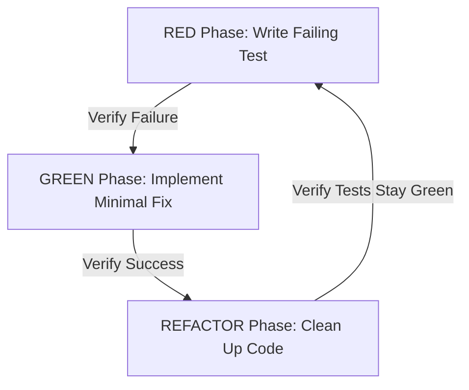

---
globs:
  - "**/*.rs"
  - "**/*.py"
  - "**/*.ts"
  - "**/*.go"
---

# AI Skill: Test-Driven Development (TDD) Workflow (`skills/tdd_workflow.md`)

This skill defines the mandatory Red-Green-Refactor methodology, test coverage expectations, and validation loops for implementing new features or fixing bugs in the AegisAgent codebase.

---

## 1. Core Red-Green-Refactor Cycle

Every functional change (gateway API endpoints, intercept decorators, Cedar policy integration, or database helpers) must follow this cycle. Do not write implementation code before writing tests.



### Steps:
1. **RED Phase (Write Failing Test):**
   - Write a new unit test or integration test that exercises the target behavior.
   - Run the test suite and verify that the test **fails** for the expected reason (e.g. assert failure, missing method, unimplemented route).
2. **GREEN Phase (Minimal Implementation):**
   - Write the absolute minimum amount of code to make the failing test pass.
   - Run the test suite and verify that all tests now **pass** successfully.
3. **REFACTOR Phase (Clean Up):**
   - Refactor the newly added code for code quality, clarity, performance, and compliance with the design standards.
   - Do not add new functionality during refactoring.
   - Run the test suite to ensure no regressions were introduced.

---

## 2. Testing Framework Commands

When operating in this workflow, execute the relevant framework commands to verify test states:

### Rust Gateway Tests
- **Run all gateway tests:**
  ```bash
  cargo test --manifest-path gateway/Cargo.toml
  ```
- **Run a specific test module or test name:**
  ```bash
  cargo test --manifest-path gateway/Cargo.toml -- <test_name_or_module>
  ```

### Python SDK Tests
- **Run all SDK tests:**
  ```bash
  python -m unittest discover -s sdk-python
  ```
- **Run a specific test file:**
  ```bash
  python -m unittest sdk-python/tests/test_<name>.py
  ```

---

## 3. Test Coverage Requirements

- **Code Coverage Target:** Keep test coverage at **80%+** for new packages or modules.
- **Test Categories:**
  - **Unit Tests:** Verify individual business logic constraints, database filters, parameter sanitization, and policy decisions.
  - **Integration Tests:** Verify HTTP routing endpoints (using `axum` test helpers), multi-tenant isolation, SQLite connections, and SDK intercepts.
  - **Negative Tests:** Test input validation, unauthorized access, and invalid Cedar policy combinations to ensure graceful error paths.

---

## 4. Git Checkpoint Best Practices

To maintain a clean commit history, we recommend checking in code at TDD phase boundaries:
1. **RED Commit:**
   ```bash
   git add <test_files>
   git commit -m "test(gateway): add failing test for <feature_name>"
   ```
2. **GREEN Commit:**
   ```bash
   git add <source_files>
   git commit -m "feat(gateway): implement minimal <feature_name> to pass tests"
   ```
3. **REFACTOR Commit:**
   ```bash
   git add <source_files>
   git commit -m "refactor(gateway): clean up <feature_name> and optimize sql queries"
   ```
