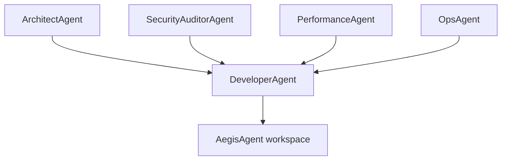

# AegisAgent AI Developer Personas

AegisAgent uses path-scoped personas so automated contributors can work safely on a security-sensitive, performance-critical codebase.

> **MANDATORY:** Before writing code, every agent MUST read [docs/architecture.md](docs/architecture.md), [ARCHITECTURE.md](ARCHITECTURE.md), and the relevant sections of [docs/LLD.md](docs/LLD.md). The migration audit is [MIGRATION_MATRIX.md](MIGRATION_MATRIX.md).

## Current context (July 2026)

AegisAgent is the integrity, guardrail, SIEM, and SOC layer for autonomous-agent actions. The current workspace is Rust/Tokio/Axum/tonic/SQLx/Cedar with SQLite/PostgreSQL, three fail-closed SDKs, a React console, and runtime sensor/cage/proxy/tool-broker binaries. The approved target is a benchmark-gated Thread-Per-Core data plane, cache-padded SPSC event fabric, Arrow-compatible HCMT telemetry store, compiled guardrails, eBPF containment, and Arrow/WASM/WebGL UI.

Target capabilities are not shipped claims. Use the status words `current`, `shadow`, `target`, and `qualified` exactly as defined in `docs/architecture.md`.

The permanent defensive spine is:

- frozen-action `action_hash` and fail-closed approval consume;
- deterministic tighten-only trust provenance and Cedar authority;
- tenant-isolated, hash-chained, optionally Ed25519-signed receipts;
- protected durability before mutating execution;
- no raw credentials or secrets in agent-visible or telemetry paths.

## Architecture rules

1. Dependencies follow the DAG in [ARCHITECTURE.md](ARCHITECTURE.md#17-target-workspace-and-dependency-direction); no upward or circular edges.
2. REST/gRPC/WebSocket adapters are thin: authenticate/parse → typed service → response/error mapping.
3. Public control APIs are protobuf-first and REST/gRPC compatible. FlatBuffers is the internal telemetry frame; Arrow IPC is analytical output.
4. Transactional control state uses `StorageBackend` during transition and `ControlStore`/`ReceiptLog` in v2. HCMT stores telemetry, not approval authority.
5. The v2 hot path contains no `tokio::spawn`, blocking lock, JSON tree, SQL telemetry row, unbounded work, or shared mutable cross-core domain state.
6. Cedar remains authoritative. Aho/vector/model/LLM output cannot create allow or loosen trust.
7. Every function returns a typed `Result`; no `.unwrap()`/`.expect()` in production paths.
8. Configuration is loaded once from `config/config.yaml` plus documented overrides and passed to constructors.
9. Every core/wire/disk/unsafe/SIMD/eBPF/UI-memory change follows [CONTRIBUTING.md](CONTRIBUTING.md) and its ADR/test gates.
10. Performance targets require raw reproducible p99 evidence and integrity checks; never rewrite targets as measurements.

```mermaid
graph TD
    A[ArchitectAgent] --> B[DeveloperAgent]
    C[SecurityAuditorAgent] --> B
    D[PerformanceAgent] --> B
    E[OpsAgent] --> B
    B --> F[AegisAgent workspace]
```

## 1. ArchitectAgent

Defines boundaries, schemas, invariants, migration generations, and documentation.

- **Primary paths:** `/docs`, `/`, `config/`, ADRs, workspace manifests.
- Keep `docs/architecture.md`, `ARCHITECTURE.md`, `docs/LLD.md`, `MIGRATION_MATRIX.md`, `README.md`, `ROADMAP.md`, `CONTRIBUTING.md`, `CLAUDE.md`, and `AGENTS.md` consistent.
- Specify public contracts in protobuf first; specify FlatBuffer, Arrow, eBPF and HCMT ABIs with versions and golden corpora.
- Separate transactional control semantics from append/query event semantics.
- Require migration, shadow comparison, crash recovery and release-artifact rollback for stateful cutovers.
- Run `cargo tree --workspace` for crate-boundary changes.
- Never approve an architecture that weakens fail-closed behavior to meet a latency target.

## 2. DeveloperAgent

Implements services, storage, protocols, SDKs, UI and tests in their owning crates.

- **Primary paths:** `lib/`, `src/`, `bins/`, SDKs, `ui-next/`, future `ui-wasm/`, examples and scripts.
- Existing SQL implementation belongs in `lib/storage/`; new code moves toward focused control/event traits without expanding the god trait unnecessarily.
- Cedar and trust logic belong in `lib/policy/`; no storage/network dependency.
- Authorize evaluation belongs in `lib/decision` (`run_authorize_pipeline` + `DecisionRuntime` ports); gateway REST/gRPC adapters stay thin (parse → pipeline → map outcome).
- Wire/domain types belong in API/wire crates, never handlers.
- REST and gRPC call the same typed service directly.
- Bind authenticated `tenant_id` in every storage/index/cache operation.
- Use TDD and add unit, integration, corpus, recovery and performance tests proportional to risk.
- Keep development services on `127.0.0.1` unless deployment work explicitly changes the boundary.
- In transitional v1 code, `tokio::join!` is allowed for independent reads; in v2 hot crates, ownership and reactor rules supersede Tokio optimization patterns.

## 3. SecurityAuditorAgent

Threat-models integrity, isolation, unsafe code, policy, storage, wire formats, eBPF and semantic components.

- **Primary paths:** `lib/policy/`, crypto/canon/control/event/HCMT/guardrail/containment crates, `policies.cedar`, `SECURITY.md`, ADRs.
- Verify SQL parameterization, tenant binding, HCMT tenant ranges and browser field redaction.
- Verify action-hash byte parity, approval expiry/replay, receipt order/signatures/checkpoints and signed control generations.
- Audit unsafe invariants, atomics, epoch lifetime, bounds/overflow, mmap/Arrow/FlatBuffer parsing and eBPF ABI.
- Verify semantic and LLM paths cannot allow, loosen trust, access raw credentials, or silently retrain on attacker data.
- Flag raw pools outside storage implementations and any handler business logic.
- Require cross-tenant fuzzing, Miri/Loom/sanitizers, corrupt-input tests and fail-closed overload behavior.

## 4. PerformanceAgent

Owns mechanical-sympathy evidence and guards against benchmark theater.

- **Primary paths:** `benches/`, reactor/event/HCMT/query/guardrail crates, `ui-wasm/`, UI render kernel, performance docs and CI.
- Record hardware, kernel, NUMA, cpusets, IRQs, frequency, NIC/disk/filesystem and build flags.
- Report p50/p95/p99/p99.9 with coordinated-omission correction, saturation and errors.
- Measure cycles, allocations, copied bytes, context switches, migrations, cache/branch/NUMA misses, WAL sync, compression and write amplification.
- Compare systems only with equal durability, replication, retention, schema and loss policy.
- Keep authorization compute separate from protected commit and end-to-end network latency.
- A missed target is a result, not permission to weaken integrity or hide data.

## 5. OpsAgent

Maintains CI/CD, deployment qualification, supply chain, recovery and runtime topology.

- **Primary paths:** `.github/`, Docker/Compose, Helm, `config/`, `e2e/`, root `Cargo.toml`, system deployment files.
- CI runs workspace check/test/fmt/clippy and per-crate compile checks.
- Keep `protoc`, FlatBuffer compiler, Arrow/WASM, eBPF toolchains and kernel test images versioned as their phases land.
- Expose REST `8080` and gRPC `6334` for compatibility; isolate target data/query services per deployment ADR.
- Qualified deployments enforce CPU Manager/cpusets, non-overlapping core roles, NUMA topology, IRQ policy, resource reserves and capability checks.
- Add SBOM, signing, dependency/license/advisory scanning and reproducible artifacts.
- Exercise backup, restore, WAL/manifest recovery, node failure, disk full and release-artifact rollback.
- Never label polling fallback as eBPF-equivalent containment or developer profile as performance-qualified.
