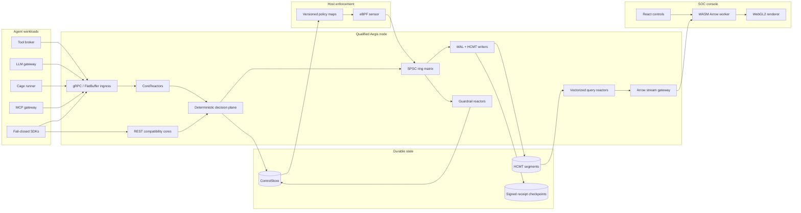
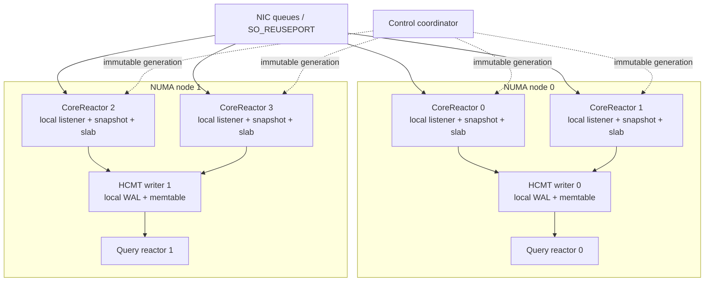
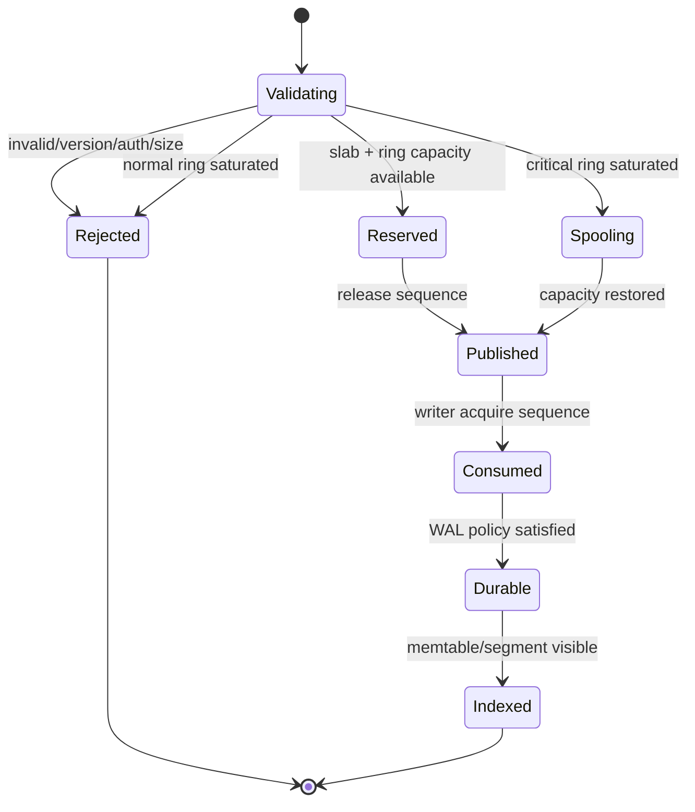
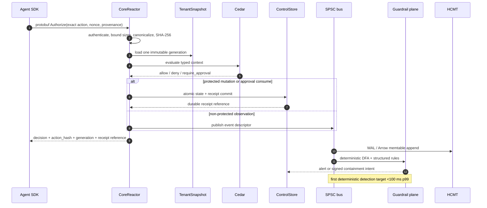
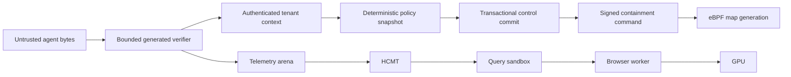
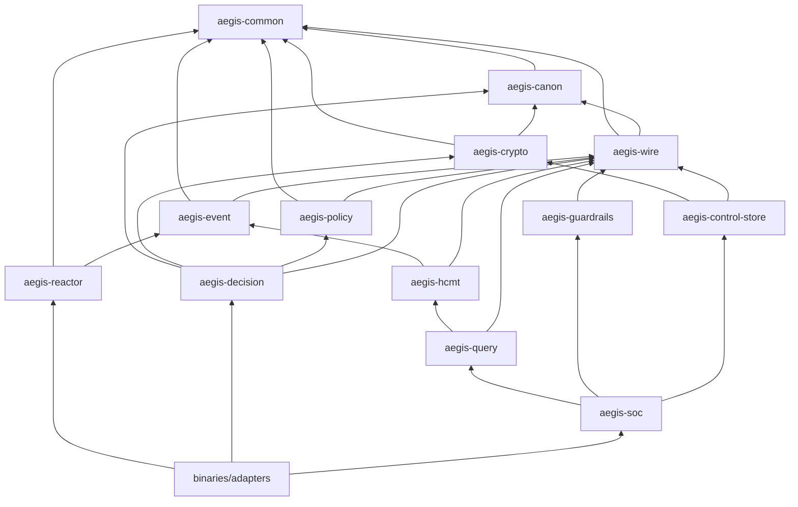

# AegisAgent High-Level Architecture

**Status:** normative target architecture; implementation status is tracked separately

**Version:** 2.0-draft

**Last reviewed:** 2026-07-12

**Low-level contract:** [docs/LLD.md](docs/LLD.md)

**Migration audit:** [MIGRATION_MATRIX.md](MIGRATION_MATRIX.md)

> AegisAgent is a Rust-native integrity, guardrail, SIEM, and SOC system for autonomous-agent actions. The architecture is designed for `<1 ms p99` deterministic authorization compute, `<100 ms p99` first deterministic detection, and `>=1,000,000` telemetry events/s per qualified node. These are acceptance targets, not current measurements. The current measured baseline remains in [docs/performance-baseline.md](docs/performance-baseline.md).

## 1. Architectural thesis

General-purpose search clusters optimize for arbitrary documents, broad query languages, replica coordination, and JVM-managed object graphs. AegisAgent controls a narrower domain: bounded, typed security events; deterministic action decisions; append-dominant time-series writes; known SOC predicates; and tenant-scoped evidence. It exploits that domain with five separations:

1. **One core owns mutable hot state.** Pinned reactor threads eliminate executor migration and shared scheduler queues.
2. **Control state is not telemetry.** Approval and receipt transactions use a control store; high-volume events use HCMT.
3. **Typed bytes remain typed.** Protobuf controls public contracts, FlatBuffers frames internal telemetry, and Arrow buffers serve analytics.
4. **Deterministic guardrails precede probabilistic analysis.** Cedar and Aho-Corasick can enforce; semantic models can only tighten or investigate.
5. **React does not render points.** React owns controls; WASM owns column views and layout; WebGL2 owns high-cardinality drawing.

The design avoids a global runtime, global event queue, per-event JSON tree, per-event row transaction, and DOM node per point. It does not claim that every byte transfer is physically copy-free; it specifies where copies are unavoidable and measures them.

## 2. Non-negotiable integrity laws

1. **The executable action is frozen.** Approval binds to `SHA-256(aegis-jcs-1(action))` after every authorized mutation and before execution.
2. **Approval is fail closed.** Hash mismatch, expiry, replay, unavailable required authority, or failed protected receipt commit prevents execution.
3. **Trust only tightens.** Unknown values map to the least-trusted state; a classifier or downstream agent cannot increase trust.
4. **Cedar is authoritative.** Risk, anomaly, vector, and model scores cannot produce `allow`.
5. **Protected evidence is durable before execution.** Mutating allow, approval consumption, and containment commands cross the declared durability boundary before acknowledgement.
6. **Every tenant boundary is explicit.** Authenticated tenant context participates in routing, storage keys, indexes, cache keys, encryption context, and receipt chains.
7. **Every queue is bounded.** Overload is rejected or durably spooled; memory growth is not a backpressure policy.
8. **Every target is benchmark-gated.** A target never appears as a shipped claim without a hardware manifest, workload, raw histogram, and reproducible command.

## 3. System topology



### Plane responsibilities

| Plane | Latency objective | State | Failure policy |
|---|---:|---|---|
| Decision compute | `<1 ms p99` within capacity envelope | immutable per-core tenant snapshot | fail closed |
| Protected commit | hardware-profiled; target `<5 ms p99` on PLP NVMe | transactional control state + receipt WAL | fail closed |
| Telemetry admission | `<250 µs p99` server-side | bounded reactor-local slab and SPSC descriptor | reject/spool |
| First deterministic detection | `<100 ms p99` from admitted event | immutable DFA/rule generation | alert lag visible; never blocks current allow |
| Analytical query | interactive target `<100 ms p95` for pruned 15-minute windows | mmap Arrow segments + indexes | deadline/cancel |
| UI frame | `<=16.67 ms` at 60 Hz | worker-owned Arrow views + GPU buffers | coalesce/drop obsolete frames |

Authorization **compute** and protected **commit** have separate SLOs. A generic filesystem `fsync` cannot honestly be guaranteed below one millisecond. A protected action cannot evade durability merely to satisfy the compute headline.

## 4. Thread-Per-Core reactor model



Each `CoreReactor` is a pinned OS thread with one current-thread event loop, one io_uring instance, one network accept queue, reactor-local admission counters, tenant snapshot references, metrics, request arena, and producers for downstream SPSC rings. Hot work never enters a work-stealing pool.

### Ownership rules

- A mutable object has exactly one owning reactor.
- Cross-core messages transfer descriptors, not shared mutable domain objects.
- Immutable decision snapshots are replicated to every decision reactor, so a connection is evaluated on its accepting core. Ordered control mutations and receipt/event writes are rendezvous-hashed to tenant-affine writer shards; the hash includes a routing generation so movement is explicit.
- Listener affinity uses RSS/RPS and `SO_REUSEPORT`; connections remain on the accepting core.
- Memory is first-touched on its owning NUMA node. Cross-NUMA ring edges are forbidden in the normal topology.
- Control updates are compiled off the hot cores, validated, then atomically published as immutable generations.
- Compatibility REST, webhooks, OIDC, exports, and administrative jobs run on reserved control cores or separate processes.

## 5. Shared-memory SPSC event bus

```mermaid
sequenceDiagram
    participant P as Ingress reactor
    participant A as NUMA-local slab
    participant R as SPSC descriptor ring
    participant C as HCMT writer
    participant E as Epoch/reclaim tracker

    P->>A: reserve bytes; write verified frame once
    P->>R: publish {arena, offset, len, generation, crc}
    Note over P,R: payload write happens-before release sequence
    C->>R: acquire published sequence
    C->>A: borrow immutable frame view
    C->>C: append columns / WAL
    C->>R: advance consumed sequence
    C->>E: retire slab page at generation
    E-->>A: reuse only after every reader unpins
```

There is one SPSC ring for each producer→consumer edge. A writer shard polls its producer rings round-robin with a per-tenant quota. A ring capacity is a power of two; index calculation is `sequence & (capacity - 1)`. Producer and consumer sequences occupy different `#[repr(align(64))]` cache lines to prevent false sharing.

The fixed ring does not need general garbage collection: its sequence barrier proves slot reuse. `crossbeam-epoch` is limited to slab-page retirement, snapshot publication, manifest generations, and readers that can outlive a ring slot.

### Event admission states



## 6. Inline and asynchronous flow



No semantic model participates in the current request’s allow decision. If an asynchronous classifier tightens trust or quarantines an agent, that control update increments the tenant generation; subsequent requests observe it under the emergency-revocation protocol.

## 7. Control state versus event state

### Transactional ControlStore

The control store owns values whose correctness depends on compare-and-set, uniqueness, or a total order:

- agents, tenants, tool grants, policy and control generations;
- approval creation/edit/expiry/atomic consumption;
- replay nonces and idempotency keys;
- ban, quarantine, command and acknowledgement state;
- protected decisions, receipt chain heads, signer generations and checkpoints.

SQLite remains a development/single-node adapter and PostgreSQL an HA adapter during migration. Both implement `ControlStore`; neither is in the million-event ingestion path. A future replicated control store requires its own consensus and linearizability ADR.

### HCMT EventStore

HCMT owns append-heavy telemetry and analytical projections:

- events first accumulate in per-writer structure-of-arrays memtables;
- a durable WAL establishes replay order according to event class;
- sealed memtables become immutable Arrow-compatible L0 SSTables;
- leveled compaction merges time/key ranges and builds indexes;
- queries mmap immutable buffers and prune granules before decoding columns;
- segment and manifest publication is atomic and checksum-verified.

HCMT details, physical layout, codecs, and recovery protocol are normative in [docs/LLD.md](docs/LLD.md).

## 8. Guardrail pipeline

| Stage | Algorithm | Complexity | Enforcement authority |
|---|---|---|---|
| Schema/size validation | generated verifier + bounded fields | `O(frame bytes)` | reject malformed input |
| Provenance lattice | fixed enum max/restrictiveness join | `O(1)` | tighten trust |
| Literal/phrase guardrail | Aho-Corasick DFA | build `O(sum(pattern lengths) × alphabet representation)`; scan `O(n + z)` | deterministic deny/tighten when policy declares it |
| Structured rule predicates | compiled field tests/bitmap operations | `O(r)` relevant predicates; bitmap AND proportional to compressed containers | alert/contain under deterministic rule |
| Semantic nearest neighbors | HNSW over PQ codes | empirical sublinear average; worst case `O(N)` | advisory/tighten only |
| Model inference | INT8 ONNX, fixed tensors | model-dependent; bounded by fixed input and batch | advisory/tighten only |
| Correlation | tenant/agent time windows | amortized `O(1)` insert; rule-specific query | alert/contain under declared policy |

`z` is the number of pattern matches. Aho-Corasick time is independent of the number of patterns after compilation, but automaton memory grows with their combined prefixes. HNSW has no universal sublinear worst-case guarantee; benchmark recall and tail latency are therefore first-class gates.

### Semantic isolation

- Embeddings never contain raw secrets by design; sensitive fields are redacted or hashed before inference.
- Model, tokenizer, quantization, HNSW parameters, and PQ codebooks are content-addressed and tenant-compatible.
- Codebooks are trained on curated data; attacker-controlled events cannot silently retrain them.
- Each inference core owns one ONNX Runtime session with inter-op and intra-op thread counts set to one.
- Queue overflow drops/degrades semantic enrichment, never deterministic evidence.

## 9. eBPF containment architecture

Linux nodes use CO-RE eBPF programs for observation and narrow containment:

- cgroup connect hooks gate network destinations;
- eBPF LSM hooks gate designated cgroup process execution and file opens where supported;
- tracepoints capture process lifecycle and syscall metadata;
- per-CPU maps count events without a shared cache line;
- a BPF ring buffer transfers fixed, versioned kernel records to the sensor;
- map-in-map generations publish policy atomically;
- signed Ed25519 control commands authorize map-generation changes.

The eBPF verifier, kernel version, LSM availability, lockdown mode, and required capabilities are deployment preconditions. Unsupported hosts use procfs/fanotify/OS-native fallback in observe-only or explicitly reduced-assurance mode. A fallback must never be labeled equivalent containment.

Kernel programs do not parse arbitrary prompts or execute large DFAs. They enforce bounded identifiers, cgroups, inodes, capabilities, address/port sets, and signed control generations. Content guardrails remain in user space.

## 10. Protocol and copy contract

### Protocol roles

| Boundary | Format | Reason |
|---|---|---|
| Public control RPC | protobuf over gRPC | versioned compatibility, generated clients, existing project contract |
| REST compatibility | JSON mirrors of protobuf | migration and operator access; excluded from fast-path claims |
| Streaming telemetry payload | size-prefixed FlatBuffer inside gRPC `bytes` frame | verifier and in-place field access |
| Native analytical query | Arrow Flight/gRPC record batches | columnar interoperability |
| Browser analytical stream | Arrow IPC messages in a custom WebSocket envelope | browsers do not expose standard Arrow Flight/gRPC transport directly |
| Disk segment | Arrow-compatible column buffers + HCMT sidecars | mmap projection and vectorized operators |
| Kernel event | versioned `#[repr(C)]` record | verifier-bounded eBPF ABI |

The browser transport is **Flight-semantic**, not a claim that WebSocket is the standard Arrow Flight transport. It preserves schema/dictionary/record-batch semantics and resume tokens in an Aegis envelope.

### Copy ledger

| Boundary | Minimum expected copy/materialization | Policy |
|---|---|---|
| NIC → host | NIC DMA and kernel/TLS processing | unavoidable; measure bytes and CPU |
| gRPC body → reactor arena | zero or one copy depending on TLS/h2 buffer ownership | accept `Bytes`; copy only when lifetime/alignment requires |
| reactor → writer | descriptor only; payload remains slab-owned | no payload clone |
| eBPF ring → durable slab | one copy if data must outlive ring reservation | required by ring lifetime; bounded fixed record |
| memtable → Arrow segment | ownership transfer when already sorted; otherwise one columnar permutation; selected compressed columns encode once | no JSON/row-object reserialization; count reordered bytes |
| mmap segment → query | views for uncompressed projected buffers; selected compressed blocks decode to scratch | no full-segment materialization |
| compaction inputs → output segment | selected rows are rewritten into a new immutable sorted generation | inherent to merge/retention; report write amplification |
| server → socket | kernel/network copy and TLS encryption | unavoidable |
| browser `ArrayBuffer` → WASM linear memory | currently one bounded copy with `wasm-bindgen` | instrument; no per-field copy |
| WASM → WebGL buffer | CPU-to-GPU upload | unavoidable in WebGL2; triple-buffer and update only changed ranges |

A PR may call a path zero-copy only if its copy ledger and allocation counters prove no payload copy inside the stated boundary.

## 11. UI data plane

React manages navigation, query controls, accessibility, approval dialogs, and low-cardinality metadata. A dedicated Web Worker owns the WebSocket, resume cursor, WASM instance, Arrow buffers, query transforms, and level-of-detail selection. React receives small summaries and selection IDs, not million-row arrays.

WASM validates the envelope and Arrow schema, constructs buffer views, applies SIMD128 filters/normalization, and emits typed-array views for GPU upload. WebGL2 renders points, bars, heatmaps, graph nodes, and edges with instancing. Picking uses an off-screen ID framebuffer. The renderer caps visible geometry by viewport resolution; a time series uses min/max pixel buckets or LTTB before upload.

### Frame budget at 60 Hz

| Work | Budget |
|---|---:|
| stream ingestion and Arrow validation on worker | 3.0 ms |
| filter/layout/LOD in WASM worker | 4.0 ms |
| main-thread state and interaction | 2.0 ms |
| changed-range GPU upload | 3.0 ms |
| draw and composite | 3.5 ms |
| margin | 1.17 ms |
| Total | 16.67 ms |

Obsolete query batches are cancelable. If producers outrun rendering, the UI coalesces intermediate visualization snapshots while retaining the server resume cursor; it does not build an unbounded browser queue.

## 12. Capacity model

For `C` physical ingestion cores, clock `f` cycles/s, CPU utilization ceiling `u`, and average cost `c_e` cycles/event:

```text
events_per_second_cpu <= C × f × u / c_e
```

For a reference qualification profile of 32 physical cores at 3.2 GHz and `u = 0.70`, one million events/s permits:

```text
c_e <= 32 × 3.2e9 × 0.70 / 1e6 = 71,680 cycles/event
```

At 256 input bytes/event and one million events/s:

```text
payload bandwidth = 256 MB/s ≈ 2.048 Gbit/s before framing/TLS
```

A 25 GbE NIC leaves headroom for protocol overhead and query traffic. If HCMT compression yields 80 durable bytes/event, the steady segment write rate is 80 MB/s before WAL and compaction. Storage qualification must prove the actual write-amplification factor `WA`; required device bandwidth is:

```text
device_write_bandwidth >= ingest_rate × durable_bytes_per_event × WA / target_device_utilization
```

For leveled HCMT with size ratio `T` and `L` occupied levels, read amplification for a point/range candidate is bounded by L0 overlap plus at most one non-overlapping run per lower level. Write amplification is workload- and compaction-policy-dependent; it is measured, not reduced to a misleading universal constant.

### Authorization cycle budget

At 3.2 GHz, one millisecond is 3.2 million cycles. The target compute budget is:

| Stage | p99 budget | Approximate 3.2 GHz cycles |
|---|---:|---:|
| frame/protobuf validation | 80 µs | 256,000 |
| authentication + nonce fast check | 140 µs | 448,000 |
| canonicalization + SHA-256 | 120 µs | 384,000 |
| immutable snapshot lookups | 80 µs | 256,000 |
| Cedar evaluation | 350 µs | 1,120,000 |
| response construction | 80 µs | 256,000 |
| scheduling/network-server margin | 150 µs | 480,000 |
| Total compute | 1,000 µs | 3,200,000 |

Payload limits and policy complexity limits are part of the SLO. Large JSON-compatible actions, cold control-store misses, KMS calls, and durable receipt commits are separate classes and must be reported separately.

## 13. Why this can outperform conventional SIEM pipelines

The performance hypothesis is structural:

- a pinned reactor removes work-stealing, task wake/migration, and cross-core executor queues from the hot path;
- SPSC ownership uses one producer and one consumer sequence instead of a contended MPMC queue;
- FlatBuffer verification and Arrow views avoid building per-event JSON object graphs;
- memtable append is amortized `O(1)` and converts thousands of events into one sequential segment write;
- bitmap/zone-map pruning excludes granules before string or timestamp decoding;
- Aho-Corasick scans `O(n + z)` rather than executing one substring scan per pattern;
- per-core allocation and metrics avoid shared allocator/metric locks;
- WebGL2 instancing converts point rendering from one DOM/SVG object per point to a bounded number of draw calls.

JVM-based systems can also use off-heap buffers, vectorization, and careful GC tuning. AegisAgent therefore does not declare victory by language choice. It declares a smaller coordination and materialization budget, then requires an apples-to-apples benchmark against pinned OpenSearch/Elasticsearch-style baselines using the same hardware, replication, durability, event schema, query mix, and loss policy.

## 14. Backpressure and overload

| Resource | Limit | Saturation behavior |
|---|---|---|
| connection accepts | per-core fixed maximum | refuse/reset before allocation storm |
| in-flight authorization | per-reactor permits | `RESOURCE_EXHAUSTED`; protected SDK fails closed |
| normal telemetry ring | fixed descriptors + bytes | reject with retry token or sensor spool |
| critical evidence ring | reserved capacity | spill to protected WAL; if unavailable, block protected execution |
| memtable | bytes and rows | seal; switch to spare; reject if no spare and WAL budget exceeded |
| compaction debt | level bytes/score | throttle normal ingestion; preserve critical lane |
| query | memory, scanned bytes, CPU time | cancel at deadline; return resource limit metadata |
| semantic queue | fixed batches | skip/defer enrichment; deterministic plane unaffected |
| UI stream | outstanding batches/bytes | server credit window; coalesce client frames |

## 15. Failure and recovery model

- WAL records are length-delimited, CRC32C-protected, monotonically sequenced, and truncated at the first invalid tail during recovery.
- Segment construction occurs under a temporary name; data and indexes are synced before a checksummed manifest atomically references the segment.
- Manifest generations are immutable. Startup selects the highest generation whose checksum and referenced segments verify.
- A receipt checkpoint binds event-segment ranges to the control-store receipt chain without making HCMT the authority for approval state.
- A writer crash replays its WAL into an empty memtable. Event IDs make replay idempotent.
- Disk-full reserves are preallocated for critical evidence and manifest progress. When exhausted, protected actions fail closed and normal telemetry is rejected.
- Cross-node replication, quorum acknowledgement, and RPO/RTO are deployment-mode contracts; they are not implied by a single-node WAL.
- Clock ordering uses both wall-clock UTC nanoseconds and per-source monotonic sequence. Wall-clock regressions do not reorder receipt chains.

## 16. Security boundaries



- FlatBuffer verification precedes every field dereference; size, depth, vector length, and string length are bounded.
- Unsafe code is isolated to reviewed buffer/ring/FFI modules with explicit invariants and Miri/sanitizer coverage.
- Query operators cannot mutate control state.
- Browser Arrow schemas exclude secrets and enforce tenant-filtered server queries before transmission.
- Semantic embeddings are security-sensitive derived data and receive encryption, retention, deletion, and tenant-isolation controls.
- eBPF maps accept only commands whose signature, key generation, tenant/node binding, nonce, and expiry verify.

## 17. Target workspace and dependency direction



Arrows mean “depends on.” `aegis-policy` never depends on storage or networking. Protocol adapters never become dependencies of service crates. `aegis-hcmt` cannot call Cedar or mutate approvals.

### Target tree

```text
AegisAgent/
├── Cargo.toml
├── ARCHITECTURE.md
├── MIGRATION_MATRIX.md
├── config/
├── lib/
│   ├── common/ canon/ wire/ crypto/
│   ├── policy/ event/ reactor/ decision/
│   ├── control-store/ hcmt/ query/ guardrails/ soc/ containment/
├── bins/
│   ├── aegis-gateway/ aegis-dataplane/ aegis-query/ aegis-compactor/
│   ├── aegis-node-sensor/ aegis-cage-runner/ aegis-egress-proxy/ aegis-tool-broker/
├── bpf/
│   ├── aegis-sensor-ebpf/ and shared ABI/
├── ui-next/
├── ui-wasm/
├── sdk-python/ sdk-typescript/ sdk-go/
├── benches/
├── docs/
│   ├── LLD.md
│   └── adr/
└── e2e/
```

## 18. Deployment profiles

| Profile | Topology | Guarantee |
|---|---|---|
| Developer | loopback REST/gRPC, SQLite control, one HCMT writer, no eBPF requirement | correctness/demo; no production performance claim |
| Qualified single node | physical cores, NUMA pinning, PLP NVMe, 25 GbE, PostgreSQL or local protected control mode, eBPF-capable Linux | node throughput/latency targets after benchmark |
| HA cluster | stateless/pinned ingress nodes, transactional HA control store, replicated HCMT/object-store checkpoints, routed query nodes | declared RPO/RTO and tenant failover |
| Edge sensor | eBPF + durable local spool + signed commands | local observation/containment during gateway outage according to cached policy expiry |

Kubernetes CPU limits alone do not provide core exclusivity. Qualified deployments use static CPU Manager, guaranteed QoS, explicit cpusets, topology manager, hugepage policy where measured, IRQ affinity, and dedicated control/compaction cores.

## 19. Observability and proof

Each reactor exports padded local counters and HDR histograms; scrape-time aggregation must not touch request-owned cache lines. Required telemetry includes:

- queue occupancy, byte occupancy, rejection/spool counts and oldest age;
- per-stage authorization cycles and p50/p95/p99/p99.9;
- scheduler migrations (target zero), context switches, allocations/event;
- L1/LLC misses, branch misses, NUMA remote accesses and io_uring completions;
- WAL group size, sync latency, bytes/event, segment seal latency;
- compaction debt, write amplification, granules pruned, bytes decoded;
- Aho states/bytes, matches/byte, HNSW recall/latency, ONNX batch latency;
- Arrow batches/bytes, browser copy bytes, GPU upload bytes and frame time;
- policy/control generation propagation and emergency-revocation lag;
- receipt commit, chain verification and checkpoint age.

Request logs contain identifiers and hashes, never raw secrets or unrestricted prompts. Tracing is sampled and exported from a separate control path.

## 20. Acceptance benchmark contract

No performance milestone passes without:

1. a machine-readable hardware/software manifest: CPU model, SMT, cores, NUMA, RAM, kernel, mitigations, NIC, filesystem, device and firmware;
2. release build, fixed CPU frequency policy, pinned IRQs/reactors, warmed and cold cases;
3. at least 30 minutes steady state plus burst, policy reload, compaction, query, disk-latency and downstream-failure cases;
4. HDR histograms with coordinated-omission correction and raw artifacts;
5. integrity checks proving zero missing/duplicate protected records and valid receipt chains;
6. workload distributions for event size/cardinality, tenants, patterns, policy size, queries and durability class;
7. comparison systems configured to the same replication, durability, retention, schema and loss policy;
8. regression thresholds for throughput, p99, allocations, copies, cache misses, write amplification and recovery time.

The `1M events/s/node` gate is telemetry ingestion, not one million durable approval transactions per second. The `<1 ms p99` gate is deterministic decision compute on a warm immutable snapshot, reported separately from protected storage commit and network round-trip.

## 21. Architectural decisions required before code cutover

- ADR: raw io_uring reactor versus a maintained thread-per-core runtime;
- ADR: control-store HA/linearizability and receipt-chain partitioning;
- ADR: HCMT segment ABI, Arrow extension types and forward compatibility;
- ADR: FlatBuffer/protobuf conversion and canonical-action versioning;
- ADR: browser stream transport, copy ledger and schema negotiation;
- ADR: eBPF hooks, capabilities, fallback assurance and emergency unlock;
- ADR: HNSW/PQ implementation, deletion, retraining and tenant isolation;
- ADR: NUMA routing, live shard movement and rollback;
- ADR: unsafe-code boundary and verification toolchain.

Until an ADR is accepted and its tests exist, the corresponding target remains a blueprint, not an implementation fact.
