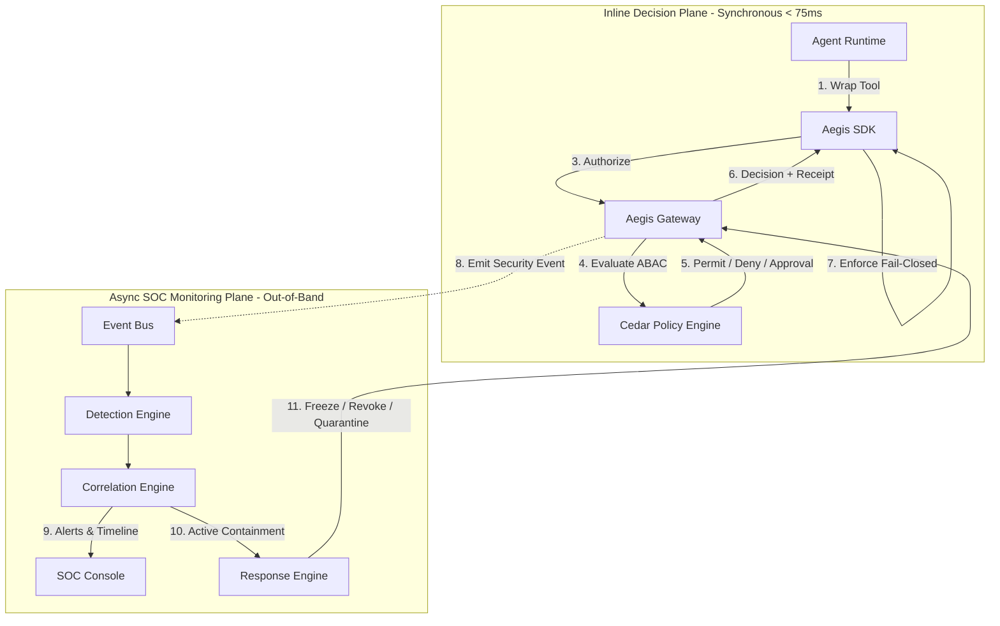

<div align="center">
  
  <h1>AegisAgent</h1>
  <p><strong>The Zero-Trust Security & Integrity Layer for Autonomous AI Agents</strong></p>
</div>

---

[](https://github.com/lavkushry/AegisAgent/actions/workflows/ci.yml)
[](https://github.com/lavkushry/AegisAgent/actions/workflows/sast.yml)
[](https://github.com/lavkushry/AegisAgent/actions/workflows/container-scan.yml)
[](https://github.com/lavkushry/AegisAgent/releases)
[](https://github.com/lavkushry/AegisAgent/pkgs/container/aegisagent)
[](LICENSE)
[](Cargo.toml)
[](sdk-python/pyproject.toml)
[](https://lavkushry.github.io/AegisAgent/)

AegisAgent is an open-source, self-hostable **security integrity layer and API firewall** designed for **autonomous AI agents** and **Model Context Protocol (MCP)** tool execution. It acts as a zero-trust guardrail between your AI agent runtime (LangGraph, OpenAI Agents, Autogen, Custom) and external systems, preventing unauthorized actions caused by prompt injections, tool-use hijacking, and data exfiltration.

## 🛡️ Why AegisAgent? The Integrity Moat

Traditional AI firewalls analyze prompts using probabilistic LLM-based text classifiers, which are prone to prompt-injection bypasses. AegisAgent introduces deterministic, cryptographic security mechanisms to secure agent actions:

| Security Vector | Generic Gateway / Scanners | **AegisAgent Security Moat** |
| :--- | :--- | :--- |
| **Human-in-the-Loop (HITL)** | Simple approval prompts (Vulnerable to TOCTOU / parameters modification) | **Approval Integrity**: Human approvals are bound to a SHA-256 hash of the frozen action parameters. SDK fails closed on parameter tampering. |
| **Prompt Injection Defense** | Probabilistic text scoring (Evadable, high latency) | **Deterministic Trust-Provenance**: Authorization gates on the *source trust level* of triggering content (6 tiers). Malicious inputs are blocked regardless of text shape. |
| **Compliance Evidence** | Text-based audit logs (Tamperable, unstructured) | **Verifiable Action Receipts**: Decision flows are stored in a per-tenant, tamper-evident hash chain, creating cryptographic proof for SOC 2. |
| **Agent Autonomy** | All-or-nothing execution | **Active SOC Containment**: Automated response loop detects repeated denials (deny-storms) and quarantines, freezes, or revokes agent keys in real-time. |

---

## 🏗️ Architecture

AegisAgent implements the **Two-Plane Principle** to isolate synchronous decision-making from asynchronous security monitoring, ensuring sub-75ms response latency:



Every decision flows through the **Inline Plane** to enforce permissions, while the **Async SOC Plane** processes security telemetry out-of-band to detect exfiltration, deny-storms, and anomalies without delaying agent execution.

---

## 📥 Installation

### Docker Compose (recommended)
```bash
git clone https://github.com/lavkushry/AegisAgent.git
cd AegisAgent
docker compose up --build
```

<!-- After the first release, pre-built images will be available:
docker pull ghcr.io/lavkushry/aegisagent:latest
docker run -p 8080:8080 -p 6334:6334 ghcr.io/lavkushry/aegisagent:latest
-->

### From Source
```bash
git clone https://github.com/lavkushry/AegisAgent.git
cd AegisAgent
cargo build --release
```

### Python SDK
```bash
pip install aegisagent
```

---

## ⚡ 5-Step Quickstart

Experience AegisAgent's security gate preventing a simulated prompt-injection attack in under 5 minutes:

### 1. Clone the Repository
```bash
git clone https://github.com/lavkushry/AegisAgent.git
cd AegisAgent
```

### 2. Start the Local Gateway (Docker)
```bash
docker compose up --build
```
Ensure the gateway is healthy in another terminal:
```bash
curl http://127.0.0.1:8080/health
# {"status":"healthy","version":"0.1.0","db":"up"}
```

### 3. Seed Demo Environment
Initialize configurations, mock GitHub actions, and demo keys:
```bash
bash scripts/seed-demo.sh
```

### 4. Run the GitHub Prompt-Injection Attack Demo
This demo simulates a malicious external user trying to hijack a coding agent to merge a PR. AegisAgent detects the untrusted external provenance and blocks it deterministically:
```bash
python3 examples/github-attack-demo.py
```
*Output:* `AegisAgent blocked the malicious merge attempt (untrusted external provenance)`

### 5. Inspect Audit Timeline
Retrieve the tamper-evident audit record generated for the blocked action:
```bash
curl -H "Authorization: Bearer tenant_123" http://127.0.0.1:8080/v1/audit/events
```

---

## 📦 SDK Support

AegisAgent provides unified, multi-language SDK support. Every SDK implements `aegis-jcs-1` JSON canonicalization and performs fail-closed verification:

* **Python (Reference SDK)**: [sdk-python/](sdk-python/) — Supports async clients, `@protect_tool` decorators, CLI utilities, and evidence packaging.
* **TypeScript / Node.js**: [sdk-typescript/](sdk-typescript/) — Fully typed, zero-dependency canonicalization wrapper.
* **Go**: [sdk-go/](sdk-go/) — Idiomatic Go client with context-based cancellation and management routing.

---

## ⚙️ Development & Testing

AegisAgent is built in Rust for raw speed and security, featuring rigorous unit, integration, and cross-language compatibility tests:

```bash
# Setup development environment (formatting, linters, pre-commit hooks)
make setup

# Run the complete test suite (Rust, Python, TS, Go)
make check
```

---

## 📖 Strategy & Architecture Docs

Detailed strategies, reassessments, and technical specifications:
* [Market Gap Reassessment](docs/AegisAgent_Gap_Reassessment_2026-06.md) — Rationale behind the security integrity positioning.
* [Technical Architecture Design](docs/AegisAgent_Technical_Design.md) — Cryptographic details, database models, and API contracts.
* [Agent SOC Design Specification](docs/AegisAgent_Agent_SOC_Design.md) — Asynchronous detection rules and containment playbooks.
* [Verifiable Receipt Specification](docs/action-receipt-spec.md) — Hash-chain specifications for SOC 2 audits.
* [Feature Parity & PR History](docs/feature_history.md) — Detailed changelogs and ticket history.

---

## 🤝 Contributing & Security

Contributions are welcome! Please read [CONTRIBUTING.md](CONTRIBUTING.md) to understand development conventions.

If you discover a security vulnerability, please do **not** open a public issue. Follow our [SECURITY.md](SECURITY.md) guidelines to privately disclose the issue to our security team.

---

## 📄 License

AegisAgent is open-source and licensed under the [MIT License](LICENSE).
