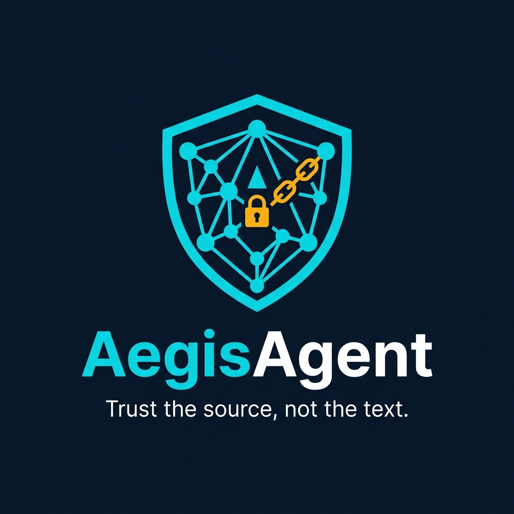

<div align="center">
  
</div>

# AegisAgent

[](https://github.com/lavkushry/AegisAgent/actions/workflows/ci.yml)
[](LICENSE)
[](sdk-python/pyproject.toml)
[](https://lavkushry.github.io/AegisAgent/)

AegisAgent is the **integrity layer for AI agent actions** — open, self-hostable, and framework-neutral. It sits between an agent runtime and external actions and does two things that the now-commodity gateway market decides but does **not prove**:

1. **Provable approvals.** Every high-risk action is frozen and SHA-256 hashed; the human approval is bound to that exact action, and the SDK **fails closed** if a different action is about to execute. *An approval is valid for exactly one action* — defeating approve-then-swap, replay, and render-vs-bytes ("approval manipulation," OWASP Agentic Top 10).
2. **Deterministic trust-provenance gating.** Authorization is gated on *where the triggering content came from* (six trust levels), not a probabilistic text score. A mutating action triggered by untrusted external content is denied/escalated regardless of how benign the text looks — the confused-deputy defense at the policy layer.

Every protected action emits a verifiable, hash-chained **action receipt** suitable as SOC 2 / EU AI Act Article 14 evidence. AegisAgent runs standalone **or layers onto** an existing gateway (e.g. Microsoft Agent Governance Toolkit, MintMCP, Pipelock).

> **Make the approval trustworthy. Trust the source, not the text.**

> ℹ️ **Positioning context (June 2026):** the generic "intercept → policy → allow/deny → audit → approval" loop is now commodity, including free OSS. AegisAgent deliberately competes only on *integrity + provenance + verifiable evidence*. See [`docs/AegisAgent_Gap_Reassessment_2026-06.md`](docs/AegisAgent_Gap_Reassessment_2026-06.md) for the full competitor analysis and rationale.

## Architecture

AegisAgent runs two planes — a synchronous inline path for real-time decisions and an asynchronous SOC plane for monitoring:

```text
INLINE PLANE (synchronous, <75 ms — the action path)
  Agent SDK ──► Gateway ──► Cedar ──► allow | deny | require_approval
       │ freezes action_hash · binds approval · emits receipt
       ▼ emit Agent Security Event (fire-and-forget)
ASYNC SOC PLANE (out-of-band — never adds latency)
  Event bus ──► detect ──► correlate ──► alert ──► { respond · index · notify · RCA }
```

## Current Status

| Capability | State |
| --- | --- |
| **Canonicalization `aegis-jcs-1`** | Byte-identical across Python, Go, TypeScript SDKs + Rust gateway; locked by shared corpora, verified in CI (4-language gate) |
| **Approval integrity** — action-hash binding, expiry, single-use consume | SDK fail-closed verified · gateway enforcement verified in CI |
| **Trust-provenance gate** (deterministic 6-level, classifiers may only tighten) | Cedar policy pack + demo |
| **Verifiable action receipts** (per-tenant hash chain) | Format + reference verifier + `aegis-verify-receipts` CLI + gateway emission + `GET /v1/receipts/:id/verify` + optional Ed25519 signing |
| **Python SDK** (`AegisClient`, `AegisAsyncClient`, `@protect_tool`) | 174 unit tests + runnable demos + CLI tools |
| **Go SDK** (`aegis.Client`, `aegis.Protect`, receipts) | Full parity · cross-language corpus gate in CI |
| **TypeScript SDK** (`AegisClient`, `protect()`, canon) | Full parity · cross-language corpus gate in CI |
| **Rust gateway** (Axum, SQLite/SQLx tenant-scoped, Cedar) | 53 tests · `cargo test/fmt/clippy` gated in CI (stable + beta + MSRV 1.88) |
| **Agent SOC** — detect, correlate, alert, respond, index, notify, RCA | Phases 0-3, 5, 6 implemented; Phase 4 response engine complete |
| **Agentless ingestion** (`POST /v1/ingest`) | GitHub webhooks, OpenAI traces → normalize → detect pipeline |
| **Behavioral baselining** | Per-agent action frequency baselines with anomaly detection |
| **MCP Gateway Lite** | Server registration, manifest discovery, approve/disable, unknown-tool deny, quarantine/restore |
| **Kubernetes probes** | `/livez`, `/readyz`, `/startupz` |
| **Webhook notifications** | HMAC-SHA256 signed, circuit breaker, Slack callback support |
| Docs | Quickstart, MkDocs Material site, security policy, contribution guide, roadmap, dashboard mock, open receipt spec |

> **CI gate.** The CI runs on every push and PR: Rust (stable + beta + MSRV 1.88), Python (3.9–3.12), Go, TypeScript, cross-language corpus byte-equality, Docker Compose E2E, and dependency audits.

## 5-Step Quickstart

> Requirements: Docker with Compose, `python3`, and `bash`.
>
> The compose setup uses host networking so the gateway still binds to `127.0.0.1:8080` as required by the security rules.

### 1. Clone and enter the repository

```bash
git clone https://github.com/lavkushry/AegisAgent.git
cd AegisAgent
```

### 2. Start the local gateway

```bash
docker compose up --build
```

Expected health output in another terminal:

```bash
curl http://127.0.0.1:8080/health
# {"status":"healthy","version":"0.1.0","db":"up"}
```

### 3. Seed demo data

```bash
bash scripts/seed-demo.sh
```

Expected output:

```text
==> Gateway is healthy
==> Registering demo agent (coding-agent-prod)
==> Registering mock GitHub tool actions
==> Registering demo MCP server and manifest
==> Demo seed complete. Run: python3 examples/github-attack-demo.py
```

### 4. Run the GitHub prompt-injection attack demo

```bash
python3 examples/github-attack-demo.py
```

Expected output includes:

```text
AegisAgent blocked the malicious merge attempt
Audit URL: http://127.0.0.1:8080/v1/audit/events
Expected outcome: blocked mutation after untrusted external context.
```

### 5. Inspect audit events

```bash
curl -H "Authorization: Bearer tenant_123" \
  http://127.0.0.1:8080/v1/audit/events
```

## No-setup integrity demo

To see the three integrity guarantees without running the gateway (pure Python, no network):

```bash
python3 examples/integrity_demo.py
```

It demonstrates: (1) a deterministic **provenance gate** denying an untrusted-triggered mutation, (2) **approve-then-swap** failing closed on an `action_hash` mismatch, and (3) **verifiable receipts** detecting tampering. Auditors can verify receipts independently with `aegis-verify-receipts <receipts.json>`.

## Default Policy Pack

The default Cedar policy pack lives in both:

- `policies.cedar` for local/Docker gateway runs from the repository root.
- `gateway/policies.cedar` for gateway package tests and direct package runs.

Starter behavior:

1. Cedar implicit deny is the deny-all baseline.
2. Read-only actions are allowed.
3. `github.merge_pull_request` into `main` requires platform approval.
4. Mutations after semi-trusted customer context require security review.
5. Mutations after untrusted, suspicious, or unknown context are denied.

## Key API Endpoints

### Core (inline path)

| Endpoint | Purpose |
| --- | --- |
| `GET /health` | Readiness probe (pings DB) |
| `GET /livez` | Kubernetes liveness (no I/O) |
| `GET /readyz` | Kubernetes readiness (pings DB) |
| `GET /startupz` | Kubernetes startup probe |
| `POST /v1/agents/register` | Register or retrieve an agent token |
| `POST /v1/tools` | Register static tool actions |
| `POST /v1/authorize` | Authorize an intercepted tool call (returns decision, `action_hash`, approval info) |
| `GET /v1/approvals/:id` | Poll approval status (returns `EXPIRED` for stale) |
| `POST /v1/approvals/:id/approve` | Approve a paused action |
| `POST /v1/approvals/:id/reject` | Reject a paused action |
| `POST /v1/approvals/:id/edit` | Approve with edited parameters (re-hash + re-evaluate) |
| `POST /v1/approvals/:id/consume` | Single-use consume before execution (409 if already used/expired) |
| `GET /v1/receipts/:id/verify` | Recompute a receipt's hash and report `verified` |

### MCP Gateway Lite

| Endpoint | Purpose |
| --- | --- |
| `POST /v1/mcp/servers` | Register MCP servers |
| `GET/POST /v1/mcp/servers/:server_key/tools` | Show/discover MCP tools |
| `POST /v1/mcp/servers/:server_key/tools/:tool_key/approve` | Approve an MCP tool |
| `POST /v1/mcp/servers/:server_key/tools/:tool_key/disable` | Disable an MCP tool |
| `POST /v1/mcp/servers/:server_key/quarantine` | Quarantine an MCP server |
| `POST /v1/mcp/servers/:server_key/restore` | Restore a quarantined server |

### Management & query (tenant-scoped, paginated)

| Endpoint | Purpose |
| --- | --- |
| `GET /v1/agents` | List agents |
| `GET/PATCH/DELETE /v1/agents/:id` | Agent CRUD |
| `POST /v1/agents/:id/freeze\|unfreeze\|revoke` | Agent lifecycle control |
| `GET /v1/decisions` | List decisions (filter by `agent_id`, `decision`) |
| `GET /v1/approvals` | List pending approvals |
| `GET /v1/receipts` | List receipts |
| `POST /v1/receipts/verify-chain` | Verify per-tenant receipt chain integrity |
| `GET/POST /v1/policies` | Policy CRUD |
| `POST /v1/policies/reload` | Hot-reload Cedar policies |
| `GET/POST /v1/tenants` | Tenant management |
| `GET /v1/tenants/:id/export` | GDPR data-portability bundle |
| `GET /v1/audit/events` | View recent audit events |
| `GET /v1/runs/:id/timeline` | Run-specific audit timeline |
| `GET /v1/stats` | Database size and row counts |
| `GET /v1/version` | Gateway version and build hash |
| `GET /v1/openapi.json` | OpenAPI spec |

### Agent SOC

| Endpoint | Purpose |
| --- | --- |
| `GET /v1/alerts` | List SOC alerts |
| `GET /v1/incidents` | List SOC incidents |
| `GET /v1/incidents/:id` | Incident detail |
| `POST /v1/incidents/:id/close` | Close an incident |
| `GET /v1/incidents/:id/narrate` | RCA narrative (sandboxed LLM) |
| `GET /v1/soc/summary` | SOC overview dashboard data |
| `POST /v1/ingest` | Agentless ingestion (GitHub webhooks, OpenAI traces) |
| `GET /v1/ws/events` | WebSocket live SOC event stream |

## SDKs

AegisAgent ships three first-class SDKs — all canonicalize with `aegis-jcs-1` byte-identically and enforce the fail-closed contract. See [`docs/sdk-parity-status.md`](docs/sdk-parity-status.md) for the full parity matrix.

| SDK | Package | Key features |
| --- | --- | --- |
| **Python** (reference) | `sdk-python/` | `AegisClient`, `AegisAsyncClient`, `@protect_tool`, `async_protect_tool`, receipt verifier, CLI tools, evidence packs, webhook handler |
| **Go** | `sdk-go/` | `aegis.Client`, `aegis.Protect`, receipt verifier, cross-language corpus CI gate |
| **TypeScript** | `sdk-typescript/` | `AegisClient`, `protect()`, canon, cross-language corpus CI gate |

## Development Validation

```bash
# One-shot setup: installs pre-commit (cargo fmt/clippy, black, gitleaks) and the Python SDK
make setup

# Everything CI runs, in one command
make check
```

Or invoke each suite directly:

```bash
# Rust gateway
cargo test --manifest-path gateway/Cargo.toml
cargo fmt  --manifest-path gateway/Cargo.toml -- --check
cargo clippy --manifest-path gateway/Cargo.toml -- -D warnings

# Python SDK (174 tests)
python3 -m pip install -e "sdk-python[dev]"
python3 -m unittest discover -s sdk-python/tests

# Go SDK
cd sdk-go && go test ./...

# TypeScript SDK
cd sdk-typescript && npm ci && npx tsc --noEmit && npm test
```

## Project Docs

> 📖 **Full documentation site:** <https://lavkushry.github.io/AegisAgent/> — published from this `docs/` folder with MkDocs Material on every push to `main`. Browse the index in [`docs/README.md`](docs/README.md).

> 📌 The strategy docs in `docs/` were re-anchored on 2026-06-02 from the original "Agent Action Firewall" framing to the **integrity-layer** positioning above. Start with the reassessment doc.

- [`docs/mission.md`](docs/mission.md) — mission, category definition, the Five Dimensions, and the Six Laws.
- [`docs/AegisAgent_Gap_Reassessment_2026-06.md`](docs/AegisAgent_Gap_Reassessment_2026-06.md) — **source of truth**: June-2026 competitor matrix, the real gap, and repositioning.
- `docs/AegisAgent_PRD.md` — product requirements (integrity primitives as headline features).
- `docs/AegisAgent_GTM_Document.md` — positioning, ICP, pricing, competitive landscape.
- [`docs/AegisAgent_Technical_Design.md`](docs/AegisAgent_Technical_Design.md) — architecture (Approval Integrity Engine, Trust-Provenance Gate, Verifiable Receipts).
- [`docs/AegisAgent_Threat_Model.md`](docs/AegisAgent_Threat_Model.md) — foregrounds approval manipulation, confused-deputy, and evidence tampering.
- [`docs/action-receipt-spec.md`](docs/action-receipt-spec.md) — the open, hash-chained action-receipt format.
- [`docs/sdk-parity-status.md`](docs/sdk-parity-status.md) — SDK feature parity matrix (Python, Go, TypeScript).
- [`docs/database-schema.md`](docs/database-schema.md) — database ERD and schema reference.
- Background & strategy: [`docs/AegisAgent_Agent_Workflow.md`](docs/AegisAgent_Agent_Workflow.md), [`docs/AegisAgent_Vision.md`](docs/AegisAgent_Vision.md), [`docs/AegisAgent_Market_Gap_Analysis.md`](docs/AegisAgent_Market_Gap_Analysis.md), [`docs/AegisAgent_Problem_Definition.md`](docs/AegisAgent_Problem_Definition.md), [`docs/AegisAgent_Operational_Design.md`](docs/AegisAgent_Operational_Design.md), [`docs/AegisAgent_Product_Research.md`](docs/AegisAgent_Product_Research.md).
- `CLAUDE.md` — agent/developer commands, security rules, and API contracts.
- `AGENTS.md` — persona boundaries for Architect, Developer, SecurityAuditor, and Ops agents.
- `SECURITY.md` — vulnerability disclosure and secure development expectations.
- `CONTRIBUTING.md` — local development and contribution rules.
- `ROADMAP.md` — MVP and post-MVP roadmap.
- `docs/dashboard-mock.html` — static audit timeline/dashboard mock.

## Contributing

Contributions are welcome. Please read [`CONTRIBUTING.md`](CONTRIBUTING.md) for the
development flow, the fail-closed/canonicalization invariants you must not weaken,
and the multi-tenant security rules. By contributing you agree to license your work
under the MIT License. See also our [`CODE_OF_CONDUCT.md`](CODE_OF_CONDUCT.md).

## Security

Found a vulnerability? Please **do not** open a public issue — see
[`SECURITY.md`](SECURITY.md) for private disclosure via GitHub Security Advisories.

## License

[MIT](LICENSE) © Lavkush Kumar. The open action-receipt format is documented in
[`docs/action-receipt-spec.md`](docs/action-receipt-spec.md) and is intended for
free, interoperable implementation.
