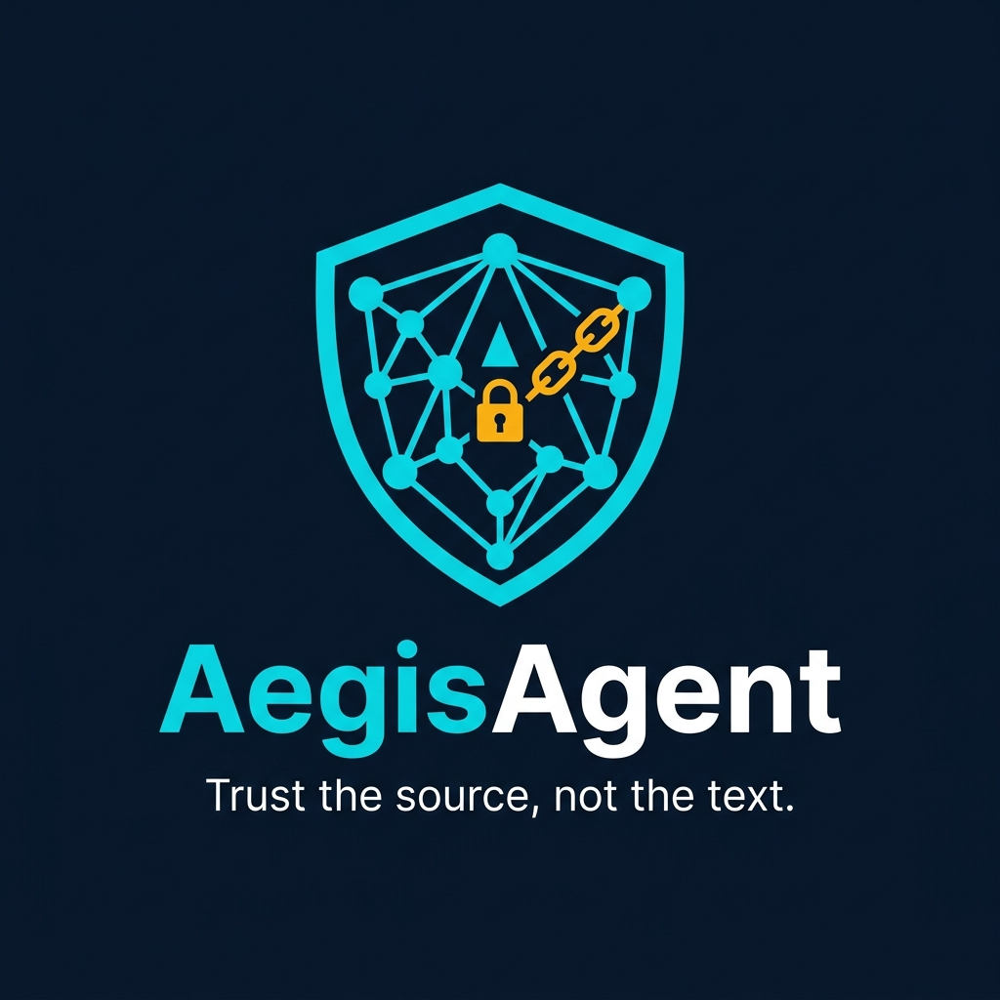
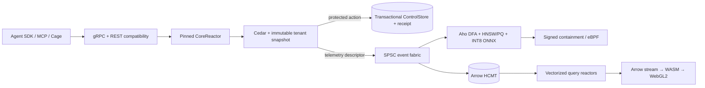

<div align="center">
  
  <h1>AegisAgent</h1>
  <p><strong>Bare-metal integrity, guardrails, SIEM, and SOC for autonomous AI agents.</strong></p>
</div>

[](https://github.com/lavkushry/AegisAgent/actions/workflows/ci.yml)
[](https://github.com/lavkushry/AegisAgent/actions/workflows/sast.yml)
[](LICENSE)
[](Cargo.toml)

AegisAgent is not another prompt wrapper or generic API proxy. It is the enforcement and evidence layer between autonomous agents and consequential tools: cloud APIs, code repositories, MCP servers, databases, filesystems, networks, and credentials.

The current system already binds approval to the exact canonical action, gates on deterministic source provenance with Cedar, fails closed in Python/TypeScript/Go SDKs, and emits hash-chained receipts. The target data plane replaces JSON-heavy, row-oriented telemetry processing with pinned Rust reactors, bounded SPSC rings, Hybrid Columnar Merge Trees, compiled guardrails, kernel containment, and an Arrow/WASM/WebGL console.

> **Performance status:** `<1 ms p99` deterministic authorization compute, `>=1,000,000 events/s/node` telemetry ingestion, `<100 ms p99` first deterministic detection, and 60 FPS analytical rendering are qualification targets—not current benchmark results. The checked-in SQLite baseline sustains roughly 130–150 authorizations/s and records 17.58 ms HTTP p99 at 10 requests/s. See [the measured baseline](docs/performance-baseline.md) and [benchmark contract](ARCHITECTURE.md#20-acceptance-benchmark-contract).

## The integrity moat

| Threat | Weak control | AegisAgent invariant |
|---|---|---|
| Approve-then-swap / TOCTOU | approval binds to display text | `SHA-256(aegis-jcs-1(exact action))`; mismatch or edit fails closed |
| Confused deputy | classifier trusts persuasive text | Cedar gates deterministic source provenance; trust can only tighten |
| Approval replay | reusable approval token | atomic, expiring, single-use consume bound to `action_hash` |
| Audit tampering | mutable text logs | per-tenant receipt chain with optional Ed25519/KMS signature |
| Runaway agent | alert after damage | signed containment commands and target eBPF enforcement |
| SOC data overload | JSON rows through a general search cluster | bounded binary ingestion and time-partitioned HCMT/Arrow storage |

Security scores never create an allow. LLMs may explain a closed incident; they do not decide, approve, contain, or execute.

## Architecture


```mermaid
flowchart LR
    Agent[Agent SDK / MCP / Cage] --> Gateway[gRPC + REST compatibility]
    Gateway --> Reactor[Pinned CoreReactor]
    Reactor --> Cedar[Cedar + immutable tenant snapshot]
    Cedar -->|protected action| Control[(Transactional ControlStore + receipt)]
    Cedar -->|telemetry descriptor| Ring[SPSC event fabric]
    Ring --> HCMT[(Arrow HCMT)]
    Ring --> Guard[Aho DFA + HNSW/PQ + INT8 ONNX]
    Guard --> Contain[Signed containment / eBPF]
    HCMT --> Query[Vectorized query reactors]
    Query --> UI[Arrow stream → WASM → WebGL2]
```

The architecture separates two correctness domains:

- **Control state:** agents, policies, approvals, replay claims, bans, commands, receipt heads, and protected decisions remain transactional.
- **Event state:** runtime telemetry, SOC projections, time-series data, guardrail candidates, and analytical indexes move to HCMT.

This split is deliberate. A columnar merge tree is excellent for append and scan; it is not a license to weaken atomic approval consumption or receipt durability.

Read the canonical [HLD](ARCHITECTURE.md), [LLD](docs/LLD.md), and [repository-backed migration matrix](MIGRATION_MATRIX.md).

## Performance design

The target node eliminates avoidable coordination in the telemetry path:

- one pinned thread owns each hot reactor; no work-stealing migration;
- one producer and one consumer own each cache-padded ring;
- FlatBuffers are verified and viewed in place inside the reactor arena;
- memtables append into structure-of-arrays buffers and seal into Arrow-compatible segments;
- Gorilla timestamp blocks, zone maps, Bloom filters, and Roaring bitmaps prune before decode;
- Aho-Corasick scans text in `O(n + z)` regardless of pattern count after compilation;
- React owns controls, WASM owns Arrow transforms, and WebGL2 instancing owns points.

On a 32-core 3.2 GHz qualification profile at 70% CPU utilization, one million events/s permits 71,680 cycles/event. At 256 bytes/event, payload bandwidth is about 2.05 Gbit/s before framing/TLS. These budgets are feasible hypotheses; the project accepts them only after 30-minute compaction-active, loss-checked benchmarks with raw HDR histograms.

Authorization compute and protected commit are measured separately. A warm deterministic decision targets `<1 ms p99`; a mutating allow still waits for the configured durable control/receipt commit even when storage takes longer.

## Repository status

| Capability | Current | Target migration |
|---|---|---|
| Authorization | Axum/Tokio + Cedar + SQLx | typed service on pinned decision reactors |
| APIs | REST JSON plus partial tonic/protobuf | protobuf-first parity; binary fast path; REST compatibility off benchmark path |
| Control storage | SQLite/PostgreSQL via `StorageBackend` | split transactional `ControlStore`/`ReceiptLog` |
| Telemetry storage | row tables and JSON/TEXT fields | WAL + Arrow-compatible HCMT SSTables |
| Event bus | Tokio bounded MPSC | NUMA-local cache-padded SPSC ring matrix |
| Detection | structured scalar rules; optional Qdrant | Aho DFA plus owned HNSW/PQ and isolated INT8 ONNX |
| Host sensor | procfs polling, spool, signed commands | CO-RE eBPF telemetry/containment with truthful fallback |
| Console | React JSON polling and SVG | Arrow IPC worker, Rust WASM, WebGL2 instancing |

No target row in this table is a shipped claim until its roadmap gate passes.

## Quick start

### Docker Compose

```bash
git clone https://github.com/lavkushry/AegisAgent.git
cd AegisAgent
docker compose up --build -d
```

The development gateway binds to loopback by default and serves REST on `8080` and gRPC on `6334`.

### Build from source

```bash
cargo build --workspace --release
cargo test --workspace -- --test-threads=1
```

Rust `1.88` or newer and `protoc` are required by the current workspace.

### Run the integrity demo

```bash
make doctor
make demo
```

The demo proves that an untrusted mutating action is denied, a swapped post-approval payload fails its `action_hash`, replay is rejected, and the receipt range verifies.

### Python SDK

```bash
python3 -m venv .venv
. .venv/bin/activate
python -m pip install -e "sdk-python[dev]"
python examples/integrity_demo.py
```

SDK implementations:

- [Python](sdk-python/) — async client, decorators, evidence and verification tools;
- [TypeScript](sdk-typescript/) — typed fail-closed wrapper and canonical corpus;
- [Go](sdk-go/) — context-aware client, approval consume, receipt verification.

Every SDK reproduces `aegis-jcs-1` bytes and refuses execution on hash mismatch, expiry, replay, unknown decision, or required-gateway failure.

## Development gates

```bash
cargo fmt --all -- --check
cargo clippy --workspace --all-targets -- -D warnings
cargo test --workspace -- --test-threads=1
python -m unittest discover -s sdk-python/tests
(cd sdk-typescript && npm test)
(cd sdk-go && go test ./...)
node scripts/validate-docs.mjs
```

Core data-plane changes additionally require ADR review, corpus/differential tests, Loom/Miri/sanitizer coverage for unsafe concurrency, and reproducible p99/allocation/copy/cache-miss evidence. See [CONTRIBUTING.md](CONTRIBUTING.md).

## Documentation

- [High-Level Architecture](ARCHITECTURE.md)
- [Low-Level Design](docs/LLD.md)
- [Migration Matrix](MIGRATION_MATRIX.md)
- [36-Week Roadmap](ROADMAP.md)
- [Action Receipt Specification](docs/action-receipt-spec.md)
- [Security Model](docs/security-model.md)
- [Measured Performance Baseline](docs/performance-baseline.md)
- [Implementation Status](docs/Implementation_Status.md)

## Security

Do not file public issues for vulnerabilities. Follow [SECURITY.md](SECURITY.md) for private disclosure. Never include credentials, raw secrets, unrestricted prompts, production data, or private keys in an issue, benchmark artifact, trace, receipt, or test fixture.

## License

AegisAgent is licensed under the [MIT License](LICENSE).
