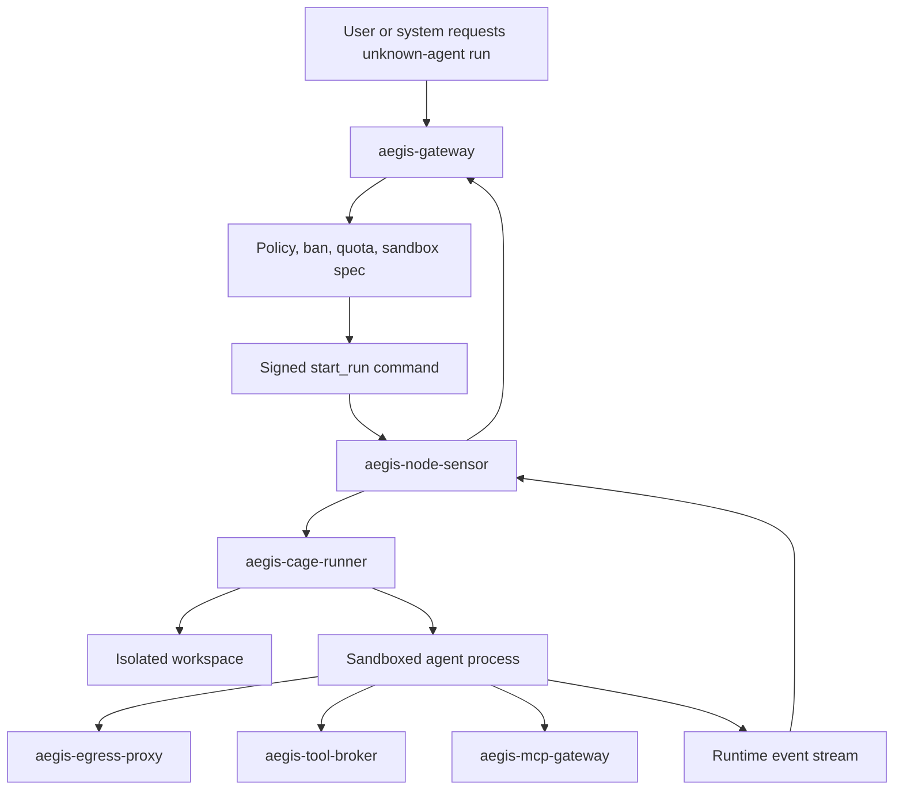
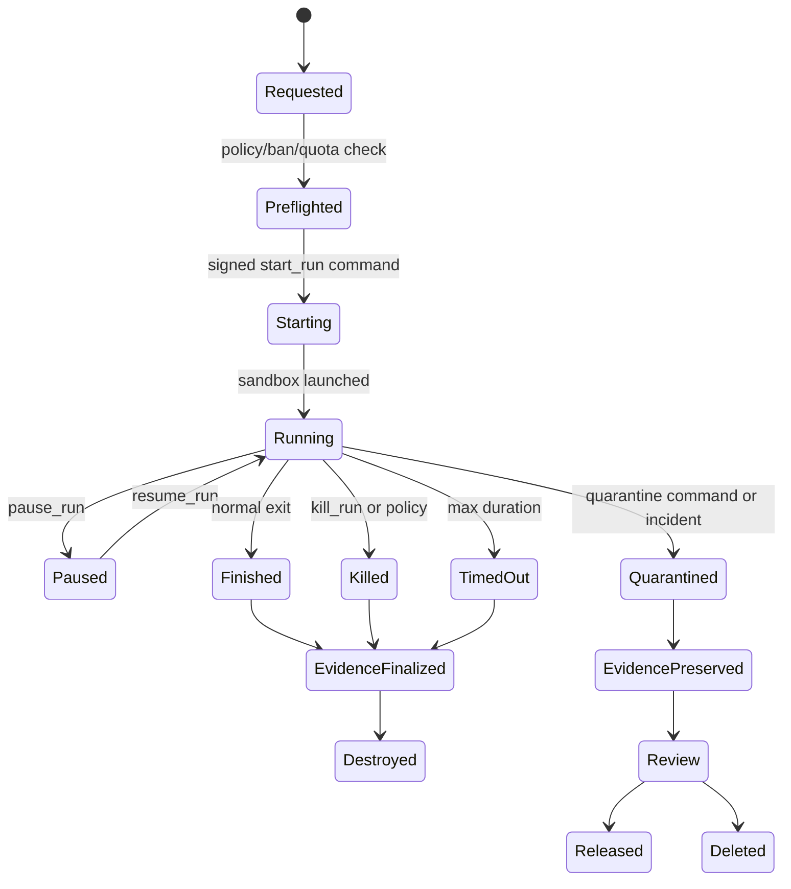

# AegisAgent Agent Cage

**Status:** target design proposal  
**Date:** 2026-06-28

---

## 1. Purpose

The **Aegis Agent Cage** is a disposable sandbox execution system for unknown, anonymous, untrusted, or high-risk AI agents.

It exists because SDK-based controls only work for known cooperative agents. Unknown agents must be controlled by runtime isolation and forced choke points:

- no host filesystem by default
- no Docker socket
- no raw credentials
- no direct internet in enforce/lockdown mode
- tools forced through `aegis-tool-broker`
- MCP forced through `aegis-mcp-gateway`
- egress forced through `aegis-egress-proxy`
- runtime telemetry forced through `aegis-node-sensor`
- signed pause/kill/quarantine controls

The cage is disposable. It is not a long-running trusted agent runtime.

---

## 2. Non-negotiable boundary

`aegis-gateway` must never run untrusted agents.

Correct separation:

```text
aegis-gateway       = control plane, policy, approvals, receipts, commands
aegis-node-sensor   = local runtime sensor and command enforcement
aegis-cage-runner   = disposable sandbox launcher/controller
sandbox runtime     = Docker first; gVisor/Firecracker/Kata/Kubernetes later
```

---

## 3. Cage architecture



---

## 4. Cage requirements

The cage runner must support:

- isolated workspace
- no host filesystem by default
- no Docker socket
- no raw credentials
- no direct internet in enforce mode
- read-only base image option
- resource limits
- CPU/memory/process limits
- timeout
- max file writes
- max output size
- controlled mounts
- controlled environment
- network namespace isolation
- egress forced through proxy
- tools forced through broker
- MCP forced through MCP gateway
- kill/pause/quarantine controls

Initial implementation can use Docker, but the architecture must support gVisor, Firecracker, Kata, or Kubernetes sandbox later.

---

## 5. Sandbox runtime abstraction

Define a trait/interface in Rust:

```rust
trait SandboxRuntime {
    async fn create(&self, spec: SandboxSpec) -> Result<SandboxHandle, CageError>;
    async fn start(&self, handle: &SandboxHandle) -> Result<(), CageError>;
    async fn pause(&self, handle: &SandboxHandle) -> Result<(), CageError>;
    async fn resume(&self, handle: &SandboxHandle) -> Result<(), CageError>;
    async fn kill(&self, handle: &SandboxHandle, reason: KillReason) -> Result<(), CageError>;
    async fn snapshot(&self, handle: &SandboxHandle) -> Result<EvidenceSnapshot, CageError>;
    async fn destroy(&self, handle: &SandboxHandle) -> Result<(), CageError>;
}
```

Runtime implementations:

| Runtime | Phase | Notes |
|---|---|---|
| Docker | first | easiest local/CI implementation; must not mount Docker socket into cage |
| Kubernetes Job/Pod | early enterprise | natural for cluster execution and NetworkPolicy |
| gVisor | later | stronger syscall isolation for containers |
| Kata | later | VM-backed container isolation |
| Firecracker | later | microVM isolation for high-risk workloads |

---

## 6. Run lifecycle



---

## 7. Cage run spec

`POST /v1/agent-cage/runs` creates an intended run. Gateway validates and sends a signed `start_run` command to the sensor.

```json
{
  "tenant_id": "tenant_...",
  "run_id": "run_...",
  "agent_id": "anon_or_registered",
  "sandbox_id": "sandbox_...",
  "mode": "observe|enforce|lockdown",
  "image": {
    "ref": "ghcr.io/example/agent:sha256-...",
    "digest": "sha256:...",
    "read_only_rootfs": true
  },
  "command": ["python", "agent.py"],
  "working_dir": "/workspace",
  "workspace": {
    "template_id": "tmpl_...",
    "max_bytes": 104857600,
    "max_files": 10000,
    "preserve_on_failure": true
  },
  "resources": {
    "cpu_millis": 1000,
    "memory_bytes": 1073741824,
    "process_limit": 128,
    "timeout_seconds": 900,
    "max_stdout_bytes": 10485760,
    "max_stderr_bytes": 10485760
  },
  "network": {
    "direct_internet": false,
    "egress_proxy_url": "http://127.0.0.1:18080",
    "allowed_destinations": []
  },
  "tooling": {
    "tool_broker_url": "http://aegis-tool-broker:8080",
    "mcp_gateway_url": "http://aegis-mcp-gateway:8080"
  },
  "environment": {
    "AEGIS_RUN_ID": "run_...",
    "AEGIS_SANDBOX_ID": "sandbox_...",
    "HTTP_PROXY": "http://127.0.0.1:18080",
    "HTTPS_PROXY": "http://127.0.0.1:18080"
  },
  "controlled_mounts": []
}
```

Rules:

- Environment values must not include raw credentials.
- Mounts must be explicit, least-privilege, and read-only unless a write mount is approved.
- Default network is no direct internet.
- Default workspace is empty or template-provisioned.

---

## 8. Filesystem/workspace design

### 8.1 Defaults

- Empty isolated workspace per run.
- No host home directory.
- No host `/var/run/docker.sock`.
- No host SSH agent socket.
- No cloud credentials from host.
- No kubeconfig from host.
- Read-only root filesystem when feasible.

### 8.2 Controlled mounts

Controlled mounts require policy approval and are recorded:

```json
{
  "mount_id": "mnt_...",
  "source_type": "git_snapshot|artifact|secretless_config|tmpfs",
  "target_path": "/workspace/input",
  "read_only": true,
  "reason": "needed for benchmark input",
  "approved_by": "policy_or_user"
}
```

### 8.3 Workspace evidence

On suspicious behavior or quarantine:

- freeze workspace
- compute file manifest hashes
- prevent deletion
- preserve as evidence snapshot
- attach to incident
- allow admin review/release/delete

No raw secret files should be exported unless explicitly authorized and redacted/handled under evidence policy.

---

## 9. Network isolation

### 9.1 Docker-first approach

Initial Docker implementation:

- create per-run Docker network
- no default bridge egress unless routed through egress proxy
- inject `HTTP_PROXY`/`HTTPS_PROXY`
- optionally run a sidecar egress proxy in the same network
- block raw outbound at iptables/network namespace where feasible

### 9.2 Kubernetes approach

Kubernetes implementation:

- per-run Pod or Job
- NetworkPolicy denies all egress by default
- allow egress only to:
  - `aegis-egress-proxy`
  - `aegis-tool-broker`
  - `aegis-mcp-gateway`
  - `aegis-node-sensor`/event relay if needed
- resource limits and securityContext enforced
- no privileged pods by default

### 9.3 Enforce/lockdown behavior

| Mode | Network behavior |
|---|---|
| observe | direct internet may be allowed if explicitly configured; events emitted |
| enforce | unknown destinations denied unless policy allows |
| lockdown | no direct internet; deny unknown egress; kill/pause on bypass attempt |

---

## 10. Credential isolation

Anonymous agents must never receive raw credentials.

Allowed credential paths:

- scoped, short-lived run token for `aegis-tool-broker`
- scoped, short-lived run token for `aegis-mcp-gateway`
- no cloud provider credentials in environment
- no persistent API keys in workspace

Tool broker owns:

- GitHub tokens/apps
- Slack tokens
- Gmail credentials
- Jira credentials
- HTTP API credentials
- filesystem/shell authorization
- MCP upstream credentials

Every broker action is canonicalized, authorized, approved if needed, executed, and receipted.

---

## 11. Process and resource controls

Minimum controls:

- CPU limit
- memory limit
- process count limit
- wall-clock timeout
- stdout/stderr max bytes
- file write count/bytes max
- max child process depth where feasible
- deny privileged container mode
- deny host PID/network namespaces
- deny Docker socket

Events:

- `process_started`
- `process_exited`
- `shell_command`
- `package_install`
- `run_killed`
- `run_paused`
- `agent_frozen`

---

## 12. Secret and environment access

Detection sources:

- wrapper-injected environment access helpers
- filesystem event detection on `.env`, credential files, SSH keys, cloud config paths
- shell command heuristics for `cat .env`, `printenv`, `aws configure`, etc.
- eBPF/fanotify later

Event types:

- `secret_access_attempt`
- `env_access_attempt`
- `credential_use_attempt`

Policy:

- In observe: emit high-severity event.
- In enforce: block if possible; otherwise kill/pause according to policy.
- In lockdown: kill or freeze run and quarantine workspace.

---

## 13. Tool and MCP forcing

Cage runtime must make direct tool/API/MCP use impractical:

- no raw credentials
- egress proxy blocks known API domains unless broker identity/policy allows
- MCP server endpoints are not directly reachable in enforce/lockdown
- broker and MCP gateway use run-scoped tokens
- direct bypass attempts emit `credential_use_attempt`, `network_connect`, and `egress_blocked`

---

## 14. Control operations

Supported controls:

- pause run
- resume run
- kill run
- freeze agent
- ban agent/fingerprint
- snapshot workspace
- quarantine workspace
- release workspace
- delete quarantined workspace after review

Controls enter via signed command protocol. Cage runner never accepts unauthenticated local commands from the agent.

---

## 15. Quarantine semantics

Quarantine target: run/workspace/agent/file/MCP server/tool/credential/destination/prompt lineage.

Workspace quarantine means:

- stop or pause active run
- block external access
- make workspace read-only
- prevent deletion
- compute evidence manifest
- attach to incident
- emit receipt
- allow admin review
- release or delete after review

Quarantine is not just a label; it changes enforcement.

---

## 16. Cage security threat model

| Threat | Mitigation |
|---|---|
| Agent escapes to host FS | no host mounts, read-only rootfs, sandbox runtime, least privilege |
| Agent uses Docker socket | never mount Docker socket; explicit startup check fails closed |
| Agent steals creds | no raw credentials; broker owns creds |
| Agent exfiltrates data | egress proxy deny-by-default; upload detection; receipts/SOC |
| Agent bypasses proxy | network namespace/NetworkPolicy; detect raw connects |
| Agent deletes evidence | workspace freeze/quarantine; host-controlled snapshots |
| Agent DoS via fork/output | process/output/resource limits |
| Agent tampers with sensor | sensor outside cage; cage has no sensor credentials |
| Agent spoofs events | sensor/broker/proxy are authoritative; agent-origin events lower trust |

---

## 17. API model

### 17.1 Create run

`POST /v1/agent-cage/runs`

Request:

```json
{
  "agent_ref": "unknown|registered_agent_id",
  "image": "ghcr.io/example/agent@sha256:...",
  "command": ["python", "agent.py"],
  "mode": "enforce",
  "resources": {},
  "workspace_template_id": "tmpl_...",
  "reason": "run untrusted agent from PR"
}
```

Response:

```json
{
  "run_id": "run_...",
  "sandbox_id": "sandbox_...",
  "status": "starting",
  "control_command_id": "cmd_..."
}
```

### 17.2 Run controls

- `POST /v1/agent-cage/runs/:id/pause`
- `POST /v1/agent-cage/runs/:id/resume`
- `POST /v1/agent-cage/runs/:id/kill`
- `POST /v1/agent-cage/runs/:id/quarantine`

Every control returns a control command ID and requires a reason.

### 17.3 Timeline

`GET /v1/agent-cage/runs/:id/timeline`

Returns runtime DAG nodes/edges, redacted payloads, linked receipts, and incident IDs.

---

## 18. Storage model

Core tables:

- `agent_runs`
- `agent_sandboxes`
- `agent_fingerprints`
- `runtime_events`
- `control_commands`
- `control_action_results`
- `quarantine_records`
- `agent_bans`
- `evidence_packs`

Every row is tenant-scoped.

---

## 19. Observability

Metrics:

- cage runs started/finished/killed/quarantined
- run duration histogram
- resource limit hit counters
- output limit hit counters
- workspace bytes written
- direct egress bypass attempts
- tool broker calls from cages
- MCP gateway calls from cages
- quarantine actions

Logs:

- structured JSON
- no raw secrets
- run/sandbox IDs included

Traces:

- `cage.create`
- `cage.start`
- `cage.kill`
- `cage.snapshot`
- `cage.quarantine`

---

## 20. Testing plan

### Unit tests

- sandbox spec validation
- Docker command generation does not include Docker socket
- resource limit translation
- controlled mount validation
- environment redaction
- run fingerprint computation

### Integration tests

- start Docker-based cage
- no direct host filesystem access
- no raw credentials in env
- egress forced through proxy
- tool action forced through broker
- MCP action forced through gateway
- kill command terminates run
- timeout terminates run
- workspace snapshot created
- quarantine prevents deletion

### Security tests

- attempt Docker socket mount rejected
- attempt privileged mode rejected
- attempt host mount rejected
- attempt direct internet blocked in enforce/lockdown
- attempt `.env` read detected
- raw secret not present in events
- banned fingerprint prevents rerun

### E2E demo

The malicious anonymous-agent demo specified in `AegisAgent_World_Class_LLD.md` should run through the cage.

---

## 21. Initial PR scope

First `aegis-cage-runner` PR should not implement all isolation primitives.

Deliver:

- crate/binary skeleton
- `SandboxRuntime` trait
- Docker runtime implementation behind feature flag
- `SandboxSpec` and validation
- start/kill/status for a simple container
- isolated temp workspace
- no Docker socket check
- resource limits best effort
- event emission stubs to node sensor/gateway
- tests for spec validation and no forbidden mounts

Do not add tool broker, egress proxy, or MCP gateway code into the cage runner. Wire only endpoints/configuration.
