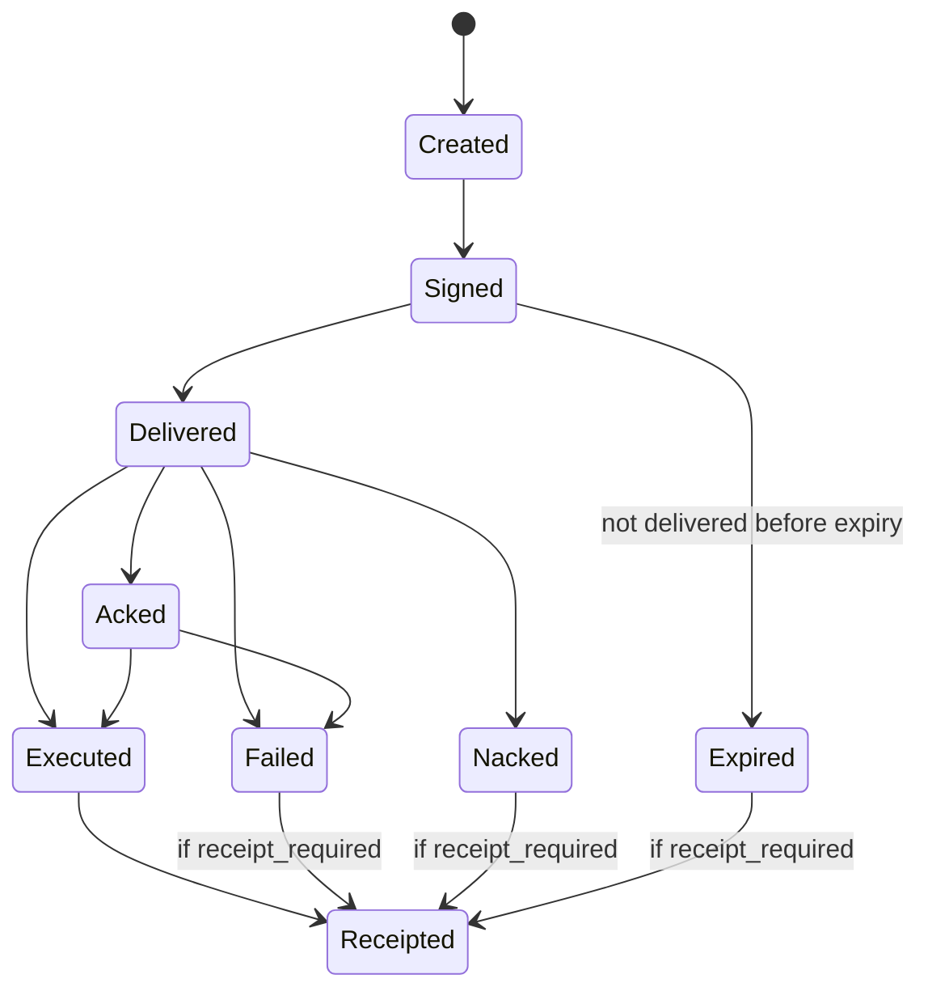

# AegisAgent Control Command Protocol

**Status:** target protocol design  
**Date:** 2026-06-28

---

## 1. Purpose

The Control Command Protocol lets `aegis-gateway` safely instruct `aegis-node-sensor` to control local workloads: start, pause, resume, kill, snapshot, quarantine, ban, update policy, or change local enforcement configuration.

This protocol is security-critical. A forged or replayed control command can kill workloads, release quarantines, or disable controls. Therefore:

- every command is signed
- every command is tenant-bound
- every command has an expiry
- every command has a nonce
- replay is rejected
- execution is idempotent
- every command result is ACK/NACKed
- control actions emit runtime events and receipts

---

## 2. Security goals

1. **Authenticity:** sensor verifies command came from trusted gateway key.
2. **Tenant binding:** command cannot control a different tenant's workload.
3. **Target binding:** command cannot be retargeted to another run/agent/sandbox.
4. **Freshness:** expired commands are rejected.
5. **Replay protection:** reused nonce/command ID is rejected or idempotently ACKed.
6. **Integrity:** command payload cannot be modified after signing.
7. **Least privilege:** sensor executes only typed command handlers, never arbitrary shell from payload.
8. **Evidence:** accepted and executed commands are recorded as runtime events and receipts.
9. **Fail closed:** invalid, unsigned, expired, or replayed commands are rejected.

---

## 3. Entities and keys

### 3.1 Gateway command signing key

Recommended signing algorithm: **Ed25519**.

- Gateway holds private command signing key in KMS/HSM or local dev file.
- Sensor stores pinned gateway public key set from registration/config.
- Key IDs support rotation.

### 3.2 Sensor identity key

Optional but recommended:

- Sensor has its own key pair.
- Sensor signs ACK/NACK result body.
- Gateway verifies result signatures for stronger non-repudiation.

### 3.3 Key rotation

- Gateway publishes key set with `kid`, `not_before`, `not_after`, and status.
- Sensor accepts active and grace-period keys.
- `update_sensor_config` rotates pinned keys only when signed by a currently trusted key.
- Emergency rotation requires out-of-band sensor re-registration or operator action.

---

## 4. Canonicalization

Commands are signed over deterministic canonical bytes.

Canonical version: `aegis-command-jcs-1`.

Rules:

- JSON object keys sorted by Unicode code point.
- Compact separators.
- Raw UTF-8.
- No non-finite numbers.
- `signature` field excluded from signed body.
- `signature_algorithm` and `signer_key_id` included in signed body.
- All timestamps are RFC3339 UTC strings.

Signed body is:

```text
canonicalize(command_without_signature)
```

Signature is:

```text
ed25519_sign(gateway_private_key, canonical_body)
```

---

## 5. Command schema

```json
{
  "schema_version": 1,
  "canonical_version": "aegis-command-jcs-1",
  "command_id": "cmd_01HY...",
  "tenant_id": "tenant_123",
  "target_type": "run",
  "target_id": "run_01HY...",
  "action": "kill_run",
  "reason": "blocked egress exfil attempt",
  "issued_by": "user:security-admin@example.com",
  "issued_at": "2026-06-28T12:00:00Z",
  "expires_at": "2026-06-28T12:05:00Z",
  "nonce": "base64url-128-bit-random",
  "requires_ack": true,
  "receipt_required": true,
  "payload": {
    "kill_signal": "SIGKILL",
    "preserve_workspace": true
  },
  "signature_algorithm": "ed25519",
  "signer_key_id": "gw-key-2026-06",
  "signature": "base64url-signature"
}
```

---

## 6. Target types

| `target_type` | `target_id` examples | Notes |
|---|---|---|
| `sensor` | `sensor_node_id` | sensor config/policy update |
| `run` | `run_id` | pause/resume/kill/snapshot |
| `sandbox` | `sandbox_id` | runtime-level actions |
| `agent` | `agent_id` | freeze/unfreeze/ban |
| `workspace` | `workspace_id` or `run_id` | quarantine/release/delete |
| `mcp_server` | `server_key` or ID | quarantine/restore |
| `mcp_tool` | server/tool composite | disable/enable |
| `tool` | tool ID/name | disable/enable |
| `destination` | domain/IP/CIDR | block/unblock egress |
| `credential` | credential scope/ref | revoke/rotate |
| `policy_bundle` | bundle ID/version | update local policy |

---

## 7. Command actions

Required command actions:

- `start_run`
- `pause_run`
- `resume_run`
- `kill_run`
- `snapshot_workspace`
- `quarantine_workspace`
- `release_workspace`
- `ban_agent`
- `unban_agent`
- `ban_fingerprint`
- `unban_fingerprint`
- `freeze_agent`
- `unfreeze_agent`
- `revoke_token`
- `rotate_token`
- `block_destination`
- `unblock_destination`
- `disable_tool`
- `enable_tool`
- `quarantine_mcp_server`
- `restore_mcp_server`
- `collect_evidence`
- `update_policy`
- `update_sensor_config`

---

## 8. Command validation algorithm on sensor

For every received command:

1. Parse JSON; reject malformed.
2. Validate required fields and `schema_version`.
3. Check `tenant_id` equals sensor tenant binding.
4. Check `target_type` and `target_id` are in sensor's local scope.
5. Check `issued_at` is not too far in the future.
6. Check `expires_at` is after current time and within allowed max TTL.
7. Check nonce not seen for `(tenant_id, signer_key_id)`.
8. Canonicalize command without `signature`.
9. Resolve `signer_key_id` to pinned gateway public key.
10. Verify Ed25519 signature.
11. Check command authorization scope if local config includes allowed command scopes.
12. Check idempotency by `command_id`.
13. Execute typed handler or return idempotent previous result.
14. Persist ACK/NACK and emit event.

Invalid commands are never executed.

---

## 9. Replay protection

Sensor maintains a durable replay cache:

```text
/var/lib/aegis/sensor/replay-cache/commands.sqlite
```

Columns:

- `tenant_id`
- `command_id`
- `nonce`
- `signer_key_id`
- `expires_at`
- `status`
- `result_hash`
- `first_seen_at`
- `last_seen_at`

Rules:

- Nonce is unique until expiry plus replay grace window.
- `command_id` is unique permanently or for retention window.
- If same valid command is delivered twice, return previous ACK result.
- If same `command_id` appears with different canonical body, reject as tamper.
- Expired replay cache entries are compacted after retention.

---

## 10. Idempotency model

Commands are designed to be retry-safe.

| Action | Idempotent behavior |
|---|---|
| `pause_run` | paused run remains paused; ACK success |
| `resume_run` | running run remains running; ACK success if not killed/quarantined |
| `kill_run` | killed/missing terminal run returns prior terminal status |
| `quarantine_workspace` | already quarantined workspace ACKs success with existing quarantine ID |
| `ban_agent` | existing active ban ACKs success with existing ban ID |
| `block_destination` | existing block ACKs success |
| `update_policy` | same bundle hash ACKs success; different hash with same command ID rejects |
| `start_run` | same run spec returns existing run; differing spec rejects |

---

## 11. Delivery mechanisms

### 11.1 Long polling

Sensor polls:

```http
GET /v1/control/commands?tenant_id=...&sensor_node_id=...&since=...
```

Response:

```json
{
  "commands": [],
  "next_cursor": "opaque",
  "server_time": "2026-06-28T12:00:00Z"
}
```

Simple and robust; good first implementation.

### 11.2 Server-sent events

Gateway streams command notifications. Sensor still fetches full command by ID to avoid losing commands on stream interruption.

### 11.3 WebSocket

Useful for low-latency enterprise control, but more operationally complex. Keep long-poll fallback.

---

## 12. ACK/NACK schema

Sensor posts:

```http
POST /v1/control/commands/:id/ack
```

Request:

```json
{
  "schema_version": 1,
  "tenant_id": "tenant_123",
  "command_id": "cmd_...",
  "sensor_node_id": "sensor_...",
  "status": "ack|nack|executed|failed|rejected|duplicate",
  "received_at": "2026-06-28T12:00:01Z",
  "executed_at": "2026-06-28T12:00:02Z",
  "result_code": "ok|invalid_signature|expired|replay|target_not_found|execution_failed",
  "message": "human readable summary without secrets",
  "result": {
    "run_id": "run_...",
    "previous_state": "running",
    "new_state": "killed"
  },
  "runtime_event_id": "evt_...",
  "receipt_id": "rcpt_...",
  "receipt_hash": "sha256hex",
  "sensor_signature_algorithm": "ed25519",
  "sensor_signer_key_id": "sensor-key-...",
  "sensor_signature": "base64url-signature"
}
```

ACK/NACK is also idempotent. Gateway accepts duplicate ACKs if body hash matches prior result.

---

## 13. Gateway command state machine



Command statuses:

- `created`
- `signed`
- `delivered`
- `acked`
- `nacked`
- `executed`
- `failed`
- `expired`
- `receipt_failed`

---

## 14. Storage model

### 14.1 `control_commands`

Required fields:

- `id`
- `tenant_id`
- `command_id`
- `target_type`
- `target_id`
- `action`
- `reason`
- `issued_by`
- `issued_at`
- `expires_at`
- `nonce`
- `payload_json`
- `requires_ack`
- `receipt_required`
- `canonical_version`
- `signature_algorithm`
- `signer_key_id`
- `signature`
- `status`
- `created_at`

Indexes:

- unique `(tenant_id, command_id)`
- `(tenant_id, target_type, target_id, created_at)`
- `(tenant_id, status, expires_at)`

### 14.2 `control_action_results`

Required fields:

- `id`
- `tenant_id`
- `command_id`
- `sensor_node_id`
- `status`
- `received_at`
- `executed_at`
- `result_code`
- `message`
- `result_json`
- `runtime_event_id`
- `receipt_id`
- `receipt_hash`
- `sensor_signature`
- `created_at`

Indexes:

- unique `(tenant_id, command_id, sensor_node_id)`
- `(tenant_id, sensor_node_id, created_at)`

---

## 15. Receipt requirements

A receipt is required for:

- `kill_run`
- `pause_run` for policy/security reasons
- `quarantine_workspace`
- `release_workspace`
- `ban_agent`
- `unban_agent`
- `ban_fingerprint`
- `unban_fingerprint`
- `freeze_agent`
- `unfreeze_agent`
- `revoke_token`
- `block_destination`
- `quarantine_mcp_server`
- `restore_mcp_server`
- `collect_evidence`
- `update_policy`
- `update_sensor_config`

Receipt fields should include:

- command ID
- tenant ID
- target type/ID
- action
- actor (`issued_by`)
- reason
- sensor node ID
- decision/control result
- previous state and new state hashes where applicable
- `prev_receipt_hash`
- `receipt_hash`
- signature
- timestamp

Protected control actions should not be considered successful until the gateway stores the command result receipt. If the sensor executed but gateway receipt storage fails, the gateway marks the command `receipt_failed` and emits a critical SOC event.

---

## 16. Sensor command execution handlers

### 16.1 Handler interface

```rust
trait CommandHandler {
    fn action(&self) -> CommandAction;
    async fn validate(&self, ctx: &CommandContext, payload: &Value) -> Result<(), CommandError>;
    async fn execute(&self, ctx: &CommandContext, payload: &Value) -> Result<CommandResult, CommandError>;
}
```

### 16.2 Handler rules

- No command may run arbitrary shell based on payload.
- All paths are resolved inside known Aegis directories/workspaces.
- All destructive operations require `reason`.
- All handlers are idempotent.
- All handlers emit runtime event.
- All handlers return structured error code on failure.

---

## 17. Command-specific payloads

### 17.1 `kill_run`

```json
{
  "kill_signal": "SIGTERM|SIGKILL",
  "grace_period_seconds": 10,
  "preserve_workspace": true,
  "collect_evidence": true
}
```

### 17.2 `quarantine_workspace`

```json
{
  "workspace_id": "workspace_or_run_id",
  "preserve_files": true,
  "make_read_only": true,
  "attach_incident_id": "inc_..."
}
```

### 17.3 `ban_fingerprint`

```json
{
  "fingerprint_type": "image_digest|repo_hash|binary_hash|package_lock_hash|behavior_signature",
  "fingerprint_value": "sha256:...",
  "scope": "tenant|organization|global_admin",
  "duration": "permanent|until_timestamp|until_manual_review|until_incident_closed",
  "expires_at": null
}
```

### 17.4 `update_sensor_config`

```json
{
  "config_version": 42,
  "mode": "enforce",
  "policy_bundle_hash": "sha256hex",
  "ban_version": 19,
  "egress_rule_version": 7,
  "effective_at": "2026-06-28T12:01:00Z"
}
```

---

## 18. Failure behavior

| Condition | Sensor behavior | Gateway behavior |
|---|---|---|
| invalid signature | reject, emit `control_command_received` with rejection | mark rejected if ACK received; alert |
| unknown key ID | reject | alert/key distribution issue |
| expired command | reject | mark expired/rejected |
| replayed nonce | reject or duplicate ACK if same command | alert if canonical body differs |
| target not found | NACK | mark failed and receipt if required |
| handler failed | NACK with structured code | mark failed and create SOC event |
| ACK delivery failed | retry with backoff from sensor | command remains pending until expiry |
| gateway down after execution | sensor stores ACK result locally and retries | reconcile on reconnect |
| receipt write failed | command result marked `receipt_failed` | protected control action requires investigation |

---

## 19. Authorization to issue commands

Gateway must authorize command creation before signing.

Inputs:

- actor identity and role
- tenant
- target ownership
- run/agent/sandbox state
- incident linkage
- policy bundle
- ban/quarantine state
- command type and risk

Rules:

- Tenant A cannot command Tenant B targets.
- Destructive actions require admin/security role or policy automation identity.
- Global bans require global admin.
- Release/delete quarantine requires explicit review permission.
- Policy automation can issue predefined commands but not arbitrary payloads.

---

## 20. API examples

### 20.1 Issue kill command

```http
POST /v1/control/commands
Authorization: Bearer <admin-jwt>
Content-Type: application/json
```

```json
{
  "target_type": "run",
  "target_id": "run_123",
  "action": "kill_run",
  "reason": "unknown egress exfiltration attempt",
  "payload": {
    "kill_signal": "SIGKILL",
    "preserve_workspace": true,
    "collect_evidence": true
  }
}
```

Response:

```json
{
  "command_id": "cmd_123",
  "status": "signed",
  "expires_at": "2026-06-28T12:05:00Z",
  "receipt_required": true
}
```

### 20.2 ACK kill command

```http
POST /v1/control/commands/cmd_123/ack
Authorization: Bearer <sensor-token-or-mtls>
```

```json
{
  "tenant_id": "tenant_123",
  "command_id": "cmd_123",
  "sensor_node_id": "sensor_1",
  "status": "executed",
  "result_code": "ok",
  "runtime_event_id": "evt_123",
  "receipt_id": "rcpt_123",
  "receipt_hash": "..."
}
```

---

## 21. Test plan

### Unit tests

- canonical command body excludes only `signature`
- command signature verification
- invalid key ID rejected
- expired command rejected
- future-issued command rejected
- nonce replay rejected
- tenant mismatch rejected
- target scope mismatch rejected
- idempotent duplicate command returns previous result

### Integration tests

- gateway signs `kill_run`, sensor verifies and executes mock handler
- sensor ACK updates command result
- gateway down after execution stores ACK locally and replays
- command result receipt emitted
- duplicate ACK accepted only if result hash matches
- same command ID with different body rejected

### Security tests

- Tenant A cannot command Tenant B run
- unauthenticated command creation rejected
- unsigned command to sensor rejected
- tampered payload rejected
- replayed command rejected
- release quarantine requires correct role

---

## 22. Initial implementation scope

First PR should implement only:

- shared command schema crate
- Ed25519 sign/verify helper
- canonical command body tests
- gateway route to create signed command record
- sensor-side verifier library tests
- ACK/NACK route storing results
- one mock command action: `kill_run`

Do not implement every command handler in the first PR. The protocol correctness is the foundation.
