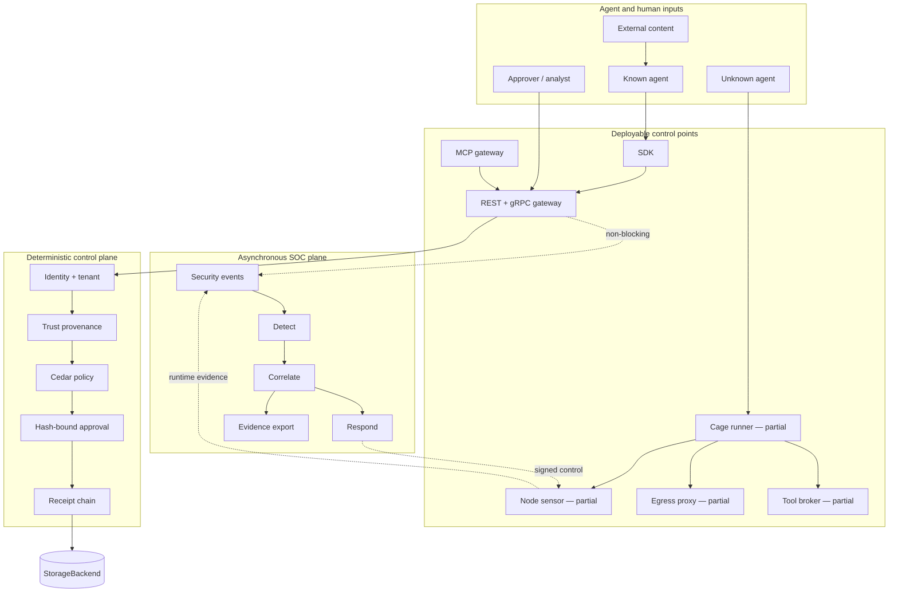
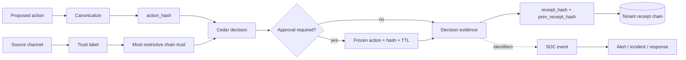
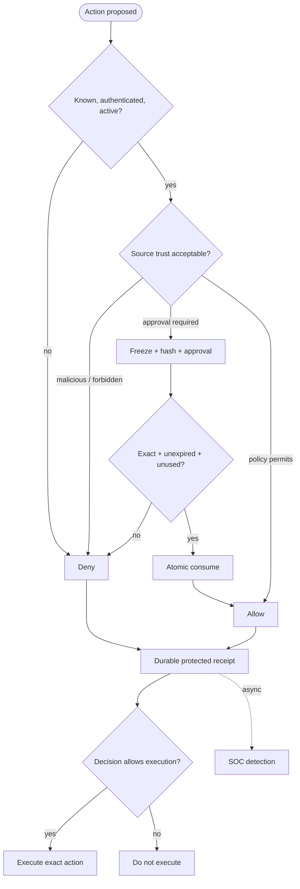
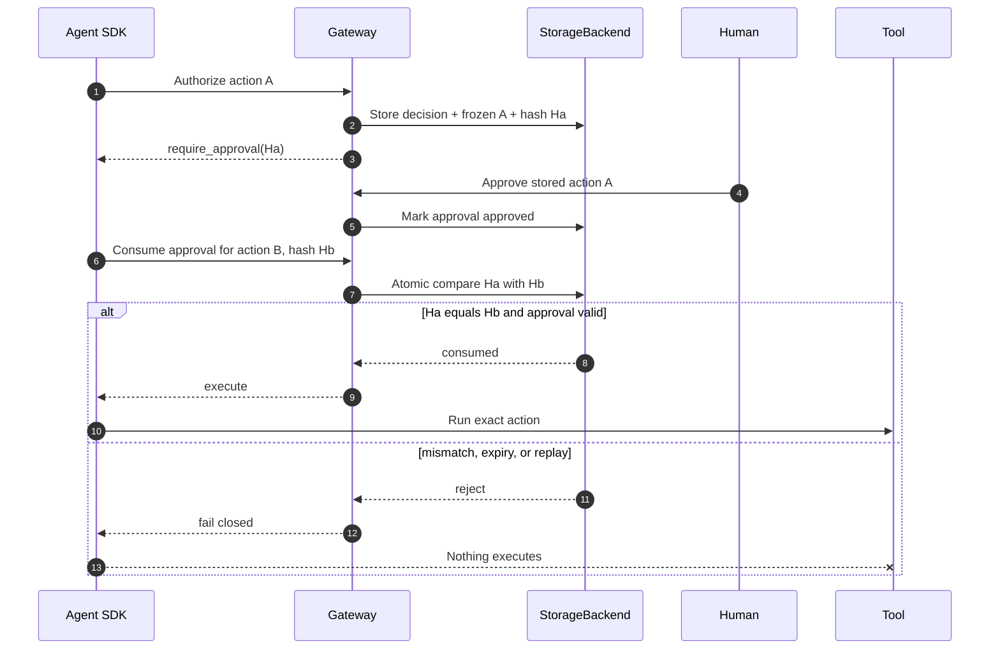
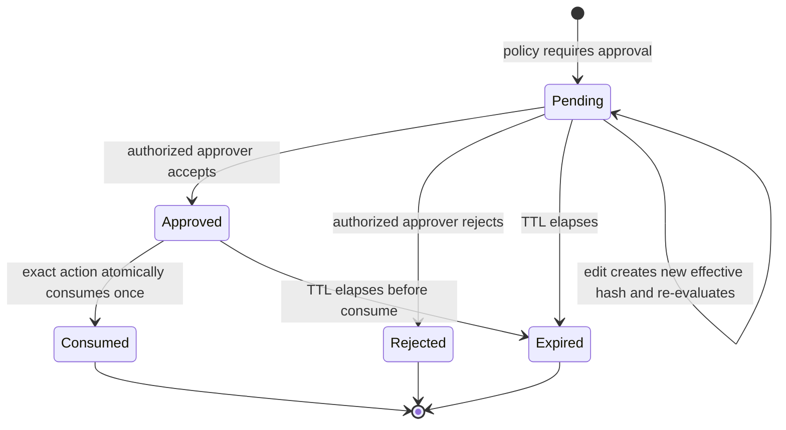
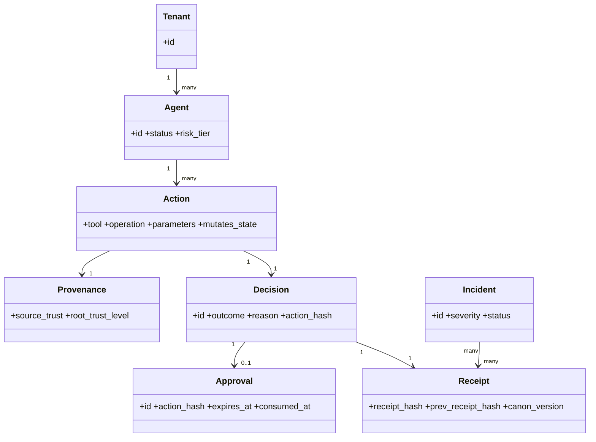
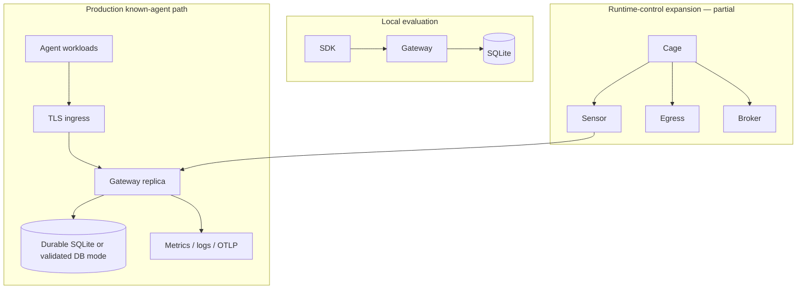

# AegisAgent Product Requirements Document

> **Document status:** Current product source of truth  
> **Version:** 1.0  
> **Updated:** 2026-07-11  
> **Owner:** Product and Architecture  
> **Implementation truth:** [Implementation Status](Implementation_Status.md)  
> **Audience:** Product · Engineering · Security · SOC · SRE · Design · Go-to-market · Enterprise evaluators

!!! warning "Requirements are not release claims"
    This PRD says what the product must do. [Implementation Status](Implementation_Status.md) says what the current build actually does. A requirement marked Partial or Planned must never be sold, demonstrated, or operated as complete.

## Overview

AegisAgent is the **integrity layer for AI agent actions**, delivered through an **integrity-anchored Agent Security Operations Center (SOC)**.

An AI agent action is a tool or API operation with a real effect: reading a secret, merging code, changing infrastructure, sending data, issuing a refund, or calling another agent. AegisAgent checks the action before it runs, binds human approval to the exact action bytes, records tamper-evident evidence, and helps security teams investigate and contain agent activity.

The product promise is:

> **Make the approval trustworthy. Trust the source, not the text. Run the SOC on the proof.**

### Product outcome

A customer should be able to:

1. connect a known agent in less than 20 minutes;
2. deterministically allow, deny, redact, quarantine, or require approval for a proposed action;
3. prove that an approved action was the action that executed;
4. prevent untrusted-origin content from silently driving privileged actions;
5. verify a per-tenant hash chain of action receipts independently;
6. detect and correlate security events without slowing the inline decision path;
7. contain an agent at every deployed control point;
8. export evidence for incident response and audit.

### Document boundaries

| This document owns | Another document owns |
|---|---|
| Product outcomes, scope, priorities, requirement IDs, acceptance criteria, success measures | Current shipped status: [Implementation Status](Implementation_Status.md) |
| Product-level non-functional requirements | Concrete deployment settings: [Deployment Guide](deployment-guide.md) |
| Product security guarantees and non-goals | Detailed adversary analysis: [Threat Model](AegisAgent_Threat_Model.md) |
| Release gates and traceability | Source-code rules: [Architecture Patterns](architecture.md) |

## Why This Exists

Organizations are giving AI agents credentials and access to real systems. Existing gateways can often decide whether a tool call is allowed, but three integrity gaps remain:

1. **Approval manipulation:** a human approves one action and a different action executes later.
2. **Confused deputy behavior:** untrusted external content causes a trusted agent to perform a privileged action.
3. **Unprovable operations:** logs show activity, but cannot prove that approvals, decisions, and resulting actions remained intact.

The product exists for teams whose agent actions have meaningful blast radius and whose security, operations, customers, or auditors need evidence stronger than application logs.

### When to use AegisAgent

- Agents can mutate production systems or customer data.
- Human approval is a required control.
- External issues, email, tickets, webpages, or tool output can influence actions.
- Security teams need fleet visibility, incident correlation, and containment.
- The organization needs a self-hosted, framework-neutral control point.

### When not to use AegisAgent

- The application only generates text and has no external actions.
- The need is a generic SIEM, identity lifecycle platform, model evaluator, or full DLP product.
- An agent can bypass every deployed Aegis control point and the organization is unwilling to add an SDK, gateway, broker, cage, sensor, or egress control.
- The team expects a probabilistic model to make final authorization decisions.

## Problem Statement

### Situation

A coding agent reads a public issue, plans a fix, and proposes a GitHub merge. The issue contains an indirect instruction written by an attacker. A human sees a friendly approval summary, approves it, and the agent changes parameters before execution.

### Uncontrolled outcome

Without action integrity:

- the source of the instruction is lost;
- the approval is detached from the exact bytes that execute;
- an old approval may be replayed;
- individual logs look legitimate;
- the incident is not correlated across the run;
- containment depends on manual credential revocation;
- audit evidence can be incomplete or mutable.

### Required outcome

The control must establish this chain:

```text
authenticated tenant and agent
  → deterministic source provenance
  → canonical action bytes
  → deterministic policy decision
  → exact-action approval when required
  → single-use consume before execution
  → durable, verifiable receipt
  → asynchronous detection and correlation
  → tenant-scoped containment
```

If any required link cannot be established, the protected action must not execute.

## Solution

AegisAgent uses two planes around a cryptographic evidence spine.

- The **inline integrity plane** authenticates, canonicalizes, authorizes, approves, consumes, and records protected actions.
- The **asynchronous SOC plane** detects, correlates, alerts, investigates, exports, and requests containment using evidence from the inline plane and runtime sensors.

### Design goals

| Goal | Product rule |
|---|---|
| Deterministic enforcement | Cedar and explicit trust labels decide; scores never grant permission |
| Exact-action approval | Approval is valid for one canonical action hash, once, before expiry |
| Independent verification | Receipt verification works outside the gateway and across supported SDK languages |
| Honest scope | Claims match deployed control points and the implementation ledger |
| Low inline latency | Detection and correlation remain asynchronous |
| Framework neutrality | REST, gRPC, and SDKs support different agent frameworks |
| Self-hosted operation | Core integrity can run within the customer's trust boundary |
| Safe extensibility | Protocol adapters stay thin; storage and policy follow crate boundaries |

### Four non-negotiable laws

1. **Deterministic policy decides; scores never gate.**
2. **An LLM may investigate; it never decides or enforces.**
3. **The inline path is sacred; detection is asynchronous.**
4. **Canonicalization, approval hashes, and receipt identity survive end to end.**

### Non-goals

AegisAgent is not a generic SIEM, generic API gateway, general identity-governance suite, full DLP platform, endpoint antivirus product, model-alignment system, or autonomous remediation agent. It integrates with those categories where useful.

## Architecture

The product architecture shows the enforcement points, shared control plane, evidence spine, and asynchronous operations plane.



Solid paths are product control paths; dotted paths are asynchronous evidence or control distribution. Partial runtime components must not be represented as universal enforcement until their force-path integrations are complete.

The existing [interactive architecture explorer](explorer/index.html) is driven by `architecture-map.json`. A future 3D mode may use React Three Fiber to separate inline and SOC planes vertically, animate only real telemetry, show status/latency/owner on hover, focus the camera on a selected run, and retain an accessible React Flow fallback. This describes a visualization experience, not a shipped telemetry guarantee.

## Component Breakdown

### Product capability map

| ID | Capability | Requirement | Priority | Current status |
|---|---|---|---:|---|
| INT-001 | Canonical action | All protected clients and the gateway produce byte-identical `aegis-jcs-1` action bytes | P0 | Implemented |
| INT-002 | Approval binding | Approval stores and displays the hash of the frozen effective action | P0 | Implemented |
| INT-003 | Atomic consume | Approval is unexpired, exact-hash, tenant-bound, and consumed once atomically | P0 | Implemented |
| INT-004 | Fail-closed SDK | SDK refuses deny, mismatch, expiry, replay, consume failure, and protected gateway failure | P0 | Implemented |
| PROV-001 | Six trust levels | Source trust is explicit, deterministic, and policy-visible | P0 | Implemented |
| PROV-002 | Tighten only | Classifiers and downstream hops may only make trust more restrictive | P0 | Implemented |
| RCPT-001 | Receipt chain | Protected decisions append a per-tenant canonical hash-chained receipt | P0 | Implemented |
| RCPT-002 | Verification | Single, range, full-chain, and head verification work independently | P0 | Implemented |
| RCPT-003 | Signing | Deployments may sign receipt hashes using Ed25519 or supported KMS integration | P1 | Implemented / beta |
| AUTH-001 | Dual protocol | Public product APIs have REST and gRPC parity from protobuf-first types | P0 | Implemented; continuous obligation |
| AUTH-002 | Tenant isolation | Every tenant-owned read/write binds authenticated `tenant_id` | P0 | Implemented; continuous audit |
| SOC-001 | Async events | Authorization emits bounded, non-blocking security events | P0 | Implemented |
| SOC-002 | Deterministic detection | Rules detect provenance, approval, drift, and behavioral sequences without LLM gating | P0 | Implemented |
| SOC-003 | Incidents | Correlation creates tenant-scoped incidents with evidence links | P0 | Implemented |
| SOC-004 | Evidence export | An investigation can export events, receipts, checkpoints, graph, and redaction manifest | P1 | Implemented / beta |
| RSP-001 | Agent control | Freeze, revoke, pause, resume, kill, quarantine commands are signed and auditable | P0 | Partial |
| RSP-002 | Choke-point enforcement | Bans and quarantine apply consistently at every deployed control point | P0 | Partial |
| RUN-001 | Unknown-agent cage | Unknown agents execute in disposable, hardened sandboxes | P0 | Partial |
| RUN-002 | Forced egress | Caged traffic cannot bypass the deny-by-default egress decision path | P0 | Partial |
| RUN-003 | Runtime telemetry | Sensor produces real process, filesystem, network, and secret-access evidence | P0 | Partial |
| BRK-001 | Credential broker | Privileged tools execute through credential indirection and exact-action authorization | P1 | Partial |
| UX-001 | SOC console | Analysts can inspect agents, approvals, incidents, receipts, runs, graph, bans, quarantine, and egress | P1 | Implemented / beta |
| OPS-001 | Single-node production | Secure JWT/TLS, durable storage, backup, metrics, and graceful shutdown are documented and exercised | P0 | Implemented / prod for known-agent path |
| OPS-002 | Multi-replica HA | Shared database/state, receipt consistency, migrations, and failover are production-validated | P0 enterprise | Partial |
| IAM-001 | Human SSO | Console supports enterprise OIDC/SAML and role mapping | P1 enterprise | Planned |

The status column is a convenient snapshot. The authoritative, file-backed ledger remains [Implementation Status](Implementation_Status.md).

## Data Flow

The data flow preserves action identity and source trust from proposal through evidence.



Action parameters remain in the appropriate protected record and must be redacted before downstream export when sensitive. SOC events use evidence identifiers and hashes rather than secrets.

## Request Flow

### Primary known-agent journey

1. The SDK builds a canonical tool call and sends agent, tenant, trust, trace, nonce, and action context.
2. The gateway authenticates and resolves tenant-scoped agent/tool state.
3. Trust propagation computes the most restrictive source level.
4. Cedar returns a deterministic decision.
5. The gateway persists decision, audit evidence, approval if needed, and the protected-action receipt.
6. The gateway emits a non-blocking SOC event.
7. The SDK executes only an allow or a valid, exact, consumed approval.

### Primary analyst journey

1. The SOC receives an event containing evidence linkage.
2. Deterministic rules create alerts.
3. Correlation groups related alerts/events into an incident.
4. The analyst verifies receipts and inspects provenance.
5. The analyst issues a tenant-scoped containment action.
6. Every response action becomes auditable evidence.

## Control Flow



No score appears in the authorization branches. A score may change display priority or investigation context, never permission.

## Sequence Diagram

The critical product proof is approve-then-swap resistance.



Acceptance evidence must demonstrate the negative branch, not only the successful approval path.

## State Diagram

The approval lifecycle is the central product state machine.



There is no transition from Consumed, Rejected, or Expired back to Approved. A new action requires a new authorization lifecycle.

## Class Diagram

This product-domain view shows the objects that carry identity, policy, approval, and evidence.



All tenant-owned relationships are scoped by tenant even where the simplified diagram omits the repeated field.

## Deployment Architecture

### Supported product tiers



- **Local evaluation:** Docker Compose or native gateway with seeded demo data.
- **Known-agent production:** hardened gateway, supported SDK, TLS/JWT or mTLS, durable storage, metrics, backups, and tested rollback.
- **Unknown-agent control:** cage, sensor, egress, broker, and signed response loop; not a complete product claim until force-path acceptance criteria pass.
- **Multi-replica enterprise:** not a supported claim until shared database/state and failover are validated end to end.

## Folder Structure

```text
AegisAgent/
├── lib/common/                 # errors, metrics, shared primitives
├── lib/api/proto/              # source of truth for REST/gRPC API types
├── lib/storage/                # tenant-scoped StorageBackend implementations
├── lib/policy/                 # Cedar and trust propagation
├── lib/soc/                    # event, detection, correlation, investigation
├── lib/egress/                 # egress decisions
├── lib/tool-broker-*/          # credential-indirection core/connectors
├── src/                        # thin gateway binary and protocol adapters
├── bins/                       # sensor, cage, egress, LLM gateway binaries
├── sdk-{python,typescript,go}/ # client enforcement and verification
├── ui-next/                    # SOC console
├── helm/                       # Kubernetes packages
├── e2e/                        # protocol/UI workflows
└── docs/                       # product, architecture, operations, reference
```

The product requirement for dual protocol and trait-backed storage is enforced by the mandatory [architecture patterns](architecture.md).

## Configuration

The minimum local product configuration uses loopback listeners, SQLite, Cedar policy, and bounded asynchronous work:

```yaml
storage:
  backend: sqlite
  sqlite:
    path: ./aegis.db
    busy_timeout_ms: 5000

gateway:
  host: "127.0.0.1"
  rest_port: 8080
  grpc_port: 6334

policy:
  cedar_path: ./policies.cedar

soc:
  event_channel_capacity: 10000
```

Production requirements add authenticated public binding, TLS, durable replay storage where replicas are involved, protected secret/signing material, durable backups, and observability. Configuration details remain owned by [Production Hardening](production-hardening.md).

## Installation

The product must support these installation paths:

| Path | Requirement | Verification |
|---|---|---|
| Native Rust | Build workspace gateway on supported Rust version | `/startupz`, `/readyz`, protected demo |
| Docker Compose | Start local known-agent proof without cloud accounts | `make demo` proof points |
| Helm | Install a single-replica hardened gateway with probes and NetworkPolicy | rollout, probes, authorize, receipt verify |
| SDK packages | Python, TypeScript, and Go clients enforce decisions consistently | shared canonicalization and receipt corpora |

Exact commands belong to [Installation](installation.md) and [Deployment Guide](deployment-guide.md); the PRD requires those paths to remain tested and documented.

## Quick Start

The activation experience is a product requirement:

```bash
make doctor
make demo
```

Within 10 minutes on a supported local environment, a reader should see:

```text
AegisAgent blocked the malicious merge attempt
Gateway rejected the swapped claimed_action_hash
Replay Blocked
"verified": true
```

Success means the unsafe tool did not execute and evidence verification passed. A pretty dashboard without the negative enforcement proof does not satisfy activation.

## Detailed Walkthrough

### Release scope: Now, Next, Later

| Horizon | Product scope | Exit condition |
|---|---|---|
| **Now — known-agent integrity** | Dual-protocol authorize, Cedar, provenance, approval lifecycle, fail-closed SDKs, receipts, SOC events/detection/incidents, evidence export, beta console | Maintain production reliability and protocol/SDK parity |
| **Next — force-path runtime control** | Cage execution loop, real sensor collectors, forced egress, mandatory privileged broker, ban/quarantine propagation, end-to-end unknown-agent narrative | An unknown agent cannot bypass the deployed process/network/tool controls in the supported topology |
| **Next — enterprise operations** | PostgreSQL/shared state GA, multi-replica validation, OIDC/SAML, upgrade/restore/DR evidence | Supported HA deployment survives failover and preserves tenant/receipt invariants |
| **Later — ecosystem depth** | More connectors, standalone MCP proxy, transparency/checkpoint proofs, richer prompt/model queries | Prioritized by validated customer demand and security value |

### Acceptance criteria by epic

#### Integrity epic

- **AC-INT-01:** Cross-language corpus produces byte-identical canonical action bytes.
- **AC-INT-02:** Approve action A, attempt action B, and verify B never executes.
- **AC-INT-03:** Consuming the same approval twice returns conflict and executes once at most.
- **AC-INT-04:** Editing an approval changes the effective hash and triggers re-evaluation.
- **AC-INT-05:** Protected receipt persistence failure prevents a successful protected response.

#### Provenance epic

- **AC-PROV-01:** Unlabeled input is treated as untrusted/unknown according to the policy contract.
- **AC-PROV-02:** A classifier cannot loosen `untrusted_external` to a trusted level.
- **AC-PROV-03:** Multi-agent hops preserve the most restrictive root trust.
- **AC-PROV-04:** Mutating action from forbidden provenance is denied regardless of benign text or advisory score.

#### SOC epic

- **AC-SOC-01:** Event emission does not block authorization when the SOC consumer is slow or unavailable.
- **AC-SOC-02:** Dropped events increment an observable counter.
- **AC-SOC-03:** A correlated incident links to decisions and receipt evidence under the same tenant.
- **AC-SOC-04:** Evidence export verifies included receipts/checkpoints and records redaction.
- **AC-SOC-05:** Any narrator receives inert evidence, has no tool credentials, and cannot change incident status or response.

#### Runtime-control epic

- **AC-RUN-01:** Unknown workload executes inside the supported disposable cage, not the gateway process.
- **AC-RUN-02:** Process, filesystem, network, and secret collectors produce real evidence from the cage.
- **AC-RUN-03:** All cage egress is forced through the deny-by-default decision path.
- **AC-RUN-04:** Signed kill/pause/resume/quarantine rejects invalid, expired, replayed, or wrong-tenant commands.
- **AC-RUN-05:** The end-to-end attack test produces action evidence, runtime evidence, an incident, containment, and verified receipts.

#### Enterprise-operations epic

- **AC-OPS-01:** Multi-replica load preserves tenant isolation, replay semantics, and receipt-chain correctness.
- **AC-OPS-02:** Rolling upgrade and rollback do not corrupt or fork receipt evidence.
- **AC-OPS-03:** Backup restoration meets declared RPO/RTO and passes receipt verification.
- **AC-OPS-04:** OIDC/SAML roles prevent unauthorized approval, administration, and containment.

### Release gates

A capability moves to Implemented only when:

1. REST and gRPC contracts are complete where applicable;
2. source files and tests are named in `Implementation_Status.md`;
3. tenant-isolation tests cover success and cross-tenant failure;
4. failure behavior is documented and fail-closed where required;
5. metrics/logs/runbooks exist for production-impacting failure;
6. docs and `architecture-map.json` are updated in the same change;
7. workspace checks and relevant SDK/UI/E2E tests pass.

## Code Explanation

This PRD does not own implementation code, but it constrains code ownership:

```text
new API type        → lib/api/proto first, then REST mirror
new DB operation    → StorageBackend trait + backend implementation
new Cedar behavior  → lib/policy
new SOC behavior    → lib/soc
REST adapter        → src/src/routes, parse → service → respond
gRPC adapter        → src/src/grpc, map → service → status
shared utility      → lib/common
```

The rule prevents product requirements from producing circular dependencies or duplicated protocol behavior. Production Rust paths return `Result<T, AegisError>` and avoid `.unwrap()`/`.expect()`.

## Live Example

### Small example: read-only trusted action

A registered agent requests a read-only file operation from `trusted_internal_signed` context. Cedar allows it, the response records advisory risk metadata, and low-risk evidence may flush asynchronously.

### Medium example: exact-action approval

A production coding agent proposes a merge. Policy requires approval. The gateway freezes the repository, pull-request number, target branch, and mutation flag into the canonical action. A human approves the stored action. The SDK consumes that approval exactly once and executes only if the current hash matches.

### Enterprise example: regulated fleet

Agents authenticate with workload identity, the gateway uses TLS and durable relational storage, policy changes use dry-run/canary comparison, receipts are KMS-signed, metrics and traces reach the customer's observability stack, evidence exports are retained under customer policy, and response actions require mapped human roles.

### Failure example

An agent reuses an expired approval for altered parameters. The gateway rejects consume, the SDK does not call the tool, a hash/replay signal becomes SOC evidence, and the analyst can inspect the original frozen action and current proposal.

### Recovery example

Storage becomes unavailable. Readiness fails, traffic stops, protected actions fail closed, operators restore storage from the tested backup procedure, verify the receipt chain, reopen traffic gradually, and document the incident.

## API

### Product API requirements

- Protobuf definitions in `lib/api/proto/` are the source of truth.
- Every endpoint has REST and gRPC parity unless an explicit architecture decision records an exception.
- Authentication and tenant identity are mandatory for tenant-owned data.
- Errors use a shared semantic vocabulary and safe protocol mappings.
- Requests support idempotency and replay protection where state mutation requires them.
- Generated OpenAPI and protobuf contracts are release artifacts.

Primary capability families:

| Family | Examples | Product purpose |
|---|---|---|
| Authorization | authorize, dry-run, canonical hash | Decide before action |
| Approval | create/get/approve/reject/edit/consume | Exact-action human oversight |
| Receipt | list/get/verify/range/chain/head | Independent evidence verification |
| Agent/MCP | registry, permissions, discovery, drift | Identity and tool governance |
| SOC | events, alerts, incidents, query, playbooks | Detect, correlate, investigate |
| Runtime | runs, runtime events, signed controls | Unknown-agent evidence and containment |
| Evidence | graph, evidence export, compliance pack | Audit and investigation portability |

The generated [API Reference](api-reference.md) owns exact paths and schemas. This PRD owns their required behavior.

## CLI

The product must maintain these operator/developer command experiences:

```bash
make doctor
make demo
cargo check --workspace
cargo test --workspace
cargo fmt --all -- --check
cargo clippy --workspace -- -D warnings
node scripts/validate-docs.mjs
```

`make doctor` validates local prerequisites. `make demo` proves the differentiators. Workspace commands enforce the crate DAG and production quality. Documentation validation prevents capability/status/navigation drift.

Receipt verification must remain available independently through supported SDK/CLI tooling, without trusting the running gateway that produced the evidence.

## Configuration Reference

Product configuration is grouped by responsibility:

| Group | Required behavior | Canonical reference |
|---|---|---|
| Listener/TLS | Local-only default; safe public binding; REST `8080`, gRPC `6334` configurable | [Deployment Guide](deployment-guide.md) |
| Authentication | JWT required mode, rotation, admin protection, optional mTLS | [Production Hardening](production-hardening.md) |
| Storage | SQLite local/single writer; validated shared backend for replicas | [Storage](components/Storage.md) |
| Policy | Cedar path, validation, safe hot reload, dry-run | [Policy Engine](components/Policy_Engine.md) |
| Approval | TTL, callback verification, role checks, rate limits | [Approval Engine](components/Approval_Engine.md) |
| Receipts | batching rules, durable protected path, signing/KMS | [Receipt Engine](components/Receipt_Engine.md) |
| SOC | bounded channel, jobs, retention/export | [SOC Engine](components/SOC_Engine.md) |
| Observability | metrics access, OTLP, logs, SIEM export | [Operational Design](AegisAgent_Operational_Design.md) |

Secret-bearing settings must never appear in API payloads, committed values, screenshots, or logs.

## Security

### Required guarantees

- Unknown agent, tool, MCP server, and MCP tool fail closed.
- Critical risk is denied; high-risk behavior follows deterministic policy and approval rules.
- Approval consume is exact-hash, time-bound, tenant-bound, and single-use.
- Classifiers may tighten provenance but cannot loosen it.
- Tenant-owned storage operations bind authenticated tenant identity.
- Protected actions do not succeed without durable receipt identity.
- Secrets are redacted and cryptographic keys remain outside ordinary payloads.
- Administrative and containment actions require authenticated authorization and audit.

### Threat model priorities

| Threat | Primary controls |
|---|---|
| Approve-then-swap / render mismatch | canonical bytes, action hash, stored effective call, SDK compare |
| Approval replay | atomic consume, TTL, nonce/idempotency semantics |
| Confused deputy | deterministic source channel label, tighten-only propagation, Cedar |
| Cross-tenant access | authenticated tenant extractor, trait methods, parameterized queries, isolation tests |
| Receipt tampering/fork | canonical receipt hash, previous hash, verification, optional signature/checkpoint |
| SOC prompt injection | deterministic detection; narrator sandboxed with no enforcement/tool authority |
| Runtime bypass | cage, forced egress, sensor, broker, ban/quarantine propagation |

The complete analysis and residual risk live in [Threat Model](AegisAgent_Threat_Model.md).

## Performance

### Product objectives

| Measure | Objective | Current evidence |
|---|---:|---|
| Inline authorization design budget | `<75 ms` p95 for supported known-agent topology | Local baseline p95 `13.80 ms` at 10 rps |
| HTTP p99 | `<100 ms` in reference benchmark | Local baseline `17.58 ms` |
| Canonical hash overhead | `<5 ms` p95 on supported action-size corpus | Canon benchmark required |
| SOC event emission | Non-blocking; no awaited detection | Implemented bounded sink |
| Detection latency | `<2 s` p95 event-to-alert in supported local topology | Must be measured continuously |
| Receipt verification | Linear, bounded memory for documented range sizes | Receipt benchmark and shared corpus |

Historical measurements are not production promises. Every release that changes the hot path must run the checked-in benchmark and explain material regression. Capacity testing must include protected writes, not only low-risk reads.

## Scaling

### Scaling requirements

- Bounded queues, caches, request bodies, timeouts, and concurrency prevent unbounded memory growth.
- Metadata may be cached; authorization decisions may not.
- Independent reads should run concurrently when safe.
- SOC work remains out of band and exposes loss/backpressure.
- SQLite remains single writer; additional replicas require validated shared storage and state.
- Receipt-chain appends preserve one consistent per-tenant order under concurrent writers.
- Rate, quota, replay, and leader-election state must have defined replica semantics.

Scale is accepted only when tenant isolation, receipt integrity, replay prevention, and failure recovery continue to pass—not merely when throughput increases.

## Monitoring

The supported production path must expose:

- liveness, readiness, and startup probes;
- authorization latency and decision counts;
- hash mismatch, provenance denial, authentication, and panic counters;
- event emitted/dropped counts;
- database pool size, active/idle use, and acquire wait;
- receipt integrity and background-job health;
- optional OpenTelemetry trace/metric export;
- dashboards that distinguish live, delayed, and unavailable telemetry.

Every metric requires units, ownership, expected direction, and an associated response when alertable.

## Logging

Logs must be structured, searchable, and safe. They should include correlation identifiers, component, severity, decision/error category, and lifecycle stage. They must not contain bearer tokens, secrets, signing keys, raw sensitive action parameters, or unredacted attacker-controlled text.

The product must support end-to-end trace correlation across SDK, gateway, SOC, and runtime controls where those components are deployed.

## Alerting

Minimum production alerts:

| Condition | Severity | Required runbook |
|---|---:|---|
| Gateway not ready | Critical | dependency/readiness recovery |
| Receipt integrity failure | Critical | [Receipt Chain Verification](runbooks/receipt-chain-verification.md) |
| Protected receipt write failure | Critical | storage/evidence incident |
| Sustained event drops | High | SOC pipeline recovery |
| Authorization p95/p99 regression | High | performance diagnosis |
| Hash mismatch or replay spike | High | approval manipulation investigation |
| Provenance denial spike | Medium/High | confused-deputy/deny-storm investigation |
| Runtime command rejection or sensor silence | High | runtime control recovery |
| Backup/restore verification failure | Critical | [Backup and Restore](runbooks/backup-and-restore.md) |

Thresholds must be based on measured baselines and include a duration to avoid single-sample noise.

## Troubleshooting

| Symptom | Product interpretation | Required response |
|---|---|---|
| HTTP success but `decision: deny` | Protocol succeeded; action is forbidden | SDK must not execute; inspect reason/evidence |
| Approval mismatch | Action changed or client integration is stale/hostile | Re-authorize the current action; investigate repeated mismatch |
| Missing cross-language parity | Canonical integrity is not proven | Block release until corpus passes |
| SOC unavailable | Detection degraded; inline decision still deterministic | Alert and restore SOC; do not weaken inline policy |
| Gateway/storage unavailable | Protected action cannot establish evidence/control | Fail closed, drain traffic, recover storage, verify receipts |
| Runtime components present but bypassable | Partial control is not enforcement | Do not claim unknown-agent containment; complete force path |
| Multiple SQLite gateway writers | Unsupported consistency topology | Return to one writer or complete shared-backend validation |

Detailed procedures belong in [Debugging Guide](AegisAgent_Debugging_Guide.md) and [Runbooks](runbooks/index.md).

## Common Mistakes

- Treating a roadmap requirement as a shipped feature.
- Calling a deny response an API failure or an HTTP `200` an allow.
- Allowing risk scores or an LLM to decide authorization.
- Labeling trust from text instead of the source channel.
- Showing a friendly action summary without its canonical/effective parameters and hash.
- Persisting plaintext secrets or putting secrets in protobuf messages.
- Implementing only REST or only gRPC.
- Adding SQL outside `lib/storage` or omitting tenant binding.
- Scaling replicas before shared-state and receipt-chain validation.
- Claiming cage, egress, sensor, or broker enforcement when a bypass path remains.
- Measuring only happy-path latency and ignoring protected receipt writes.

## Best Practices

### Product management

- Prioritize proof-producing controls over broad feature count.
- Demonstrate negative security cases, not only happy paths.
- Keep every roadmap item linked to a requirement ID, acceptance criterion, owner, and evidence.
- Validate customer demand before adding generic SIEM or connector breadth.

### Engineering and security

- Preserve protobuf-first dual protocol and trait-based storage boundaries.
- Test cross-tenant denial for every tenant-owned API.
- Keep canonicalization corpora shared across gateway and SDK languages.
- Make security degradation visible without making detection part of authorization.

### Release and operations

- Update PRD traceability, Implementation Status, architecture map, API reference, and runbooks in the same feature release.
- Use policy dry-run and canary comparison before enforcement changes.
- Back up before schema changes and verify receipt integrity after restore.
- Roll back image, policy, and compatible schema as a tested unit.

### Success metrics

| Outcome | Metric | Target direction |
|---|---|---|
| Activation | Time to first protected action | `<20 min` |
| Integrity coverage | Protected actions with durable verifiable receipt | `100%` |
| Approval safety | Mismatch/replay attempts that execute | `0` |
| Provenance safety | Forbidden untrusted mutations that execute | `0` |
| Detection | Event-to-alert p95 | `<2 s` supported topology |
| Containment | Detection-to-enforced response | Decrease; publish topology-specific SLO |
| Reliability | Protected authorization success when dependencies healthy | Define and measure SLO |
| Evidence | Incident exports passing independent verification | `100%` |
| Adoption | Demo completion and SDK activation | Increase |

## FAQ

### What is the MVP now that many capabilities are implemented?

The historical integrity MVP has shipped. The current P0 completion target is a trustworthy force path for unknown-agent runtime control plus enterprise-grade multi-replica operations. “MVP” should be used only for historical context; use Now/Next/Later for current planning.

### What is the single most important differentiator?

The combination of exact-action approval enforcement, deterministic source provenance, and independently verifiable evidence. The SOC is the operational surface built on those primitives.

### Is the SOC the product or a separate module?

It is the daily operational surface of the product. It must remain anchored to Aegis evidence and deterministic rules rather than becoming a generic arbitrary-log SIEM.

### Why does the PRD contain implementation status?

Only to make scope understandable. The linked implementation ledger is authoritative and must be updated from source/tests.

### What blocks a full unknown-agent-control claim?

Real runtime collectors, forced cage egress, mandatory broker paths, comprehensive ban/quarantine enforcement, and the end-to-end narrative test.

### What blocks a multi-replica enterprise claim?

Production validation of shared database/state behavior, migrations, failover, receipt consistency, restore, and human SSO/role mapping.

### How should a team decide whether a feature belongs?

It must strengthen action integrity, provenance, verifiable evidence, or the operations/containment built on that evidence. Generic breadth requires validated customer demand and must not violate the four laws.

## References

- [Implementation Status](Implementation_Status.md) — authoritative shipped/partial/planned ledger
- [Gap Reassessment](AegisAgent_Gap_Reassessment_2026-06.md) — internal positioning rationale
- [Product Vision](AegisAgent_Vision.md)
- [Problem Definition](AegisAgent_Problem_Definition.md)
- [Architecture Overview](Architecture_Overview.md)
- [Technical Design](AegisAgent_Technical_Design.md)
- [Agent SOC Design](AegisAgent_Agent_SOC_Design.md)
- [Threat Model](AegisAgent_Threat_Model.md)
- [Action Receipt Specification](action-receipt-spec.md)
- [Runtime Authorization API](runtime-authorization-api.md)
- [Deployment Guide](deployment-guide.md)
- [Production Hardening](production-hardening.md)
- [Documentation Standard](contributing/documentation-standard.md)
