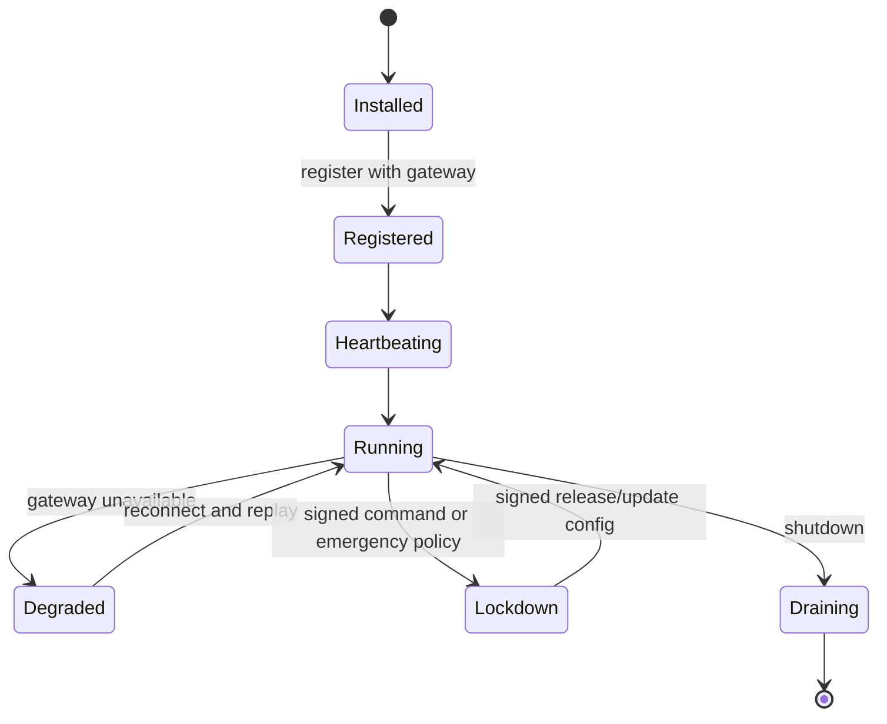
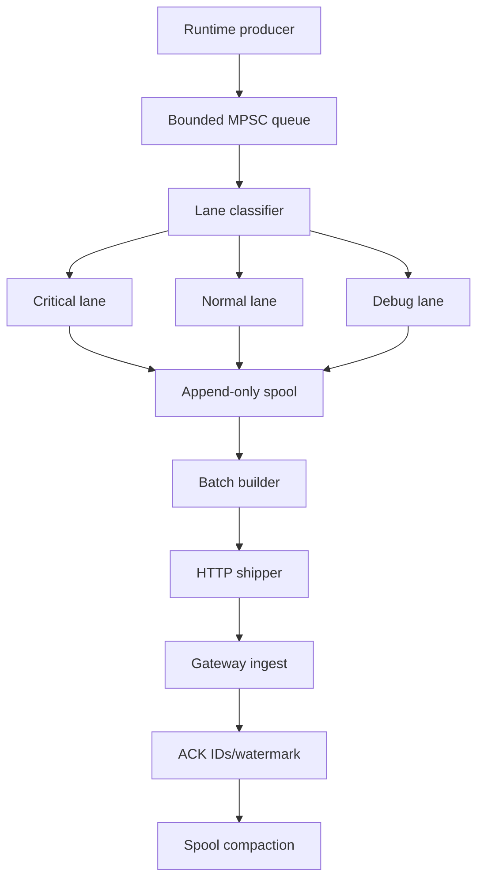

# AegisAgent Runtime Data Plane

**Status:** target design proposal  
**Date:** 2026-06-28

---

## 1. Purpose

The runtime data plane gives AegisAgent real enforcement leverage over unknown, anonymous, or partially integrated agents. It lives near the workload and creates runtime choke points for process, filesystem, secret, tool, MCP, network, and control actions.

The runtime data plane is intentionally separate from `aegis-gateway`:

- `aegis-gateway` is the central brain and control plane.
- Runtime components enforce near workloads and report evidence.
- Untrusted agent execution never happens inside the gateway.

---

## 2. Runtime components

| Component | Runs where | Purpose |
|---|---|---|
| `aegis-node-sensor` | Linux host, Kubernetes DaemonSet, CI sidecar | observe runtime activity, ship events, enforce signed commands |
| `aegis-cage-runner` | host, Kubernetes, CI | launch unknown agents in disposable isolated sandboxes |
| `aegis-egress-proxy` | host, sidecar, DaemonSet, service mesh path | network egress choke point |
| `aegis-tool-broker` | service near gateway/workload | credential/API/tool choke point |
| `aegis-mcp-gateway` | service near gateway/workload | MCP tool/server choke point |

---

## 3. Runtime data-plane architecture

```mermaid
flowchart TD
    subgraph HostOrCluster[Host, CI Runner, or Kubernetes Node]
        Sensor[aegis-node-sensor]
        Queue[Durable local queue]
        Cage[aegis-cage-runner]
        Agent[Unknown agent process]
        Egress[aegis-egress-proxy]
        Broker[aegis-tool-broker client path]
        MCP[aegis-mcp-gateway client path]
    end

    subgraph Control[Aegis Control Plane]
        Gateway[aegis-gateway]
        Ingest[/v1/ingest/runtime-events]
        Commands[/v1/control/commands]
        Policy[Policy/Ban/Quarantine]
        Receipts[Receipts/SOC]
    end

    Sensor --> Queue
    Queue --> Ingest
    Gateway --> Commands --> Sensor
    Cage --> Agent
    Agent --> Egress
    Agent --> Broker
    Agent --> MCP
    Agent --> Sensor
    Egress --> Gateway
    Broker --> Gateway
    MCP --> Gateway
    Gateway --> Policy
    Gateway --> Receipts
```

---

## 4. Node Sensor requirements

The Node Sensor runs like Filebeat/Wazuh/EDR agent.

It must:

- run as Linux service
- run as Kubernetes DaemonSet
- run as CI sidecar
- register with gateway
- heartbeat to gateway
- collect runtime events
- maintain durable local queue
- ship events to gateway
- receive signed commands
- verify command signatures
- enforce local commands
- ACK/NACK commands
- support observe/enforce/lockdown modes

---

## 5. Sensor modes

### 5.1 Observe mode

Goal: visibility with minimal disruption.

Behavior:

- collect and ship events
- buffer if gateway unavailable
- do not automatically kill unless local emergency policy says so
- allow known configured egress/tool routes
- emit events for suspicious actions

Use cases:

- initial rollout
- production baselining
- canary deployments

### 5.2 Enforce mode

Goal: block risky privileged behavior when Aegis cannot make a safe decision.

Behavior:

- block risky privileged actions if gateway unavailable
- block unknown egress if policy unavailable
- require gateway approval for controlled actions
- force tools through broker
- force MCP through MCP gateway
- preserve evidence before destructive control

Use cases:

- production agents with write access
- regulated environments
- shared CI runners

### 5.3 Lockdown mode

Goal: contain hostile or uncontrolled agents.

Behavior:

- pause or kill unknown agents if gateway unavailable
- deny unknown egress
- deny raw tool/API usage
- deny credential issuance
- prevent new sandbox starts unless explicitly allowed
- quarantine workspaces and preserve evidence

Use cases:

- active incident
- gateway unreachable in high-risk environment
- global emergency policy

---

## 6. Sensor lifecycle



### 6.1 Registration

Sensor sends:

- node key
- tenant binding
- hostname
- environment
- version
- public key for ACK/result signatures if used
- supported capabilities
- initial mode

Gateway returns:

- sensor ID
- gateway signing public key bundle
- config version
- policy snapshot
- command polling/stream endpoint
- event ingest endpoint

### 6.2 Heartbeat

Heartbeat includes:

- `sensor_node_id`
- `tenant_id`
- `mode`
- `version`
- queue depths by lane
- disk usage
- active cage runs
- last event watermark
- last command watermark
- config version
- health status

---

## 7. Runtime event collection

### 7.1 Event sources

Initial practical sources:

- Cage runner lifecycle events.
- Process start/exit from cage runtime.
- Shell command wrapper inside cage.
- Filesystem events from controlled workspace.
- Environment/secret access via wrapper and policy-injected environment.
- Egress proxy events.
- Tool broker events.
- MCP gateway events.
- SDK prompt/model/tool events.

Future Linux-native sources:

- eBPF process/network/file telemetry.
- fanotify/inotify where applicable.
- seccomp notify for process/syscall policy.
- Kubernetes audit events.
- container runtime events.

### 7.2 Event normalization

Every event is normalized into the common envelope described in `AegisAgent_World_Class_LLD.md`.

Rules:

- No raw secrets.
- Sensitive payloads are hash-only or redacted preview.
- Every event gets a deterministic `event_id` or UUID plus idempotency key.
- Sensor timestamps use monotonic sequence numbers where possible.
- Gateway sets `received_at`.

---

## 8. Event pipeline design



### 8.1 Bounded queues

No runtime component may use unbounded channels.

Recommended initial bounds:

- critical lane memory queue: 10k events
- normal lane memory queue: 50k events
- debug lane memory queue: 10k events
- disk spool: tenant/node configurable, e.g. 1-20 GiB

### 8.2 Backpressure policy

- Critical events block producers or trigger workload pause when queues are full.
- Normal events apply backpressure in enforce/lockdown and degrade in observe.
- Debug events can be dropped with explicit `sensor_event_dropped` event.
- Dropping critical events is forbidden unless the sensor is in unrecoverable emergency shutdown, and must produce a local tamper marker.

### 8.3 Batching

Batch shape:

```json
{
  "sensor_node_id": "sensor_...",
  "tenant_id": "tenant_...",
  "batch_id": "batch_...",
  "first_sequence": 100,
  "last_sequence": 199,
  "events": []
}
```

Gateway response:

```json
{
  "accepted_event_ids": ["evt_..."],
  "duplicate_event_ids": ["evt_..."],
  "rejected": [{"event_id":"evt_...","code":"schema_invalid"}],
  "watermark": 199
}
```

---

## 9. Durable local queue

### 9.1 Segment format

Each segment contains:

- segment header with magic/version
- event records: length, checksum, sequence, event bytes
- segment footer/checkpoint where possible

### 9.2 Fsync policy

| Lane | Fsync behavior | Rationale |
|---|---|---|
| critical | fsync before local ACK | evidence cannot be lost |
| normal | group commit every N ms/events | throughput |
| debug | best effort | low-value telemetry |

### 9.3 Disk budget

- Reserve critical lane quota.
- Apply configurable max disk usage.
- Expose queue pressure in heartbeat.
- Enter enforce/lockdown behavior when critical lane cannot persist.

### 9.4 Replay after reconnect

1. Re-authenticate to gateway.
2. Send heartbeat with last known watermark.
3. Gateway returns accepted high watermark if known.
4. Sensor starts shipping after watermark.
5. Duplicate event IDs are idempotent.
6. Corrupt segments are isolated and reported.

---

## 10. Command channel

The sensor receives signed commands from the gateway through one of:

- long-poll `GET /v1/control/commands?since=...`
- server-sent events
- WebSocket stream
- local relay for air-gapped environments

Every command is:

- canonicalized deterministically
- signed by gateway
- tenant-bound
- target-bound
- expires quickly
- nonce-protected
- idempotent
- ACK/NACKed
- linked to runtime event and receipt

The full protocol is specified in `AegisAgent_Control_Command_Protocol.md`.

---

## 11. Local enforcement actions

| Action | Sensor behavior |
|---|---|
| `start_run` | invoke cage runner with signed run spec |
| `pause_run` | send runtime pause signal or freeze cgroup/container |
| `resume_run` | release paused run if still authorized |
| `kill_run` | terminate process/container, collect exit evidence |
| `snapshot_workspace` | create read-only evidence snapshot |
| `quarantine_workspace` | remove write access, block deletion, preserve evidence |
| `ban_agent` | update local ban cache and prevent new execution |
| `ban_fingerprint` | prevent matching future runs |
| `block_destination` | update local egress deny cache |
| `update_policy` | atomically swap policy/config bundle after signature verification |

---

## 12. Runtime data-plane interaction with cage

The sensor should not embed a full sandbox runtime. It delegates to `aegis-cage-runner`.

Responsibilities split:

- Sensor: command verification, event queue, local policy mode, telemetry shipping.
- Cage runner: sandbox launch/stop/resource limits/workspace/network wiring.

Cage emits lifecycle and runtime events to sensor:

- run started/finished
- process started/exited
- file read/write/delete
- shell command
- package install
- secret/env access attempt
- output limit exceeded
- timeout exceeded

---

## 13. Runtime data-plane interaction with egress proxy

The egress proxy can be deployed as:

- HTTP/HTTPS proxy with `HTTP_PROXY`/`HTTPS_PROXY` in cages.
- transparent proxy via network namespace rules.
- sidecar proxy in Kubernetes.
- service mesh egress route.

Events:

- DNS query
- network connect
- HTTP request
- egress allowed
- egress blocked
- large upload detected
- exfil hook fired

Gateway API:

- `POST /v1/egress/check`
- `GET /v1/egress/events`
- `POST /v1/egress/block`
- `POST /v1/egress/unblock`

---

## 14. Runtime data-plane interaction with tool broker

The tool broker owns credentials. The cage receives only broker endpoint and scoped run token.

Tool execution path:

```text
agent/cage
→ tool broker request
→ canonicalize action
→ gateway authorize
→ approval if required
→ execute with broker-held credential
→ return sanitized result
→ emit event and receipt
```

Anonymous agents never receive raw credentials.

---

## 15. Runtime data-plane interaction with MCP gateway

Unknown agents must not connect directly to arbitrary MCP servers.

Path:

```text
agent/cage
→ mcp gateway
→ manifest trust check
→ gateway authorize
→ approval if required
→ MCP server proxy call
→ event and receipt
```

Unknown or drifted MCP tools are denied or quarantined.

---

## 16. Privacy and redaction

Rules:

- Prompt text is not stored raw by default.
- Secrets are never stored raw.
- File paths may be stored, but file contents are hash-only unless explicitly evidence-preserved under quarantine policy.
- HTTP URLs store domain and path hash; query strings redacted by default.
- Environment variable values are never stored; variable names may be stored if not secret-like.
- Evidence packs contain redacted data plus receipt proofs.

Redaction failures for sensitive event types are fail-closed for protected action success.

---

## 17. Deployment patterns

### 17.1 Linux service

- `aegis-node-sensor` installed with systemd.
- Runs with least privileges needed for configured observation/enforcement.
- Spool under `/var/lib/aegis/sensor`.
- Logs to journald/stdout with structured JSON.

### 17.2 Kubernetes DaemonSet

- One sensor per node.
- Cage runner may launch Kubernetes Jobs or sandboxed pods.
- NetworkPolicy forces cage pods through egress proxy and broker/MCP gateway.
- Sensor uses Kubernetes API only with narrow RBAC.

### 17.3 CI sidecar

- Runs next to CI job.
- Cage runner controls anonymous agent job.
- Spool persists to workspace/cache if possible.
- Enforce/lockdown defaults should be stricter for untrusted PRs.

---

## 18. Failure model

| Failure | Sensor response |
|---|---|
| Gateway down | spool events; enforce mode blocks risky/unknown actions; lockdown pauses/kills unknown agents |
| Command stream down | continue local policy; heartbeat reconnect; no unsigned fallback |
| Local spool full | preserve critical lane; throttle/pause workload; emit queue pressure |
| Egress proxy unavailable | deny unknown egress in enforce/lockdown |
| Tool broker unavailable | tool actions fail closed |
| MCP gateway unavailable | MCP actions fail closed |
| Sensor restart | replay durable queue; recover command nonce cache; re-heartbeat |
| Corrupt queue segment | quarantine segment; replay valid prefix; emit corruption event |
| Clock skew | rely on gateway-issued expiries with tolerance; reject obviously expired/future commands |

---

## 19. Security model

Sensor trust requirements:

- Sensor identity is registered and rotated.
- Gateway command public keys are pinned through registration/config.
- Commands are signed and replay-protected.
- Local config is signed or integrity-protected.
- Sensor only accepts commands for its tenant and target scope.
- Sensor never executes arbitrary shell from command payload; it maps command actions to typed local handlers.
- Sensor emits ACK/NACK and runtime event for every accepted command.

Host compromise caveat:

- If root on host is compromised, sensor can be bypassed or tampered with.
- Aegis should detect missing heartbeats, queue gaps, invalid ACKs, and unexpected direct egress/tool usage, but cannot guarantee control against a fully compromised host without stronger isolation such as secure boot, TPM attestation, or managed runtime controls.

---

## 20. Observability

Metrics:

- `aegis_sensor_events_collected_total`
- `aegis_sensor_events_shipped_total`
- `aegis_sensor_events_dropped_total`
- `aegis_sensor_queue_depth`
- `aegis_sensor_spool_bytes`
- `aegis_sensor_gateway_disconnects_total`
- `aegis_sensor_commands_received_total`
- `aegis_sensor_commands_rejected_total`
- `aegis_sensor_commands_executed_total`
- `aegis_sensor_mode`
- `aegis_sensor_replay_lag_seconds`

Spans:

- `sensor.collect_event`
- `sensor.spool_append`
- `sensor.ship_batch`
- `sensor.command.verify`
- `sensor.command.execute`
- `sensor.mode.transition`

---

## 21. Initial implementation slice

The first implementation should be deliberately small:

1. Sensor registration.
2. Heartbeat.
3. Local config file.
4. Durable spool abstraction.
5. Runtime event JSON schema and shipper.
6. Signed command verifier.
7. ACK/NACK endpoint.
8. Observe/enforce/lockdown mode state machine.
9. One command: `kill_run` against a mocked local run.
10. Tests for signature, replay, queue replay, and gateway-down behavior.

Do not add cage, egress, broker, and MCP enforcement into the sensor binary. Keep binaries separate.
