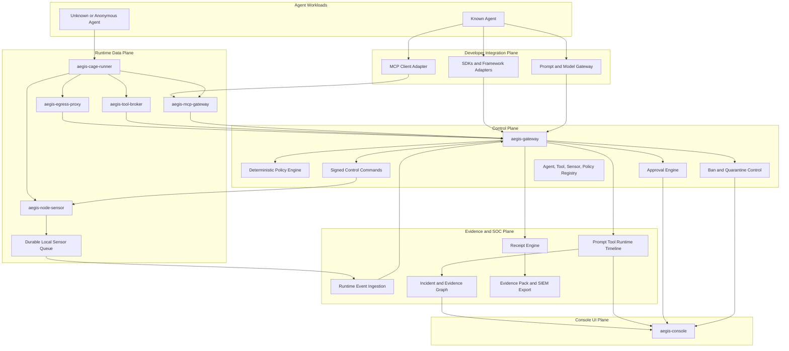
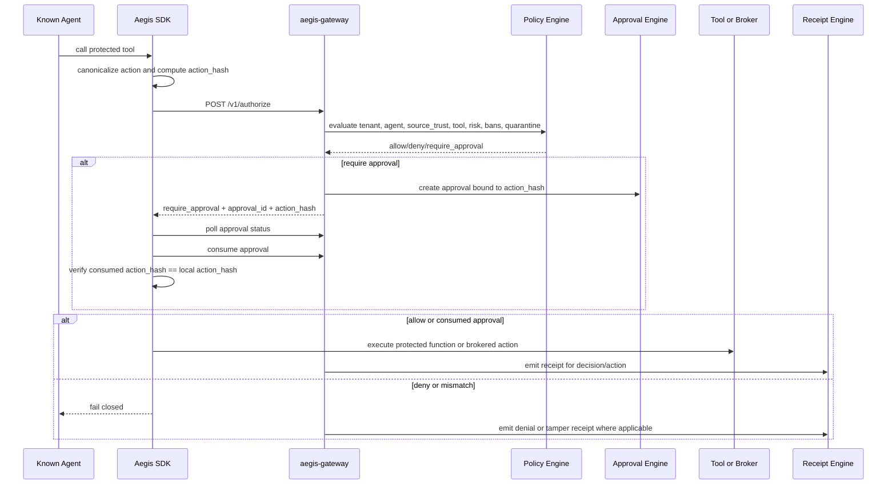
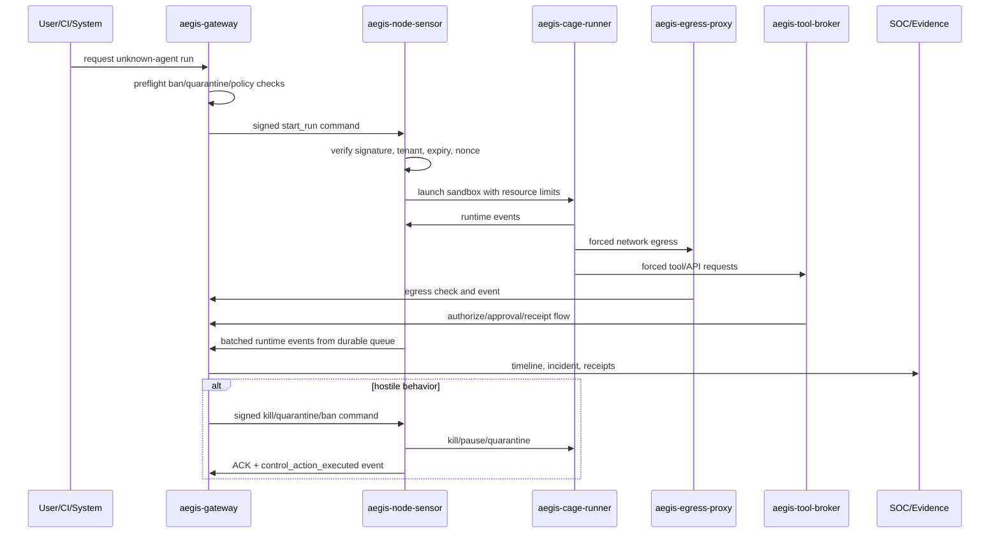
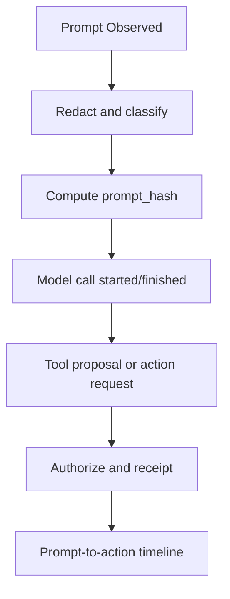
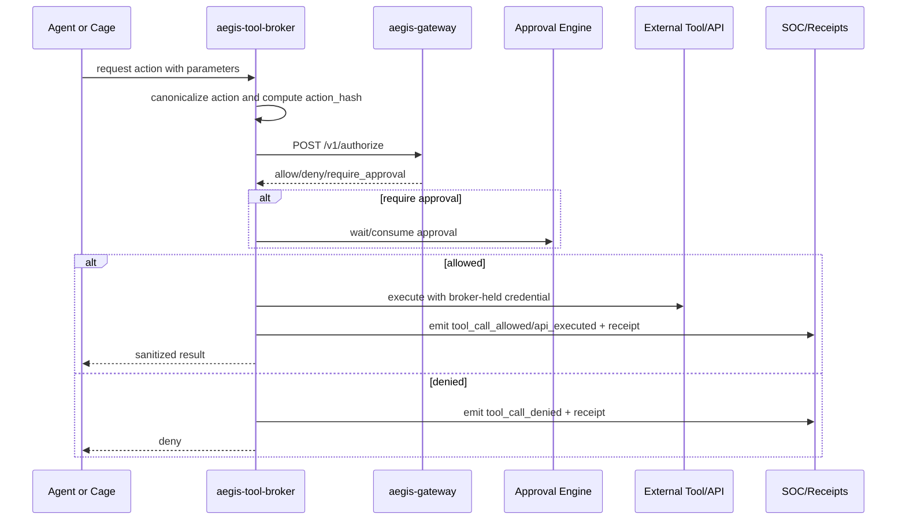
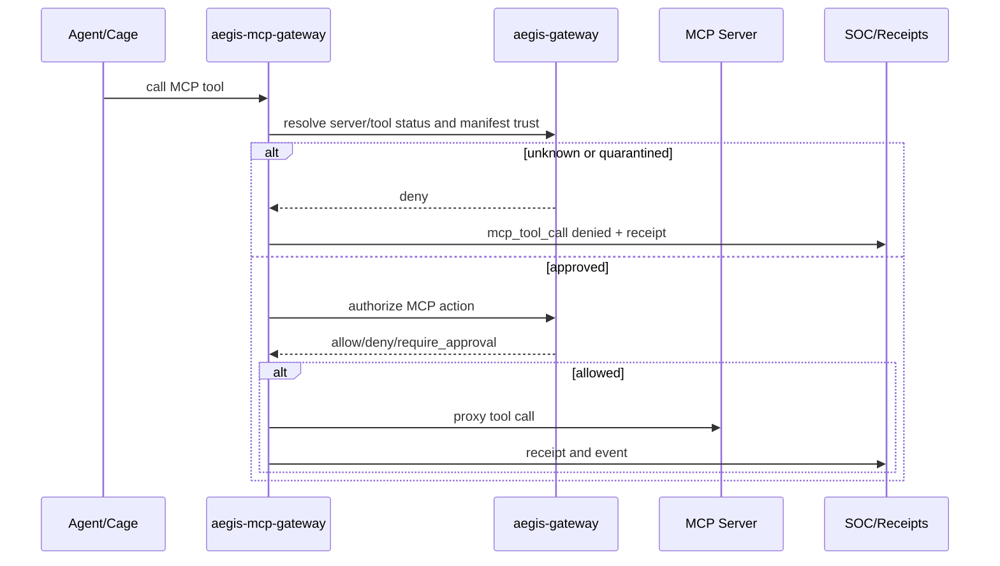
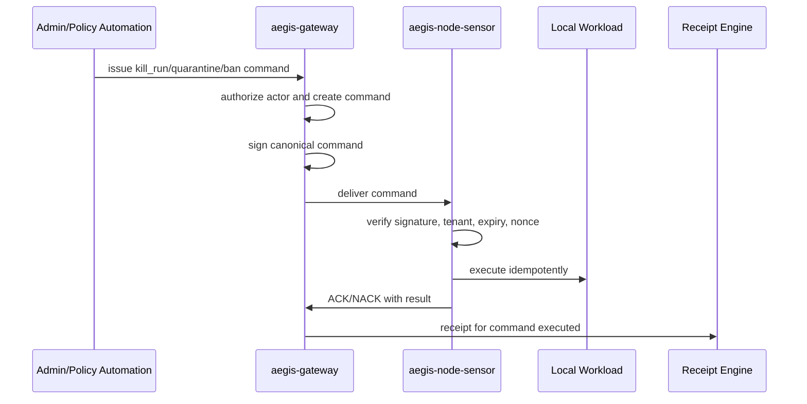
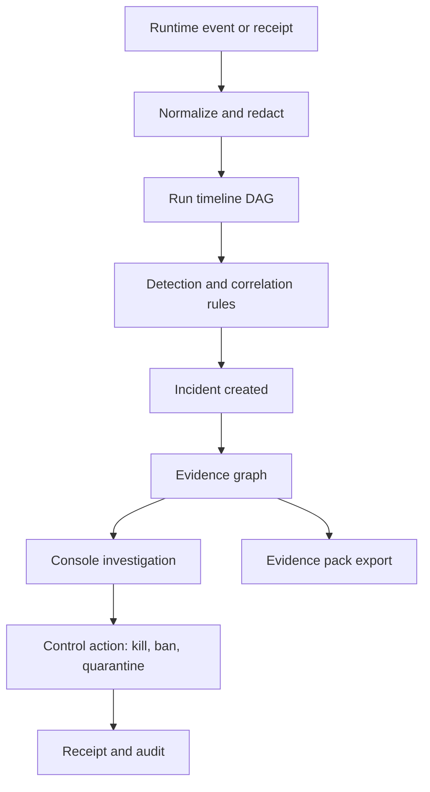

# AegisAgent World-Class HLD

**Status:** target architecture proposal  
**Date:** 2026-06-28  
**Scope:** architecture only; no runtime implementation implied  
**Audience:** platform security, infra, backend, SDK, SOC, and product engineering

---

## 1. Product vision

AegisAgent becomes the **AI Agent Security Control Plane** for autonomous agents.

AegisAgent is **not an agent**. AegisAgent controls agents by forcing important agent actions through explicit, auditable choke points. It provides control, isolation, evidence, and runtime response for both:

- **Known agents** integrated through SDKs, the gateway, MCP gateway, tool broker, policy engine, approval engine, and receipt engine.
- **Unknown or anonymous agents** controlled through a node sensor, disposable cage runner, sandbox isolation, runtime telemetry, egress proxy, tool broker, credential isolation, signed control commands, and ban/quarantine systems.

The governing principle is:

> Aegis can only control what passes through Aegis choke points. If an agent bypasses all choke points, it is treated as hostile and must be isolated, blocked, killed, quarantined, or banned by the runtime data plane.

---

## 2. Category definition

AegisAgent defines a higher-order category than the current repository's MVP framing of **Agent Action Integrity**:

> **AI Agent Security Control Plane** — a control plane plus runtime data plane that governs prompt/model, tool, API, MCP, network, filesystem, process, secret, approval, runtime-control, and receipt/evidence boundaries for autonomous AI agents.

AegisAgent still preserves its current differentiators:

1. **Approval integrity:** exact action is canonicalized and hashed; approvals bind to `action_hash`; SDKs fail closed on mismatch, expiry, or replay.
2. **Deterministic provenance gating:** policy evaluates source trust and prompt/tool lineage; LLMs may summarize but never decide enforcement.
3. **Receipt-backed evidence:** protected actions produce tamper-evident receipts.

The world-class version adds the missing runtime data plane:

- `aegis-node-sensor`
- `aegis-cage-runner`
- `aegis-egress-proxy`
- `aegis-tool-broker`
- signed gateway-to-sensor command protocol
- runtime event ingestion
- ban/quarantine control plane
- prompt/model/tool/runtime timeline
- receipt-backed SOC evidence graph

---

## 3. Current repository summary

The active root is a **Cargo workspace** (the earlier single-`gateway/`-crate MVP
has already been migrated; a stale `gateway/` directory may remain on disk but is
**not** a workspace member and is not the source of truth):

- `src/`: the gateway binary crate (package name `gateway`) — Axum + Tokio + SQLx,
  `routes/` split into focused modules (`authorize*.rs`, `approval.rs`,
  `receipts.rs`, `soc.rs`, `mcp.rs`, `tenant.rs`, …), middleware, jobs, mTLS,
  admission webhook, dashboard serving. `src/canon/` holds the canonicalization crate.
- `lib/{common,api,storage,policy,soc}`: extracted workspace crates — shared
  canonicalization/errors/metrics, strongly-typed API models, the `StorageBackend`
  trait + SQLite/Postgres implementations and SQLx migrations
  (`lib/storage/migrations{,_postgres}/`), the Cedar policy engine, and the async
  SOC plane (events/detect/correlate/respond/notify/backtest).
- `sdk-python/`, `sdk-typescript/`, `sdk-go/`: all three SDKs are active, with
  byte-identical `aegis-jcs-1` canonicalization and fail-closed approval consume.
- `ui/`: the Next.js console (static-exported, served by the gateway).
- `mcp-gateway-lite/`, `policies.cedar` (kept byte-identical across the root,
  `src/`, `lib/policy/`, and Helm copies), `helm/`, `docs/`, and a substantial CI
  matrix (`fmt`/`clippy`/tests/coverage/fuzz-smoke/benchmarks/SDK parity/Docker E2E/
  SAST/secret-scan/container-scan).

Recent hardening already merged: transaction-safe atomic receipt-chain append;
**fail-closed durable receipts** for protected decisions; receipt
verify-chain/verify-range/chain-head endpoints; SOC event evidence linkage;
public-bind + admin-endpoint auth gates; structured `POST /v1/soc/query`; and a
**DB-backed, multi-instance-safe replay-nonce store**. See
[`production-hardening.md`](production-hardening.md).

What does **not** yet exist is the **runtime data plane** — there are no
`aegis-node-sensor`, `aegis-cage-runner`, `aegis-egress-proxy`, or
`aegis-tool-broker` binaries, no runtime-event ingestion, no signed
gateway→sensor command protocol, and no first-class ban/quarantine or
prompt/model/runtime capture. That is the subject of this architecture.

---

## 4. System overview

AegisAgent is split into clear planes and binaries. The gateway is the central brain; it never runs untrusted agents.



---

## 5. Mandatory choke points

| Choke point | Known-agent enforcement | Unknown-agent enforcement | Fail-closed behavior |
|---|---|---|---|
| Prompt/model call | SDK, LLM proxy, framework adapter | cage-forced LLM gateway/proxy where possible | no raw sensitive prompt storage; capture hashes/metadata |
| Tool call | SDK and gateway authorize | tool broker owns credentials and executes | anonymous agent never receives raw credentials |
| API call | SDK, API proxy, tool broker | tool broker / egress proxy | direct privileged API bypass is incident |
| MCP call | MCP gateway + manifest trust | cage routes MCP only through MCP gateway | unknown MCP/tool denied or quarantined |
| Network egress | egress proxy opt-in | egress forced through proxy by network namespace | deny unknown destination in enforce/lockdown |
| Filesystem/workspace | SDK hooks where possible | cage isolated workspace, sensor telemetry | block host FS; quarantine workspace on incident |
| Process execution | SDK/tool wrapper where possible | cage runner + sensor | enforce CPU/mem/proc/time limits; kill if hostile |
| Secret access | tool broker, vault proxy | no raw secrets in cage; sensor detects access attempts | deny raw secret access; emit event |
| Approval | approval engine + SDK hash verification | broker/gateway approval before broker execution | approval mismatch/expiry/replay blocks execution |
| Runtime control | signed commands to sensor | sensor enforces pause/kill/quarantine/ban | unsigned/expired/replayed command rejected |
| Receipt/evidence | receipt engine on protected action | receipt engine on protected/control action | receipt write failure blocks protected action |

---

## 6. Planes

### 6.1 Control Plane

**Binary:** `aegis-gateway`

Responsibilities:

- Tenant, agent, run, sensor, sandbox, tool, MCP, policy, approval, ban, and quarantine registries.
- Deterministic policy evaluation using Cedar or a versioned deterministic policy bundle.
- Approval creation, edit, approve, reject, consume, expiry, and evidence.
- Runtime event ingestion APIs.
- Signed control command creation and delivery tracking.
- Receipt append, verification, checkpoints, and evidence packs.
- SOC incident correlation and evidence graph APIs.

Non-responsibilities:

- It must **not** execute untrusted agents.
- It must **not** hold long-running sandbox workloads.
- It must **not** make enforcement decisions using an LLM.

### 6.2 Runtime Data Plane

Binaries:

- `aegis-node-sensor`: EDR/Filebeat/Wazuh-like daemon near workloads.
- `aegis-cage-runner`: disposable sandbox executor for unknown agents.
- `aegis-egress-proxy`: network choke point.
- `aegis-tool-broker`: credential/API/tool execution choke point.
- `aegis-mcp-gateway`: MCP choke point.

Responsibilities:

- Runtime telemetry collection.
- Local durable queueing and shipping to gateway.
- Local enforcement under observe/enforce/lockdown modes.
- Signed command verification and idempotent execution.
- Sandbox isolation and resource limiting.
- Network, tool, MCP, filesystem, secret, and process control.

### 6.3 Developer Integration Plane

Components:

- Python SDK (active today).
- TypeScript and Go SDKs (target; hidden worktree has prototypes).
- LLM gateway/proxy and framework adapters.
- Browser automation adapter where feasible.

Responsibilities:

- Known-agent registration and tool wrapping.
- Prompt/model metadata capture where a choke point exists.
- Canonical action hashing and fail-closed approval verification.
- Trace/run propagation.
- Redaction before event emission.

### 6.4 Evidence/SOC Plane

Responsibilities:

- Runtime event normalization.
- Prompt/model/tool/runtime DAG timeline.
- Receipt chain, checkpoints, range verification, and proof export.
- Incident correlation and evidence graph.
- SOC events for blocked egress, bans, quarantine, receipt failures, command execution, and suspicious lineage.

### 6.5 Console UI Plane

**Binary/app:** `aegis-console`

Aegis Console should feel like Grafana + Kibana + CrowdStrike for AI agents.

Required pages:

- Overview
- Explore
- Approvals
- Incidents
- Receipts
- Agents
- Agent Cage Runs
- Runtime Timeline
- Prompt Timeline
- Model Calls
- Tool Calls
- Egress Events
- Ban Center
- Quarantine Center
- MCP Security
- Policy Center
- Evidence Graph
- Settings

---

## 7. Component model

| Component | Purpose | Critical boundaries |
|---|---|---|
| `aegis-gateway` | Central control plane and evidence API | no untrusted execution; tenant isolation; policy determinism |
| `aegis-node-sensor` | Runtime sensor and local enforcer near workloads | durable queue; signed command verification; local fail-closed modes |
| `aegis-cage-runner` | Disposable sandbox for unknown agents | no host FS, no Docker socket, no raw creds, proxy-forced egress |
| `aegis-egress-proxy` | Network egress decision point | deny unknown destination; DNS/HTTP/SNI metadata; exfil hooks |
| `aegis-tool-broker` | Credential/API/tool choke point | owns credentials; canonicalize, authorize, approve, execute, receipt |
| `aegis-mcp-gateway` | MCP server and tool gate | manifest pinning, drift quarantine, per-tool authorization |
| `aegis-console` | SOC/approval/control UI | read-only views unless explicit admin auth; command actions are signed/audited |
| SDKs/adapters | Known-agent integration | final approval hash check before execution; fail closed on mismatch |

---

## 8. Known-agent flow



---

## 9. Anonymous-agent flow



---

## 10. Prompt/model capture flow

Aegis captures prompt/model activity only where it owns a choke point:

- SDK capture.
- LLM gateway/proxy capture.
- Framework adapters.
- Browser automation adapter where possible.

Default storage avoids raw sensitive prompts. Persist:

- `prompt_hash`
- `redacted_prompt_preview`
- model/provider
- role
- `source_trust`
- `run_id`
- `trace_id`
- `parent_event_id`
- `action_hash` linkage
- `receipt_hash` linkage
- retention policy
- redaction status



---

## 11. Tool broker flow

Anonymous agents must never receive raw credentials.



Initial tool categories:

- GitHub
- Slack
- Gmail
- Jira
- HTTP
- filesystem
- shell
- MCP

---

## 12. MCP gateway flow



MCP manifest drift is a high-signal tool poisoning indicator. Drift should downgrade trust and can auto-quarantine the MCP server until reviewed.

---

## 13. Egress control flow

```mermaid
sequenceDiagram
    participant Cage as Cage/Workload
    participant Proxy as aegis-egress-proxy
    participant GW as aegis-gateway
    participant SOC as SOC/Receipts
    participant Internet as Destination

    Cage->>Proxy: DNS/HTTP/TCP connect
    Proxy->>Proxy: extract metadata: domain, CIDR, DNS, HTTP, SNI
    Proxy->>GW: POST /v1/egress/check
    GW->>GW: ban, quarantine, per-run, per-tenant policy
    GW-->>Proxy: allow or block
    alt allow
        Proxy->>Internet: forward
        Proxy->>SOC: egress_allowed event; receipt if high risk
    else block
        Proxy-->>Cage: block
        Proxy->>SOC: egress_blocked event + receipt
    end
```

Deny-by-default is mandatory for unknown agents in enforce/lockdown mode.

---

## 14. Runtime control flow

All control commands from gateway to sensor are signed and replay-protected.



---

## 15. Receipt/evidence flow

Protected actions cannot succeed without durable receipt.

Receipt-required events:

- approval created/edited/approved/rejected/consumed
- tool allowed/denied
- API executed
- egress blocked and high-risk egress allowed
- prompt-to-tool risky chain
- run killed
- agent frozen/banned
- workspace quarantined
- MCP quarantined
- control command executed
- incident created/closed
- evidence pack exported

Receipts are append-only per tenant and hash-chained. Enterprise mode signs chain heads and checkpoints with KMS/HSM-backed keys.

---

## 16. SOC investigation flow



Critical UI demo flow:

```text
Unknown agent starts
→ prompt captured
→ model call captured
→ tool proposal captured
→ file secret access detected
→ network exfil blocked
→ run killed
→ fingerprint banned
→ workspace quarantined
→ receipt chain visible
→ incident generated
→ evidence graph exportable
```

---

## 17. Ban/quarantine flow

Bans are first-class policy inputs and enforcement artifacts.

Ban targets include:

- `agent_id`, `run_id`, `sandbox_id`
- `agent_fingerprint`, `image_digest`, `repo_hash`, `binary_hash`, `package_lock_hash`
- `mcp_server_id`, `mcp_tool_id`, `tool_name`
- `destination_domain`, `destination_ip`, `credential_scope`
- `prompt_hash`, `behavior_signature`

Ban scopes:

- run
- agent
- tenant
- organization
- global admin

Ban enforcement happens before:

- sandbox start
- authorization
- tool call
- MCP call
- egress
- credential issuance
- approval consumption

Quarantine prevents new execution, preserves evidence, blocks external access, prevents deletion, attaches to incidents, and supports admin review/release/delete.

Every ban/unban/quarantine/release requires actor, reason, authorization, audit event, receipt, and SOC event.

---

## 18. Deployment models

### 18.1 Local development

- Single `aegis-gateway` on `127.0.0.1`.
- SQLite WAL.
- Default Cedar policies.
- Python SDK demo.
- Optional local mock egress proxy/tool broker/cage stubs.

### 18.2 Docker Compose

- Gateway.
- SQLite or local Postgres.
- Node sensor sidecar.
- Cage runner using Docker with strict no-Docker-socket-in-cage rule.
- Egress proxy.
- Tool broker.
- Console.

### 18.3 Kubernetes

- `aegis-gateway` Deployment with HPA.
- Postgres production storage.
- `aegis-node-sensor` DaemonSet.
- `aegis-cage-runner` as Job/Deployment or per-run Job controller.
- `aegis-egress-proxy` as sidecar/daemonset/service mesh egress path.
- `aegis-tool-broker` Deployment.
- `aegis-mcp-gateway` Deployment.
- `aegis-console` Deployment.
- NetworkPolicies force cage traffic through egress proxy/tool broker/MCP gateway.

### 18.4 Enterprise production

- Multi-region control plane option.
- Postgres with PITR and backups.
- OIDC/JWT/admin auth.
- TLS/mTLS for all service-to-service paths.
- KMS/HSM signing for receipts and command keys.
- SIEM export.
- Helm chart.
- Air-gapped support.
- Immutable evidence storage option.

---

## 19. Trust boundaries

| Boundary | Risk | Control |
|---|---|---|
| Agent runtime to SDK | agent may be hijacked | SDK final hash check, fail closed |
| Unknown agent to cage | untrusted code | sandbox, no host FS, no direct creds/network |
| Cage to network | exfiltration | egress proxy deny-by-default |
| Cage to tools/APIs | credential theft | tool broker owns credentials |
| MCP client/server | tool poisoning, manifest drift | MCP gateway, manifest pinning, quarantine |
| Sensor to gateway | forged telemetry/control | mutual auth, signed commands, ACKs |
| Gateway to DB | tenant leakage | `tenant_id` on every table/query, parameterized SQL |
| Gateway to approval channel | callback forgery | signed callbacks, approver authz |
| Receipt store | tampering/drop | append-only chain, checkpoints, signatures |
| Console/admin | destructive control actions | JWT/OIDC, RBAC, receipts, command signing |

---

## 20. Security assumptions

- A compromised or unknown agent is hostile until proven otherwise.
- LLM output is untrusted and cannot decide enforcement.
- Source provenance can only be tightened by classifiers, never loosened.
- Gateway, sensor, broker, proxy, and MCP gateway are trusted computing base components and must be hardened accordingly.
- Tenants are mutually hostile in SaaS mode.
- Raw secrets must not enter logs, runtime events, prompt events, or receipts.
- Receipt loss for protected actions is a security failure, not merely observability loss.

---

## 21. Non-goals

- AegisAgent is not itself an autonomous agent.
- AegisAgent does not claim to catch actions that bypass every Aegis choke point.
- AegisAgent is not a generic SIEM, CNAPP, GRC suite, DLP platform, model-scanning system, or identity lifecycle manager.
- AegisAgent does not let LLMs make allow/deny/control decisions.
- AegisAgent does not run untrusted agents inside `aegis-gateway`.

---

## 22. Failure modes

| Failure | Observe mode | Enforce mode | Lockdown mode |
|---|---|---|---|
| Gateway unavailable | buffer events locally | block risky privileged actions and unknown egress | pause/kill unknown agents; deny unknown egress/tools |
| DB unavailable | ingest may buffer when safe | protected action fails closed | protected action fails closed; command issuance disabled except local emergency |
| Receipt write failure | low-risk can buffer if policy allows | protected action fails closed | protected action fails closed |
| Sensor queue full | drop only non-critical after policy; alert | backpressure workload; preserve critical | pause workload until drained or killed |
| Command signature invalid | reject and emit event | reject and emit event | reject and emit event |
| Egress proxy down | no enforcement if not inline | fail closed for unknown destinations | deny all unknown egress |
| Tool broker down | known SDK can deny | tool/API action fails closed | tool/API action fails closed |
| MCP gateway down | MCP action fails closed | MCP action fails closed | MCP action fails closed |
| Console down | API remains available | API remains available | API remains available |
| Policy bundle invalid | keep previous valid bundle | deny if no valid bundle | deny and lockdown affected workloads |

---

## 23. Scale model

Design targets:

- Authorization p95 under 50 ms for cached policy.
- Egress check fast path under 5 ms.
- Event ingest target 10k events/sec per gateway node.
- No unbounded queues.
- UI handles 100k events with virtualization and cursor pagination.
- Ban lookup O(1) or O(log n).
- Receipt verification supports streaming/ranges.
- Local sensor queue supports backpressure and replay.

Scale strategy:

- Stateless gateway replicas behind a load balancer.
- Postgres production with partitions by `tenant_id` and time for high-volume tables.
- Tenant-scoped policy and ban caches with invalidation.
- Runtime event ingest uses bounded Tokio queues and batch writes.
- Receipt append uses transaction-safe per-tenant chain head locking.
- Evidence graph materialization can be asynchronous; protected receipts are synchronous.

---

## 24. Production hardening checklist

- [ ] Postgres production mode; SQLite local/dev mode only.
- [ ] TLS/mTLS for service-to-service traffic.
- [ ] JWT/OIDC and admin RBAC for console/control APIs.
- [ ] Bootstrap lock after initial admin/key creation.
- [ ] Signed gateway-to-sensor control commands.
- [ ] Replay protection for commands and signed agent requests.
- [ ] Receipt write failure blocks protected actions.
- [ ] Receipt checkpoints and range verification.
- [ ] Tenant isolation tests for every API and table.
- [ ] No raw secrets in logs/events/receipts.
- [ ] Bounded queues and backpressure everywhere.
- [ ] Durable node-sensor spool.
- [ ] Egress deny-by-default option.
- [ ] Tool broker credential isolation.
- [ ] No Docker socket in cages.
- [ ] Health, liveness, readiness, and startup probes.
- [ ] Structured logs and OpenTelemetry traces.
- [ ] Prometheus metrics.
- [ ] Helm chart and Docker Compose.
- [ ] Backup/restore and retention policy.
- [ ] Prompt retention/redaction policy.
- [ ] SBOM, image signing, dependency scans, secret scans.

---

## 25. HLD decision summary

AegisAgent should evolve from an action-integrity gateway MVP into a **control plane plus runtime data plane**. The central architectural rule is strict separation:

- `aegis-gateway` decides, records, signs, correlates, and commands.
- `aegis-node-sensor`, `aegis-cage-runner`, `aegis-egress-proxy`, `aegis-tool-broker`, and `aegis-mcp-gateway` enforce near the workload.
- `aegis-console` investigates, approves, and controls through authenticated APIs.

This creates real choke points. Without those choke points, Aegis cannot honestly claim control.
