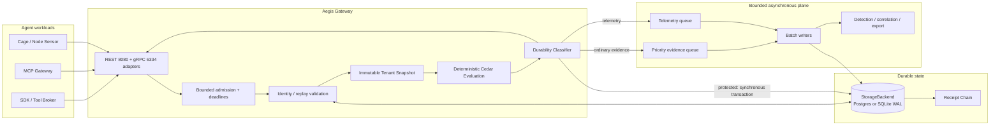
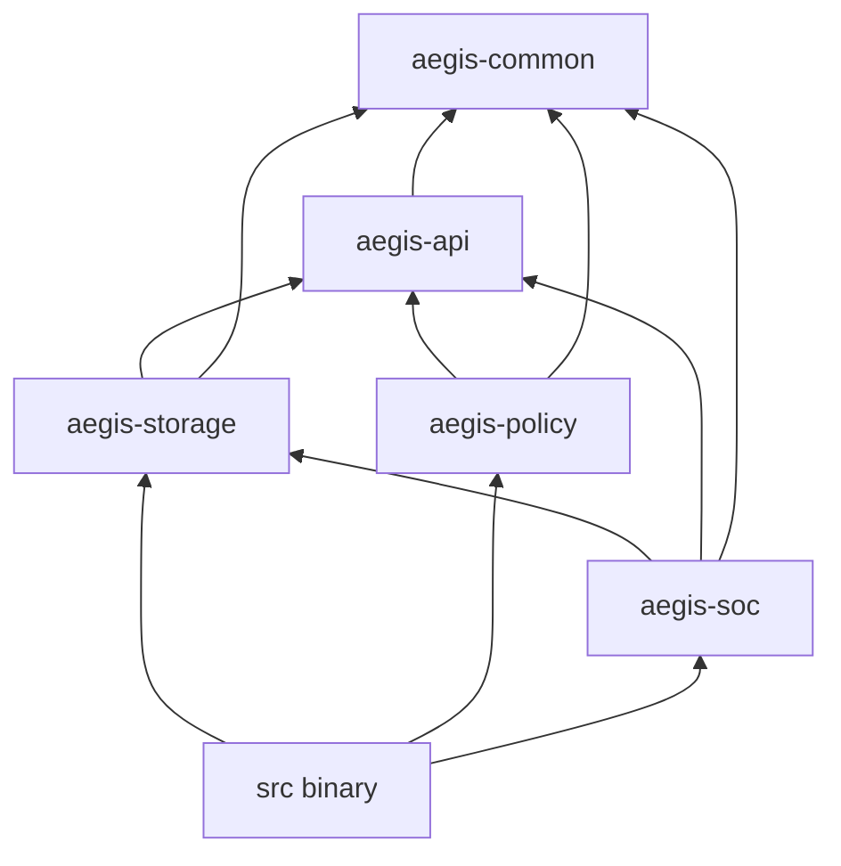
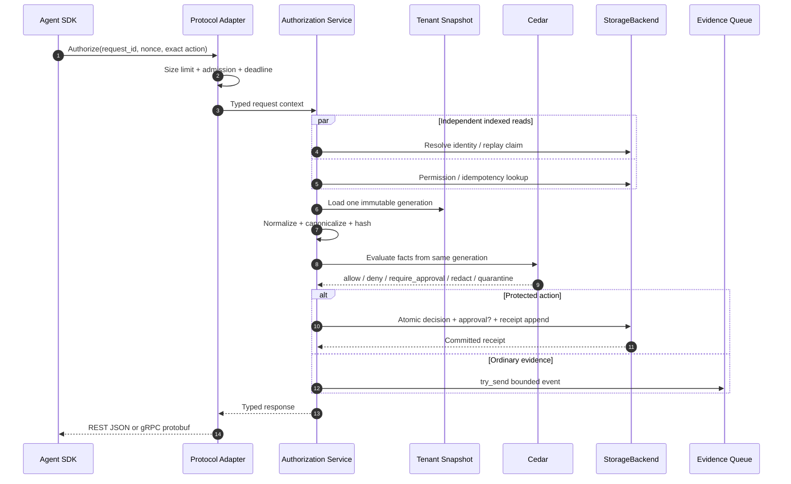
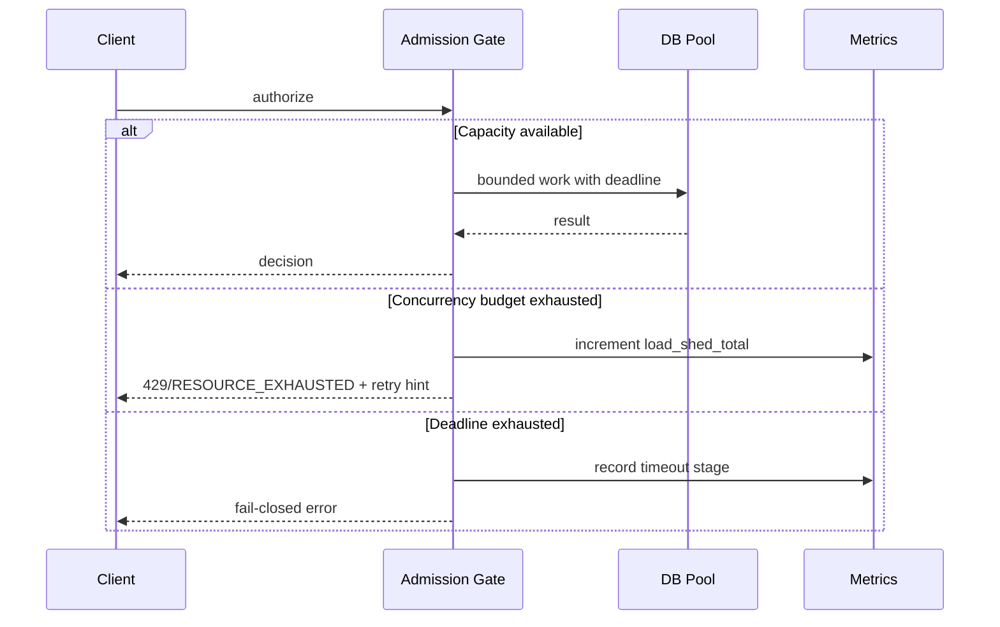
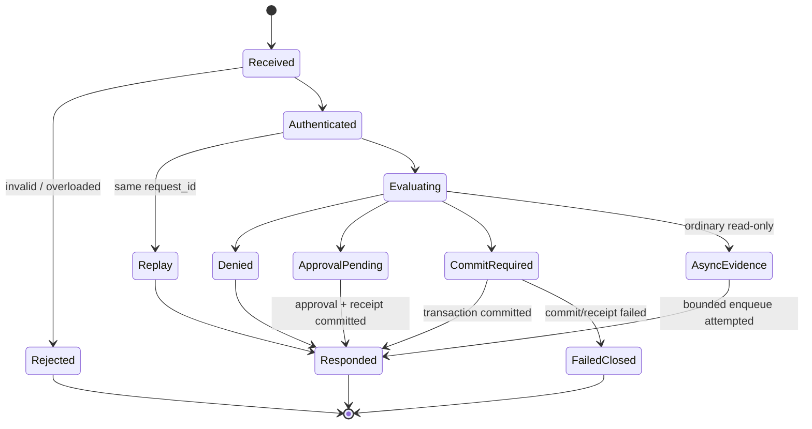
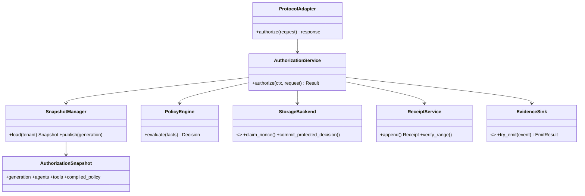
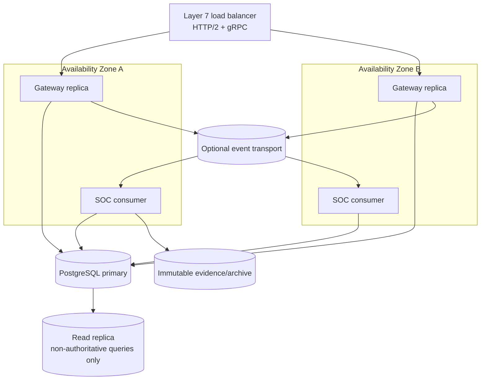

# AegisAgent Performance-First High-Level Design

**Status:** normative target design with current-state annotations

**Last reviewed:** 2026-07-12

**Owners:** Architecture, Platform Security, Gateway, Storage, SRE
**Audience:** students, developers, security engineers, SREs, and enterprise architects

> **Performance contract, not a slogan.** No finite system can guarantee “zero bottlenecks” under unlimited load. This design removes avoidable serialization, bounds every queue, sheds excess work before resources collapse, and defines a capacity envelope that must be proven by benchmark. Security invariants are never traded for speed.

## Overview

AegisAgent is the integrity layer for AI-agent actions. Before an agent invokes a tool, changes data, calls an MCP server, or uses a privileged API, AegisAgent determines whether the exact action is allowed, denied, or requires human approval. It then creates evidence that can be independently verified.

The performance-first architecture separates work into three lanes:

1. **Decision lane:** authenticate, normalize, verify provenance, evaluate deterministic policy, and respond.
2. **Durability lane:** atomically persist protected decisions, approvals, replay state, and hash-chained receipts.
3. **Evidence lane:** batch non-critical audit, telemetry, detection, correlation, export, and UI projections asynchronously.

The selected design is the **Snapshot-Isolated Fast Lane**: immutable tenant-scoped control snapshots serve read-heavy authorization without global locks; independent storage reads execute concurrently; tenant-affine bounded writers reduce write contention; and protected actions synchronously cross the durability boundary before a response is returned.

### Design status vocabulary

| Label | Meaning |
|---|---|
| **Current** | Present in the repository and described by the implementation ledger. |
| **Target** | Approved architecture direction; implementation and benchmark evidence are still required. |
| **Conditional** | Enabled only by configuration or deployment mode. |

The authoritative shipped-status ledger is [Implementation Status](Implementation_Status.md). This page does not promote a target capability to “shipped.”

## Why This Exists

An AI agent can create a pull request, delete cloud data, send money, read secrets, or call an untrusted tool in milliseconds. Traditional IAM often answers only “may this identity access this service?” It does not bind approval to the exact canonical action, preserve source provenance, or produce a tamper-evident action history.

A slow control point is bypassed. An unreliable control point blocks legitimate work. A fast but eventually consistent security decision may authorize against stale policy. AegisAgent therefore needs low latency **and** deterministic, fail-closed integrity.

Real example: an agent requests approval to transfer ₹10,000 and later changes the payload to ₹100,000. A text-only approval can be misleading. AegisAgent canonicalizes the executable action, hashes it, binds approval to that hash, and rejects any mismatch.

## Problem Statement

Companies face five coupled problems:

- **Latency:** every inline database round trip increases agent execution time.
- **Contention:** decision, audit, receipt, and telemetry writes can fight for the same pool or SQLite writer lock.
- **Staleness:** aggressive caching can continue to allow a quarantined agent or revoked policy.
- **Overload:** unbounded work queues convert a traffic spike into memory growth and multi-second tail latency.
- **Evidence integrity:** making every write asynchronous is fast but can acknowledge a protected action without durable proof.

If these are not solved, operators see timeouts, retry storms, duplicated approvals, missing evidence, cross-tenant risk, and pressure to bypass the gateway.

### Non-negotiable design laws

1. Deterministic policy decides; advisory risk scores never gate.
2. An LLM may investigate or explain; it never allows, denies, approves, or executes.
3. The inline authorization path is sacred; detection and correlation run out of band.
4. Canonical action hashing, approval binding, expiry, replay protection, tenant isolation, and receipt-chain integrity remain fail closed.

## Solution

### Architectural alternatives considered

The following candidates are intentionally diverse. Scores are relative, from 1 (poor) to 5 (excellent), for AegisAgent’s security and workload shape.

| Candidate | Core idea | Median speed | Tail latency | CPU/memory efficiency | Consistency | Operational cost | Verdict |
|---|---|---:|---:|---:|---:|---:|---|
| Lock-free snapshot gateway | Immutable per-tenant compiled policy and metadata snapshots; atomic pointer swap | 5 | 5 | 5 | 4 | 4 | **Selected foundation** |
| Tenant-affine actors | Hash tenant to a single mailbox/writer; eliminate lock competition within a shard | 4 | 4 | 5 | 5 | 4 | **Selected for writes** |
| Edge/WASM authorization | Push compiled policy beside every agent and reconcile centrally | 5 | 5 | 4 | 2 | 2 | Rejected as authority; optional preflight only |
| Append-log-first CQRS | Append every request to a durable log, decide from materialized projections | 2 | 3 | 3 | 5 | 2 | Rejected for inline decisions; selected for async evidence |
| Stateless replicas + remote cache/bus | Redis for reads, Kafka/NATS for all writes, Postgres source of truth | 3 | 3 | 2 | 4 | 2 | Useful at scale, but remote hops are not the default fast path |

### Converged decision

Use a hybrid of the first, second, and fourth candidates:

- **Immutable snapshots** make normal control reads local and lock-light.
- **Tenant-affine writer shards** serialize only writes that must be ordered, without a global writer lock.
- **Append-oriented evidence processing** absorbs telemetry efficiently after the decision.
- **PostgreSQL transactions** provide multi-replica durability; **SQLite WAL** remains the local/single-node mode.
- **Edge policy** may provide a non-authoritative early deny, but only the gateway returns the authoritative decision.

Why this wins: it performs the least network and storage coordination compatible with the security contract. It does not place Kafka, Redis, an LLM, or a graph query on the authorization path.

### Explicit non-goals

- Unlimited throughput or universal latency guarantees.
- Caching final allow/deny decisions.
- Running untrusted agents inside the gateway.
- Using eventual consistency for quarantine, approval consumption, replay claims, or protected receipts.
- Treating SQLite as a multi-writer, multi-replica production database.

## Architecture


```mermaid
flowchart LR
    subgraph Clients[Agent workloads]
        SDK[SDK / Tool Broker]
        MCP[MCP Gateway]
        Cage[Cage / Node Sensor]
    end

    subgraph Gateway[Aegis Gateway]
        Proto[REST 8080 + gRPC 6334 adapters]
        Admit[Bounded admission + deadlines]
        Auth[Identity / replay validation]
        Snap[Immutable Tenant Snapshot]
        Cedar[Deterministic Cedar Evaluation]
        Classify[Durability Classifier]
    end

    subgraph Durable[Durable state]
        Store[(StorageBackend\nPostgres or SQLite WAL)]
        Chain[Receipt Chain]
    end

    subgraph Async[Bounded asynchronous plane]
        Critical[Priority evidence queue]
        Bulk[Telemetry queue]
        Batch[Batch writers]
        SOC[Detection / correlation / export]
    end

    SDK --> Proto
    MCP --> Proto
    Cage --> Proto
    Proto --> Admit --> Auth
    Auth --> Snap --> Cedar --> Classify
    Auth <--> Store
    Classify -->|protected: synchronous transaction| Store
    Store --> Chain
    Classify -->|ordinary evidence| Critical
    Classify -->|telemetry| Bulk
    Critical --> Batch --> Store
    Bulk --> Batch
    Batch --> SOC
    Classify --> Proto
```

The diagram shows the essential isolation. A request cannot enter an unbounded queue. Cedar reads an immutable snapshot. Protected actions wait for the required database transaction and receipt append; ordinary evidence is offered to bounded queues. SOC never feeds a probabilistic decision back into the current authorization.

### Latency budget

Budgets are targets within a benchmarked capacity envelope, not promises for arbitrary infrastructure.

| Stage | p99 target | Bound/strategy |
|---|---:|---|
| Protocol parsing and validation | 3 ms | body limit, protobuf/JSON validation, no blocking I/O |
| Authentication and replay | 12 ms | indexed lookup; bounded cache only with revocation epoch; atomic nonce claim when enabled |
| Metadata acquisition | 12 ms | immutable snapshot first; independent misses joined concurrently |
| Canonicalization and hash | 4 ms | `aegis-jcs-1`; bounded payload size; cache canonical hashes only for identical immutable input |
| Cedar evaluation | 8 ms | precompiled tenant policy snapshot; deterministic evaluation |
| Protected durability | 25 ms | one short transaction; indexed chain-head access; no SOC work |
| Serialization/network margin | 11 ms | response encoding and local network variability |
| **End-to-end hard objective** | **<75 ms** | measured per decision class and protocol |

The current historical local baseline is documented in [Performance Baseline](performance-baseline.md). It is evidence from a specific environment, not a production SLA.

## Component Breakdown

| Component | Responsibility | Hot-path rule | Scale unit |
|---|---|---|---|
| REST/gRPC adapters | Parse, authenticate transport, call shared service, map errors | No business logic or SQL | Gateway replica |
| Authorization service | Orchestrate canonicalization, provenance, policy, decision class | One implementation for both protocols | Gateway replica |
| Snapshot manager | Build validated tenant control snapshots and atomically publish generations | Reads never wait for refresh | Tenant generation |
| Policy engine | Deterministic Cedar evaluation | No storage dependency; no network | CPU core |
| StorageBackend | Tenant-scoped persistence contract | Parameterized, indexed, deadline-aware | DB pool/shard |
| Receipt service | Canonical hash-chain append and verification | Protected receipt is synchronous | Tenant chain |
| Admission controller | Limit concurrent work and shed overload | Reject before DB exhaustion | Gateway replica |
| Evidence writers | Batch decisions/audit/runtime events | Bounded queues and explicit overflow policy | Tenant shard |
| SOC engine | Detect, correlate, respond, export | Always asynchronous from authorize | Consumer replica |
| Runtime data plane | Sensor, cage, egress, broker, LLM gateway | Enforce near workload; spool telemetry locally | Node/workload |

### Dependency direction


```mermaid
flowchart BT
    Common[aegis-common]
    API[aegis-api]
    Storage[aegis-storage]
    Policy[aegis-policy]
    SOC[aegis-soc]
    Binary[src binary]
    API --> Common
    Storage --> API
    Storage --> Common
    Policy --> API
    Policy --> Common
    SOC --> Storage
    SOC --> API
    SOC --> Common
    Binary --> Storage
    Binary --> Policy
    Binary --> SOC
```

Arrows mean “depends on.” `aegis-policy` never depends on storage. The binary composes the crates and keeps REST and gRPC adapters thin. This prevents policy evaluation from silently acquiring database or network dependencies.

## Data Flow

1. The adapter applies request-size, authentication-attempt, and concurrency limits.
2. Identity is resolved within the tenant boundary; quarantine and environment restrictions fail closed.
3. Tool permission and idempotency reads execute concurrently when both are required.
4. The final post-admission action is normalized and canonicalized with `aegis-jcs-1`.
5. Replay state is atomically claimed when the durable replay store is enabled.
6. The authorization service reads one immutable snapshot generation.
7. Cedar evaluates deterministic facts and returns `allow`, `deny`, or
   `require_approval` (annotations may escalate to `redact` or `quarantine`).
8. The durability classifier chooses the commit protocol:
   - protected/mutating/approval/control action: synchronous transaction and receipt;
   - low-risk read-only action: decision response plus bounded asynchronous evidence, according to policy.
9. Detection, correlation, webhooks, risk samples, and UI projections consume events asynchronously.

## Request Flow


```mermaid
sequenceDiagram
    autonumber
    participant A as Agent SDK
    participant G as Protocol Adapter
    participant S as Authorization Service
    participant C as Tenant Snapshot
    participant P as Cedar
    participant D as StorageBackend
    participant Q as Evidence Queue

    A->>G: Authorize(request_id, nonce, exact action)
    G->>G: Size limit + admission + deadline
    G->>S: Typed request context
    par Independent indexed reads
        S->>D: Resolve identity / replay claim
    and
        S->>D: Permission / idempotency lookup
    end
    S->>C: Load one immutable generation
    S->>S: Normalize + canonicalize + hash
    S->>P: Evaluate facts from same generation
    P-->>S: allow / deny / require_approval / redact / quarantine
    alt Protected action
        S->>D: Atomic decision + approval? + receipt append
        D-->>S: Committed receipt
    else Ordinary evidence
        S->>Q: try_send bounded event
    end
    S-->>G: Typed response
    G-->>A: REST JSON or gRPC protobuf
```

Parallelism is used only for independent operations. The response is tied to one snapshot generation, preventing a policy refresh from mixing old metadata with new policy inside a single decision.

## Control Flow

Control changes—policy activation, agent quarantine, tool revocation, ban, or key rotation—follow a versioned publish protocol:

1. Validate and persist the new control state.
2. Increment the tenant control generation in the same transaction.
3. Publish an invalidation notification after commit.
4. Rebuild a complete immutable snapshot off-thread.
5. Atomically swap the tenant’s snapshot pointer.
6. Record propagation lag; fail closed for emergency revocations until every serving replica acknowledges the generation.

Routine policy updates favor availability with bounded propagation. Emergency quarantine and credential revocation use a synchronous deny overlay or generation fence so stale positive cache entries cannot authorize.

## Sequence Diagram

The preceding request sequence is the primary latency-critical sequence. The next diagram shows overload behavior.


```mermaid
sequenceDiagram
    participant C as Client
    participant A as Admission Gate
    participant DB as DB Pool
    participant M as Metrics
    C->>A: authorize
    alt Capacity available
        A->>DB: bounded work with deadline
        DB-->>A: result
        A-->>C: decision
    else Concurrency budget exhausted
        A->>M: increment load_shed_total
        A-->>C: 429/RESOURCE_EXHAUSTED + retry hint
    else Deadline exhausted
        A->>M: record timeout stage
        A-->>C: fail-closed error
    end
```

Early rejection is intentional. It preserves useful latency for admitted requests and prevents a saturated database from becoming a system-wide queue.

## State Diagram


```mermaid
stateDiagram-v2
    [*] --> Received
    Received --> Rejected: invalid / overloaded
    Received --> Authenticated
    Authenticated --> Replay: same request_id
    Authenticated --> Evaluating
    Replay --> Responded
    Evaluating --> Denied
    Evaluating --> ApprovalPending
    Evaluating --> CommitRequired
    Evaluating --> AsyncEvidence: ordinary read-only
    CommitRequired --> Responded: transaction committed
    CommitRequired --> FailedClosed: commit/receipt failed
    AsyncEvidence --> Responded: bounded enqueue attempted
    Denied --> Responded
    ApprovalPending --> Responded: approval + receipt committed
    Rejected --> [*]
    Responded --> [*]
    FailedClosed --> [*]
```

No protected action reaches `Responded` before its required durable state is committed.

## Class Diagram


```mermaid
classDiagram
    class ProtocolAdapter { +authorize(request) response }
    class AuthorizationService { +authorize(ctx, request) Result }
    class SnapshotManager { +load(tenant) Snapshot +publish(generation) }
    class AuthorizationSnapshot { +generation +agents +tools +compiled_policy }
    class PolicyEngine { +evaluate(facts) Decision }
    class StorageBackend { <<interface>> +claim_nonce() +commit_protected_decision() }
    class ReceiptService { +append() Receipt +verify_range() }
    class EvidenceSink { <<interface>> +try_emit(event) EmitResult }
    ProtocolAdapter --> AuthorizationService
    AuthorizationService --> SnapshotManager
    SnapshotManager --> AuthorizationSnapshot
    AuthorizationService --> PolicyEngine
    AuthorizationService --> StorageBackend
    AuthorizationService --> ReceiptService
    AuthorizationService --> EvidenceSink
```

The class boundaries mirror crate ownership. Protocol types originate in protobuf; storage remains behind `StorageBackend`; policy remains a pure dependency.

## Deployment Architecture


```mermaid
flowchart TB
    LB[Layer 7 load balancer\nHTTP/2 + gRPC]
    subgraph AZ1[Availability Zone A]
        G1[Gateway replica]
        S1[SOC consumer]
    end
    subgraph AZ2[Availability Zone B]
        G2[Gateway replica]
        S2[SOC consumer]
    end
    PG[(PostgreSQL primary)]
    RR[(Read replica\nnon-authoritative queries only)]
    BUS[(Optional event transport)]
    OBJ[(Immutable evidence/archive)]
    LB --> G1
    LB --> G2
    G1 --> PG
    G2 --> PG
    PG --> RR
    G1 --> BUS
    G2 --> BUS
    BUS --> S1
    BUS --> S2
    S1 --> PG
    S2 --> PG
    S1 --> OBJ
```

Authorization never reads security-critical state from a lagging replica. Read replicas serve dashboards, searches, and reports only. An optional transport scales evidence consumption but is not required for the single-node path.

### Deployment modes

| Mode | Storage | Replicas | Intended use |
|---|---|---:|---|
| Local | SQLite WAL | 1 | development and demos |
| Small production | PostgreSQL | 1–2 | controlled workload after backend qualification |
| Enterprise | HA PostgreSQL + optional event transport | 2+ | multi-AZ, benchmarked capacity, disaster recovery |

### Availability, backup, and disaster recovery

- Run qualified gateway replicas across failure domains; readiness removes a replica when its database, snapshot generation, or protected writer is unsafe.
- Use PostgreSQL point-in-time recovery, encrypted backups, and regularly tested restores. Back up signing-key metadata and policy/configuration separately under the organization’s KMS process.
- Replicate immutable evidence archives according to retention policy. A database restore is not complete until receipt chains and checkpoints verify.
- Define and test recovery point and recovery time objectives per deployment tier. SQLite local mode uses a quiesced database/WAL backup and is not an HA topology.
- During regional failover, fence writes until the promoted primary is authoritative for replay claims, approval consumption, control generations, and receipt heads.

### Release strategies

- **Rolling update:** permitted only when protobuf/database changes are backward compatible and mixed-version contract tests pass.
- **Canary:** send a small tenant-safe traffic slice; compare decisions in shadow mode where safe, then check p99, errors, receipt integrity, and snapshot lag.
- **Blue/green:** preferred for storage or snapshot-engine changes; warm snapshots and verify readiness before switching traffic.
- **Rollback:** stop admission to the new pool, return traffic to the previous compatible version, and use forward schema migrations. Never delete evidence to roll back.

### Interactive 3D architecture concept

A React Three Fiber view represents gateway replicas as illuminated nodes, PostgreSQL as the durable core, and tenant snapshots as translucent layers. The camera starts above the deployment, zooms into one authorization, and follows particles through the fast lane. Green particles stop at the snapshot and Cedar nodes; protected actions turn amber while crossing the transaction boundary; asynchronous blue particles fan into evidence consumers. Hover reveals live p50/p95/p99, queue occupancy, snapshot generation, DB pool utilization, and receipt commit latency. Selecting a tenant filters every connection without exposing another tenant’s identifiers. Motion is reduced when the browser requests reduced animation.

## Folder Structure

```text
AegisAgent/
├── lib/common/               # errors, hashes, metrics; no internal dependencies
├── lib/api/proto/            # wire-contract source of truth
├── lib/api/src/              # REST mirrors and records
├── lib/storage/              # StorageBackend + SQLite/Postgres implementations
├── lib/policy/               # deterministic Cedar and validation
├── lib/soc/                  # asynchronous detection/correlation/export
├── src/src/                  # thin binary composition and protocol adapters
├── bins/                     # sensor, cage, egress, LLM gateway
├── config/config.yaml        # defaults; environment overrides at startup
└── docs/                     # contracts, runbooks, HLD, and LLD
```

The dependency graph in [Architecture Patterns](architecture.md) is mandatory. A target service extraction must preserve the downward-only crate DAG.

## Configuration

Performance settings must be explicit, typed, range-validated, and observable. Names below are target additions unless already present in `config/config.yaml`.

```yaml
gateway:
  rest_port: 8080
  grpc_port: 6334
  authorize_deadline_ms: 75
  max_concurrent_requests: 512
  max_body_bytes: 262144

storage:
  backend: postgres
  max_connections: 64
  min_connections: 8
  acquire_timeout_ms: 10

authorization:
  snapshot_max_tenants: 10000
  snapshot_idle_ttl_seconds: 900
  snapshot_refresh_timeout_ms: 500
  emergency_revocation_fence: true

evidence:
  critical_queue_capacity: 8192
  telemetry_queue_capacity: 65536
  writer_shards: 16
  batch_max_events: 250
  batch_max_delay_ms: 10
```

`authorize_deadline_ms` is the total server budget. `max_concurrent_requests` must be derived from load tests and DB pool capacity. Queue capacities are memory budgets, not throughput knobs. Increasing them hides saturation and increases recovery time.

## Installation

This HLD does not replace the product installation guide. Use [Installation](installation.md) for prerequisites and [Deployment Guide](deployment-guide.md) for Docker, Helm, and production configuration. Both REST 8080 and gRPC 6334 must be exposed where the deployment model permits access.

## Quick Start

For architecture verification, start the gateway, submit the same authorization through REST and gRPC, and confirm both return the same semantic decision, policy IDs, action hash behavior, and receipt class. Then run the benchmark harness at increasing concurrency until the first SLO or saturation threshold is crossed. That point defines the initial safe capacity envelope.

## Detailed Walkthrough

### Snapshot publication

A snapshot contains a tenant generation, compiled Cedar policy, tool metadata, MCP trust metadata, environment restrictions, and revocation metadata. A builder validates the complete object before publication. Readers clone an atomic shared pointer in constant time. A failed build leaves the previous valid snapshot active and raises an alert.

### Write isolation

Evidence events are assigned to `hash(tenant_id) % writer_shards`. Each shard owns a bounded mailbox and batches compatible operations. Ordering-sensitive receipt appends stay in the synchronous transaction path or a tenant-serialized durable primitive; they never share a lossy telemetry queue.

### Backpressure

Every boundary declares capacity and overflow behavior:

| Boundary | Full behavior |
|---|---|
| Authorization admission | Reject with HTTP 429 / gRPC `RESOURCE_EXHAUSTED` |
| DB pool | Fail closed when the short acquire deadline expires |
| Protected durability | Fail closed; never drop |
| Critical evidence | Persist synchronously or fail according to decision class |
| Ordinary evidence | Count and surface loss; never block authorize indefinitely |
| Runtime telemetry | Producer spool/backpressure; drop only policy-approved low-priority events |

## Code Explanation

The implementation blueprint and line-level pseudocode are in [Performance-First LLD](AegisAgent_World_Class_LLD.md). The critical rule is that REST and gRPC call one `AuthorizationService`; neither adapter reimplements hashing, policy, or storage behavior.

## Live Example

Suppose tenant `acme` authorizes `github.merge_pull_request`:

- Identity, quarantine state, and tool permission resolve within `acme`.
- The final JSON action is canonicalized and hashed.
- One snapshot generation supplies tool risk, provenance rules, and compiled policy.
- Cedar returns `require_approval`.
- A short transaction writes the decision, pending approval bound to `action_hash`, and protected receipt.
- The response includes the approval reference only after commit.
- SOC correlation runs later and cannot change this decision.

Expected result: retries with the same idempotency key return the original decision; a changed action hash cannot consume the approval; a receipt failure produces a fail-closed error.

## API

The wire source of truth is `lib/api/proto/*.proto`. Every endpoint must exist on both protocols and call the same service method.

| Operation | REST | gRPC | Inline class |
|---|---|---|---|
| Authorize action | `POST /v1/authorize` | `AegisService.Authorize` | Critical |
| Approve/reject | approval routes | `AegisService.Approve` and contract peers | Critical |
| Register agent | agent routes | `AegisService.RegisterAgent` | Control |
| SOC query | `POST /v1/soc/query` | `SocService.Query` | Off-path |

Any missing dual-protocol operation is a contract gap, not permission to implement only one transport.

## CLI

Operational CLI commands must expose the same typed configuration, support a read-only `config validate`, and provide benchmark modes that report decision class, protocol, offered load, achieved throughput, latency histogram, error class, and queue utilization. Exact shipped setup and invocation commands remain documented in [Installation](installation.md) and [Deployment Guide](deployment-guide.md).

## Configuration Reference

Production defaults are selected by measurement:

- Pool size: start near `2 × available DB cores`, then benchmark; more connections can reduce throughput through contention.
- Writer shards: power of two for cheap hashing; never exceed useful concurrent DB writers.
- Snapshot TTL: controls memory reclamation only, not policy freshness; invalidation controls freshness.
- Batch delay: 5–10 ms is a starting point for evidence, never for protected receipts.
- Queue memory: calculate `capacity × worst_case_event_bytes` and include allocator overhead.

## Security

The fast path preserves:

- tenant-scoped authentication and parameterized storage access;
- optional request signatures and mTLS identity;
- durable replay claims for multi-replica deployments;
- tighten-only provenance propagation;
- deterministic Cedar decisions;
- exact `aegis-jcs-1` action hashes;
- approval expiry, single consumption, and hash equality;
- atomic hash-chained protected receipts;
- no raw secrets in snapshots, logs, events, or receipts.

### Threat model for optimization

| Optimization | Threat | Required control |
|---|---|---|
| Identity cache | revoked agent remains active | revocation generation/fence; bounded TTL; fail closed on ambiguity |
| Snapshot cache | stale allow policy | transactional generation, invalidation ACK, emergency deny overlay |
| Async writes | missing protected evidence | classify before enqueue; protected class commits synchronously |
| Batching | cross-tenant data mixing | tenant key on every item and query; isolation tests |
| Load shedding | attacker starves tenants | tenant-aware quotas and fair admission |

## Performance

### SLOs and saturation signals

| Metric | Design objective |
|---|---|
| Authorize p95 | <50 ms within declared capacity |
| Authorize p99 | <75 ms within declared capacity |
| Policy evaluation p99 | <8 ms |
| Admission rejection latency p99 | <10 ms |
| Unbounded queues | 0 |
| Protected receipt loss | 0 |
| Snapshot mixed-generation decisions | 0 |

Benchmark REST and gRPC separately for allow, deny, require-approval, idempotent replay, cache miss, policy refresh, DB degradation, and receipt contention. Report latency histograms—not averages—and identify the load at which p99, errors, CPU, DB pool wait, or queue occupancy first violates threshold.

## Scaling

- Scale gateway replicas on CPU, admitted concurrency, and p95—not raw request count alone.
- Partition high-volume event tables by tenant/time only after query evidence justifies it.
- Keep authoritative security reads on the primary unless a consistency protocol proves freshness.
- Use tenant-aware admission so one noisy tenant cannot monopolize the DB pool.
- Move evidence to an external transport only when in-process bounded consumers are the measured limiter.
- Isolate very large tenants onto dedicated shards when their receipt or event volume dominates shared resources.

## Monitoring

Required dimensions are bounded enums or hashed tenant classes; raw tenant IDs and action values must not create unbounded metric cardinality.

- authorization duration by stage, decision class, and protocol;
- admitted, rejected, timed out, and fail-closed totals;
- DB pool active/idle/wait duration and transaction latency;
- snapshot generation, age, rebuild duration, and propagation lag;
- queue depth, enqueue failures, batch size, and oldest-item age;
- receipt append duration, conflicts, and verification failures;
- CPU, resident memory, allocator pressure, storage IOPS, and network bytes.

## Logging

Structured logs include `trace_id`, `decision_id`, hashed tenant/agent correlation keys, snapshot generation, decision class, stage, duration, and error code. They exclude tokens, secrets, raw prompts, and unrestricted parameters. Sampling may reduce successful low-risk logs; denies, approval transitions, integrity failures, and protected receipt failures are never sampled away.

## Alerting

| Alert | Trigger | First action |
|---|---|---|
| Authorize p99 breach | >75 ms for 5 minutes within normal load | inspect stage histogram and DB wait |
| Admission shedding | sustained >1% | reduce offered load or add qualified capacity |
| Snapshot lag | emergency generation not acknowledged within bound | fence affected tenant and investigate replica |
| Protected receipt failure | any | page security/SRE; protected actions already fail closed |
| Evidence queue pressure | >80% or oldest age above bound | scale/drain consumer; inspect DB writes |
| Replay store unavailable | any multi-replica request failure | restore primary path; do not disable protection |

## Troubleshooting

| Symptom | Likely cause | Verification | Safe response |
|---|---|---|---|
| Low CPU, high latency | DB pool wait or lock contention | stage histogram, pool wait, DB locks | reduce concurrency; inspect slow queries |
| High CPU, low DB wait | canonicalization/policy or serialization | CPU profile by decision class | reduce payload, precompile snapshots, scale CPU |
| p99 spikes on refresh | snapshot rebuild on reader path | rebuild spans overlap requests | move build off-thread; atomic publish only |
| Missing ordinary audit | bounded queue overflow | enqueue-failure metric | scale writer; do not increase queue blindly |
| Protected actions fail | DB/receipt durability unavailable | receipt/transaction errors | restore durability; never bypass receipt |
| One tenant affects all | unfair admission or hot shard | per-class quota/shard metrics | isolate tenant or rebalance shards |

## Common Mistakes

- Caching final authorization decisions.
- Adding Redis, Kafka, webhooks, graph queries, or LLM calls to `/v1/authorize`.
- Increasing queues or DB connections without measuring memory and contention.
- Returning a protected allow before receipt commit.
- Reading authoritative revocation state from a lagging replica.
- Refreshing a mutable policy object in place while readers use it.
- Implementing REST and gRPC with different business logic.
- Using raw `SqlitePool` outside `aegis-storage`.

## Best Practices

- Optimize the measured slowest stage, not the most visible component.
- Preserve one snapshot generation per decision.
- Make overload cheap, explicit, and observable.
- Keep transactions short and ordered consistently.
- Use idempotency keys on retried mutations.
- Benchmark security-heavy cases, not only cached allows.
- Maintain a rollback switch for each target optimization.
- Re-run tenant-isolation, canonicalization parity, approval, and receipt tests after every performance change.

## FAQ

### Why not authorize entirely in the SDK?

It can reduce network latency but cannot reliably observe current quarantine, replay, approval consumption, or policy state. SDK-side logic may perform an early deny; it is not the authority.

### Why not make every write asynchronous?

Protected actions require durable approval and receipt evidence before acknowledgment. Asynchronous loss would violate the security contract.

### Is Redis required?

No. A remote cache adds a hop and failure mode. It is useful only when multi-replica invalidation or measured database pressure justifies it.

### Is PostgreSQL always faster than SQLite?

No. SQLite is excellent for local single-node operation. PostgreSQL is selected for concurrent writers, HA, and multi-replica coordination—not because every individual query is faster.

### What does “zero bottleneck” mean here?

No hidden or unbounded bottleneck: every scarce resource has a limit, metric, overflow policy, benchmark, and scaling action. A finite capacity limit still exists.

## References

- [Architecture Patterns](architecture.md) — mandatory crate and dual-protocol rules
- [Performance-First LLD](AegisAgent_World_Class_LLD.md) — concrete structures, algorithms, schemas, and API behavior
- [Implementation Status](Implementation_Status.md) — shipped versus partial versus planned
- [Performance Baseline](performance-baseline.md) — historical measurements and method
- [Runtime Authorization API](runtime-authorization-api.md) — authorization contract
- [Action Receipt Specification](action-receipt-spec.md) — canonical receipt chain
- [Security Model](security-model.md) and [Fail-Closed Behavior](fail-closed-behavior.md)
- [Database Schema](database-schema.md) and [Event Schema](event-schema.md)

---

**Decision summary:** adopt the Snapshot-Isolated Fast Lane, tenant-affine bounded writers, and asynchronous evidence processing. Keep protected durability synchronous. Prove the capacity envelope before production, and reject overload early rather than turning the gateway into a queue.
