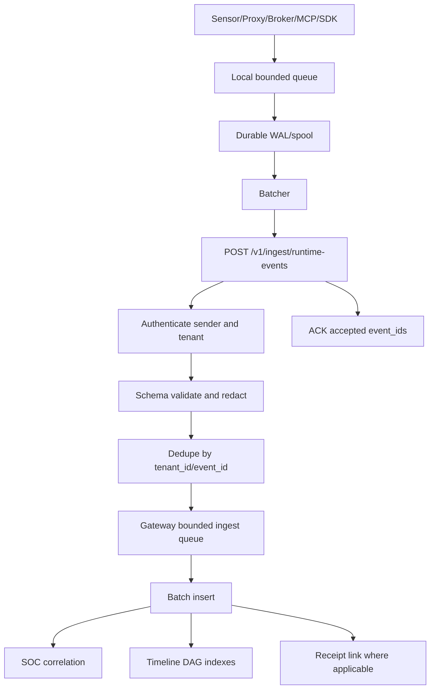

# AegisAgent World-Class LLD

**Status:** target low-level design proposal  
**Date:** 2026-06-28  
**Scope:** architecture and implementation plan; not a full implementation PR

---

## 1. Current implementation baseline

The active root is already a Cargo workspace (the single-`gateway/`-crate MVP has
been migrated; the workspace migration steps in §19 are largely **done**):

- Workspace members: `src` (binary crate `gateway`), `src/canon`, and
  `lib/{common,api,storage,policy,soc}`. A leftover `gateway/` directory may exist
  on disk but is **not** a workspace member.
- `src/src/routes/` is split into focused modules — `authorize.rs`,
  `authorize_canon.rs`, `authorize_decision.rs`, `authorize_receipts.rs`,
  `approval.rs`, `receipts.rs`, `soc.rs`, `mcp.rs`, `tenant.rs`, `policy.rs`,
  `webhooks.rs`, `graph.rs`, `agents.rs`, `dashboard.rs`, plus `mod.rs` (AppState,
  extractors, caches). `src/src/main.rs` builds the router, middleware stack,
  startup gates (JWT/public-bind/admin), and background jobs.
- `lib/api`: strongly-typed request/response + record models (`AuthorizeRequest`,
  `AuthorizeResponse` incl. inline `receipt`, `ApprovalRecord` with
  `effective_call_hash`, `ActionReceiptRecord`, SOC records, `EventEvidence`, …)
  and the gRPC proto types.
- `lib/storage`: the `StorageBackend` trait (~150 methods) with one SQLite/Postgres
  implementation (`SqlDbStorage`), SQLx versioned migrations
  (`migrations/0001…0025`, `migrations_postgres/0001…0004`), tenant-scoped queries,
  WAL/busy-timeout config, atomic receipt-chain append, audit batching, and the
  DB-backed replay-nonce store.
- `lib/policy`: Cedar engine with `@decision`/`@approver_group`/`@id` annotations,
  per-tenant policy sets, fail-closed reload.
- `lib/soc`: async events/detect/correlate/respond/notify/backtest/qdrant.
- `sdk-python`, `sdk-typescript`, `sdk-go`: all active with shared JCS-1 corpus.

This LLD specifies the **next** layer: runtime data-plane crates/binaries
(sensor, cage, egress, broker), the runtime event/command schemas, and the
ban/quarantine/evidence-graph models — built as *separate* binaries, never folded
into the gateway.

---

## 2. Target Rust workspace/crate layout

```text
AegisAgent/
  Cargo.toml                         # workspace root
  crates/
    aegis-common/                    # IDs, errors, canonicalization, crypto helpers, redaction
    aegis-api/                       # strongly typed API models + OpenAPI schemas
    aegis-storage/                   # SQLx traits + SQLite/Postgres implementations + migrations
    aegis-policy/                    # Cedar wrapper, policy bundles, ban/quarantine inputs
    aegis-receipts/                  # receipt hashing, chain append, verification, checkpoints
    aegis-events/                    # runtime event schema, ingestion batching, dedupe
    aegis-control-protocol/          # signed command schema + verification
    aegis-egress-policy/             # domain/CIDR rule matching
    aegis-tool-broker-core/          # tool broker abstractions and built-in tool contracts
    aegis-soc/                       # detections, incidents, evidence graph, evidence packs
  bins/
    aegis-gateway/
    aegis-node-sensor/
    aegis-cage-runner/
    aegis-egress-proxy/
    aegis-tool-broker/
    aegis-mcp-gateway/
  sdk-python/
  sdk-typescript/
  sdk-go/
  ui/                                # aegis-console
  docs/
  tests/
  helm/
  docker/
  .github/workflows/
```

Migration principle: extract stable, tested modules from the current `gateway` crate first; do not rewrite behavior and refactor simultaneously.

---

## 3. Binary layout

| Binary | Main role | Runtime profile |
|---|---|---|
| `aegis-gateway` | Control plane API, policy, approvals, receipts, SOC APIs | stateless-ish Axum service; Postgres prod, SQLite dev |
| `aegis-node-sensor` | Runtime telemetry and local control enforcement | Linux service, Kubernetes DaemonSet, CI sidecar |
| `aegis-cage-runner` | Disposable sandbox executor | Docker first; gVisor/Firecracker/Kata/Kubernetes later |
| `aegis-egress-proxy` | Network egress decision point | transparent/HTTP CONNECT/DNS proxy modes |
| `aegis-tool-broker` | Credential/API/tool execution broker | plugin-like connectors; no raw creds to agents |
| `aegis-mcp-gateway` | MCP choke point | MCP client/server proxy and manifest trust enforcement |
| `aegis-console` | SOC/approval/control UI | Next.js/React frontend or static SPA backed by gateway APIs |

---

## 4. API route design

### 4.1 Existing routes to preserve

- `POST /v1/authorize`
- `POST /v1/agents/register`
- `POST /v1/tools`
- `POST /v1/mcp/servers`
- `GET|POST /v1/mcp/servers/:server_key/tools`
- `POST /v1/mcp/servers/:server_key/tools/:tool_key/approve`
- `POST /v1/mcp/servers/:server_key/tools/:tool_key/disable`
- `GET /v1/approvals/:id`
- `POST /v1/approvals/:id/approve`
- `POST /v1/approvals/:id/reject`
- `POST /v1/approvals/:id/edit`
- `POST /v1/approvals/:id/consume`
- `GET /v1/runs/:id/timeline`
- `GET /v1/audit/events`
- `GET /v1/receipts/:id/verify`

### 4.2 Required target routes

#### Authorization and ingest

```http
POST /v1/authorize
POST /v1/ingest/runtime-events
POST /v1/ingest/prompt-events
POST /v1/ingest/model-calls
```

#### Control commands

```http
POST /v1/control/commands
GET  /v1/control/commands/:id
POST /v1/control/commands/:id/ack
```

#### Agent cage runs

```http
POST /v1/agent-cage/runs
GET  /v1/agent-cage/runs
GET  /v1/agent-cage/runs/:id
POST /v1/agent-cage/runs/:id/pause
POST /v1/agent-cage/runs/:id/resume
POST /v1/agent-cage/runs/:id/kill
POST /v1/agent-cage/runs/:id/quarantine
GET  /v1/agent-cage/runs/:id/timeline
```

#### Bans and quarantine

```http
POST /v1/bans
GET  /v1/bans
GET  /v1/bans/:id
POST /v1/bans/:id/revoke
GET  /v1/quarantine
GET  /v1/quarantine/:id
POST /v1/quarantine/:id/release
POST /v1/quarantine/:id/delete
```

#### Runtime and SOC

```http
GET  /v1/runtime/events
GET  /v1/runtime/runs/:id/events
GET  /v1/runtime/runs/:id/graph
POST /v1/soc/query
```

#### Receipts

```http
GET  /v1/receipts/:id/verify
POST /v1/receipts/verify-chain
POST /v1/receipts/verify-range
GET  /v1/receipts/chain-head
GET  /v1/receipts/:id/proof
```

#### Tool broker

```http
POST /v1/tool-broker/execute
GET  /v1/tool-broker/tools
POST /v1/tool-broker/tools/:id/disable
POST /v1/tool-broker/tools/:id/enable
```

#### Egress

```http
POST /v1/egress/check
GET  /v1/egress/events
POST /v1/egress/block
POST /v1/egress/unblock
```

### 4.3 API standards

- All tenant-owned APIs require authenticated tenant context.
- `tenant_id` must be server-derived where possible, not trusted from body.
- Every write accepts an idempotency key where replay is plausible.
- All list APIs use cursor pagination.
- Error bodies use a typed shape: `{ code, message, request_id, details }`.
- All destructive operations require actor identity, reason, authorization, audit event, and receipt.

---

## 5. Storage table design

Production uses Postgres. Local/dev may use SQLite. Every tenant-owned table includes `tenant_id` unless explicitly global/admin-only.

### 5.1 Core identity and runtime tables

```sql
-- tenants(id, name, plan, status, created_at, updated_at)
-- agents(id, tenant_id, agent_key, agent_token_hash, name, owner_team, environment,
--        framework, model_provider, model_name, risk_tier, status, created_at, updated_at)
-- agent_runs(id, tenant_id, agent_id, run_key, source_component, mode, status,
--            started_at, finished_at, root_trace_id, root_trust_level, policy_bundle_id)
-- agent_sandboxes(id, tenant_id, run_id, sensor_node_id, sandbox_type, sandbox_runtime,
--                 image_digest, workspace_path_hash, network_mode, status, created_at, destroyed_at)
-- agent_fingerprints(id, tenant_id, agent_id, run_id, fingerprint_type, fingerprint_value,
--                    confidence, first_seen_at, last_seen_at)
-- sensor_nodes(id, tenant_id, node_key, hostname, environment, version, public_key,
--              mode, status, registered_at, last_seen_at)
-- sensor_heartbeats(id, tenant_id, sensor_node_id, observed_at, received_at,
--                   mode, queue_depth, disk_used_bytes, running_runs, config_version)
```

### 5.2 Event tables

```sql
-- runtime_events(id, tenant_id, event_id, agent_id, run_id, sandbox_id, trace_id,
--                parent_event_id, observed_at, received_at, event_type, severity,
--                source_component, source_trust, decision, reason, action_hash,
--                prompt_hash, request_hash, response_hash, receipt_id, receipt_hash,
--                prev_receipt_hash, canonical_version, redaction_status, schema_version,
--                event_json, dedupe_key)
-- prompt_events(id, tenant_id, event_id, run_id, trace_id, prompt_hash,
--               redacted_prompt_preview, role, source_trust, model_provider,
--               retention_policy, redaction_status, created_at)
-- model_call_events(id, tenant_id, event_id, run_id, trace_id, provider, model,
--                   request_hash, response_hash, started_at, finished_at,
--                   token_counts_json, status, redaction_status)
-- tool_call_events(id, tenant_id, event_id, run_id, trace_id, tool_name, action,
--                  resource, action_hash, decision, approval_id, receipt_id, created_at)
-- api_call_events(id, tenant_id, event_id, run_id, trace_id, api_category,
--                 method, resource_hash, action_hash, decision, receipt_id, created_at)
-- egress_events(id, tenant_id, event_id, run_id, sandbox_id, destination_domain,
--               destination_ip, destination_port, protocol, sni, http_method,
--               url_hash, bytes_sent, bytes_received, decision, rule_id, reason,
--               receipt_id, created_at)
```

Indexes:

- `(tenant_id, event_id)` unique for dedupe.
- `(tenant_id, run_id, observed_at)` for timelines.
- `(tenant_id, trace_id)` for causal tracing.
- `(tenant_id, action_hash)` and `(tenant_id, prompt_hash)` for lineage.
- Time partitions for `runtime_events` and `egress_events` in Postgres.

### 5.3 Approval, policy, receipt, SOC tables

```sql
-- decisions(id, tenant_id, request_id, agent_id, run_id, trace_id, skill, action,
--           resource, action_hash, source_trust, decision, risk_score,
--           reason, matched_policy_ids, policy_bundle_id, created_at)
-- approvals(id, tenant_id, decision_id, status, approver_group, approver_user_id,
--           reason, original_skill_call, original_call_hash, edited_skill_call,
--           expires_at, decided_at, consumed_at, nonce, created_at)
-- approval_revisions(id, tenant_id, approval_id, revision_no, actor, revision_type,
--                    canonical_action, action_hash, reason, created_at)
-- policy_bundles(id, tenant_id, bundle_key, version, language, body, compiled_hash,
--                status, created_by, created_at, activated_at, rolled_back_at)
-- receipts(id, tenant_id, event_id, decision_id, agent_id, run_id, tool, action,
--          resource, action_hash, prompt_hash, source_trust, decision, approver,
--          actor, prev_receipt_hash, receipt_hash, canonical_version, signature,
--          signer_key_id, timestamp, created_at)
-- receipt_checkpoints(id, tenant_id, sequence_start, sequence_end, chain_head_hash,
--                     merkle_root, signature, signer_key_id, created_at)
-- incidents(id, tenant_id, incident_key, severity, status, title, summary,
--           first_event_id, last_event_id, opened_at, closed_at, assigned_to)
-- incident_evidence_edges(id, tenant_id, incident_id, from_node_id, to_node_id,
--                         edge_type, confidence, created_at)
-- evidence_packs(id, tenant_id, incident_id, requested_by, status, range_start,
--                range_end, object_uri, manifest_hash, receipt_checkpoint_id, created_at)
```

### 5.4 Control, ban, and quarantine tables

```sql
-- control_commands(id, tenant_id, command_id, target_type, target_id, action,
--                  reason, issued_by, issued_at, expires_at, nonce, payload_json,
--                  requires_ack, receipt_required, signature, status, created_at)
-- control_action_results(id, tenant_id, command_id, sensor_node_id, status,
--                        acked_at, executed_at, error_code, error_message,
--                        result_json, receipt_id)
-- agent_bans(id, tenant_id, target_type, target_value, target_hash,
--            scope, reason, actor, status, starts_at, expires_at,
--            incident_id, receipt_id, created_at, revoked_at)
-- quarantine_records(id, tenant_id, target_type, target_id, run_id, incident_id,
--                    reason, actor, status, preservation_uri, created_at,
--                    released_at, deleted_at, receipt_id)
```

### 5.5 Tool/MCP and egress tables

```sql
-- tools(id, tenant_id, tool_key, name, type, owner_team, auth_type, status, created_at)
-- tool_actions(id, tenant_id, tool_id, action_key, risk, mutates_state,
--              data_access, approval_required, default_decision, created_at)
-- broker_tools(id, tenant_id, tool_name, connector_type, credential_ref,
--              status, allowed_scopes_json, created_at)
-- mcp_servers(id, tenant_id, server_key, name, transport, endpoint, trust_level,
--             manifest_hash, status, inspection_enabled, created_at, updated_at)
-- mcp_tools(id, tenant_id, server_id, tool_key, name, input_schema,
--           risk, mutates_state, approval_required, status, created_at, updated_at)
-- egress_rules(id, tenant_id, scope_type, scope_id, rule_type, pattern,
--              action, priority, reason, created_by, created_at, expires_at)
```

---

## 6. Runtime event schema design

### 6.1 Common event envelope

```json
{
  "event_id": "evt_...",
  "tenant_id": "tenant_...",
  "agent_id": "agent_...",
  "run_id": "run_...",
  "sandbox_id": "sandbox_...",
  "trace_id": "trace_...",
  "parent_event_id": "evt_parent",
  "observed_at": "2026-06-28T12:00:00Z",
  "received_at": "2026-06-28T12:00:01Z",
  "event_type": "tool_call_requested",
  "severity": "info|low|medium|high|critical",
  "source_component": "sdk|node_sensor|cage_runner|egress_proxy|tool_broker|mcp_gateway|gateway",
  "source_trust": "trusted_internal_signed|trusted_internal_unsigned|semi_trusted_customer|untrusted_external|malicious_suspected|unknown",
  "decision": "allow|deny|require_approval|block|flag|none",
  "reason": "human-readable deterministic reason",
  "action_hash": "sha256hex-or-null",
  "prompt_hash": "sha256hex-or-null",
  "request_hash": "sha256hex-or-null",
  "response_hash": "sha256hex-or-null",
  "receipt_id": "rcpt-or-null",
  "receipt_hash": "sha256hex-or-null",
  "prev_receipt_hash": "sha256hex-or-null",
  "canonical_version": "aegis-jcs-1",
  "redaction_status": "redacted|hash_only|none|failed_closed",
  "schema_version": 1,
  "payload": {}
}
```

### 6.2 Supported `event_type` values

- `agent_run_started`
- `agent_run_finished`
- `prompt_observed`
- `model_call_started`
- `model_call_finished`
- `tool_call_requested`
- `tool_call_allowed`
- `tool_call_denied`
- `api_call_requested`
- `mcp_tool_call`
- `process_started`
- `process_exited`
- `shell_command`
- `file_read`
- `file_write`
- `file_delete`
- `secret_access_attempt`
- `env_access_attempt`
- `network_connect`
- `dns_query`
- `http_request`
- `package_install`
- `browser_action`
- `credential_use_attempt`
- `egress_allowed`
- `egress_blocked`
- `policy_decision`
- `approval_required`
- `approval_approved`
- `approval_rejected`
- `approval_consumed`
- `receipt_emitted`
- `control_command_received`
- `control_action_executed`
- `run_paused`
- `run_killed`
- `agent_frozen`
- `agent_banned`
- `workspace_quarantined`
- `incident_created`

---

## 7. Control command schema

```json
{
  "command_id": "cmd_...",
  "tenant_id": "tenant_...",
  "target_type": "sensor|run|sandbox|agent|workspace|mcp_server|tool|destination|credential",
  "target_id": "target identifier",
  "action": "kill_run",
  "reason": "policy or admin reason",
  "issued_by": "user/system identity",
  "issued_at": "2026-06-28T12:00:00Z",
  "expires_at": "2026-06-28T12:05:00Z",
  "nonce": "base64url-random-128-bit",
  "requires_ack": true,
  "receipt_required": true,
  "payload": {},
  "canonical_version": "aegis-command-jcs-1",
  "signature": "ed25519:base64url(signature)"
}
```

Command types:

- `start_run`, `pause_run`, `resume_run`, `kill_run`
- `snapshot_workspace`, `quarantine_workspace`, `release_workspace`
- `ban_agent`, `unban_agent`, `ban_fingerprint`, `unban_fingerprint`
- `freeze_agent`, `unfreeze_agent`
- `revoke_token`, `rotate_token`
- `block_destination`, `unblock_destination`
- `disable_tool`, `enable_tool`
- `quarantine_mcp_server`, `restore_mcp_server`
- `collect_evidence`
- `update_policy`, `update_sensor_config`

---

## 8. Runtime event ingestion path



Properties:

- Bounded MPSC queues inside gateway.
- Backpressure before memory grows unbounded.
- Batch inserts with idempotency.
- Dedupe by `(tenant_id, event_id)`.
- Ordering by `(tenant_id, run_id, sequence_no, observed_at)` where sensors provide sequence.
- Watermarks per sensor/run for replay progress.
- Critical events never silently dropped; non-critical events can be sampled only by explicit policy.

---

## 9. Local durable sensor queue design

The node sensor maintains an append-only local spool.

### 9.1 File layout

```text
/var/lib/aegis/sensor/
  config.toml
  identity.json
  spool/
    lane-critical/
      00000001.segment
      00000002.segment
    lane-normal/
      00000001.segment
    lane-debug/
      00000001.segment
  ack/
    watermarks.json
  replay-cache/
    command-nonces.bin
```

### 9.2 Queue algorithm

1. Serialize normalized event envelope.
2. Compute event checksum.
3. Append to lane segment.
4. Fsync according to lane policy:
   - critical: fsync before ACK to local producer.
   - normal: group fsync.
   - debug: best effort with bounded loss allowed only by config.
5. Shipper reads oldest unacked event by lane priority.
6. Batch POST to gateway.
7. Gateway returns accepted event IDs and highest contiguous watermark.
8. Sensor marks ACKed offsets and compacts old segments.

### 9.3 Failure handling

- Corrupt segment: stop at last valid checksum, quarantine corrupt tail, emit `sensor_spool_corruption`.
- Disk full: enforce policy mode; critical lane reserves disk budget; non-critical drops only with event.
- Gateway down: spool until disk budget; then observe/enforce/lockdown mode decides workload impact.

---

## 10. Receipt chain algorithm

### 10.1 Append

Protected actions execute in one DB transaction:

1. Validate tenant, actor, decision, and receipt-required flag.
2. Lock per-tenant chain head row:
   - Postgres: `SELECT ... FOR UPDATE` on `receipt_chain_heads WHERE tenant_id = $1`.
   - SQLite local: `BEGIN IMMEDIATE` and one writer.
3. Read `prev_receipt_hash` and sequence.
4. Canonicalize receipt body excluding `receipt_hash`, `signature`, and volatile DB fields.
5. Compute `receipt_hash = sha256(canonical_body)`.
6. Optionally sign `receipt_hash` with tenant/key-specific signer.
7. Insert receipt.
8. Update chain head to new sequence/hash.
9. Commit.
10. Return receipt ID/hash to caller.

Protected action fails closed if steps 1-9 fail.

### 10.2 Chain checkpoints

Every N receipts or T minutes:

1. Select receipt range by tenant and sequence.
2. Compute Merkle root over receipt hashes.
3. Store `receipt_checkpoints` with `sequence_start`, `sequence_end`, `chain_head_hash`, `merkle_root`.
4. Sign checkpoint.
5. Optionally anchor to external transparency log or immutable object store.

### 10.3 Verification

- Single receipt: recompute receipt hash and optional signature.
- Chain: stream receipts in sequence, recompute each hash, verify `prev_receipt_hash` linkage.
- Range: verify range linkage plus checkpoint/Merkle proof if available.
- Proof endpoint returns receipt, neighbor hashes or Merkle proof, checkpoint, and signatures.

---

## 11. Ban cache algorithm

### 11.1 Source of truth

`agent_bans` table is authoritative. All ban/unban actions write audit + receipt + invalidation event.

### 11.2 In-memory cache

Per gateway/sensor/proxy/broker process:

- Exact maps: `(tenant_id, target_type, target_hash) -> ban decision`.
- Domain suffix trie for `destination_domain`.
- CIDR prefix matcher for `destination_ip`.
- Tool/MCP maps by normalized ID.
- TTL and version watermarks.
- Optional bloom filter for global bans as a fast precheck.

### 11.3 Lookup order

1. Tenant/run local ban cache.
2. Exact hash match.
3. Domain suffix match.
4. CIDR prefix match.
5. Scope escalation: run → agent → tenant → organization → global.
6. If cache stale and gateway reachable: refresh.
7. If cache stale and gateway unavailable: enforce according to sensor mode.

### 11.4 Invalidation

- Gateway publishes `ban_version` increments.
- Sensors/proxies poll or receive config push.
- Control command `update_sensor_config` can force immediate refresh.

---

## 12. Egress rule matching algorithm

Inputs:

- tenant ID, run ID, sandbox ID, agent ID
- destination domain, resolved IP, port, protocol
- DNS metadata
- HTTP method, host, path hash, content length
- TLS SNI where available
- byte counters and upload heuristics

Algorithm:

1. Deny if run/agent/sandbox/destination is banned.
2. Deny if run/workspace/destination is quarantined.
3. Check per-run rules by priority.
4. Check per-agent rules.
5. Check tenant rules.
6. Domain matching using suffix trie:
   - exact `api.github.com`
   - suffix `*.github.com`
   - public suffix-aware matching to avoid `evilgithub.com` false positives.
7. CIDR matching using prefix tree / radix trie.
8. Apply deny-by-default if no allow rule and mode is enforce/lockdown.
9. Emit `egress_allowed`/`egress_blocked` event.
10. Emit receipt for blocked egress and high-risk allowed egress.

Fast path target: under 5 ms for cached rules.

---

## 13. Timeline DAG model

Runtime timelines are DAGs, not flat logs.

Node types:

- run
- prompt
- model_call
- tool_call
- api_call
- mcp_call
- process
- file_event
- secret_access
- network_event
- policy_decision
- approval
- receipt
- control_command
- quarantine
- ban
- incident

Edges:

- `parent_event_id`
- `caused_by`
- `prompt_to_model`
- `model_to_tool`
- `tool_to_egress`
- `decision_for_action`
- `approval_for_decision`
- `receipt_for_event`
- `control_response_to_incident`
- `evidence_for_incident`

Indexes:

- `(tenant_id, run_id)`
- `(tenant_id, trace_id)`
- `(tenant_id, parent_event_id)`
- `(tenant_id, action_hash)`
- `(tenant_id, prompt_hash)`
- graph edge table for incident evidence subgraphs

---

## 14. Incident evidence graph model

An incident evidence graph is a subgraph extracted from the timeline DAG.

Graph root:

- `incident_id`

Common evidence chain:

```text
prompt_observed
→ model_call_finished
→ tool_call_requested
→ secret_access_attempt
→ egress_blocked
→ policy_decision
→ kill_run command
→ control_action_executed
→ workspace_quarantined
→ agent_banned
→ receipts
```

Evidence graph invariants:

- Every edge includes `tenant_id`.
- Cross-tenant edges are impossible.
- Evidence export includes receipts and checkpoint proofs.
- Node payloads are redacted; raw secrets and raw sensitive prompts are absent.

---

## 15. Policy evaluation model

Policy inputs:

- tenant
- agent state
- run state
- source trust
- prompt lineage
- tool/action/resource
- action hash
- risk metadata
- runtime context
- ban state
- quarantine state
- MCP trust
- egress destination
- approval state

Outputs:

- `allow`
- `deny`
- `require_approval`
- `pause_run`
- `kill_run`
- `freeze_agent`
- `revoke_token`
- `quarantine_agent`
- `quarantine_workspace`
- `quarantine_mcp`
- `ban_agent`
- `ban_fingerprint`
- `block_egress`

Evaluation pipeline:

1. Build deterministic context.
2. Fast deny path: ban/quarantine/unknown MCP/disabled tool/invalid tenant.
3. Load cached versioned policy bundle.
4. Evaluate Cedar with no LLM call.
5. Risk enrichment can escalate but cannot override deterministic forbids.
6. Return decision with matched policy IDs and explanation.
7. Persist decision and receipt if required.

LLM allowed uses:

- summarize incident
- explain policy in human language
- generate investigation narrative
- suggest policy changes
- draft incident report

LLM disallowed use:

- allow/deny/control enforcement decision.

---

## 16. OpenAPI contract model

`aegis-api` owns request/response structs and OpenAPI generation.

Rules:

- Every external route has typed request/response schema.
- Every route documents auth, tenant resolution, idempotency, failure mode, and receipt behavior.
- Every schema includes `schema_version` where persisted or emitted by runtime components.
- Generated OpenAPI is checked in or generated in CI and validated for backwards-compatible changes.
- SDKs generate types from OpenAPI where practical but keep hand-written fail-closed control logic.

---

## 17. UI data contracts

Console pages consume stable APIs:

| Page | Primary APIs |
|---|---|
| Overview | `/v1/soc/summary`, `/v1/runtime/events`, `/v1/receipts/chain-head` |
| Explore | `/v1/soc/query`, `/v1/runtime/events`, `/v1/decisions` |
| Approvals | `/v1/approvals`, approval action routes |
| Incidents | `/v1/incidents`, `/v1/runtime/runs/:id/graph`, `/v1/soc/query` |
| Receipts | `/v1/receipts`, verify/proof/range APIs |
| Agents | `/v1/agents`, `/v1/agent-cage/runs` |
| Agent Cage Runs | `/v1/agent-cage/runs`, run controls |
| Runtime Timeline | `/v1/runtime/runs/:id/events`, `/v1/runtime/runs/:id/graph` |
| Prompt Timeline | `/v1/ingest/prompt-events` read APIs, prompt timeline endpoint |
| Model Calls | model call event list/detail endpoints |
| Tool Calls | tool call event list/detail endpoints |
| Egress Events | `/v1/egress/events` |
| Ban Center | `/v1/bans` |
| Quarantine Center | `/v1/quarantine` |
| MCP Security | MCP server/tool routes plus quarantine/restore |
| Policy Center | policy bundle CRUD/simulation routes |
| Evidence Graph | incident graph and evidence pack APIs |
| Settings | tenant, sensor, keys, retention, OIDC settings |

UI must use virtualization for large event lists and graph pagination for large evidence graphs.

---

## 18. Test plan

### 18.1 Unit tests

- canonical action hashing
- prompt hashing/redaction
- receipt hashing
- receipt signature verification
- policy decisions
- ban matching
- egress matching
- command signature verification
- event deduplication
- local spool corruption recovery

### 18.2 Integration tests

- known agent allow
- known agent require approval
- approval edit/approve/consume
- wrong approval hash does not burn approval
- anonymous agent run start
- runtime event ingest
- secret access detection
- unknown egress block
- kill command execution
- ban fingerprint prevents rerun
- quarantine workspace
- receipt emitted for control action
- SOC incident created
- evidence graph links prompt/model/tool/runtime/receipt

### 18.3 Concurrency tests

- concurrent receipt append
- concurrent approval consume
- concurrent runtime event ingestion
- concurrent command ACK
- concurrent ban cache invalidation
- multi-sensor event ordering

### 18.4 Security tests

- tenant A cannot see tenant B data
- tenant A cannot control tenant B agent
- invalid command signature rejected
- expired command rejected
- replayed command rejected
- raw secret redaction
- banned agent cannot authorize
- quarantined agent cannot call tools
- public admin route rejected
- JWT required in production

### 18.5 Failure tests

- gateway down in observe mode buffers
- gateway down in enforce mode blocks
- gateway down in lockdown mode pauses/kills
- DB unavailable for protected action fails closed
- receipt write failure blocks protected action
- sensor restart replays local queue
- duplicate event ID is idempotent

### 18.6 E2E demo test

A malicious anonymous agent:

1. receives a prompt
2. calls a model
3. tries to read `.env`
4. tries to install a package
5. tries to call GitHub
6. tries to POST data to unknown domain

Aegis must:

1. capture prompt hash and redacted prompt
2. capture model call metadata
3. detect `.env` access
4. detect package install
5. force GitHub call through Tool Broker
6. block unknown egress
7. require approval for GitHub write action
8. kill or pause the run according to policy
9. quarantine workspace
10. ban fingerprint if configured
11. emit receipts for protected/control actions
12. create SOC incident
13. show full timeline in UI
14. export evidence pack
15. verify receipt chain

---

## 19. Migration strategy from current repo

### 19.1 Do not start with a rewrite

The active MVP has valuable correctness tests around canonicalization, approval integrity, and receipts. Preserve those first.

### 19.2 Migration sequence — status

Steps 1–8 are **already complete** on `main`; the live work begins at step 9.

1. ✅ Add docs and target contracts (this document set).
2. ✅ Root Cargo workspace in place.
3. ✅ `aegis-common` (`lib/common`) — canonicalization/errors/metrics extracted.
4. ✅ `aegis-api` (`lib/api`) — typed models extracted.
5. ✅ Receipt helpers + shared corpus tests live (`authorize_receipts.rs`,
   `tests/receipt_chain_vectors.json`).
6. ✅ `aegis-storage` (`lib/storage`) behind the `StorageBackend` trait.
7. ✅ Postgres feature + `migrations_postgres/` alongside SQLite migrations.
8. ✅ Gateway routes split into domain modules under `src/src/routes/`.
9. ▶ **Next:** add runtime data-plane schemas (`runtime_events`,
   `agent_runs`, `control_commands`, `agent_bans`, `quarantine_records`) and
   ingest routes to `lib/api`/`lib/storage`/gateway (Phase 2).
10. Add the `aegis-node-sensor` skeleton (Phase 3).
11. Add `aegis-cage-runner` / `aegis-egress-proxy` / `aegis-tool-broker` /
    standalone MCP gateway as independent binaries (Phases 4–6).

Recent hardening already merged also covers items this doc once listed as gaps:
transaction-safe receipt append, fail-closed durable receipts, verify-range +
chain-head, JWT/public-bind/admin auth gates, and the DB-backed replay store.

### 19.3 Legacy `gateway/` directory

If a `gateway/` directory still exists at the repo root, it predates the
workspace migration and is **not** a workspace member. Treat it as legacy: do not
add new code there; the production source of truth is `src/` + `lib/`.

---

## 20. Phased implementation plan summary

Detailed PR sequencing is in `docs/AegisAgent_Phased_PR_Plan.md`.

High-level phases:

1. Documentation and gap analysis.
2. Control-plane data models and migrations.
3. Node sensor skeleton.
4. Cage runner skeleton.
5. Egress proxy.
6. Tool broker.
7. Prompt/model/tool capture.
8. SOC/evidence graph.
9. Console UI.
10. Production hardening.

---

## 21. LLD design laws

1. No untrusted agent execution in `aegis-gateway`.
2. No privileged action without an Aegis choke point.
3. No protected success without durable receipt.
4. No LLM-decided enforcement.
5. No missing `tenant_id` on tenant data.
6. No raw secrets in events, logs, prompts, receipts, or evidence packs.
7. No unbounded queue.
8. No unsigned or replayable runtime command.
9. No anonymous raw credential access.
10. No direct internet for unknown agents in enforce/lockdown mode.
