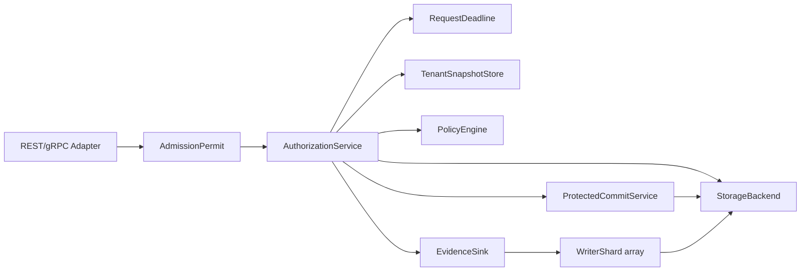
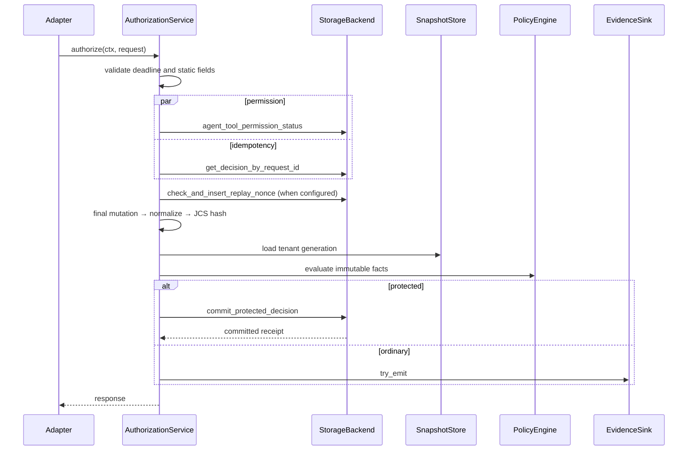
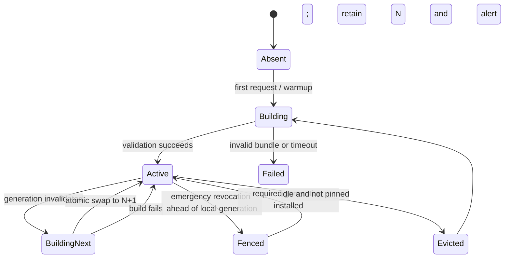
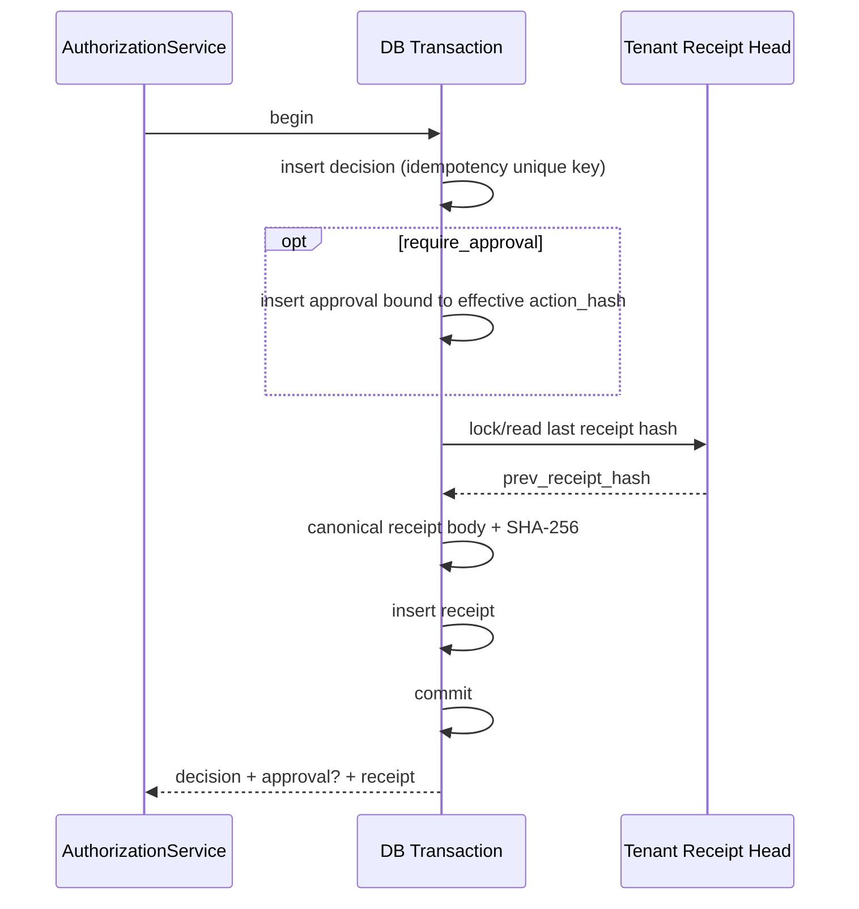
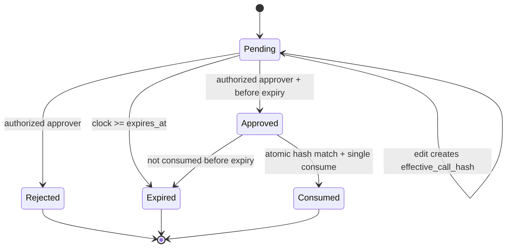
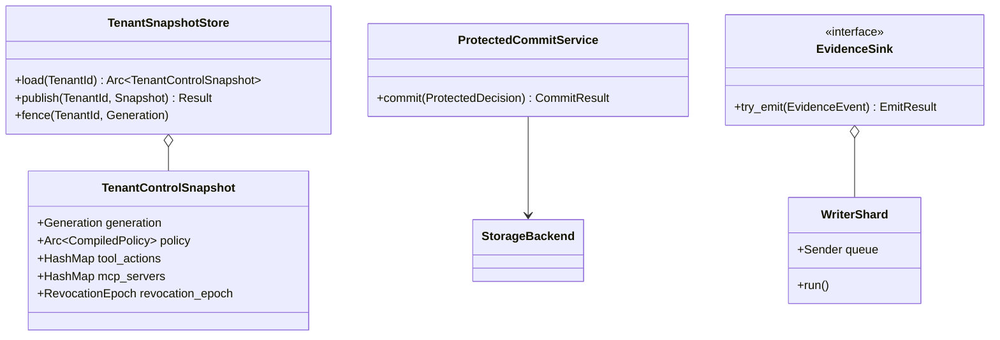

# AegisAgent Performance-First Low-Level Design

**Status:** normative implementation blueprint; target items require code, tests, and benchmark proof

**Last reviewed:** 2026-07-12
**Companion:** [Performance-First HLD](AegisAgent_World_Class_HLD.md)

> This LLD optimizes execution speed without weakening action hashing, approval binding, replay protection, tenant isolation, or durable receipts. “Maximum efficiency” means the minimum coordination compatible with those invariants, inside a measured capacity envelope.

## Overview

This document translates the HLD into concrete Rust ownership, request stages, data structures, algorithms, database transactions, indexes, API contracts, queue policies, and rollout gates.

The central implementation unit is a shared `AuthorizationService`. REST on port 8080 and gRPC on port 6334 are adapters around that service. The service takes one immutable tenant snapshot, evaluates one deterministic decision, and assigns one durability class.

### Current and target boundary

| Area | Current | Target in this LLD |
|---|---|---|
| Workspace DAG | Layered `lib/` crates plus thin binary rule | Preserve exactly |
| REST authorize | Implemented | Thin adapter to shared service |
| gRPC authorize | Implemented, but protected receipt parity is incomplete in proto | Proto-first receipt parity and contract tests |
| Independent reads | `tokio::join!` used for permission/idempotency | Generalize only where dependencies are proven independent |
| Caches | Bounded skill/MCP/hash/replay/risk caches | Immutable tenant control snapshot with generation fences |
| Replay | In-memory option and durable DB option | Durable store required for multi-replica production |
| Receipts | Atomic append; protected synchronous, low-risk allow asynchronous | Preserve; combine protected writes into the shortest safe transaction |
| SOC | Bounded non-blocking event path | Priority-separated bounded evidence lanes |
| Storage | SQLite and partial PostgreSQL implementation | PostgreSQL qualification gate before HA/multi-replica claim |

The authoritative capability status remains [Implementation Status](Implementation_Status.md).

## Why This Exists

An HLD can say “use a cache” or “process asynchronously” without answering the dangerous questions: which values are safe to cache, how revocation invalidates them, which queue may drop, what transaction owns the receipt chain head, or how REST and gRPC remain identical. This LLD removes those ambiguities.

## Problem Statement

The authorize path combines CPU work, indexed reads, conditional writes, and security checks. Naively serializing all of them wastes latency. Naively parallelizing all of them wastes database capacity. Naively caching all of them makes revocation unsafe.

The implementation must therefore:

- keep reader synchronization O(1) and avoid global write locks;
- execute only independent reads concurrently;
- never cache a final decision;
- make idempotency and replay atomic across replicas;
- serialize receipt-chain updates at the narrowest tenant boundary;
- bound memory, queue time, request time, and DB wait;
- preserve one semantic API across REST and gRPC.

## Solution

### Selected implementation pattern

Use five cooperating primitives:

1. `ArcSwap`-style immutable `TenantControlSnapshot` publication.
2. A fair, bounded admission semaphore before expensive work.
3. Structured concurrency with one request cancellation/deadline context.
4. `StorageBackend` transactions for idempotency, replay, approval, and protected receipt integrity.
5. Tenant-hashed bounded writer shards for non-critical evidence.

`ArcSwap` names the intended semantics; the exact crate must pass dependency and security review. A standard `RwLock<Arc<_>>` may be used initially, benchmarked, and replaced only if lock contention is measured.

### Developer decision rules

```text
Does the value change the current allow/deny/approval result?
├─ yes → read from the same validated snapshot generation or authoritative transaction
└─ no  → it may be asynchronously produced after the decision

Would losing the write invalidate approval, replay, or protected evidence?
├─ yes → synchronous durable transaction; failure is fail closed
└─ no  → bounded queue with explicit overflow telemetry
```

## Architecture


```mermaid
flowchart LR
    Adapter[REST/gRPC Adapter] --> Gate[AdmissionPermit]
    Gate --> Service[AuthorizationService]
    Service --> Deadline[RequestDeadline]
    Service --> Snap[TenantSnapshotStore]
    Service --> Policy[PolicyEngine]
    Service --> Storage[StorageBackend]
    Service --> Durable[ProtectedCommitService]
    Service --> Sink[EvidenceSink]
    Durable --> Storage
    Sink --> Shards[WriterShard array]
    Shards --> Storage
```

The adapter cannot call `PolicyEngine` or storage directly. `AuthorizationService` owns orchestration. Policy remains storage-independent. The protected commit boundary is visibly different from best-effort evidence.

## Component Breakdown

### Crate ownership

| Type/logic | Owner | Forbidden dependency |
|---|---|---|
| `AegisError`, hashing helpers, bounded metric labels | `aegis-common` | All project crates |
| Protobuf messages, REST mirrors, records | `aegis-api` | Storage, policy, SOC, binary |
| `StorageBackend`, SQL, transactions, migrations | `aegis-storage` | Policy, SOC, binary |
| Cedar compilation/evaluation, trust validation | `aegis-policy` | Storage and binary |
| Detection/correlation/export | `aegis-soc` | Policy and binary business logic |
| Composition, config, Axum/tonic adapters | `src/` binary | Business logic accumulation |

Every library function returns `Result<T, AegisError>`. Production paths do not use `unwrap()` or `expect()`.

### Service contract

```rust
pub struct AuthorizationContext {
    pub tenant_id: TenantId,
    pub peer: PeerIdentity,
    pub protocol: Protocol,
    pub deadline: Instant,
    pub trace: TraceContext,
}

#[async_trait::async_trait]
pub trait AuthorizationService: Send + Sync {
    async fn authorize(
        &self,
        ctx: AuthorizationContext,
        request: AuthorizeRequest,
    ) -> Result<AuthorizeResponse, AegisError>;
}
```

Line-by-line intent:

- `tenant_id` is established by authenticated transport context, not trusted from an arbitrary body alone.
- `peer` captures verified token or mTLS identity without logging the credential.
- `protocol` enables bounded metrics, not different behavior.
- `deadline` is created once and inherited by every child operation.
- the trait makes both adapters call the same implementation.

## Data Flow

### Request-stage pipeline

| Order | Stage | Input | Output | Can run concurrently? | Failure behavior |
|---:|---|---|---|---|---|
| 1 | Frame validation | bytes/protobuf | typed request | No | 400 / `INVALID_ARGUMENT` |
| 2 | Admission | tenant class + permit pool | permit | No | 429 / `RESOURCE_EXHAUSTED` |
| 3 | Identity | tenant + credential | `AgentRecord` | Limited | fail closed |
| 4 | Static restrictions | agent + environment | validated context | No | deterministic deny |
| 5 | Permission + idempotency | agent, tool, request_id | two read results | Yes, independent |
| 6 | Replay claim | nonce + timestamp | unique claim | No; atomic | conflict/fail closed |
| 7 | Final mutation hook | typed action | final typed action | No | configured fail closed/open policy; must precede hash |
| 8 | Normalize/canonicalize | final action | canonical bytes + hash | CPU task | fail closed |
| 9 | Snapshot load | tenant | `Arc<TenantControlSnapshot>` | O(1) | fail closed if none valid |
| 10 | Policy evaluation | facts + snapshot | deterministic decision | CPU task | fail closed |
| 11 | Durability classification | decision + action metadata | class | No | conservative/protected on ambiguity |
| 12 | Commit/enqueue | record set | receipt or enqueue outcome | Class-dependent | protected fails closed |

No stage may start detached work that outlives cancellation unless it transfers ownership to a bounded, monitored background service.

## Request Flow


```mermaid
sequenceDiagram
    participant A as Adapter
    participant S as AuthorizationService
    participant DB as StorageBackend
    participant SS as SnapshotStore
    participant P as PolicyEngine
    participant E as EvidenceSink
    A->>S: authorize(ctx, request)
    S->>S: validate deadline and static fields
    par permission
        S->>DB: agent_tool_permission_status
    and idempotency
        S->>DB: get_decision_by_request_id
    end
    S->>DB: check_and_insert_replay_nonce (when configured)
    S->>S: final mutation → normalize → JCS hash
    S->>SS: load tenant generation
    S->>P: evaluate immutable facts
    alt protected
        S->>DB: commit_protected_decision
        DB-->>S: committed receipt
    else ordinary
        S->>E: try_emit
    end
    S-->>A: response
```

## Control Flow

### Snapshot lifecycle


```mermaid
stateDiagram-v2
    [*] --> Absent
    Absent --> Building: first request / warmup
    Building --> Active: validation succeeds
    Building --> Failed: invalid bundle or timeout
    Active --> BuildingNext: generation invalidated
    BuildingNext --> Active: atomic swap to N+1
    BuildingNext --> Active: build fails; retain N and alert
    Active --> Fenced: emergency revocation ahead of local generation
    Fenced --> Active: required generation installed
    Active --> Evicted: idle and not pinned
    Evicted --> Building
```

An emergency generation fence denies affected operations until the replica installs the required generation. A normal refresh never blocks readers and never mutates an active snapshot.

## Sequence Diagram

### Protected commit


```mermaid
sequenceDiagram
    participant S as AuthorizationService
    participant TX as DB Transaction
    participant H as Tenant Receipt Head
    S->>TX: begin
    TX->>TX: insert decision (idempotency unique key)
    opt require_approval
        TX->>TX: insert approval bound to effective action_hash
    end
    TX->>H: lock/read last receipt hash
    H-->>TX: prev_receipt_hash
    TX->>TX: canonical receipt body + SHA-256
    TX->>TX: insert receipt
    TX->>TX: commit
    TX-->>S: decision + approval? + receipt
```

All rows use the same `tenant_id`. The lock is tenant-scoped and held only while the receipt body is hashed and inserted. Compiling policy, calling webhooks, rendering JSON, and SOC work are forbidden inside the transaction.

## State Diagram

### Approval lifecycle


```mermaid
stateDiagram-v2
    [*] --> Pending
    Pending --> Approved: authorized approver + before expiry
    Pending --> Rejected: authorized approver
    Pending --> Expired: clock >= expires_at
    Approved --> Consumed: atomic hash match + single consume
    Approved --> Expired: not consumed before expiry
    Pending --> Pending: edit creates effective_call_hash
    Rejected --> [*]
    Expired --> [*]
    Consumed --> [*]
```

Consume is a compare-and-set operation. The predicate includes tenant, approval ID, `status='approved'`, `consumed_at IS NULL`, unexpired time, and effective action hash equality.

## Class Diagram


```mermaid
classDiagram
    class TenantSnapshotStore {
      +load(TenantId) Arc~TenantControlSnapshot~
      +publish(TenantId, Snapshot) Result
      +fence(TenantId, Generation)
    }
    class TenantControlSnapshot {
      +Generation generation
      +Arc~CompiledPolicy~ policy
      +HashMap tool_actions
      +HashMap mcp_servers
      +RevocationEpoch revocation_epoch
    }
    class ProtectedCommitService {
      +commit(ProtectedDecision) CommitResult
    }
    class EvidenceSink {
      <<interface>>
      +try_emit(EvidenceEvent) EmitResult
    }
    class WriterShard {
      +Sender queue
      +run()
    }
    TenantSnapshotStore o-- TenantControlSnapshot
    ProtectedCommitService --> StorageBackend
    EvidenceSink o-- WriterShard
```

## Deployment Architecture

At one replica, an in-process snapshot store and writer-shard array minimize hops. At multiple replicas, PostgreSQL is authoritative; a notification channel accelerates invalidation, but every control generation remains queryable from PostgreSQL so missed notifications recover. Runtime telemetry may use a durable external bus only after measured need.

Read replicas are forbidden for identity revocation, quarantine, nonce claims, approval consume, policy generation fences, and receipt-chain heads.

## Folder Structure

Target changes preserve the existing Qdrant-inspired layout:

```text
lib/api/proto/aegis.proto             # add receipt contract first
lib/api/src/models.rs                 # REST mirror generated/reconciled with proto
lib/storage/src/traits.rs             # transaction-oriented trait additions
lib/storage/src/sqlite/               # SQLite implementation details
lib/storage/src/postgres/             # PostgreSQL implementation details
lib/policy/src/                       # pure compiled policy and validation
src/src/services/authorization.rs     # target orchestration service
src/src/routes/authorize.rs           # thin REST adapter
src/src/grpc.rs                       # thin gRPC adapter
src/src/background/evidence_writer.rs # bounded consumers
benches/authorize_benchmark.rs         # decision-class benchmark matrix
```

If the service must be reusable outside the binary, introduce a downward-compatible library crate through an ADR; do not make an existing lower crate depend upward on `src/`.

## Configuration

```yaml
gateway:
  authorize_deadline_ms: 75       # total request deadline
  db_acquire_deadline_ms: 10      # included in total deadline
  max_concurrent_requests: 512    # benchmark-derived admission ceiling
  max_body_bytes: 262144          # limits parse/hash CPU and memory

authorization:
  durable_replay_required: true   # mandatory for multi-replica production
  snapshot_idle_ttl_seconds: 900  # memory reclamation, not freshness
  emergency_revocation_fence: true

evidence:
  writer_shards: 16
  critical_queue_capacity: 8192
  telemetry_queue_capacity: 65536
  batch_max_events: 250
  batch_max_bytes: 1048576
  batch_max_delay_ms: 10
```

Validation rules:

- deadlines must be positive and `db_acquire_deadline_ms < authorize_deadline_ms`;
- capacities must fit the declared memory budget;
- `writer_shards` must be a power of two if bit-mask routing is used;
- multi-replica startup fails when durable replay or qualified PostgreSQL support is absent;
- public bind fails without the required authentication/TLS gates.

## Installation

No new endpoint is considered installed until protobuf generation tools are present and both protocol suites pass. Follow [Installation](installation.md); PostgreSQL target mode additionally requires migrations, pooling, backups, and a completed backend qualification matrix.

## Quick Start

Implementation order:

1. Add characterization tests around current REST and gRPC decisions.
2. Correct protobuf receipt parity without changing REST behavior.
3. Extract a shared authorization service behind existing adapters.
4. Add stage timings and deadlines.
5. Introduce snapshot generation storage and invalidation.
6. Add priority-separated evidence writers.
7. Qualify PostgreSQL transactions and multi-replica behavior.
8. Benchmark, canary, and raise concurrency only from evidence.

Each step is independently reversible.

## Detailed Walkthrough

### Core identifiers

Use validated newtypes internally to prevent accidental tenant/key interchange:

```rust
#[derive(Clone, Eq, PartialEq, Hash)]
pub struct TenantId(Arc<str>);

#[derive(Clone, Copy, Eq, PartialEq, Ord, PartialOrd)]
pub struct Generation(u64);

#[derive(Clone, Eq, PartialEq)]
pub struct ActionHash([u8; 32]);
```

- `Arc<str>` makes snapshot key clones cheap while retaining UTF-8 compatibility.
- `Generation` is monotonic per tenant and cannot be mixed with a timestamp.
- `ActionHash` stores binary SHA-256 internally; lowercase hex is a wire/storage encoding.

### Immutable snapshot

```rust
pub struct TenantControlSnapshot {
    pub generation: Generation,
    pub policy: Arc<CompiledPolicySet>,
    pub tool_actions: HashMap<ToolActionKey, ToolActionMeta>,
    pub mcp_servers: HashMap<NormalizedKey, McpServerMeta>,
    pub mcp_tools: HashMap<McpToolKey, McpToolMeta>,
    pub revocation_epoch: u64,
    pub built_at: Instant,
}
```

Data-structure choices:

| Structure | Operation | Complexity | Reason |
|---|---|---:|---|
| `HashMap<ToolActionKey, Meta>` | exact normalized lookup | expected O(1) | dominant authorization access pattern |
| `Arc<CompiledPolicySet>` | clone for request | O(1) | immutable sharing without policy copy |
| atomic `Arc` publication | load/swap | O(1) | readers do not wait for rebuild |
| bounded LRU | optional canonical/metadata memoization | expected O(1) | fixed memory; never stores decisions |
| `BTreeMap` | ordered range/report paths only | O(log n) | avoid when exact hash lookup is enough |

Build memory off-thread, validate it completely, then publish. Do not mutate a live `HashMap`. Set maximum tenants, entries per tenant, and bytes per snapshot; evict idle snapshots only when no emergency fence requires them.

### Authorization algorithm

```rust
async fn authorize(ctx: AuthorizationContext, mut req: AuthorizeRequest)
    -> Result<AuthorizeResponse, AegisError>
{
    let _permit = admission.acquire_before(ctx.deadline).await?;
    validate_wire_limits(&req)?;

    let agent = identity.resolve(&ctx, &req).await?;
    validate_environment(&agent, &req.agent.environment)?;

    let (permission, prior) = tokio::try_join!(
        storage.agent_tool_permission_status(&ctx.tenant_id, &agent.id, &req.tool_call.tool),
        idempotency.lookup_unless_dry_run(&ctx, &agent.id, &req),
    )?;
    enforce_permission(permission)?;
    if let Some(decision) = prior { return replay(decision).await; }

    replay_guard.claim_if_requested(&ctx, &agent.id, &req).await?;
    admission_hook.apply_before_hash(&ctx, &mut req).await?;

    let normalized = normalize_identifiers(&req.tool_call)?;
    let canonical = canonicalize_aegis_jcs_1(&req.tool_call)?;
    let action_hash = sha256(&canonical);
    let snapshot = snapshots.load_valid(&ctx.tenant_id)?;
    let facts = build_policy_facts(&agent, &req, &normalized, snapshot.generation)?;
    let decision = policy.evaluate(&snapshot.policy, &facts)?;
    let class = classify_durability(&decision, &req, &snapshot)?;

    persist_or_enqueue(ctx, req, decision, action_hash, class).await
}
```

Important details:

- The permit is acquired before storage work.
- `try_join!` cancels the sibling future when one fails. Use it only when both reads are semantically independent.
- Idempotency is checked before policy work; dry-run bypasses persistence and idempotency state.
- The admission hook runs before hashing because it may mutate the action.
- Original values are canonicalized for the action hash; normalized identifiers are lookup keys.
- One snapshot is loaded once and referenced through evaluation.
- Unknown durability class is treated as protected.

### Trust propagation

Map trust labels to an ordered enum, from most trusted to least trusted. Propagation selects the **more restrictive** value:

```text
effective_root_trust = max_restriction(inherited_root_trust, current_source_trust)
```

This is O(1), deterministic, and idempotent. An unknown label returns an error or the least-trusted value; it never increases trust.

### Identifier normalization

For lookup only:

1. reject overlong values and invalid control characters;
2. percent-decode exactly once according to the existing contract;
3. normalize Unicode to the chosen form;
4. apply case rules defined by the identifier contract;
5. use the normalized tuple as a map/database key.

Do not normalize action parameters before `aegis-jcs-1` unless the canonicalization specification explicitly requires it. Lookup normalization and approval hashing solve different problems.

### Durability classifier

```rust
enum DurabilityClass {
    Protected,
    Ordinary,
    DryRun,
}

fn classify(decision: &Decision, call: &ToolCall, risk: Risk) -> DurabilityClass {
    if decision.dry_run { return DurabilityClass::DryRun; }
    if call.mutates_state || risk >= Risk::High || decision.kind != Allow {
        DurabilityClass::Protected
    } else {
        DurabilityClass::Ordinary
    }
}
```

The actual risk ordering and decision enum must use existing typed API definitions. Any parse error yields `Protected`, never `Ordinary`.

### Writer sharding and batching

```rust
let shard = stable_hash(tenant_id.as_bytes()) & (writer_shards - 1);
writers[shard].try_send(event)
```

- Stable hashing keeps a tenant’s evidence ordered within a process.
- Power-of-two shard counts permit a mask instead of modulo.
- Each event carries its tenant ID; the consumer still validates tenant binding.
- Flush when any limit is reached: event count, byte count, or delay.
- Never batch different SQL shapes into one malformed statement; group by event type.
- On shutdown, stop admission, drain until the configured deadline, then report any remainder.

### Queue priorities

| Lane | Examples | Producer operation | Overflow |
|---|---|---|---|
| Protected | required receipt/approval/replay | direct transaction | fail closed |
| Critical evidence | denies, integrity alarms, control ACKs | bounded send or durable spool | alert and preserve according to contract |
| Telemetry | process/fs/net observations | `try_send` or sensor spool | drop only approved lowest priority; count every drop |
| Derived | risk samples, UI projection, semantic index | `try_send` | rebuild from source when possible |

One full telemetry queue must never prevent a protected receipt.

## Code Explanation

### Deadline propagation

Every storage and external operation uses the request’s remaining duration, not a fresh full timeout:

```rust
fn remaining(deadline: Instant) -> Result<Duration, AegisError> {
    deadline.checked_duration_since(Instant::now())
        .ok_or(AegisError::DeadlineExceeded)
}
```

Creating new independent timeouts at each stage can make a nominal 75 ms request run for several multiples of 75 ms. The root deadline prevents that.

### Admission permit sizing

Use Little’s Law as a starting estimate, then benchmark:

```text
concurrency ≈ target_throughput_per_second × target_service_time_seconds
```

At 2,000 requests/s and 25 ms service time, the starting concurrency is about 50, plus measured headroom—not 2,000. DB connections are sized separately; a request does not hold a connection during CPU-only policy evaluation.

### Error mapping

| `AegisError` category | REST | gRPC | Retry |
|---|---:|---|---|
| Validation | 400 | `INVALID_ARGUMENT` | No |
| Unauthenticated | 401 | `UNAUTHENTICATED` | After credentials change |
| Forbidden/policy deny | 403 or typed decision | `PERMISSION_DENIED` or typed decision | No automatic retry |
| Replay conflict | 409 | `ALREADY_EXISTS` | No |
| Admission full | 429 | `RESOURCE_EXHAUSTED` | With jitter/idempotency |
| Deadline | 504 | `DEADLINE_EXCEEDED` | Only with idempotency |
| Durability unavailable | 503 | `UNAVAILABLE` | With idempotency; protected action not executed |

REST and gRPC adapters map the same underlying error; they do not invent different policy outcomes.

## Live Example

Request:

```json
{
  "request_id": "req-018f",
  "agent": {"id": "agent-ci", "environment": "production"},
  "tool_call": {
    "tool": "github",
    "action": "merge_pull_request",
    "resource": "acme/payments#481",
    "mutates_state": true,
    "parameters": {"sha": "4f3c...", "method": "squash"}
  },
  "context": {"source_trust": "trusted", "contains_sensitive_data": false},
  "nonce": "b23a...",
  "timestamp": "2026-07-12T08:00:00Z"
}
```

Expected protected response shape:

```json
{
  "decision_id": "0190...",
  "decision": "require_approval",
  "matched_policies": ["prod-mutation-approval"],
  "approval": {
    "approval_id": "0190...",
    "status": "pending",
    "action_hash": "8f5e..."
  },
  "root_trust_level": "trusted",
  "dry_run": false,
  "receipt": {
    "receipt_hash": "0a9d...",
    "prev_receipt_hash": "b61c...",
    "canon_version": "aegis-jcs-1"
  }
}
```

The exact receipt wire type must be introduced in protobuf first. Secrets and raw signing material are excluded.

## API

### Protobuf-first parity correction

Current gap: the REST `AuthorizeResponse` models an optional inline receipt for protected decisions, while `lib/api/proto/aegis.proto` currently ends `AuthorizeResponse` at `dry_run` and does not expose the receipt. Before parity can be claimed:

```proto
message ReceiptInfo {
  string receipt_id = 1;
  string receipt_hash = 2;
  string prev_receipt_hash = 3;
  string canon_version = 4;
  string signature = 5;
  string signer_public_key = 6;
  string signer_key_id = 7;
}

message AuthorizeResponse {
  // Existing fields 1..11 remain unchanged.
  ReceiptInfo receipt = 12;
  uint64 snapshot_generation = 13;
}
```

Rules:

- never reuse or renumber existing protobuf fields;
- add generated-code, REST-mirror, OpenAPI, and compatibility tests in the same change;
- absence means ordinary/dry-run/no-inline-receipt, not an empty fabricated receipt;
- `snapshot_generation` is diagnostic and safe to expose; it must not reveal secrets.

### Endpoint contract

| Service method | REST | gRPC | Idempotency | Required durability |
|---|---|---|---|---|
| `authorize` | `POST /v1/authorize` | `AegisService.Authorize` | `(tenant, agent, request_id)` | decision-class dependent |
| `approve` | approval decision route | `AegisService.Approve` | approval state CAS | synchronous |
| `consume_approval` | approval consume route | **must have proto RPC before parity claim** | effective hash + single consume | synchronous |
| `register_agent` | agent registration route | `AegisService.RegisterAgent` | contract-specific | synchronous |
| `soc_query` | `POST /v1/soc/query` | `SocService.Query` | read-only | off-path |

The table intentionally flags incomplete dual-protocol coverage. Adding an HTTP route alone violates the architecture contract.

### Request limits

| Field | Target limit | Reason |
|---|---:|---|
| Full body | 256 KiB default | bounds memory, parse, canonicalization, and hash cost |
| Tool/action identifier | 256 bytes each | prevents normalization abuse |
| Resource | 2 KiB | supports URIs without unbounded index/log cost |
| `request_id` / nonce | 128 bytes | bounded unique indexes |
| Trace identifiers | 128 bytes | bounded correlation keys |
| Parameters nesting | 32 levels | prevents pathological recursive processing |

Limits must be identical across JSON and protobuf after decoding.

## CLI

Target diagnostic commands:

```text
aegis config validate
aegis snapshot inspect --tenant <id> --redacted
aegis receipts verify --tenant <id> --from <n> --to <n>
aegis benchmark authorize --protocol rest --class protected --concurrency 64
```

Flags that contain tenant or file references must not print secrets. Benchmark output includes commit SHA, config hash, CPU count, memory, storage backend, dataset size, protocol, decision mix, offered/achieved RPS, p50/p95/p99/max, errors, shed count, queue depth, and DB wait.

## Configuration Reference

### Cache policy

| Cache | Key | Value | Invalidation | Failure mode |
|---|---|---|---|---|
| Tenant snapshot | tenant | immutable control generation | transaction generation + notification | previous valid snapshot; fence emergencies |
| Skill action | tenant/tool/action | static metadata | control generation | miss → authoritative read/fail closed |
| MCP metadata | tenant/server/tool | trust and manifest metadata | manifest generation | miss → authoritative read/fail closed |
| Canonical hash | canonical input digest/key | action hash | bounded content identity | miss → recompute |
| Risk weights | tenant | advisory weights | TTL/admin invalidation | miss → read/default; never gates |
| Replay nonce | tenant/agent/nonce | expiry | atomic insert + expiry cleanup | DB error → fail closed in durable mode |

Final decisions, approval status, approval consumption, and protected receipt heads are not ordinary TTL-cache entries.

## Database Schema

Existing canonical schema remains in `lib/storage/migrations/`. The following indexes already express important hot paths:

```sql
CREATE UNIQUE INDEX idx_decisions_tenant_agent_request_id
ON decisions (tenant_id, agent_id, request_id)
WHERE request_id IS NOT NULL;

CREATE INDEX idx_decisions_tenant_agent_created
ON decisions (tenant_id, agent_id, created_at);

CREATE INDEX idx_approvals_tenant_status_created
ON approvals (tenant_id, status, created_at);

CREATE INDEX idx_action_receipts_tenant_created
ON action_receipts (tenant_id, created_at);

CREATE UNIQUE INDEX idx_runtime_events_tenant_event
ON runtime_events (tenant_id, event_id);
```

### Target control-generation table

Add only through versioned SQLite and PostgreSQL migrations after query-plan tests:

```sql
CREATE TABLE tenant_control_generations (
    tenant_id TEXT PRIMARY KEY,
    generation BIGINT NOT NULL,
    emergency_floor BIGINT NOT NULL DEFAULT 0,
    updated_at TIMESTAMP NOT NULL,
    FOREIGN KEY (tenant_id) REFERENCES tenants(id)
);
```

- `generation` increments in the same transaction as a control mutation.
- `emergency_floor` is the minimum generation allowed to authorize for that tenant.
- a replica below the floor fails closed for affected requests.
- use database-native timestamp types and constraints appropriate to each backend migration.

### Target receipt head optimization

Scanning `ORDER BY created_at DESC LIMIT 1` can become a hot operation. After correctness tests, introduce one row per tenant:

```sql
CREATE TABLE tenant_receipt_heads (
    tenant_id TEXT PRIMARY KEY,
    sequence_no BIGINT NOT NULL,
    receipt_hash TEXT NOT NULL,
    updated_at TIMESTAMP NOT NULL,
    FOREIGN KEY (tenant_id) REFERENCES tenants(id)
);
```

Protected append transaction:

1. lock or compare-and-swap the tenant head;
2. build receipt with that `prev_receipt_hash`;
3. insert receipt with `sequence_no + 1` (add a unique tenant/sequence index if the record gains that column);
4. update head;
5. commit.

For PostgreSQL use row-level locking or an atomic compare-and-swap. For SQLite use its short write transaction and busy timeout. Never use a process-local mutex as the only cross-replica ordering mechanism.

### Query rules

- Every tenant-owned table and query includes `tenant_id`.
- Every query is parameterized.
- List APIs use cursor pagination on a stable composite key, normally `(created_at, id)`.
- Avoid `OFFSET` for deep pages.
- Select explicit columns; do not use `SELECT *` in stable storage methods.
- Run `EXPLAIN`/`EXPLAIN ANALYZE` with production-shaped cardinality before adding an index.
- Remove redundant indexes only after write-cost and query-plan evidence.

## Security

### Authentication and authorization

- Resolve bearer token or verified mTLS CN within the runtime tenant.
- Apply auth-failure lockout before expensive work.
- Enforce agent status, quarantine, allowed environment, tool permissions, and MCP permissions.
- Admin and control APIs require authenticated RBAC; startup rejects unsafe public binding.

### Encryption and secrets

- TLS for client traffic and mTLS for service/sensor paths in production.
- Database encryption or encrypted volumes, plus encrypted backups.
- KMS/HSM-backed receipt and command signing keys where required.
- Store callback secret hashes or opaque credential references, never plaintext secrets.
- Redact credentials, parameters, prompts, and tokens from traces and logs.

### Atomic invariants

| Invariant | Enforcement |
|---|---|
| Idempotent decision | unique `(tenant_id, agent_id, request_id)` plus conflict readback |
| Replay claim | primary/unique `(tenant_id, agent_id, nonce)` with expiry |
| Approval consume once | conditional update/CAS in transaction |
| Exact action approved | constant-time effective action-hash comparison |
| Receipt chain ordered | tenant-scoped DB head lock/CAS |
| Same tenant throughout | typed tenant context + SQL predicate + tests |

## Performance

### Complexity summary

| Operation | Expected complexity | Dominant cost |
|---|---:|---|
| Snapshot load | O(1) | atomic shared-pointer load |
| Tool metadata lookup | expected O(1) | normalized key hash |
| Trust propagation | O(1) | enum comparison |
| Canonicalization | O(n log n) worst case for object-key ordering | payload bytes/keys |
| SHA-256 | O(n) | canonical bytes |
| Cedar evaluation | policy-dependent; benchmarked | entities/rules matched |
| Replay claim | O(log n) DB index | primary write/unique constraint |
| Idempotency lookup | O(log n) DB index | indexed read |
| Receipt append | O(log n) + O(receipt bytes) | tenant head coordination + transaction |
| Evidence enqueue | O(1) | bounded channel contention |

### Memory accounting

For every bounded queue:

```text
reserved_memory ≈ capacity × (maximum_event_bytes + channel/item overhead)
```

A 65,536-item queue with 4 KiB events already reserves a theoretical 256 MiB before overhead. Prefer smaller events and batching over a larger queue. Snapshot memory is tracked per tenant and globally; builders are concurrency-limited to avoid doubling the entire cache during mass refresh.

### Benchmark matrix

| Dimension | Values |
|---|---|
| Protocol | REST, gRPC |
| Decision | allow, deny, require approval, redact/quarantine if supported |
| Durability | ordinary, protected, dry-run |
| Cache | warm, cold, invalidating |
| Storage | SQLite WAL, PostgreSQL |
| Load | steady, ramp, burst, overload |
| Failure | DB delay, DB unavailable, queue full, policy rebuild, receipt conflict |
| Tenant shape | one hot tenant, many small tenants, mixed |

Pass criteria include p95/p99, achieved throughput, error correctness, zero protected receipt loss, bounded RSS, bounded queue age, and correct load shedding.

## Scaling

### Connection pool

Connections are a scarce concurrency limit. A larger pool can increase lock and CPU contention. Measure:

- acquisition duration;
- active/idle connections;
- transaction duration;
- query duration by stable operation name;
- DB CPU, IOPS, locks, and buffer-cache hit rate.

Do not hold a connection while waiting on an admission webhook, webhook delivery, SOC, or response serialization.

### Tenant fairness

Use a global admission ceiling plus tenant-class token buckets. A tenant bucket contains only bounded state and expires when idle. Enterprise dedicated capacity is implemented as a separate pool/shard, not a larger unbounded tenant queue.

### Horizontal scaling

Requirements before adding the second gateway replica:

- qualified PostgreSQL implementation for every hot-path trait method;
- durable shared replay claims;
- DB-backed receipt ordering;
- snapshot generation recovery after missed notifications;
- no process-local cache required for correctness;
- multi-replica idempotency, quarantine, approval-consume, and receipt tests.

## Monitoring

Target metrics:

```text
aegis_authorize_duration_seconds{stage,decision_class,protocol}
aegis_authorize_inflight{class}
aegis_authorize_shed_total{reason}
aegis_storage_operation_duration_seconds{operation,backend,outcome}
aegis_storage_pool_wait_seconds{backend}
aegis_snapshot_generation_lag{replica_class}
aegis_snapshot_rebuild_seconds{outcome}
aegis_evidence_queue_depth{lane,shard_class}
aegis_evidence_dropped_total{lane,reason}
aegis_receipt_append_seconds{backend,outcome}
aegis_receipt_chain_conflict_total{backend}
```

Do not place tenant ID, agent ID, tool, action, request ID, or error message into metric labels. Those belong in access-controlled structured logs/traces.

## Logging

Each authorize trace contains child spans for `admission`, `identity`, `permission`, `idempotency`, `replay`, `canonicalize`, `snapshot_load`, `policy`, `protected_commit`, and `evidence_enqueue`. Record elapsed time and stable outcome codes. Do not record raw action parameters or credentials.

## Alerting

| Condition | Severity | Automated safety action |
|---|---|---|
| Protected receipt append error | Critical | fail protected request; page |
| Snapshot below emergency floor | Critical | fence tenant on replica |
| DB pool wait consumes >25% of deadline | High | shed earlier; investigate pool/DB |
| Evidence queue >80% for 5 min | High | scale consumer; preserve protected lane |
| Telemetry drops above policy threshold | Medium/High | alert and inspect producer spool |
| RSS above 85% limit | High | stop snapshot prewarming; shed before OOM |

## Troubleshooting

### Tail latency runbook

1. Confirm offered versus admitted RPS; do not confuse shedding with backend errors.
2. Compare stage histograms. Locate the first stage whose p99 increased.
3. If pool wait is high, inspect connection hold time and DB locks before adding connections.
4. If policy CPU is high, profile the exact tenant bundle and entity count.
5. If canonicalization is high, inspect payload size and nesting—not payload contents.
6. If protected commit is high, inspect tenant receipt-head conflicts and transaction duration.
7. If queue age is high but authorize is healthy, scale evidence consumers without changing the inline path.

### Snapshot incident

If rebuild fails, retain the previous validated generation and alert. If the tenant has an emergency generation floor above the local snapshot, fail closed for that tenant until rebuilt. Roll back the bad control mutation or publish a corrected generation; never decrement generation numbers.

### Database incident

SQLite `busy` errors indicate writer contention; reduce concurrent writes, keep transactions short, and drain async batches. PostgreSQL pool timeouts indicate insufficient qualified capacity or leaked/long-held connections. Protected requests fail closed in either case.

## Common Mistakes

- Using `RwLock<HashMap<tenant, mutable policy>>` and compiling while holding the write lock.
- Calling the DB once per policy fact instead of building a snapshot/read model.
- Spawning an unbounded Tokio task per audit event.
- Using `send().await` on a bulk telemetry queue from `/v1/authorize`.
- Treating a process-local replay cache as multi-replica protection.
- Holding a transaction open during hashing, webhooks, or SOC work that could happen earlier/later.
- Returning the new decision after an idempotency unique conflict instead of the original committed decision.
- Adding indexes without measuring their write amplification.
- Claiming REST/gRPC parity while protobuf omits a response field or RPC.

## Best Practices

- Write characterization tests before extracting the service.
- Use typed enums/newtypes at internal boundaries and strings only at wire/storage edges.
- Normalize once, canonicalize once, hash once.
- Reuse the canonical bytes for approval, receipt, audit hash, and response metadata where permitted.
- Keep a single root deadline and structured child tasks.
- Publish snapshots atomically; never partially refresh.
- Separate protected, critical, bulk, and derived work.
- Validate query plans with realistic tenant cardinality.
- Benchmark cold paths and failures, not only warm allows.
- Roll out each optimization behind a config flag with a defined rollback.

## Testing

### Unit tests

- trust propagation never loosens;
- identifier normalization corpus and abuse cases;
- `aegis-jcs-1` byte parity across Rust/Python/TypeScript/Go;
- durability classifier defaults to protected;
- snapshot builder rejects incomplete/invalid policy;
- writer-shard routing is stable and bounded;
- error mapping parity.

### Integration tests

- REST and gRPC semantic golden corpus;
- idempotent concurrent requests return one committed decision;
- nonce race accepts one claimant and rejects the rest;
- approval consume race has one winner;
- tenant receipt appends form one valid chain under concurrency;
- emergency generation fence blocks stale replicas;
- queue saturation never blocks protected durability;
- every storage backend passes the same trait conformance suite.

### Property and failure tests

- arbitrary JSON canonicalization is deterministic;
- no cross-tenant query returns a row under generated tenant pairs;
- cancellation releases permits/connections;
- crash after receipt insert but before response replays safely by idempotency;
- missed invalidation notification recovers from persisted generation;
- graceful shutdown drains within bound and reports residue.

### Performance tests

CI guards regressions in in-process policy/canonicalization microbenchmarks. Scheduled or release benchmarks run the full matrix on pinned hardware. A release is blocked by a statistically meaningful p99 regression, increased protected error rate, unbounded memory growth, or receipt/invariant failure.

## Rollback

| Change | Rollback |
|---|---|
| Shared service extraction | route adapters call the characterized prior orchestration behind flag |
| Snapshot reads | disable target snapshot; use authoritative existing lookup path |
| Writer shards | return to existing bounded writer without losing protected path |
| Receipt-head table | use existing atomic append implementation after dual-write verification |
| External event transport | revert to in-process bounded sink/local spool |
| Higher concurrency | lower admission limit immediately; no schema rollback |

Schema rollbacks are forward migrations that preserve evidence. Never delete receipt or approval history to reverse an optimization.

## FAQ

### Why expected O(1) instead of guaranteed O(1) for `HashMap`?

Hash-table operations are expected constant time; collision behavior and hashing still matter. Inputs are bounded and the standard hardened hasher is retained unless a security review approves another choice.

### Why can’t the receipt append be asynchronous?

For a protected action, the receipt is part of the authorization guarantee. A response without a committed receipt could authorize execution without durable evidence.

### Why use a snapshot if the database is indexed?

Indexes reduce individual query cost but not network round trips, connection contention, or mixed-generation reads. A snapshot turns several stable control reads into one local immutable view.

### Does snapshot generation belong in every response?

It is recommended as diagnostic metadata after the protobuf-first contract change. It helps reproduce decisions and detect propagation lag without exposing policy contents.

### When should an external message bus be introduced?

Only when measured evidence throughput or durability requirements exceed the bounded in-process/local-spool design. It remains off the authorization path.

## References

- [Performance-First HLD](AegisAgent_World_Class_HLD.md)
- [Architecture Patterns](architecture.md)
- [Runtime Authorization API](runtime-authorization-api.md)
- [API Reference](api-reference.md) and [API Versioning](api-versioning.md)
- [Database Schema](database-schema.md)
- [Action Receipt Specification](action-receipt-spec.md)
- [Event Schema](event-schema.md)
- [Performance Baseline](performance-baseline.md)
- [Production Hardening](production-hardening.md)
- [Fail-Closed Behavior](fail-closed-behavior.md)

---

**Implementation acceptance rule:** the design is complete only when both protocols pass the same golden corpus, protected invariants pass under concurrency and crash injection, PostgreSQL passes backend qualification for multi-replica use, and the published latency/capacity envelope is reproduced on controlled hardware.
