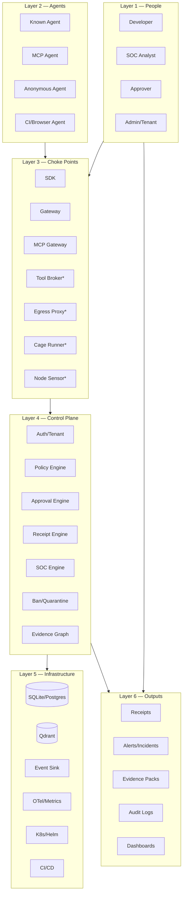
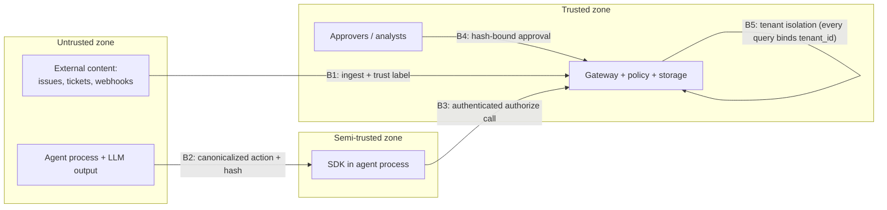

# Architecture Overview

**One sentence:** AegisAgent is built as a set of *choke points* around agents, backed by a deterministic control plane, with every decision leaving tamper-evident evidence.

**Mental model:** think of an airport. Agents are travelers; tools, APIs, networks, and secrets are the gates. Aegis doesn't scan the whole city — it makes the gates the only way through, checks identity and intent at each gate, requires a supervisor's signature for dangerous cargo (bound to the *exact* cargo manifest), and keeps a tamper-evident log of every crossing. A traveler who avoids the gates never gets a boarding pass: unknown = denied.

---

## 1. The layers

`*` = designed, not yet implemented (see [Implementation_Status.md](Implementation_Status.md)). This diagram is generated from the same metadata as the [interactive explorer](explorer/index.html): [architecture-map.json](architecture-map.json).

## 2. The eleven choke points

The security claim is scoped and honest: **Aegis controls what passes through Aegis choke points; anything outside them is treated as hostile and is isolated, blocked, killed, or banned.**

| # | Choke point | What passes through | Status | Enforced by |
|---|---|---|---|---|
| 1 | Prompt / model call | prompts, completions, tool proposals | 📐 planned (Phase 7) — untrusted-content ingest exists today (`POST /v1/ingest`) | [components/Prompt_Model_Capture.md](components/Prompt_Model_Capture.md) |
| 2 | Tool call | every SDK-wrapped tool invocation | ✅ | SDK `@protect_tool` → `POST /v1/authorize` → `lib/decision` pipeline |
| 3 | API call | generic registered skills/actions | ✅ | same authorize path, action registry |
| 4 | MCP call | MCP server/tool invocations | ✅ | `src/src/routes/mcp.rs` — manifest pinning + drift |
| 5 | Network egress | caged workload traffic | 📐 planned (Phase 5) | [components/Egress_Proxy.md](components/Egress_Proxy.md) |
| 6 | Filesystem / workspace | sandbox workspace only, no host FS | 📐 planned (Phase 4) | [AegisAgent_Agent_Cage.md](AegisAgent_Agent_Cage.md) |
| 7 | Process execution | spawn/exec inside the cage | 📐 planned (Phases 3–4) | [components/Node_Sensor.md](components/Node_Sensor.md) |
| 8 | Secret access | brokered credentials, never raw | 📐 planned (Phase 6) | [components/Tool_Broker.md](components/Tool_Broker.md) |
| 9 | Approval | human sign-off on frozen action hash | ✅ | `src/src/routes/approval.rs` |
| 10 | Runtime control | freeze/quarantine/revoke (✅); signed kill-commands to sensors (📐) | 🟡 | `src/src/routes/agents.rs`, [AegisAgent_Control_Command_Protocol.md](AegisAgent_Control_Command_Protocol.md) |
| 11 | Receipt / evidence | every protected decision | ✅ | `src/src/routes/receipts.rs`, `src/src/sign.rs` |

**What can bypass Aegis, and the response:** a known agent that skips the SDK simply has no valid decision — high-risk/mutating actions fail closed at the SDK, and unregistered agents/tools are denied by default at the gateway. An unknown agent that won't cooperate is (by design) only ever run inside the cage, where the choke points are the environment itself. Anything observed operating outside the choke points is a detection signal, not a supported path: the SOC's answer is freeze → quarantine → revoke → ban.

## 3. Two-plane principle

- **Inline decision plane (synchronous, target < 75 ms):** authorize → Cedar → decision → receipt append → respond. Hot-path caches (`SkillActionCache`, `RiskWeightsCache`, replay-nonce LRU) only ever cache *registration metadata*, never decisions.
- **Async SOC plane (out-of-band):** `EventSink` (`lib/soc/src/events.rs`) → ingest → detect → correlate → respond. Detection latency never delays agent execution, and SOC failures never change an inline decision.

## 4. Trust provenance (the confused-deputy defense)

Six deterministic source-trust levels, defined in [cedar policy authoring skill](https://github.com/lavkushry/AegisAgent/blob/main/.claude/rules/cedar_policy_authoring.md) and enforced by `lib/policy/src/trust_chain.rs`:

`trusted_internal_signed` → `trusted_internal_unsigned` → `semi_trusted_customer` → `untrusted_external` → `malicious_suspected` → `unknown` (unlabeled = untrusted).

Rules that make it deterministic:

1. Labels are assigned at ingestion (`POST /v1/ingest`) from the *channel*, not the text.
2. Classifiers/heuristics may only **tighten** a label, never loosen it.
3. Across agent hops, the effective label is the **most restrictive seen anywhere upstream** (`trust_chain::propagate`).
4. Cedar gates on the label: e.g. mutating actions from `untrusted_external` are forbidden outright; from `semi_trusted_customer`/`unknown` they require approval.

## 5. Trust boundaries (where the security lines are)

Key subtlety at **B2**: the SDK runs *inside* the agent process, so it is not a trust anchor against a malicious host — it is a fail-closed *cooperating* enforcement point. The gateway never trusts SDK claims it can't verify (hashes are recomputed server-side; approvals are consumed server-side, atomically). Full adversarial analysis: [AegisAgent_Threat_Model.md](AegisAgent_Threat_Model.md).

## 6. Fail-closed paths (the invariants)

| Situation | Behavior |
|---|---|
| Unknown agent / tool / MCP server / MCP tool | **deny** |
| Critical risk | **deny**; high risk | **require approval** |
| Action hash mismatch vs. approval | SDK refuses to execute |
| Approval expired / already consumed | refuse (consume is single-use, atomic) |
| Gateway unreachable (mutating/high-risk call) | SDK refuses to execute |
| Banned / quarantined / deleted agent authenticates | 401/deny (`get_agent_by_token` excludes them) |
| `AEGIS_DB_ENCRYPTION_KEY` set but binary lacks sqlcipher | startup **fails** |
| Policy bundle endpoint without signing key | 501 for every request |
| Invalid/unsigned/expired/replayed control command (designed) | sensor rejects |

Full catalogue with failure modes: [fail-closed-behavior.md](fail-closed-behavior.md).

## 7. Key data structures

- **Canonical action** — `aegis-jcs-1` JSON (Unicode-sorted keys, compact separators, raw UTF-8, non-finite floats rejected); `src/canon/`; parity locked by `tests/canonical_action_vectors.json`.
- **`action_hash`** — SHA-256 of the canonical action; the identity every approval and receipt binds to.
- **Decision** — authorize outcome (`allow` / `deny` / `require_approval` / `redact` / `quarantine`) + reason + risk + trust context (`decisions` table); evaluation in `lib/decision`.
- **Approval** — frozen action + `action_hash` + TTL + single-use consumption (`approvals` table).
- **Action receipt** — canonical body + `prev_receipt_hash` chain link + optional Ed25519 signature (`action_receipts` table); spec: [action-receipt-spec.md](action-receipt-spec.md).
- **SOC event / alert / incident** — async pipeline records with `EventEvidence` linkage.
- **Runtime event / agent run / control command / ban / quarantine record** — the runtime data-plane stores (migrations 0026–0030).

## 8. Where to go deeper

| Topic | Doc |
|---|---|
| Full component/file map | [Repo_Knowledge_Map.md](Repo_Knowledge_Map.md) |
| End-to-end story | [Last_Mile_System_Walkthrough.md](Last_Mile_System_Walkthrough.md) |
| High/low-level target design | [AegisAgent_World_Class_HLD.md](AegisAgent_World_Class_HLD.md) / [AegisAgent_World_Class_LLD.md](AegisAgent_World_Class_LLD.md) |
| Every flow, step by step | [flows/](flows/Known_Agent_Flow.md) |
| What's real vs. designed | [Implementation_Status.md](Implementation_Status.md) |
| All diagrams | [AegisAgent_Diagram_Index.md](AegisAgent_Diagram_Index.md) |
