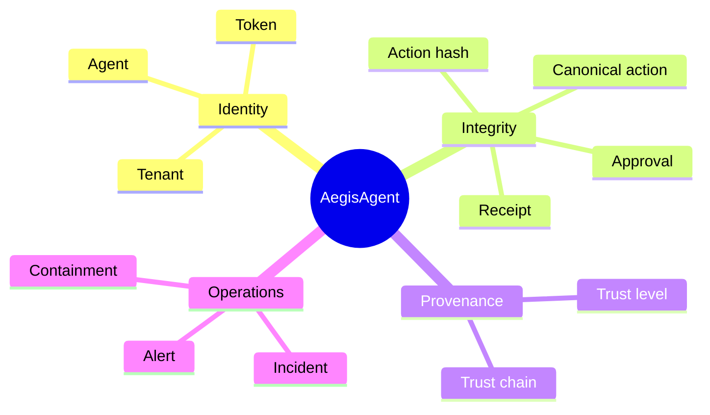

# Glossary

Shared vocabulary for AegisAgent. Terms link to the doc that owns them.

## Overview

Use this page when a product, security, API, or operations term is unfamiliar. The short definition supports first-time readers; the technical definition preserves exact implementation meaning.

> **Status:** Terms reflect the current architecture. Capability status remains authoritative in [Implementation Status](Implementation_Status.md).

## Why This Exists

Security controls fail when teams use the same word for different things—for example, treating an approval status as an executable permission or treating an advisory score as an authorization decision. Shared vocabulary keeps product, code, runbooks, and customer claims aligned.

The map groups terms by the job they perform: identify the actor, preserve exact action identity, track the source of influence, and operate the resulting evidence.

## Usage Example

“The **decision** required an **approval** bound to the **action hash**. The SDK atomically **consumed** it, and the resulting **receipt** linked to the tenant's previous receipt hash.”

## Key terms, two ways

| Term | Simple | Technical |
|---|---|---|
| **Action hash** | A fingerprint of the exact action the agent wants to run. | A SHA-256 digest over the `aegis-jcs-1`-canonicalized action object, used to bind approval and execution. |
| **Receipt** | Proof that Aegis saw and recorded a decision or action. | A hash-chained, tenant-scoped evidence record generated from canonical event data, optionally Ed25519-signed. |
| **Fail closed** | If Aegis is unsure, the risky action does not run. | Security-sensitive execution defaults to deny/error when policy, approval, receipt, or gateway state cannot be verified. |
| **Approval** | A human says yes to one exact action, once. | A TTL-bounded record bound to an `action_hash`, consumed atomically exactly once before execution. |
| **Trust level** | A label saying how much we trust where content came from. | One of six deterministic source-provenance labels, assigned at ingestion by channel, tighten-only, propagated across agent hops. |
| **Control point (choke point)** | A door every agent action must pass through. | An enforced interception path (SDK, gateway, MCP gateway, approval, receipt; planned: broker/egress/cage/sensor) — the unit of Aegis's security claim. |

## Full glossary

| Term | Meaning |
|---|---|
| **Action** | A concrete thing an agent wants to do: `{tool, action, resource, parameters}`. |
| **`action_hash`** | SHA-256 of the canonicalized action — the identity that approvals and receipts bind to. |
| **`aegis-jcs-1`** | The canonical JSON scheme (Unicode-sorted keys, compact separators, raw UTF-8, non-finite floats rejected). Byte-identical across gateway and all SDKs. [ADR-0003](adr/0003-aegis-jcs-1-canonicalization.md) |
| **Agent (known)** | A cooperative agent integrated via SDK; registered, tokened, policy-governed. |
| **Agent (anonymous/unknown)** | An untrusted workload; target of the partial [Agent Cage](AegisAgent_Agent_Cage.md) runtime path. |
| **Agent Cage / cage runner** | Partial disposable sandbox system for unknown agents; complete sensor/egress/broker force paths remain unfinished. 🟡 |
| **Agent run** | A registered execution of an agent (`agent_runs`, `POST /v1/agent-cage/runs`). |
| **Approval** | A human decision bound to an `action_hash`; TTL-limited, single-use. [Approval Integrity](components/Approval_Engine.md) |
| **Approve-then-swap** | Attack where the action changes after approval; defeated by hash binding. |
| **ASE (Agent Security Event)** | Normalized event flowing through the SOC pipeline. [event-schema.md](event-schema.md) |
| **Ban** | Durable containment record (`agent_bans`) intended to gate future runs. 🟡 [Ban & Quarantine](flows/Ban_Quarantine_Flow.md) |
| **Cedar** | AWS's open-source policy language; AegisAgent's decision engine. [ADR-0001](adr/0001-cedar-policy-engine.md) |
| **Chain head** | The latest `receipt_hash` in a tenant's receipt chain (`GET /v1/receipts/chain-head`). |
| **Choke point** | A path agents *must* traverse for a capability (tool, network, secret…); the unit of Aegis's security claim. [Architecture Overview](Architecture_Overview.md) |
| **Confused deputy** | An agent tricked into using its authority for an attacker; countered by trust provenance. |
| **Consume** | The atomic, single-use act of redeeming an approval before execution. |
| **Control command** | Signed, tenant/target-bound, expiring, replay-protected instruction to a node sensor (kill/pause/quarantine…). 🟡 store / 📐 protocol. [Control Command Protocol](AegisAgent_Control_Command_Protocol.md) |
| **Decision** | The gateway's answer to an authorize call: `allow` / `deny` / `require_approval`, with reason and context. |
| **Deny-storm** | Burst of denials for one agent — a canonical detection. [runbook](runbooks/deny-storm.md) |
| **Egress proxy** | Partial network choke point for caged workloads; transparent forced integration remains unfinished. 🟡 [doc](components/Egress_Proxy.md) |
| **Evidence graph** | Linked structure connecting content → decisions → approvals → receipts → alerts → incidents. [evidence-graph.md](evidence-graph.md) |
| **Evidence pack** | Exportable compliance bundle (`GET /v1/compliance/evidence-pack`). |
| **Fail closed** | On any uncertainty (unknown entity, mismatch, expiry, unreachable dependency), refuse. [fail-closed-behavior.md](fail-closed-behavior.md) |
| **Freeze / quarantine / revoke** | The containment ladder on agent status; all enforced at authentication. |
| **Gateway** | The `aegis-gateway` binary: REST (:8080) + gRPC (:6334) control plane. |
| **Incident** | Correlated group of alerts with timeline and narrative. |
| **Inline plane / async plane** | The two-plane principle: synchronous decisions (<75 ms target) vs. out-of-band SOC. |
| **Manifest drift** | Change in an MCP server's pinned tool manifest; severity-classified alert. [MCP Gateway](components/MCP_Gateway.md) |
| **MCP** | Model Context Protocol — pluggable tool servers for agents. |
| **Node sensor** | Partial host-local telemetry and enforcement agent; real collectors remain incomplete. 🟡 [doc](components/Node_Sensor.md) |
| **Playbook** | Automated SOC response recipe (freeze/revoke/quarantine on conditions). |
| **Receipt (action receipt)** | Hash-chained, optionally Ed25519-signed record of a decision. [spec](action-receipt-spec.md) |
| **`prev_receipt_hash`** | The chain link: each receipt commits to its predecessor. |
| **Provenance / trust level** | One of six deterministic source-trust labels; tighten-only; gates authorization. |
| **Replay protection** | Nonce dedup (in-memory LRU or durable `replay_nonces` table) + timestamp staleness window on authorize. |
| **Run / `run_id`** | Correlation spine tying prompts, decisions, receipts, and events to one agent execution. |
| **SOC** | Security Operations Center — here, the agent-native async pipeline + console. [SOC Model](components/SOC_Engine.md) |
| **Tenant** | Isolation boundary; every query binds `tenant_id`. |
| **Tool broker** | Partial credential-isolation path; standalone packaging and mandatory privileged-tool routing remain incomplete. 🟡 [doc](components/Tool_Broker.md) |
| **Trust chain propagation** | Downstream hops inherit the most restrictive upstream trust label (`trust_chain::propagate`). |
| **Two-plane principle** | Decisions inline, monitoring async — SOC latency never delays agents, SOC failure never changes decisions. |

Statuses used across docs: ✅ implemented · 🟡 partial · 📐 planned/designed — authoritative list in [Implementation_Status.md](Implementation_Status.md).
