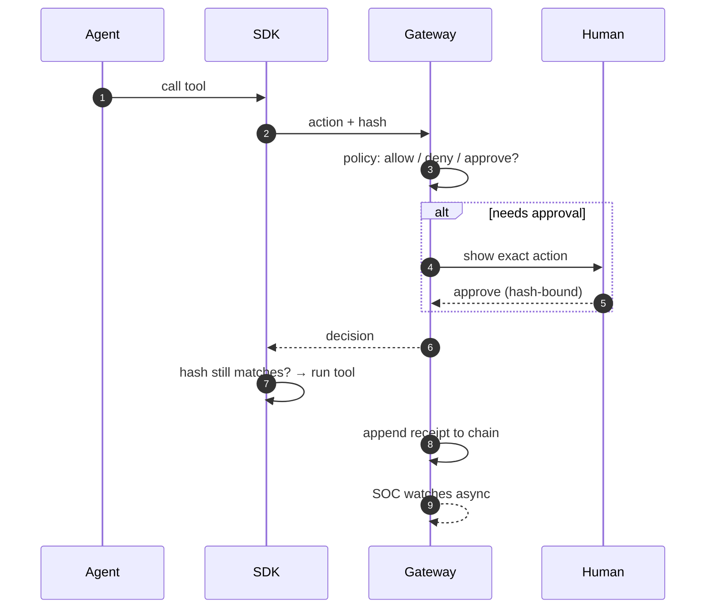

# How It Works

## Overview

An agent wants to act → Aegis checks the action → policy decides → a human approves if needed → the action runs only if it exactly matches what was approved → a receipt proves it → the SOC investigates patterns.

## Why it exists

Every control in Aegis exists to answer one of three questions: *Should this run?* (policy), *Did a human really approve this?* (approval integrity), *Can we prove what happened?* (receipts).

## How it works, step by step

1. **The agent wants to act.** Your code wrapped the tool with the SDK, so the call is intercepted before it runs.
2. **Aegis fingerprints the action.** The exact call (tool, action, parameters) is serialized in a canonical form and hashed — the **action hash**.
3. **Policy decides.** The gateway checks: is this agent known? is this tool registered? where did the triggering content come from (trust level)? how risky is it? Answer: **allow**, **deny**, or **require approval**.
4. **A human approves, if required.** The approver sees the exact frozen action. The approval binds to its hash, is single-use, and expires.
5. **Execution only on exact match.** The SDK consumes the approval and re-checks the hash. Changed action → refused. Gateway unreachable → refused (**fail closed**).
6. **A receipt proves it.** The decision is recorded in a hash chain — each record fingerprints the one before it. Tampering breaks the chain visibly.
7. **The SOC watches.** Denials, anomalies, and drift become alerts; alerts correlate into incidents; analysts (or playbooks) freeze, quarantine, or revoke the agent.

## Visual



## Technical details

- Canonical form is `aegis-jcs-1`, byte-identical across the gateway and all three SDKs (`src/canon/`, locked by `tests/canonical_action_vectors.json`).
- Policy is AWS Cedar with a third state (`require_approval`) via annotations; source trust has six deterministic levels that can only tighten (`lib/policy/src/trust_chain.rs`).
- Decisions happen inline (< 75 ms target); the SOC runs fully out-of-band, so monitoring never slows agents and SOC failure never changes a decision.
- Full depth: [flows/Known_Agent_Flow.md](flows/Known_Agent_Flow.md) and [Last_Mile_System_Walkthrough.md](Last_Mile_System_Walkthrough.md).

## Related code

`sdk-python/aegisagent/decorator.py` · `lib/decision/` · thin `routes/authorize.rs` · `lib/policy/src/cedar.rs` · `src/src/routes/approval.rs` · `src/src/routes/receipts.rs` · `lib/soc/src/detect.rs`

## Current status

This whole loop is **Implemented** for SDK-integrated agents. Runtime containment of non-integrated agents is **Planned/Partial** ([Implementation_Status.md](Implementation_Status.md)).

## What can go wrong

- Agent not wrapped by the SDK → Aegis never sees the call (coverage problem, not a bypass of a control).
- Huge approval TTLs → longer replay window. Keep them short.
- Custom clients that skip the consume step → you lose single-use protection. Use the SDKs.

## Related docs

[The_One_Minute_Tour.md](The_One_Minute_Tour.md) · [flows/Approval_Flow.md](flows/Approval_Flow.md) · [flows/Receipt_Flow.md](flows/Receipt_Flow.md) · [flows/SOC_Incident_Flow.md](flows/SOC_Incident_Flow.md) · [Architecture_Overview.md](Architecture_Overview.md)

## Try the Flow

```bash
make demo
```

Inspect the resulting audit events and receipt verification rather than relying only on terminal success text.
