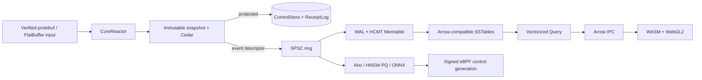

# AegisAgent Low-Level Design

**Status:** normative target contract; code snippets are skeletons, not shipped implementations

**Version:** 2.0-draft

**Last reviewed:** 2026-07-12

**HLD:** [../ARCHITECTURE.md](../ARCHITECTURE.md)

**Migration matrix:** [../MIGRATION_MATRIX.md](../MIGRATION_MATRIX.md)

## 1. Scope and terminology

This document defines the byte layouts, ownership rules, algorithms, traits, schemas, failure behavior, and acceptance tests for AegisAgent’s target data plane. RFC 2119 terms are normative.

- **MUST / MUST NOT:** required for correctness or the stated security contract.
- **SHOULD / SHOULD NOT:** required unless an accepted ADR records measured evidence for an exception.
- **Target:** not shipped until its test gate passes.
- **Protected action:** an action whose acknowledgement permits mutation, consumes approval, changes containment, or promises a durable receipt.
- **Normal event:** telemetry whose source retains a replay/spool copy or whose policy explicitly permits rejection.
- **Critical event:** integrity evidence that MUST be durable or MUST cause the protected action to fail closed.
- **Generation:** immutable, monotonically increasing version of policy/control/schema/index state.
- **Granule:** the minimum independently prunable and timestamp-decodable HCMT row group.

## Why this exists

The current implementation mixes protocol adaptation, policy orchestration, transactional rows, telemetry batching, detection and UI projections across shared Tokio/JSON/SQL paths. A performance rewrite without a byte-level contract would replace visible bottlenecks with ambiguous ownership, unrecoverable formats, or weakened approval durability. This LLD makes every ownership transfer, consistency class, bounded resource, on-disk byte, schema generation, copy and failure outcome reviewable before implementation.



## 2. Constants and hard limits

Defaults are starting values for qualification, not magic universal optimums.

```rust
pub const CACHE_LINE_BYTES: usize = 64;
pub const RING_CAPACITY: usize = 1 << 16;          // 65,536 descriptors
pub const MAX_FRAME_BYTES: usize = 1 << 20;        // 1 MiB
pub const MAX_ACTION_BYTES: usize = 64 << 10;      // 64 KiB
pub const MAX_STRING_BYTES: usize = 16 << 10;      // 16 KiB
pub const MAX_VECTOR_DIM: usize = 4_096;
pub const GRANULE_ROWS: usize = 8_192;
pub const MEMTABLE_TARGET_ROWS: usize = 262_144;
pub const MEMTABLE_TARGET_BYTES: usize = 64 << 20; // 64 MiB
pub const L0_COMPACT_TRIGGER: usize = 8;
pub const LEVEL_SIZE_RATIO: usize = 10;
pub const WAL_GROUP_MAX_RECORDS: usize = 256;
pub const WAL_GROUP_MAX_DELAY_US: u64 = 200;
pub const QUERY_VECTOR_ROWS: usize = 1_024;
pub const ARROW_BATCH_TARGET_ROWS: usize = 16_384;
pub const UI_MAX_IN_FLIGHT_BATCHES: u32 = 4;
```

Every externally supplied length MUST be checked before allocation, multiplication, offset addition, decompression, or FlatBuffer/Arrow traversal. Checked arithmetic is mandatory.

## 3. Target module hierarchy

```text
lib/
├── common/src/{error,id,limits,time,tenant}.rs
├── canon/src/{v1_json,v2_typed,corpus}.rs
├── wire/
│   ├── proto/{control,telemetry,query}.proto
│   ├── fbs/{event,segment,manifest,stream}.fbs
│   ├── arrow/{event_schema,query_schema}.rs
│   └── src/{verify,convert,version}.rs
├── crypto/src/{action_hash,receipt,ed25519,checkpoint}.rs
├── policy/src/{cedar,compiler,snapshot,trust}.rs
├── event/src/{descriptor,ring,slab,epoch,priority}.rs
├── reactor/src/{core,affinity,uring,listener,admission,deadline}.rs
├── decision/src/{authorize,approval,snapshot,publish,service}.rs
├── control-store/src/{traits,sqlite,postgres,receipt_log}.rs
├── hcmt/src/{wal,memtable,segment,gorilla,bitmap,bloom,manifest,compact,recover}.rs
├── query/src/{plan,prune,scan,aggregate,arrow_out,text,vector}.rs
├── guardrails/src/{normalize,aho,hnsw,pq,onnx,correlate}.rs
├── containment/src/{command,bpf_maps,policy_generation}.rs
└── soc/src/{pipeline,detect,respond,projection}.rs
```

Protocol adapters live in binaries. No `axum`, `tonic::Request`, WebSocket, SQL row, or browser type is allowed in the service traits below.

## 4. Reactor ownership model

### 4.1 Thread topology

At startup, the launcher discovers online physical cores and NUMA nodes, applies an explicit role map, and starts named OS threads:

```text
core 0                 control coordinator / admin compatibility
core 1                 metrics, KMS, webhooks, background jobs
cores 2..(2+I-1)       ingress + decision CoreReactors
next W cores           HCMT WAL/memtable writers
next Q cores           query reactors
next G cores           guardrail/inference reactors
remaining reserved     compaction, replication, OS/IRQ headroom
```

SMT siblings MUST NOT both host latency-critical reactors unless a benchmark proves the selected workload improves. IRQs and NIC queues SHOULD be affined to the same NUMA node as their ingress reactors but not to the same physical core.

### 4.2 CoreReactor skeleton

```rust
use std::{collections::HashMap, io, sync::Arc, time::Instant};

use aegis_common::{AegisError, TenantId};
use aegis_event::{Producer, TelemetryDescriptor};
use aegis_policy::TenantPolicySnapshot;
use io_uring::IoUring;

pub struct ReactorConfig {
    pub core_id: usize,
    pub numa_node: usize,
    pub queue_depth: u32,
    pub max_in_flight: usize,
}

/// Mutable fields are touched only by the pinned owner thread.
pub struct CoreReactor {
    cfg: ReactorConfig,
    ring: IoUring,
    snapshots: HashMap<TenantId, Arc<TenantPolicySnapshot>>,
    telemetry: Vec<Producer<TelemetryDescriptor>>,
    in_flight: usize,
    now: Instant,
}

impl CoreReactor {
    pub fn new(cfg: ReactorConfig) -> Result<Self, AegisError> {
        let ring = IoUring::new(cfg.queue_depth).map_err(AegisError::Io)?;
        Ok(Self {
            cfg,
            ring,
            snapshots: HashMap::new(),
            telemetry: Vec::new(),
            in_flight: 0,
            now: Instant::now(),
        })
    }

    pub fn run(mut self) -> Result<(), AegisError> {
        loop {
            self.drain_control_mailbox()?;
            self.poll_network()?;
            self.flush_submissions()?;
            self.reap_completions()?;
            self.enforce_deadlines()?;
        }
    }

    fn drain_control_mailbox(&mut self) -> Result<(), AegisError> {
        // Apply complete immutable generations only at a reactor safe point.
        Ok(())
    }

    fn poll_network(&mut self) -> Result<(), AegisError> { Ok(()) }
    fn flush_submissions(&mut self) -> Result<(), AegisError> { Ok(()) }
    fn reap_completions(&mut self) -> Result<(), AegisError> { Ok(()) }
    fn enforce_deadlines(&mut self) -> Result<(), AegisError> { Ok(()) }
}

pub fn spawn_reactor(cfg: ReactorConfig) -> io::Result<std::thread::JoinHandle<Result<(), AegisError>>> {
    std::thread::Builder::new()
        .name(format!("aegis-reactor-{}", cfg.core_id))
        .spawn(move || {
            if !core_affinity::set_for_current(core_affinity::CoreId { id: cfg.core_id }) {
                return Err(AegisError::Affinity(cfg.core_id));
            }
            CoreReactor::new(cfg)?.run()
        })
}
```

This skeleton intentionally contains no `tokio::spawn`, blocking lock, or detached task. Real io_uring operations MUST use generation-tagged user data so a stale completion cannot access a recycled request slot.

### 4.3 Request placement

An accepted connection remains on its ingress core. Immutable tenant snapshots are replicated to all decision cores, so ordinary evaluation does not require a cross-core hop. Ordered state transitions—approval consumption, replay claims, receipt-chain append, and control mutation—are rendezvous-hashed to a tenant-affine control writer. Telemetry is hashed to a NUMA-local HCMT writer by `(tenant_id, time_partition)`.

The routing generation is included in internal messages. A receiver MUST reject a message for an obsolete generation with a retryable relocation response; it MUST NOT apply it twice.

### 4.4 Admission

Admission is a reactor-local counter and byte budget. Permits are acquired before body growth or canonicalization. The response is `RESOURCE_EXHAUSTED`/HTTP 429 with bounded retry metadata. A mutating SDK treats admission failure as fail closed.

## 5. Disruptor-style SPSC ring

**Implementation status:** `lib/event` contains `current`, unwired prototypes
governed by Proposed ADR-0006 through ADR-0008. The ring implements
non-cloneable owning endpoints, checked capacity, modular wrap, closure/drain
semantics, unread-value destruction, and cache-layout assertions. The safe
sealed-page reference provides bounded layout, exact descriptor membership,
CRC32C, and immutable page-level lifetime. The append-only page uses
Release/Acquire to publish one packed descriptor-count, byte-watermark, and
closure state, then immediately resolves immutable prefix views while its
writer appends to a disjoint suffix. Evidence includes a safe sealed
differential corpus, native stress, the same publication algorithm under Loom,
full Miri, defined ASan/TSan CI lanes, and a zero-allocation append-plus-resolve
test. These
prototypes carry no production or protected-evidence traffic, are neither
`shadow` nor `qualified`, and make no performance claim. ADR acceptance and
security review, green sanitizer CI artifacts, composite ring reservation/admission, authenticated registry
lookup, bounded page rotation and outstanding pages, generation reuse and
epochs, NUMA-owner reclamation, production shadow wiring, UBSan support, and
qualification remain `target` gates.

### 5.1 Memory layout

```rust
use std::{
    cell::UnsafeCell,
    mem::MaybeUninit,
    sync::atomic::{AtomicU64, Ordering},
};

#[repr(align(64))]
struct PaddedSequence(AtomicU64);

struct Slot<T>(UnsafeCell<MaybeUninit<T>>);

pub struct SpscRing<T, const N: usize> {
    published_head: PaddedSequence, // written by producer, read by consumer
    consumed_tail: PaddedSequence,  // written by consumer, read by producer
    slots: Box<[Slot<T>; N]>,
}

pub struct Producer<'a, T, const N: usize> {
    ring: &'a SpscRing<T, N>,
    next: u64,
    cached_tail: u64,
}

pub struct Consumer<'a, T, const N: usize> {
    ring: &'a SpscRing<T, N>,
    next: u64,
    cached_head: u64,
}

// Safety requires exactly one Producer and exactly one Consumer, T: Send,
// endpoints joined before ring drop, and slot reuse only after tail advance.
unsafe impl<T: Send, const N: usize> Sync for SpscRing<T, N> {}
unsafe impl<T: Send, const N: usize> Send for SpscRing<T, N> {}

impl<'a, T, const N: usize> Producer<'a, T, N> {
    pub fn try_push(&mut self, value: T) -> Result<(), T> {
        debug_assert!(N.is_power_of_two());
        if self.next.wrapping_sub(self.cached_tail) == N as u64 {
            self.cached_tail = self.ring.consumed_tail.0.load(Ordering::Acquire);
            if self.next.wrapping_sub(self.cached_tail) == N as u64 {
                return Err(value);
            }
        }
        let index = (self.next as usize) & (N - 1);
        // SAFETY: the producer exclusively owns this unconsumed slot.
        unsafe { (*self.ring.slots[index].0.get()).write(value) };
        self.next = self.next.wrapping_add(1);
        self.ring.published_head.0.store(self.next, Ordering::Release);
        Ok(())
    }
}

impl<'a, T, const N: usize> Consumer<'a, T, N> {
    pub fn try_pop(&mut self) -> Option<T> {
        if self.next == self.cached_head {
            self.cached_head = self.ring.published_head.0.load(Ordering::Acquire);
            if self.next == self.cached_head {
                return None;
            }
        }
        let index = (self.next as usize) & (N - 1);
        // SAFETY: Acquire observed publication; consumer exclusively reads slot.
        let value = unsafe { (*self.ring.slots[index].0.get()).assume_init_read() };
        self.next = self.next.wrapping_add(1);
        self.ring.consumed_tail.0.store(self.next, Ordering::Release);
        Some(value)
    }
}
```

The condensed skeleton shows the cursor ordering, not the complete public API.
The current prototype uses setup-only `Arc` ownership so endpoints can move to
independent threads while final destruction waits for both endpoints. It has
constructor endpoint uniqueness, wraparound, shutdown/drop, Loom, native
stress, cache-layout tests, Miri coverage, and defined ASan/TSan CI lanes. Green
CI artifacts remain required. UBSan is unavailable in the current Rust
toolchain; supported qualification evidence remains mandatory before production
wiring. This snippet is not permission to copy unreviewed unsafe code.

### 5.2 Descriptor ABI

```rust
#[repr(C, align(32))]
#[derive(Clone, Copy)]
pub struct TelemetryDescriptor {
    pub sequence: u64,
    pub arena_generation: u32,
    pub arena_id: u16,
    pub flags: u16,
    pub offset: u32,
    pub len: u32,
    pub crc32c: u32,
    pub schema_id: u32,
}
```

The descriptor is exactly 32 bytes. Payload bytes reside in a NUMA-local slab. `offset + len` uses checked arithmetic and MUST remain within the referenced immutable page. CRC32C covers the complete FlatBuffer payload. The descriptor’s sequence is monotonic per producer.

#### Current sealed-page reference implementation

The current, unwired `SlabPageBuilder` is a safe ownership oracle, not the
target concurrent slab. It bounds one page to 64 MiB, one descriptor table to
65,536 entries, and each frame to 1 MiB. Successful append copies the caller's
already-verified bytes once into pre-reserved storage and performs no buffer
growth. Descriptors stay private until `seal(self)` consumes the only mutable
owner. Sealing moves the pre-reserved vectors behind one page-level `Arc`; this
allocates page metadata but does not copy payload bytes. The ring then transfers
only 32-byte descriptors.

Resolution checks arena ID, generation, non-zero length, and exact membership
in the sealed descriptor table before that canonical entry can select bytes.
It then checks the range against the used prefix and CRC32C before returning a
borrowed slice. CRC32C is `O(n)` corruption detection, not
authentication or FlatBuffer verification. The reference withholds a page's
descriptors until seal, so it neither overlaps producer/consumer work nor meets
the target immediate-publication flow. Outstanding-page budgets, bounded flush
latency, authenticated routing scope, generation reuse/wrap, epoch retirement,
NUMA ownership, and owner-thread destruction remain production blockers.

#### Current append-only published-prefix prototype

The `current`, unwired `PublishedSlabPage` consumes one setup handle into
exactly one non-cloneable writer and reader. Its fixed payload and descriptor
cell arrays never resize. A successful append copies one caller-provided,
upstream-verified and redacted slice into a never-written suffix, initializes
its canonical descriptor, and then Release-stores a cache-line-aligned packed
state containing descriptor count, byte watermark, and writer closure. That
store is the append linearization point; the descriptor is not returned before
it completes.

Resolution Acquire-loads one coherent state, rejects invalid reserved bits or
a sequence outside the published count, requires exact equality with the
canonical descriptor cell, checks its range against the published byte
watermark, and verifies CRC32C before returning a native borrowed view. Later
appends touch only the disjoint unpublished suffix. The shipping append and
resolve operations allocate nothing after construction; Loom exercises the
same publication algorithm but uses a disclosed model-only copy because a
borrow cannot escape its checked-cell guard.

This closes only the within-page publication gap. The production fabric
remains `target`, neither `shadow` nor `qualified`, and has no performance
result. ADR acceptance and security review, atomic reservation across page
bytes and the descriptor ring, bounded page rotation and outstanding-page
admission, authenticated lookup, generation reuse with epoch retirement,
NUMA-owner reclamation, production shadow wiring, UBSan coverage when the
toolchain supports it, and qualification remain blockers.

### 5.3 Priority and fairness

Critical and normal traffic use separate rings and slab budgets. Writer polling uses deficit round robin:

```text
deficit[p] += quantum[p]
while head_cost[p] <= deficit[p] and work < poll_budget:
    consume(p)
    deficit[p] -= head_cost[p]
```

Critical traffic has reserved WAL and ring capacity but a finite quota; it cannot starve control completions forever. Tenant quotas apply within each producer stream.

### 5.4 Memory reclamation

Ring slots are reclaimed by the consumer sequence. Slab pages, query snapshots, and manifest generations can outlive a slot and use epoch retirement:

1. reader pins an epoch before resolving the page/generation pointer;
2. publisher atomically installs a complete new pointer;
3. old object is retired, never mutated;
4. reclamation occurs after every pinned reader predating retirement unpins.

Epoch pinning MUST NOT span network awaits, disk waits, or user think time.

## 6. Immutable decision snapshots

```rust
pub struct TenantPolicySnapshot {
    pub tenant_id: TenantId,
    pub generation: u64,
    pub agents_by_token_hash: FrozenHashMap<TokenHash, AgentFacts>,
    pub agents_by_mtls_cn: FrozenHashMap<MtlsCn, AgentFacts>,
    pub tool_actions: AdaptiveRadixTree<ToolActionFacts>,
    pub policy_set: cedar_policy::PolicySet,
    pub aho_generation: u64,
    pub emergency_epoch: u64,
    pub expires_mono_ns: u64,
}
```

An Adaptive Radix Tree lookup is `O(k)` in key bytes, independent of the number of keys in trie height; cache behavior still depends on node layout. The implementation MAY use a different frozen index if benchmark and memory results are superior.

Snapshot publication protocol:

1. validate and transactionally commit new control state and generation;
2. compile Cedar and deterministic guardrails off reactor cores;
3. build a complete immutable snapshot;
4. send the same content hash and generation to every decision reactor;
5. each reactor installs it at a safe point and acknowledges;
6. coordinator declares active after the configured quorum/all-replica rule;
7. emergency revocation fails closed on reactors that have not acknowledged by deadline.

A request reads exactly one generation. Mixing agent facts from generation `g` with policy `g+1` is forbidden.

## 7. Typed authorization service

```rust
pub trait AuthorizeService {
    fn authorize(
        &mut self,
        ctx: &AuthenticatedContext,
        request: &AuthorizeCommand,
        deadline: Deadline,
    ) -> Result<AuthorizeOutcome, AegisError>;
}

pub struct AuthorizeOutcome {
    pub decision: Decision,
    pub action_hash: [u8; 32],
    pub policy_generation: u64,
    pub reason_code: ReasonCode,
    pub approval: Option<ApprovalRef>,
    pub receipt: Option<ReceiptRef>,
}
```

The service performs the following fixed sequence:

1. verify authenticated tenant/agent binding and sizes;
2. normalize identifiers using the versioned normalization contract;
3. compute inherited trust with tighten-only lattice join;
4. construct the exact post-admission action;
5. produce `aegis-jcs-1` bytes and SHA-256 action hash;
6. evaluate Cedar against one snapshot generation;
7. apply deterministic monotonic overrides (`deny`/`quarantine`/`require_approval`, never `allow`);
8. classify durability;
9. for protected paths, execute one tenant-affine control transaction that commits state and receipt;
10. publish telemetry descriptor or protected WAL reference;
11. return typed outcome.

REST and gRPC adapters only convert types and errors. They MUST NOT call one another.

### 7.1 Cryptographic byte contract

The migration preserves current cryptographic inputs exactly:

```text
action_hash_v1  = SHA-256(UTF-8(aegis-jcs-1(exact Action object)))
receipt_hash_v0 = SHA-256(UTF-8(aegis-jcs-1(receipt body without receipt_hash)))
receipt_sig_v0  = Ed25519.Sign(UTF-8(lowercase receipt_hash text))
```

The receipt chain body includes `prev_receipt_hash`; therefore changing any prior receipt changes every later verified link. Current command signatures cover the versioned canonical command bytes defined by the control-command contract. The code MUST NOT silently switch a signature from lowercase hash text to raw 32-byte digest, add a prefix, alter null/absent fields, or change canonical numeric rendering. Domain separation or a typed v2 canonical form requires a new scheme identifier, dual verification, cross-language golden vectors, migration and rollback.

## 8. Control-store traits

The current 245-method `StorageBackend` is decomposed by consistency contract:

```rust
pub trait ControlStore: Send + Sync + 'static {
    fn load_snapshot_input(&self, tenant: &TenantId, generation: u64)
        -> ControlFuture<SnapshotInput>;
    fn claim_replay_nonce(&self, claim: ReplayClaim)
        -> ControlFuture<ReplayClaimed>;
    fn consume_approval_and_append_receipt(&self, command: ConsumeApproval)
        -> ControlFuture<ProtectedCommit>;
    fn commit_protected_decision(&self, command: ProtectedDecision)
        -> ControlFuture<ProtectedCommit>;
    fn publish_control_generation(&self, command: ControlMutation)
        -> ControlFuture<ControlGeneration>;
}

pub trait ReceiptLog: Send + Sync + 'static {
    fn append(&self, tenant: &TenantId, receipt: CanonicalReceipt)
        -> ControlFuture<ReceiptRef>;
    fn verify_range(&self, tenant: &TenantId, range: ReceiptRange)
        -> ControlFuture<Verification>;
    fn checkpoint(&self, tenant: &TenantId, segment_root: [u8; 32])
        -> ControlFuture<SignedCheckpoint>;
}

pub trait EventStore: Send + Sync + 'static {
    fn publish(&self, descriptor: TelemetryDescriptor) -> Result<(), PublishError>;
    fn query(&self, request: QueryPlan, output: &mut dyn ArrowBatchSink)
        -> Result<QueryStats, AegisError>;
}
```

`ControlFuture` is a bounded, deadline-aware completion handle; it is not an `async_trait` allocation requirement. Concrete adapters may use async internally on reserved control cores.

## 9. HCMT overview

HCMT is a leveled, immutable, columnar merge tree optimized for time-partitioned security events.

```text
producer frames
  -> protected/normal WAL
  -> mutable SoA memtable
  -> sealed immutable Arrow buffers
  -> L0 overlapping segments
  -> leveled non-overlapping L1..Ln segments
  -> object-store/checkpoint replication where configured
```

Append to a preallocated memtable is amortized `O(1)`. Segment lookup first prunes by partition, time zone map, categorical bitmap/Bloom filters, and only then decodes projected data.

### 9.1 Partition and sort key

```text
partition = (tenant_shard, UTC_hour)
sort_key  = (tenant_id, ts_wall_ns, source_sequence, event_id_hi, event_id_lo)
```

Tenant shard uses a keyed, versioned routing hash; the key prevents an external tenant identifier from controlling directory distribution. The full authenticated tenant ID remains in every logical row and index boundary.

### 9.2 Logical Arrow event schema

| Field | Arrow logical type | Encoding/index |
|---|---|---|
| `tenant_id` | fixed-size binary(16) or dictionary utf8 | partition constant + equality check |
| `event_id` | fixed-size binary(16) | Bloom + optional ART/FST |
| `ts_wall_ns` | timestamp(ns, UTC) | Gorilla delta-of-delta sidecar + min/max |
| `ts_mono_ns` | uint64 | delta bit-pack |
| `source_sequence` | uint64 | delta bit-pack |
| `event_type` | dictionary(uint16, utf8) | Roaring bitmap |
| `severity` | uint8 enum | Roaring bitmap |
| `agent_id` | dictionary(uint32, utf8) | Roaring for frequent values, Bloom otherwise |
| `run_id`, `trace_id` | fixed-size binary(16), nullable | Bloom + sparse index |
| `source_component` | dictionary(uint16, utf8) | Roaring bitmap |
| `trust` | uint8 enum | Roaring bitmap |
| `decision` | uint8 enum | Roaring bitmap |
| `action_hash`, `receipt_hash` | fixed-size binary(32), nullable | Bloom + exact verification |
| `policy_generation` | uint64 | delta/RLE |
| `schema_version` | uint16 | RLE |
| `redaction_flags` | uint32 | bit-pack |
| `payload_ref` | struct(offset:uint32,len:uint32,codec:uint8) | points to bounded blob column |

Raw prompts, secrets, credentials, and unrestricted tool output are not part of this schema.

## 10. HCMT memtable

Arrow arrays are immutable; the mutable form is a structure of preallocated builders whose buffers transfer ownership at seal.

```rust
use arrow_array::{
    builder::{BinaryBuilder, PrimitiveBuilder, StringDictionaryBuilder},
    types::{UInt16Type, UInt32Type, UInt64Type},
    RecordBatch,
};

pub struct HcmtMemtable {
    partition: PartitionKey,
    rows: usize,
    estimated_bytes: usize,
    ts_wall_ns: Vec<i64>,
    ts_mono_ns: PrimitiveBuilder<UInt64Type>,
    source_sequence: PrimitiveBuilder<UInt64Type>,
    event_type: StringDictionaryBuilder<UInt16Type>,
    agent_id: StringDictionaryBuilder<UInt32Type>,
    decision: PrimitiveBuilder<UInt16Type>,
    payload: BinaryBuilder,
    // Remaining fixed/hash fields omitted from the skeleton only.
}

impl HcmtMemtable {
    pub fn append(&mut self, event: VerifiedEventView<'_>) -> Result<SealState, AegisError> {
        event.validate_partition(self.partition)?;
        self.ts_wall_ns.push(event.ts_wall_ns());
        self.ts_mono_ns.append_value(event.ts_mono_ns());
        self.source_sequence.append_value(event.source_sequence());
        self.event_type.append(event.event_type())?;
        self.agent_id.append(event.agent_id())?;
        self.decision.append_value(event.decision() as u16);
        self.payload.append_value(event.redacted_payload());
        self.rows += 1;
        self.estimated_bytes = self.estimated_bytes.saturating_add(event.estimated_bytes());
        Ok(self.seal_state())
    }

    pub fn seal(self, schema: std::sync::Arc<arrow_schema::Schema>)
        -> Result<SealedMemtable, AegisError>
    {
        // Transfer finished buffers when already ordered. Otherwise compute one
        // stable sort-key permutation and apply it column-wise; count copied bytes.
        // Encode timestamps by granule only after final row order is known.
        SealedMemtable::from_builders(self, schema)
    }

    fn seal_state(&self) -> SealState {
        if self.rows >= MEMTABLE_TARGET_ROWS || self.estimated_bytes >= MEMTABLE_TARGET_BYTES {
            SealState::Seal
        } else {
            SealState::Continue
        }
    }
}
```

No `serde_json::Value` is allowed in the memtable. Variable payloads enter as verified, redacted bytes with a declared codec and size.

### 10.1 Double buffering

Each writer owns one active memtable and at least one empty spare. Sealing swaps pointers in `O(1)` and writes the sealed table asynchronously on the writer/flush pipeline. If no spare exists and WAL debt exceeds its bound, normal ingestion is throttled/rejected; protected evidence uses its reserve or fails closed.

## 11. WAL physical format

All integers are little-endian. Files start on a 4 KiB boundary.

### 11.1 File header (64 bytes)

| Offset | Size | Field |
|---:|---:|---|
| 0 | 8 | magic `AEGWAL02` |
| 8 | 2 | format version |
| 10 | 2 | header length = 64 |
| 12 | 4 | writer ID |
| 16 | 8 | routing generation |
| 24 | 8 | first sequence |
| 32 | 16 | partition UUID |
| 48 | 8 | creation wall time ns |
| 56 | 4 | flags |
| 60 | 4 | CRC32C of bytes 0..60 |

### 11.2 Record

```text
u32 record_len
u16 record_type
u16 flags
u64 sequence
u64 source_sequence
u32 schema_id
u32 payload_len
u32 crc32c(type..payload)
u32 reserved
u8  payload[payload_len]
u8  padding[to 8-byte alignment]
```

`record_len` includes the fixed record header, payload, and padding but excludes its own four bytes. `payload_len <= MAX_FRAME_BYTES`. A record is accepted only when length, type, sequence, schema, FlatBuffer verification, and CRC all pass.

### 11.3 Durability classes

| Class | Acknowledgement point |
|---|---|
| `Protected` | control transaction and protected WAL/receipt durability complete |
| `CriticalTelemetry` | `fdatasync` group containing record completes, or action fails closed |
| `ReplayableTelemetry` | copied into process-owned WAL buffer; source retains until batch ACK |
| `BestEffortDerived` | ring publication; may be recomputed from durable source |

Protected/critical group commit closes at `min(256 records, 200 µs, earliest deadline)`. The actual sync p99 is a hardware qualification metric. `SQPOLL` and `O_DIRECT` are optional, privileged/complex optimizations requiring an ADR and benchmark; the baseline uses registered files/buffers with explicit `fdatasync`.

### 11.4 Recovery

Recovery scans from the last manifest checkpoint, validates each record, and stops at the first incomplete or invalid tail. It MUST NOT skip arbitrary bytes looking for a plausible record; that can transform corruption into fabricated order. A corrupted interior record quarantines the WAL and raises an integrity incident. Replayed event IDs are deduplicated per partition.

## 12. HCMT segment layout

An SSTable is a directory published atomically by manifest reference:

```text
segments/<segment-id>/
├── meta.fbs             # checksummed segment metadata and file hashes
├── schema.arrow         # standard Arrow IPC schema message
├── columns.arrow        # Arrow-layout buffers for non-Gorilla columns
├── timestamp.gorilla    # independently decodable granule blocks
├── granules.idx         # offsets, row counts, min/max, codec, CRC
├── dictionaries.arrow   # immutable dictionary arrays
├── filters.roar         # directory of serialized Roaring bitmaps
├── filters.bloom        # blocked Bloom filters for high-cardinality equality
├── terms.fst            # optional exact/prefix term index
├── vectors.pq           # optional fixed-width PQ codes
├── hnsw.graph           # optional versioned adjacency lists
└── evidence.merkle      # optional leaf hashes and segment Merkle root
```

`columns.arrow` uses Arrow-compatible validity, offset, and value buffer layouts aligned to 64 bytes and described by `meta.fbs`. It is not falsely advertised as a standalone generic Arrow IPC file. `schema.arrow` is standard IPC. The query engine constructs standard Arrow arrays from selected buffers; compressed timestamps are decoded only for selected granules.

### 12.1 Segment invariants

- segment ID is content-addressed from metadata and component hashes;
- row count is `< 2^32`, so Roaring row IDs are `u32`;
- sort key is nondecreasing;
- granule boundaries align across every column and sidecar;
- every file has a length and SHA-256 content hash in `meta.fbs`; CRC32C remains the fast corruption check;
- every granule has CRC32C for fast corruption detection;
- min/max and bitmap metadata are conservative: false positives are allowed, false negatives are forbidden;
- tenant range is recorded and verified at query open;
- temporary segments are never referenced by a live manifest.

## 13. Gorilla timestamp codec

Each granule restarts independently to bound random-access decode to `GRANULE_ROWS`.

Block header:

```text
u16 codec          # 0=raw_i64, 1=gorilla_dod_v1
u16 header_len
u32 row_count
i64 first_ts_ns
i64 min_ts_ns
i64 max_ts_ns
u64 bit_len
u32 crc32c
u32 reserved
```

For `gorilla_dod_v1`:

1. write `first_ts_ns` in the block header;
2. encode first signed delta with ZigZag varint;
3. for each subsequent delta-of-delta `D`:
   - `D == 0`: bit prefix `0`;
   - `-63 <= D <= 64`: prefix `10` plus unsigned 7-bit value `D + 63`;
   - `-255 <= D <= 256`: prefix `110` plus unsigned 9-bit value `D + 255`;
   - `-2047 <= D <= 2048`: prefix `1110` plus unsigned 12-bit value `D + 2047`;
   - otherwise: prefix `1111` plus signed 32-bit `D`;
4. bits are written most-significant-bit first within each byte; unused low bits in the last byte are zero and excluded from `bit_len` but included in the block CRC;
5. if checked subtraction fails or any delta-of-delta is outside signed 32-bit range, select `raw_i64` for the complete granule;
6. if encoded bytes plus header are not smaller than raw `i64` bytes, select `raw_i64`.

The encoder and decoder use checked signed arithmetic. Timestamp order is validated after decode. A corpus covers duplicates, negative deltas before sort rejection, clock jumps, `i64` boundaries, escape values, torn blocks, corrupted bit lengths, and both codecs.

Compression makes selected timestamp blocks non-zero-copy: they decode into a query scratch Arrow buffer. This is an intentional storage/CPU tradeoff and is recorded in query statistics.

## 14. Granule indexes

### 14.1 Zone maps

Every granule stores min/max timestamp, source sequence, policy generation, payload length, and dictionary code ranges. A predicate excludes a granule only if the range proves no match.

### 14.2 Roaring bitmaps

Low/medium-cardinality fields use one bitmap per `(field_id, dictionary_code)` over segment row IDs. Query `decision=deny AND severity>=high` intersects/ORs compressed containers. Complexity is proportional to visited Roaring containers, not universally `O(1)`.

Bitmap build policy:

- always: `event_type`, `severity`, `decision`, `trust`, `source_component`;
- adaptive: `agent_id` when frequency/density clears threshold;
- never by default: unique event, trace, action, or receipt hashes.

Serialized bitmap entries contain field ID, dictionary generation, value code, offset, length, cardinality, and CRC. Dictionary generation mismatch is a hard segment error.

### 14.3 Bloom filters

High-cardinality equality uses blocked Bloom filters. For expected `n` items and false-positive rate `p`:

```text
m = -n ln(p) / (ln 2)^2 bits
k = (m/n) ln 2 hash probes
```

The metadata stores `m`, `k`, seed generation, and actual `n`. A Bloom filter can only avoid a read; every positive is verified against the column.

### 14.4 Term index

An immutable FST maps normalized terms/prefixes to posting references. Lookup is `O(k)` in query bytes plus posting decode. Arbitrary regular expression execution is excluded from the low-latency query profile.

## 15. Manifest and segment publication

```text
CURRENT                 # ASCII manifest filename + newline + CRC
MANIFEST-000000000042   # append-only FlatBuffer records
segments/...
wal/...
```

Publication sequence:

1. write segment files under `.tmp-<uuid>`;
2. validate row order, all hashes, CRCs, index conservativeness, Arrow layout and tenant range;
3. sync files and directory according to durability class;
4. rename to final content-addressed segment directory;
5. append `AddSegment` and any `RemoveSegment` records to a new manifest generation;
6. sync manifest;
7. atomically replace `CURRENT` through write-temp + sync + rename + parent-directory sync;
8. publish generation pointer to query reactors;
9. retire removed segments only after epochs and snapshot leases clear.

Startup chooses only a fully verified `CURRENT`; if damaged, it scans manifests descending and selects the highest self-consistent generation, raising an incident.

## 16. Compaction

L0 segments may overlap. L1 and lower levels MUST be non-overlapping for the complete partition/sort-key range. Compaction score is:

```text
score(L0) = segment_count / L0_COMPACT_TRIGGER
score(Li) = bytes(Li) / target_bytes(Li), i >= 1
target_bytes(Li+1) = target_bytes(Li) × LEVEL_SIZE_RATIO
```

The highest score above one is eligible, subject to tenant fairness and I/O budget. Compaction performs a k-way merge in `O(R log K)` comparisons for `R` output rows and `K` input runs. Dictionary unification, tombstone retention, deduplication, bitmap rebuild, timestamp re-encoding, Merkle rebuild, and vector sidecars are explicit measured stages.

Compaction runs on reserved cores and I/O tokens. It MUST NOT consume decision cores or critical WAL reserve. Ingestion throttles when compaction debt crosses configured bytes/age limits.

Retention is a manifest operation when an entire segment is expired. Partial expiry waits for compaction or rewrites the segment. Receipt/evidence retention follows legal policy and may differ from raw telemetry.

## 17. Query engine

### 17.1 Plan

```rust
pub struct QueryPlan {
    pub tenant_id: TenantId,
    pub time_range: TimeRange,
    pub predicate: Predicate,
    pub projection: Vec<FieldId>,
    pub aggregate: Option<Aggregate>,
    pub order: SortOrder,
    pub limit: u32,
    pub max_scanned_bytes: u64,
    pub deadline: Deadline,
}
```

Planning order:

1. authenticate tenant and cap time range/limit;
2. select one manifest generation;
3. prune partitions/segments by tenant and time;
4. order predicates by estimated selectivity and decode cost;
5. apply zone maps and Bloom filters;
6. combine Roaring candidates;
7. decode timestamps/columns only for candidate granules;
8. evaluate residual predicates vector-wise;
9. aggregate/project into bounded Arrow record batches;
10. check deadline/cancellation at least once per granule.

### 17.2 Vectorized execution

Operators consume Arrow arrays/selection bitmaps in batches. Null handling follows Arrow validity semantics. A scalar fallback is required for correctness; SIMD uses runtime feature detection and identical corpus results.

Time-series plots use server-side pixel-aware aggregation. For viewport width `W`, min/max bucketing returns at most `2W + O(series)` points; LTTB is optional for shape preservation and runs `O(n)` over selected points.

### 17.3 Memory accounting

Every query owns an arena with hard limits for mmap leases, decoded Gorilla buffers, bitmap intermediates, Arrow output, vector candidates, and transport backlog. Exceeding a budget returns `RESOURCE_EXHAUSTED` with scanned/pruned statistics; it never falls back to an unbounded allocation.

## 18. Aho-Corasick deterministic guardrails

### 18.1 Normalization

The compiler and scanner share one versioned byte normalization:

1. validate UTF-8 or route binary fields to binary signatures;
2. Unicode NFKC when the rule declares compatibility normalization;
3. Unicode case folding when the rule is case-insensitive;
4. normalize CRLF/CR to LF;
5. optionally collapse bounded ASCII whitespace for rules that declare it;
6. retain a mapping from normalized offsets to original byte spans for evidence.

Normalization itself is `O(n)`. Rules MUST declare which transformations apply; silently changing normalization changes security meaning and requires a version bump.

### 18.2 Compilation

```rust
pub struct CompiledPatternSet {
    pub tenant_id: TenantId,
    pub generation: u64,
    pub normalizer_version: u16,
    pub automaton: aho_corasick::AhoCorasick,
    pub metadata: Box<[PatternMeta]>,
    pub content_hash: [u8; 32],
}
```

Build uses DFA mode for bounded hot rule sets. Compilation enforces maximum pattern count, total bytes, automaton states, and resident bytes. If a set exceeds the cap, publication fails; it does not silently switch semantics. Duplicate normalized patterns are coalesced with multiple metadata actions.

Scanning is `O(n + z)`, where `n` is normalized input length and `z` matches, independent of pattern count after compilation. Output count is capped; a cap hit produces a deterministic `too_many_matches` signal and the stricter configured action.

Compiled generations publish atomically with policy snapshots. A match can deny/tighten only when a Cedar/control rule explicitly maps its stable pattern ID to that effect.

## 19. HNSW + Product Quantization

Semantic detection is asynchronous and tenant-partitioned.

### 19.1 PQ layout

For embedding dimension `d`, choose `m` subquantizers such that `d % m == 0`, with 256 centroids per subspace. Each vector becomes `m` bytes. For `d=768`, `m=96`, one PQ code is 96 bytes versus 3,072 bytes for `f32`, a 32× code-size reduction excluding codebooks/graph.

Approximate distance computation builds one `m × 256` lookup table per query and evaluates one candidate in `O(m)` table accesses. Codebooks are versioned by model/tokenizer/training-set hash and cannot mix within one index search.

### 19.2 HNSW layout

Initial qualification parameters:

```text
M = 16
ef_construction = 200
ef_search = 64 (tuned by recall/latency gate)
metric = cosine on normalized vectors or declared model metric
```

Adjacency lists use fixed-width row IDs where possible and immutable generation files. Inserts enter a mutable delta index; background rebuild merges deletes/deltas. HNSW offers strong empirical search behavior but worst-case search remains `O(N)`. Every release reports recall@k against exact search, p99 latency, bytes/vector, build time, deletion debt, and tenant isolation.

### 19.3 Poisoning controls

- codebooks train only from approved, content-addressed corpora;
- new embeddings cannot mutate a live codebook;
- tenant data never trains another tenant’s codebook without explicit policy;
- suspicious-neighbor matches are evidence, not authority to allow;
- raw vectors and codes follow deletion and encryption policy because embeddings can leak source information.

## 20. ONNX Runtime INT8 inference

The inference crate is feature-gated and isolated from decision reactors.

```rust
pub struct InferenceWorker {
    model_id: ModelId,
    session: ort::session::Session,
    input_i8: Box<[i8]>,
    attention: Box<[i64]>,
    output: Box<[f32]>,
}
```

Requirements:

- signed/content-addressed ONNX model and tokenizer;
- static maximum sequence length and batch size;
- INT8 quantization calibration report and quality threshold;
- one session per inference core, ORT inter-op/intra-op threads set to one;
- preallocated tensors and no request-sized heap growth after warm-up;
- CPU execution provider baseline; accelerators require separate isolation ADR;
- p99 queue + inference below the `<100 ms` async detection target under declared load;
- timeout, malformed text, model failure, or queue saturation cannot create `allow`.

## 21. eBPF ABI and containment

### 21.1 Kernel record

```rust
#[repr(C)]
#[derive(Clone, Copy)]
pub struct KernelEventV1 {
    pub abi_version: u16,
    pub event_type: u16,
    pub flags: u32,
    pub ktime_ns: u64,
    pub cgroup_id: u64,
    pub pid: u32,
    pub tgid: u32,
    pub uid: u32,
    pub gid: u32,
    pub policy_generation: u64,
    pub object_id: [u8; 32],
    pub detail_len: u16,
    pub detail: [u8; 126],
}
```

The actual ABI is shared by the `bpfel-unknown-none` program and user-space sensor and asserted for size/offset/endian. `detail_len` is bounded by the fixed array. User space copies a record only if it must outlive the BPF ring reservation.

### 21.2 Policy maps

- outer map key: `(tenant_slot, generation)`;
- inner maps: cgroup allow/deny, network CIDR+port LPM trie, executable inode/hash, file prefix/inode, command nonce state;
- active generation map: one atomic lookup per protected hook;
- update: populate inactive maps, verify counts/hash, then switch active generation;
- rollback: switch to previous unexpired signed generation;
- expiry: protected cgroups use explicit fail-closed or freeze behavior configured at enrollment.

### 21.3 Hooks

| Hook | Purpose | Availability behavior |
|---|---|---|
| cgroup `connect4/connect6` | destination containment | mandatory for network-enforced profile |
| LSM `bprm_check_security` | executable control | require BPF LSM; otherwise reduced assurance |
| LSM `file_open` / inode hooks | protected file access | kernel/profile dependent |
| sched process tracepoints | lifecycle evidence | observe; not authority alone |
| BPF ring buffer | event delivery | overflow counter is a security signal |

The build runs verifier tests against the minimum and supported kernel matrix. Emergency unlock requires a locally auditable, signed, time-bounded break-glass procedure.

## 22. Public protobuf schema skeleton

Protobuf remains the public source of truth. The following is the required shape; field numbering is reserved permanently once committed.

```proto
syntax = "proto3";

package aegis.v2;

service DecisionService {
  rpc Authorize(AuthorizeRequest) returns (AuthorizeResponse);
  rpc ConsumeApproval(ConsumeApprovalRequest) returns (AuthorizeResponse);
}

service TelemetryService {
  rpc Ingest(stream IngestFrame) returns (stream IngestAck);
}

service QueryService {
  rpc Query(QueryRequest) returns (stream ArrowChunk);
}

message Action {
  string tool = 1;
  string operation = 2;
  string resource = 3;
  bool mutates_state = 4;
  bytes canonical_json_parameters = 5; // verified aegis-jcs-1-compatible value bytes
}

message Provenance {
  enum Trust {
    TRUST_UNSPECIFIED = 0;
    TRUSTED_INTERNAL_SIGNED = 1;
    TRUSTED_INTERNAL_UNSIGNED = 2;
    SEMI_TRUSTED_CUSTOMER = 3;
    UNTRUSTED_EXTERNAL = 4;
    MALICIOUS_SUSPECTED = 5;
    UNKNOWN = 6;
  }
  Trust source_trust = 1;
  Trust root_trust = 2;
  bytes trace_id = 3;
  bytes parent_event_id = 4;
}

message AuthorizeRequest {
  bytes request_id = 1;
  bytes nonce = 2;
  uint64 issued_at_unix_ns = 3;
  Action action = 4;
  Provenance provenance = 5;
  string environment = 6;
}

message AuthorizeResponse {
  enum Decision {
    DECISION_UNSPECIFIED = 0;
    ALLOW = 1;
    DENY = 2;
    REQUIRE_APPROVAL = 3;
    QUARANTINE = 4;
  }
  Decision decision = 1;
  bytes action_hash_sha256 = 2;
  uint64 policy_generation = 3;
  string reason_code = 4;
  bytes approval_id = 5;
  bytes receipt_id = 6;
  bytes receipt_hash_sha256 = 7;
  uint64 expires_at_unix_ns = 8;
}

message IngestFrame {
  uint32 schema_id = 1;
  uint64 stream_sequence = 2;
  bytes flatbuffer_frame = 3;
  uint32 crc32c = 4;
}

message IngestAck {
  uint64 contiguous_sequence = 1;
  uint64 durable_sequence = 2;
  uint32 credit_frames = 3;
  uint64 credit_bytes = 4;
  string error_code = 5;
}

message QueryRequest {
  bytes tenant_scoped_plan = 1; // generated typed query message replaces opaque bytes before GA
}

message ArrowChunk {
  uint64 stream_id = 1;
  uint64 sequence = 2;
  bytes ipc_message = 3;
  uint32 crc32c = 4;
  bool end_of_stream = 5;
}
```

`tonic_build::configure().bytes([".aegis.v2.IngestFrame.flatbuffer_frame", ".aegis.v2.ArrowChunk.ipc_message"])` MUST map payloads to `bytes::Bytes`, avoiding a forced `Vec<u8>` clone. Opaque `QueryRequest` bytes are only a skeleton placeholder; GA requires generated typed predicates.

## 23. FlatBuffer telemetry schema skeleton

```fbs
namespace aegis.wire.v2;

enum EventType : ushort {
  Unknown = 0,
  Authorization = 1,
  Runtime = 2,
  PromptMetadata = 3,
  ModelCallMetadata = 4,
  Alert = 5,
  Containment = 6
}

enum Decision : byte {
  None = 0,
  Allow = 1,
  Deny = 2,
  RequireApproval = 3,
  Quarantine = 4
}

enum Trust : byte {
  TrustedInternalSigned = 0,
  TrustedInternalUnsigned = 1,
  SemiTrustedCustomer = 2,
  UntrustedExternal = 3,
  MaliciousSuspected = 4,
  Unknown = 5
}

struct Id128 {
  hi: ulong;
  lo: ulong;
}

struct Hash256 {
  w0: ulong;
  w1: ulong;
  w2: ulong;
  w3: ulong;
}

table KeyValue {
  key: string (required);
  value: string;
}

table SecurityEvent {
  schema_version: ushort = 2;
  tenant_id: Id128;
  event_id: Id128;
  ts_wall_ns: long;
  ts_mono_ns: ulong;
  source_sequence: ulong;
  event_type: EventType = Unknown;
  decision: Decision = None;
  trust: Trust = Unknown;
  severity: byte;
  policy_generation: ulong;
  agent_id: string (required);
  run_id: Id128;
  trace_id: Id128;
  source_component: string (required);
  action_hash: Hash256;
  receipt_hash: Hash256;
  redaction_flags: uint;
  attributes: [KeyValue];
  redacted_payload: [ubyte];
}

root_type SecurityEvent;
file_identifier "AEF2";
file_extension "aef";
```

Generated verification runs before `SecurityEvent` access. Schema evolution adds optional fields; it never renumbers fields, changes enum meanings, or changes canonical-action semantics. Tenant ID from the frame is compared to authenticated stream context and mismatch is rejected.

## 24. Browser Arrow stream

Standard Arrow Flight is used for native clients. Browsers receive Arrow IPC messages in the Aegis Arrow Stream WebSocket envelope:

```text
offset size field
0      4    magic = "AAS2"
4      2    envelope_version
6      1    kind: schema/dictionary/record_batch/control/error
7      1    flags
8      8    stream_id
16     8    sequence
24     4    payload_len
28     4    crc32c(header[0..28] + payload)
32     N    Arrow IPC message or bounded control FlatBuffer
```

Flow control is credit-based. Client grants frames and bytes; server MUST NOT exceed either. Resume request includes stream ID, last contiguous sequence, schema fingerprint, and dictionary generation. A server that cannot resume returns a new snapshot marker; the client discards incompatible buffered deltas.

Compression is negotiated per stream. Compressed payloads necessarily decode and are not described as zero-copy.

## 25. WASM and WebGL2 pipeline

### 25.1 Worker ownership

```text
WebSocket ArrayBuffer
  -> CRC/envelope validation
  -> one bounded copy into preallocated WASM ring memory
  -> Arrow IPC message views
  -> SIMD filters / aggregation / LOD
  -> typed-array view of visible geometry
  -> WebGL2 changed-range bufferSubData
  -> instanced draw
```

With current browser WebAssembly memory, `wasm-bindgen` cannot generally make arbitrary received JavaScript `ArrayBuffer` become WASM linear memory without a copy. The contract is one browser→WASM payload copy, then decode-free/per-field-copy-free views. Any future shared-memory path requires COOP/COEP, browser support, and a new copy ledger.

### 25.2 Rust WASM boundary skeleton

```rust
use wasm_bindgen::prelude::*;

#[wasm_bindgen]
pub struct ArrowArena {
    bytes: Vec<u8>,
    generation: u64,
}

#[wasm_bindgen]
impl ArrowArena {
    #[wasm_bindgen(constructor)]
    pub fn new(capacity: usize) -> ArrowArena {
        ArrowArena { bytes: Vec::with_capacity(capacity), generation: 0 }
    }

    pub fn ingest(&mut self, input: &[u8]) -> Result<u64, JsError> {
        if input.len() > MAX_BROWSER_BATCH_BYTES {
            return Err(JsError::new("batch_too_large"));
        }
        self.bytes.clear();
        self.bytes.extend_from_slice(input); // the single declared JS→WASM copy
        validate_arrow_ipc(&self.bytes).map_err(|_| JsError::new("invalid_arrow"))?;
        self.generation = self.generation.wrapping_add(1);
        Ok(self.generation)
    }

    pub fn positions_ptr(&self) -> *const f32 { /* view into owned geometry */ std::ptr::null() }
    pub fn positions_len(&self) -> usize { 0 }
}
```

JavaScript may create a `Float32Array` view over WASM memory only until the next memory growth. Production preallocates a maximum arena or refreshes every view after growth. A stale view is a correctness bug.

### 25.3 Rendering

- React MUST NOT create one component/DOM/SVG node per event point.
- Geometry is structure-of-arrays: positions, colors, sizes, IDs, and flags in separate GPU buffers.
- Instancing draws one primitive template across N instances.
- Picking renders stable 32-bit IDs to an off-screen RGBA target and reads one pixel on demand.
- Triple buffering prevents the CPU overwriting a buffer used by the GPU.
- Only changed ranges upload; full reupload is a measured fallback.
- Context loss recreates resources from the worker’s current Arrow generation.
- Accessibility uses a bounded semantic summary/table for selected/visible items, not the canvas alone.

## 26. Proposed Cargo dependency set

These are exact proposal pins observed/resolved on 2026-07-12. They are documentation, not a change to `Cargo.toml`; each new dependency requires license, advisory, MSRV, feature, and supply-chain review before merge.

```toml
[workspace.dependencies]
# Existing public control and integrity stack
bytes = "=1.12.0"
prost = "=0.13.5"
tonic = "=0.12.3"
# Isolated native Flight query binary; Arrow Flight 59.1.0 uses this generation.
prost-flight = { package = "prost", version = "=0.14.1" }
tonic-flight = { package = "tonic", version = "=0.14.1" }
cedar-policy = "=3.4.3"
sha2 = "=0.10.9"
ed25519-dalek = { version = "=2.2.0", default-features = false, features = ["std"] }

# Thread-per-core, affinity, ownership publication
io-uring = "=0.7.13"
core_affinity = "=0.8.3"
socket2 = "=0.6.4"
crossbeam-epoch = "=0.9.20"
crossbeam-utils = "=0.8.22"
crossbeam-queue = "=0.3.13"       # control/compat queues; not the hot SPSC ring
arc-swap = "=1.9.2"

# Wire and columnar storage
flatbuffers = "=25.12.19"
arrow-array = "=59.1.0"
arrow-buffer = "=59.1.0"
arrow-flight = "=59.1.0"
arrow-ipc = "=59.1.0"
arrow-schema = "=59.1.0"
roaring = "=0.11.4"
memmap2 = "=0.9.11"
crc32c = "=0.6.8"
bytemuck = { version = "=1.25.1", features = ["derive"] }

# Deterministic and semantic guardrails
aho-corasick = "=1.1.4"
half = "=2.7.1"
ort = { version = "=2.0.0-rc.12", default-features = false, optional = true }

# Linux eBPF (separate target workspaces)
aya = "=0.14.0"
aya-ebpf = "=0.2.1"
aya-log = "=0.3.0"

# Browser WASM
wasm-bindgen = "=0.2.126"
js-sys = "=0.3.103"
web-sys = "=0.3.103"

# Measurement
hdrhistogram = "=7.5.4"
quanta = "=0.12.6"
```

HNSW and PQ are intentionally internal target modules until an ADR selects a crate or proves the custom implementation. A provisional ONNX prerelease pin MUST remain feature-gated and cannot enter the inline decision binary until a stable reviewed version is selected.

`arrow-flight` may resolve a different tonic generation than the current public control service. It MUST remain in an isolated query binary until the protocol ADR either unifies tonic versions or proves that duplicate runtime stacks do not enter one latency-critical process.

### 26.1 Feature partitioning

```toml
[features]
default = ["compat-rest", "control-sqlite"]
compat-rest = []
control-sqlite = []
control-postgres = []
dataplane-io-uring = []
semantic-onnx = ["dep:ort"]
ebpf = []
wasm-simd = []
```

Linux-only and WASM-only crates SHOULD be separate workspace members to prevent target-specific native dependencies from contaminating every build.

## 27. Configuration contract

```yaml
node:
  profile: developer # developer | qualified_single_node | cluster
  reactor_cores: [2, 3, 4, 5]
  writer_cores: [6, 7]
  query_cores: [8, 9]
  guardrail_cores: [10]
  control_cores: [0, 1]
  require_affinity: true
  numa_strict: true

gateway:
  host: "127.0.0.1"
  rest_port: 8080
  grpc_port: 6334
  max_frame_bytes: 1048576
  max_in_flight_per_reactor: 4096
  compatibility_rest_enabled: true

control_store:
  backend: sqlite
  protected_commit_deadline_ms: 20
  emergency_generation_ack_ms: 100

event_bus:
  descriptor_capacity: 65536
  normal_slab_bytes_per_reactor: 268435456
  critical_slab_bytes_per_reactor: 67108864

hcmt:
  root: ./data/hcmt
  granule_rows: 8192
  memtable_rows: 262144
  memtable_bytes: 67108864
  l0_compact_trigger: 8
  level_size_ratio: 10
  wal_group_max_records: 256
  wal_group_max_delay_us: 200
  critical_reserve_bytes: 1073741824

guardrails:
  aho_max_patterns: 100000
  aho_max_pattern_bytes: 16777216
  aho_max_resident_bytes: 536870912
  semantic_enabled: false
  onnx_threads_per_session: 1
  onnx_max_batch: 32
  hnsw_m: 16
  hnsw_ef_construction: 200
  hnsw_ef_search: 64

query:
  max_scanned_bytes: 1073741824
  max_memory_bytes: 268435456
  max_time_range_days: 31
  arrow_batch_rows: 16384

browser_stream:
  max_batch_bytes: 8388608
  max_in_flight_batches: 4
  heartbeat_ms: 5000

containment:
  ebpf_mode: disabled # disabled | observe | enforce | lockdown
  require_bpf_lsm: false
  cached_policy_max_age_secs: 300
```

Configuration is parsed once, validated as a whole, and passed to constructors. Hot crates MUST NOT read environment variables. Core sets cannot overlap, exceed online CPUs, or cross NUMA in strict mode.

## 28. Error and overload contract

All library functions return `Result<T, AegisError>` or a narrower error convertible without string parsing.

| Error | gRPC | REST compatibility | SDK behavior for mutation |
|---|---|---|---|
| invalid frame/schema/size | `INVALID_ARGUMENT` | 400 | fail closed, no retry unless corrected |
| unauthenticated/tenant mismatch | `UNAUTHENTICATED` | 401 | fail closed |
| policy deny | success response with `DENY` | 200 decision body | do not execute |
| snapshot unavailable/expired | `FAILED_PRECONDITION` | 503 | fail closed |
| admission/ring saturated | `RESOURCE_EXHAUSTED` | 429 | fail closed; bounded retry if deadline permits |
| protected durability failed | `UNAVAILABLE` or `DATA_LOSS` | 503/500 | fail closed; never execute |
| stale routing generation | `ABORTED` with generation | 409 | reconnect/retry exact request ID |
| query budget/deadline | `RESOURCE_EXHAUSTED`/`DEADLINE_EXCEEDED` | 429/504 | query only; no control impact |
| corrupt WAL/segment | `DATA_LOSS` | 500 | quarantine artifact; alert |

Error payloads contain stable codes, request IDs, and safe metadata, never SQL strings, paths containing secrets, raw prompts, or key material.

## Security and failure model

Security follows four independent fail-closed boundaries:

1. malformed, oversized, unauthenticated, cross-tenant or stale-generation input is rejected before domain access;
2. Cedar and deterministic monotonic overrides cannot be relaxed by semantic components;
3. a protected action is not executable until approval/control/receipt durability succeeds;
4. corrupt WAL, segment, manifest, Arrow, model, eBPF or browser state is quarantined or reset rather than guessed into validity.

Normal telemetry may be rejected only when its source retains a bounded replay/spool copy or policy explicitly declares it best effort. Queue saturation, disk full, KMS outage, control-store failover, model timeout and browser disconnect have distinct error/rollback paths; none silently converts protected work to best effort.

## 29. Testing matrix

### 29.1 Correctness

- existing canonical action and receipt vectors across four languages;
- protobuf ↔ domain ↔ FlatBuffer logical-event differential corpus;
- Cedar old/new engine differential decisions and diagnostics;
- exhaustive trust-lattice join and unknown-value tests;
- approval hash/expiry/replay races with thousands of concurrent consumers;
- receipt chain append/recovery/signature/checkpoint properties;
- HCMT SQL shadow-query equality including nulls, dictionaries and timestamps;
- Aho scanner versus naive reference over randomized Unicode inputs;
- PQ/HNSW recall against exact vector search;
- eBPF user/kernel ABI layout tests and map-generation rollback;
- Arrow browser schema/dictionary/resume tests.

### 29.2 Unsafe/concurrency

- Loom explores the same SPSC and packed published-prefix
  count/watermark/closure algorithms used by the `current` prototypes,
  including shutdown;
- Miri runs the complete native ring, sealed-page, published-prefix borrow,
  buffer, and poisoned-suffix corpus;
- ASan/TSan/UBSan evidence is required on supported native targets; the
  `current` prototype defines ASan/TSan CI lanes but still requires their green
  artifacts, while UBSan is unavailable in the current Rust toolchain and
  remains an explicit gate;
- randomized producer/consumer soak resolves immutable prefixes while later
  suffixes are appended and extends beyond sequence-wrap simulation;
- epoch tests prove no pin crosses blocking I/O and no object frees early;
- fuzz FlatBuffer verifier, WAL scanner, segment metadata, Gorilla decoder, Arrow envelope and protobuf conversions.

### 29.3 Recovery/chaos

Inject process termination and short writes after every WAL/segment/manifest publication step. Cover disk full, read-only filesystem, checksum mismatch, stale `CURRENT`, lost ACK, duplicate frame, reordered frame, network partition, clock rollback, policy reload, KMS outage, control-store failover, eBPF ring overflow and browser reconnect.

Success means no unauthorized execution, no cross-tenant read, no acknowledged protected record loss, deterministic replay result, and valid receipt chain.

### 29.4 Performance

| Benchmark | Gate |
|---|---|
| SPSC descriptor | cycles/op, cache misses, zero allocations, sustained wrap |
| published-prefix slab | append/resolve cycles, copied bytes, allocations, publication cache-line transfers, producer/consumer overlap, errors at saturation |
| FlatBuffer verify | events/s by frame-size distribution |
| authorize compute | `<1 ms p99` warm snapshot; p99.9 reported |
| protected commit | hardware-profile p99, group size, zero lost receipts |
| HCMT ingest | `>=1M events/s/node` qualified profile, 30 min, compaction active |
| query | prune ratio, decoded bytes, p95/p99 by query class |
| Aho | GB/s and matches/s by automaton size |
| HNSW/PQ | recall@k, p99, bytes/vector |
| ONNX | queue + INT8 inference p99 `<100 ms` async budget |
| UI | 60 FPS p95 frame, no frame >50 ms under declared viewport/cardinality |

Histograms MUST correct coordinated omission. Mean-only CI gates do not establish tail latency.

## 30. Migration and rollback switches

Every tenant has independent generations for:

```text
decision_service = legacy | typed_v2
telemetry_wire = json_v1 | flatbuffer_v2
event_write = sql | dual | hcmt
event_read = sql | shadow_hcmt | hcmt
semantic_index = qdrant | dual | local_hnsw_pq
browser_stream = json | arrow
sensor_mode = polling | ebpf_observe | ebpf_enforce
```

Switches are authenticated control state, not environment-only flags. A change emits a protected receipt and supports rollback while both representations remain within the retention window. Shadow mismatches include field-level diagnostics keyed by hashes, never raw sensitive values.

## 31. Definition of done

The architecture is implemented only when:

- hot crates contain no Tokio task spawning, blocking lock, SQLx, JSON tree, or protocol-adapter type;
- typed REST and gRPC adapters call the same service and contract parity is complete;
- control transactions preserve every approval/receipt/replay invariant;
- HCMT recovery and differential query gates pass with compaction active;
- copy/allocation ledgers match instrumentation;
- eBPF enforcement truthfully reports capability and fallback assurance;
- semantic components cannot allow or loosen trust;
- raw benchmark artifacts prove targets on a published qualification profile;
- the old path has a tested rollback until its documented retirement gate passes.

## References

- [High-Level Architecture](../ARCHITECTURE.md)
- [Migration Matrix](../MIGRATION_MATRIX.md)
- [Mandatory Architecture Law](architecture.md)
- [Contribution and Safety Standard](../CONTRIBUTING.md)
- [Action Receipt Specification](action-receipt-spec.md)
- [Measured Performance Baseline](performance-baseline.md)
- [Architecture Decision Records](adr/index.md)
