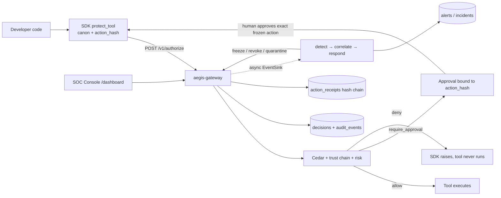

# Repo Knowledge Map

**Purpose:** the one page that tells you where everything lives, how data flows through the system, and where the documentation is complete, stale, or missing.
**Audience:** anyone about to change code or docs in this repository.
**Generated:** 2026-07-02 (verify file paths against `main` before relying on them).

> New here? Read [START_HERE.md](START_HERE.md) first. This page is the *maintainer's* map.

---

## 1. What this repository is

AegisAgent is an **AI Agent Security Control Plane**: a self-hostable Rust gateway (plus SDKs, UI, and a growing runtime data plane) that controls what AI agents are allowed to do. It is **not itself an agent** — it intercepts, authorizes, approves, receipts, and (when needed) contains agents.

- **Known/cooperative agents** are controlled through the SDK → gateway → policy → approval → receipt loop.
- **Unknown/anonymous agents** are the target of the runtime data plane (node sensor, cage runner, egress proxy, tool broker) — **designed and partially stored/served, but the runtime binaries are not implemented yet.** See [Implementation_Status.md](Implementation_Status.md).

Motto: *Make the approval trustworthy. Trust the source, not the text. Run the SOC on the proof.*

---

## 2. Repository structure

```text
AegisAgent/
├── Cargo.toml            # Workspace: src, src/canon, lib/{common,api,storage,policy,soc}
├── src/                  # aegis-gateway binary crate (Axum REST + tonic gRPC)
│   ├── src/main.rs       # Startup, env config, router wiring, background jobs, graceful shutdown
│   ├── src/lib.rs        # Library target re-exporting internals for tests/benches
│   ├── src/routes/       # HTTP handlers (see §5)
│   ├── src/grpc.rs       # gRPC services (port 6334)
│   ├── src/jobs.rs       # Periodic jobs (heartbeat flush, archival, leader-gated maintenance)
│   ├── src/sign.rs       # Optional Ed25519 receipt signing
│   ├── src/mtls.rs       # Optional agent↔gateway mutual TLS (#1310)
│   ├── src/otel.rs       # OTLP traces + metrics (gated on AEGIS_OTLP_ENDPOINT)
│   ├── src/policy_watcher.rs  # Cedar hot-reload filesystem watcher (#883)
│   ├── src/admission.rs  # Pre-authorize admission webhook (#1143)
│   ├── src/gh_comment.rs / gh_checks.rs  # GitHub App PR comment + Checks integration
│   ├── src/splunk_export.rs # Splunk HEC export
│   ├── src/bin/export_openapi.rs # Emits docs/api/openapi.json for the Redoc page
│   └── canon/            # aegis-canon crate: the aegis-jcs-1 canonicalizer (byte-parity locked)
├── lib/
│   ├── common/           # aegis-common: errors, hash, metrics, budget (no domain logic)
│   ├── api/              # aegis-api: REST models, DB records, proto/ + generated gRPC code
│   ├── storage/          # aegis-storage: StorageBackend trait + SQLite/Postgres impls (see §6)
│   ├── policy/           # aegis-policy: Cedar engine, trust_chain, risk scoring, validation
│   └── soc/              # aegis-soc: detect, correlate, respond, ingest, query, playbooks…
├── sdk-python/           # @protect_tool decorator, client, canon, receipts, `aegis` CLI
├── sdk-go/               # canon/, aegis/ (client, protect, receipts)
├── sdk-typescript/       # canon.ts, client.ts, protect.ts
├── ui/                   # Next.js SOC console (schema-driven dashboards), built into ui/dist,
│                         #   served by the gateway at /dashboard
├── e2e/                  # Playwright E2E tests against a running stack
├── examples/             # integrity_demo.py, approve_then_swap_demo.py, github-attack-demo.py, mock_server.py
├── policies.cedar        # Cedar policy pack (trust-provenance rules, approval annotations)
├── lib/storage/migrations/           # SQLite migrations 0001–0030 (see §6)
├── migrations_postgres/  # Postgres-mode migrations
├── helm/aegis-gateway/   # Kubernetes chart
├── docker-compose.yml / docker-compose.dev.yml
├── scripts/              # seed-demo.sh, flamegraph.sh, loadtest, validate-docs.mjs
├── grafana/dashboards/   # Prebuilt Grafana dashboards
├── .github/workflows/    # CI (see §9)
├── docs/                 # This documentation set (MkDocs Material → GitHub Pages)
└── mkdocs.yml            # Docs site config (published by .github/workflows/docs.yml)
```

Historical note: an empty `gateway/` directory remains from the pre-workspace layout (only a stale `target/`); the gateway crate now lives in `src/`. Some older skill files under `.claude/rules/` still reference `gateway/Cargo.toml` — use `src/Cargo.toml`.

---

## 3. Rust crates and binaries

| Crate | Path | Role |
|---|---|---|
| `aegis-gateway` (bin + lib) | `src/` | Axum REST API (8080), tonic gRPC (6334), background jobs, dashboard hosting |
| `aegis-canon` | `src/canon/` | `aegis-jcs-1` canonical JSON — **byte-identical across gateway + 3 SDKs**, locked by `tests/canonical_action_vectors.json` |
| `aegis-common` | `lib/common/` | Errors (`AegisError`), sha256 helpers, `SecurityMetrics`, budgets |
| `aegis-api` | `lib/api/` | REST request/response models, DB record types, `proto/*.proto` + prost/tonic codegen |
| `aegis-storage` | `lib/storage/` | `StorageBackend` trait (`traits.rs`), SQLite impl (`sqlite.rs`, `db/*`), tenant bloom filter, audit batching |
| `aegis-policy` | `lib/policy/` | Cedar evaluation (`cedar.rs`), trust-chain propagation (`trust_chain.rs`), risk scoring (`risk.rs`), policy compiler/validation |
| `aegis-soc` | `lib/soc/` | Async SOC: `ingest`, `detect`, `correlate`, `respond`, `query`, `narrate`, `playbook`, `notify`, `webhook_export`, `qdrant`, `mcp_inspect`, `rule_dsl`, `baseline`, `backtest` |
| `export_openapi` (bin) | `src/src/bin/export_openapi.rs` | Compile-time OpenAPI snapshot for the Redoc docs page |
| `src/fuzz` | excluded from workspace | cargo-fuzz targets for the canonicalizer |

---

## 4. The eleven choke points → where each one lives

Aegis controls what passes through Aegis choke points; anything outside them is treated as hostile and is isolated, blocked, killed, or banned. Status legend: ✅ implemented · 🟡 partial · 📐 designed, not implemented.

| # | Choke point | Status | Code |
|---|---|---|---|
| 1 | Prompt / model call | 📐 (Phase 7) + 🟡 untrusted-content ingest exists | `POST /v1/ingest` in `src/src/routes/mod.rs`; design in [components/Prompt_Model_Capture.md](components/Prompt_Model_Capture.md) |
| 2 | Tool call | ✅ | SDKs (`sdk-python/aegisagent/decorator.py`, `sdk-go/aegis/protect.go`, `sdk-typescript/src/protect.ts`) → `src/src/routes/authorize.rs` |
| 3 | API call (generic action) | ✅ | Same authorize path; action registry in `lib/storage/src/db/agents.rs` (skills/actions) |
| 4 | MCP call | ✅ (gateway-side "MCP Gateway Lite") | `src/src/routes/mcp.rs`, `lib/soc/src/mcp_inspect.rs`, manifest hash + drift in `src/src/routes/mod.rs` |
| 5 | Network egress | 📐 (Phase 5) | Design: [components/Egress_Proxy.md](components/Egress_Proxy.md) |
| 6 | Filesystem / workspace | 📐 (Phase 4 cage) | Design: [AegisAgent_Agent_Cage.md](AegisAgent_Agent_Cage.md) |
| 7 | Process execution | 📐 (Phases 3–4) | Design: [components/Node_Sensor.md](components/Node_Sensor.md) |
| 8 | Secret access | 📐 (Phase 6 tool broker) | Design: [components/Tool_Broker.md](components/Tool_Broker.md) |
| 9 | Approval | ✅ | `src/src/routes/approval.rs`, `lib/storage/src/db/approvals.rs`, SDK consume paths |
| 10 | Runtime control (kill/quarantine/ban) | 🟡 | Freeze/revoke/quarantine routes ✅ (`src/src/routes/agents.rs`, `lib/soc/src/respond.rs`); signed control-command dispatch to sensors 📐 (storage in `lib/storage/src/db/control_commands.rs`, protocol in [AegisAgent_Control_Command_Protocol.md](AegisAgent_Control_Command_Protocol.md)) |
| 11 | Receipt / evidence | ✅ | `src/src/routes/receipts.rs`, `authorize_receipts.rs`, `lib/storage/src/db/receipts.rs`, `src/src/sign.rs`, `src/src/graph.rs` (evidence graph) |

---

## 5. API layer (REST route map)

All routes are wired in `src/src/main.rs` (search `.route(`); handlers live in `src/src/routes/`. Everything under `/v1` is tenant-scoped via the `TenantId` bearer/JWT extractor (`routes/mod.rs`). gRPC equivalents live in `src/src/grpc.rs` with proto in `lib/api/proto/`.

| Domain | Routes (prefix `/v1`) | Handler file |
|---|---|---|
| Authorize | `POST /authorize` | `routes/authorize.rs` (+ `authorize_decision.rs`, `authorize_canon.rs`, `authorize_receipts.rs`) |
| Agents | `POST /agents/register`, `GET /agents`, `GET/PATCH /agents/:id`, `POST /agents/:id/{freeze,unfreeze,revoke,restore,rotate-token,quarantine…}`, tool-permissions | `routes/agents.rs` |
| Tools/skills | `POST /tools`, action registration | `routes/agents.rs` / `routes/mod.rs` |
| Approvals | `GET /approvals`, `GET /approvals/:id`, `POST /approvals/:id/{approve,reject,edit,consume}`, `POST /callbacks/slack` | `routes/approval.rs` |
| Receipts | `GET /receipts`, `GET /receipts/:id`, `GET /receipts/:id/verify`, `POST /receipts/verify-chain`, `POST /receipts/verify-range`, `GET /receipts/chain-head` | `routes/receipts.rs` |
| Decisions & audit | `GET /decisions`, `GET /decisions/:id`, `GET /decisions/timeseries`, `GET /audit/events`, `GET /runs/:id/timeline` | `routes/mod.rs` / `routes/soc.rs` |
| Policies | `GET/POST /policies`, `POST /policies/compile`, `/policies/:id/rollback`, `POST /policies/reload`, `GET /policies/audit-log`, `POST /policies/bundles` (Ed25519-signed) | `routes/policy.rs` |
| SOC | `GET /alerts`, `GET /incidents`, `GET /incidents/:id`, `POST /incidents/:id/close`, `GET /incidents/:id/narrate`, `GET /soc/summary`, `POST /soc/query`, `GET /soc/semantic-search`, detection rules, playbooks | `routes/soc.rs`, `routes/playbook.rs` |
| MCP | `POST /mcp/servers` (register/discover), `DELETE /mcp/servers/:key`, tool listing, manifest drift | `routes/mcp.rs` |
| Ingest | `POST /v1/ingest` (untrusted external content, GitHub webhook HMAC), `POST /v1/webhooks/github` | `routes/mod.rs`, `routes/webhooks.rs` |
| Agent Cage (Phase 2.6) | `POST /agent-cage/runs`, `GET /agent-cage/runs[/:id]`, `POST /ingest/runtime-events`, `GET /runtime/runs/:id/events` | `routes/runtime.rs` *(present at HEAD via PR #1681; this file is being reorganized on an active branch — re-verify before deep-linking)* |
| Tenants & admin | `POST /tenants`, `DELETE /tenants/:id` (GDPR hard delete), `GET /tenants/:id/export`, risk weights, API keys, webhook subscriptions (+ `/:id/reactivate`) | `routes/tenant.rs`, `routes/webhooks.rs` |
| Compliance | `GET /compliance/evidence-pack` | `routes/mod.rs` |
| Streaming | `GET /ws/events` (WebSocket) | `routes/mod.rs` |
| Meta / ops | `GET /health`, `/livez`, `/readyz`, `/startupz`, `/metrics`, `/debug/runtime`, `GET /openapi.json`, `GET /version`, `/dashboard/*` | `main.rs`, `routes/dashboard.rs`, `routes/openapi.rs` |

The complete, always-current reference is the generated OpenAPI: `GET /openapi.json`, rendered at [api-reference.md](api-reference.md) (Redoc; regenerated in CI by `docs.yml` via `export_openapi`).

---

## 6. Storage layer

`lib/storage/src/traits.rs` defines `StorageBackend`; the gateway holds `Arc<dyn StorageBackend>`. SQLite (WAL, busy-timeout, optional SQLCipher via `--features sqlcipher`) is the default; Postgres mode uses `migrations_postgres/`. Qdrant is the optional semantic/vector index (`lib/soc/src/qdrant.rs`).

Domain modules under `lib/storage/src/db/`: `tenant`, `agents`, `approvals`, `decisions`, `receipts`, `policies`, `mcp`, `soc`, `webhooks`, `playbooks`, `replay`, `leader`, plus the runtime data-plane stores: `agent_runs`, `runtime_events`, `control_commands`, `agent_bans`, `quarantine`.

Migrations (SQLite): `lib/storage/migrations/0001_baseline.sql` … `0030_quarantine_records.sql`. Runtime data-plane tables landed in `0026_agent_runs`, `0027_runtime_events`, `0028_control_commands`, `0029_agent_bans`, `0030_quarantine_records`. ERD: [database-schema.md](database-schema.md).

**Invariant:** every tenant-owned query binds `tenant_id`; parameterized SQLx only.

---

## 7. Policy, trust, and integrity layers

- **Cedar policy engine** — `lib/policy/src/cedar.rs`; policy pack `policies.cedar`; third decision state `require_approval` via `@decision(...)` annotations; hot reload via `src/src/policy_watcher.rs`.
- **Trust provenance (6 levels)** — `lib/policy/src/trust_chain.rs`; deterministic, tighten-only; downstream hops gate on the most restrictive upstream label.
- **Canonicalization** — `src/canon/` (`aegis-jcs-1`); parity vectors in `tests/canonical_action_vectors.json`, `tests/receipt_chain_vectors.json`; fuzzed by `canon-fuzz.yml`.
- **Approval integrity** — approval rows bind `action_hash`; edit re-hashes + re-evaluates (`0024_approval_effective_call_hash.sql`); consume is single-use atomic; brute-force protection in `ApprovalAttemptTracker` (`routes/mod.rs`).
- **Receipts** — hash-chained per tenant (`prev_receipt_hash`), optional Ed25519 signatures over `receipt_hash` (`src/src/sign.rs`, key id in migration 0020); verification endpoints + `aegis-verify-receipts` CLI.
- **Evidence graph** — `src/src/graph.rs`, `lib/api/src/graph.rs`, `GET /v1/graph/*`; docs: [evidence-graph.md](evidence-graph.md).

## 8. SOC layer

Async, never in the inline authorize path. Pipeline: `EventSink` (`lib/soc/src/events.rs`) → `lib/soc/src/ingest.rs` → `detect.rs` (rules + `rule_dsl.rs`, baselines) → `correlate.rs` (alerts → incidents) → `respond.rs` (freeze/revoke/quarantine playbooks) → `notify.rs` / `webhook_export.rs` / `splunk_export.rs`. Query API: `lib/soc/src/query.rs` behind `POST /v1/soc/query`. Narratives: `narrate.rs`. Docs: [components/SOC_Engine.md](components/SOC_Engine.md), [AegisAgent_Agent_SOC_Design.md](AegisAgent_Agent_SOC_Design.md).

## 9. CI / testing / release layer

| Workflow | Purpose |
|---|---|
| `ci.yml` | fmt, clippy `-D warnings`, tests (~637 gateway + 187 Python SDK), coverage gate (llvm-cov ≥70 lines), SDK parity vectors, cargo-deny licenses |
| `canon-fuzz.yml` | Fuzzes the `aegis-jcs-1` canonicalizer |
| `mutation-testing.yml` | cargo-mutants (config `mutants.toml`) |
| `sast.yml`, `secret-scan.yml`, `container-scan.yml` | Semgrep (`.semgrep/`), secrets, image CVEs |
| `docs.yml` | Regenerates `docs/api/openapi.json` from route metadata and deploys MkDocs to gh-pages |
| `release-please.yml`, `release-publish.yml` | Versioning; cosign keyless signing + SLSA L3 provenance + SBOMs (#1172) |

Test suites: Rust unit/integration in-crate; Python `sdk-python/tests`; Go `sdk-go`; TS `sdk-typescript`; Playwright in `e2e/`; benches in `src/benches` (flamegraph via `scripts/flamegraph.sh`).

## 10. Deployment layer

- **Local:** `docker compose up --build` + `scripts/seed-demo.sh`; dev-seeded stack via `docker-compose.dev.yml`.
- **Kubernetes:** `helm/aegis-gateway/` (probes wired to `/livez` `/readyz` `/startupz`; policy ConfigMap checksum + hot reload; HPA present but inert until Postgres).
- **Config:** env-first (see [production-hardening.md](production-hardening.md)); `config/config.yaml` for ports.
- **Observability:** Prometheus `/metrics`, OTLP traces/metrics (`AEGIS_OTLP_ENDPOINT`), Grafana dashboards in `grafana/dashboards/`.

---

## 11. How data flows through the system



The anonymous-agent path (gateway → signed command → node sensor → cage runner → egress proxy/tool broker → runtime events → SOC) is the designed extension of this loop; see [flows/Unknown_Agent_Cage_Flow.md](flows/Unknown_Agent_Cage_Flow.md).

---

## 12. Documentation inventory & gap analysis

### Existing and current (keep, reference)
`index.md`, `getting-started.md`, `quickstart.md`, `installation.md`, `deployment-guide.md`, `production-hardening.md`, `AegisAgent_Technical_Design.md`, `AegisAgent_Agent_Workflow.md`, `AegisAgent_Threat_Model.md`, `AegisAgent_Operational_Design.md`, `action-receipt-spec.md`, `evidence-graph.md`, `database-schema.md`, `fail-closed-behavior.md`, `runtime-authorization-api.md`, `api-reference.md` (generated), `sdk-parity-status.md`, `mcp-defense-architecture.md`, runbooks/, adr/, `AegisAgent_Agent_SOC_Design.md`, `AegisAgent_SOC_UI_Design.md`, `faq.md`, `concepts.md`, `feature_history.md`.

### Existing target-design docs (accurate but must stay labeled as design, not shipped)
`AegisAgent_World_Class_HLD.md`, `AegisAgent_World_Class_LLD.md`, `AegisAgent_Runtime_Data_Plane.md`, `AegisAgent_Agent_Cage.md`, `AegisAgent_Control_Command_Protocol.md`, `AegisAgent_Phased_PR_Plan.md`.

### Gaps this documentation pass fills
| Gap | New doc |
|---|---|
| No single entry point per persona | [START_HERE.md](START_HERE.md), `onboarding/` (6 personas) |
| No plain-language product story | [Product_Overview.md](Product_Overview.md), [Last_Mile_System_Walkthrough.md](Last_Mile_System_Walkthrough.md) |
| No choke-point-centric architecture page | [Architecture_Overview.md](Architecture_Overview.md) |
| No honest implemented-vs-planned matrix | [Implementation_Status.md](Implementation_Status.md) |
| Differentiators had no dedicated deep docs | [components/Approval_Engine.md](components/Approval_Engine.md), [components/Receipt_Engine.md](components/Receipt_Engine.md) |
| SOC/ban/quarantine model scattered | [components/SOC_Engine.md](components/SOC_Engine.md), [flows/Ban_Quarantine_Flow.md](flows/Ban_Quarantine_Flow.md) |
| Runtime components lacked per-component status pages | `components/Node_Sensor.md`, `components/Egress_Proxy.md`, `components/Tool_Broker.md`, `components/MCP_Gateway.md`, `components/Prompt_Model_Capture.md` |
| No end-to-end flow docs | `flows/` (5 docs) |
| No local-dev / debugging guide | [Local_Development.md](Local_Development.md), [AegisAgent_Debugging_Guide.md](AegisAgent_Debugging_Guide.md) |
| SDK/UI knowledge only in code | [components/SDK.md](components/SDK.md), [components/Console_UI.md](components/Console_UI.md) |
| No shared vocabulary | [Glossary.md](Glossary.md) |
| Diagrams not indexed or machine-derivable | `diagrams/`, [AegisAgent_Diagram_Index.md](AegisAgent_Diagram_Index.md), [architecture-map.json](architecture-map.json), `explorer/` |
| No docs validation | `scripts/validate-docs.mjs` |

### Known stale/wrong spots (fix candidates)
- `.claude/rules/*.md` skills reference `gateway/Cargo.toml` and `gateway/src/...` — the crate moved to `src/`.
- Root `README.md` quickstart predates some route/UI changes; cross-check when touching it.
- `docs/archive/dashboard-mock.html` — design-era artifact, archived (superseded by `ui/`).
- The empty `gateway/` directory should eventually be deleted (only a stale build `target/` remains).

---

## 13. Related docs

[START_HERE.md](START_HERE.md) · [Architecture_Overview.md](Architecture_Overview.md) · [Implementation_Status.md](Implementation_Status.md) · [Last_Mile_System_Walkthrough.md](Last_Mile_System_Walkthrough.md) · [AegisAgent_Diagram_Index.md](AegisAgent_Diagram_Index.md) · [feature_history.md](feature_history.md) · [AegisAgent_Gap_Reassessment_2026-06.md](AegisAgent_Gap_Reassessment_2026-06.md) (internal source of truth)
