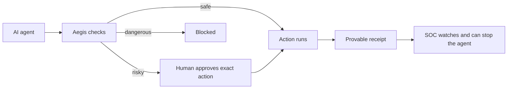

# The One-Minute Tour

*Sixty seconds. No jargon.*

## The problem

Companies are handing AI agents real power: credentials, APIs, code, money, customer data.

## The risk

Agents do what text tells them. Attackers write text. One poisoned ticket, issue, or email can turn *your* agent into *their* agent — and afterwards, nobody can prove what actually happened.

## The solution

**AegisAgent lets you run AI agents without losing control.**

Before an agent does something risky, Aegis:

1. **Checks it** — deterministic policy, based on where the request came from.
2. **Controls it** — risky actions wait for a human; the approval locks to the *exact* action.
3. **Records it** — every decision becomes a tamper-evident receipt.
4. **Proves it** — the receipt chain shows exactly what happened, to anyone.

And if an agent misbehaves, the built-in SOC can freeze, quarantine, or ban it.

## The simple picture

## Next

- What it is, in full: [What_Is_AegisAgent.md](What_Is_AegisAgent.md)
- Why it works this way: [Why_AegisAgent.md](Why_AegisAgent.md)
- The mechanism, step by step: [How_It_Works.md](How_It_Works.md)
- I'm a developer — integrate now: [onboarding/For_SDK_Developer.md](onboarding/For_SDK_Developer.md)
- The full story with code references: [Last_Mile_System_Walkthrough.md](Last_Mile_System_Walkthrough.md)
