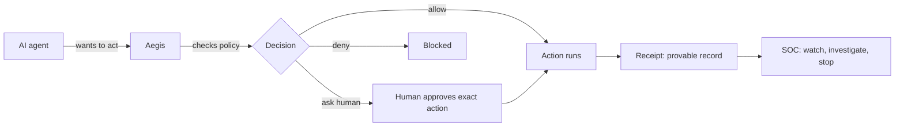

# What Is AegisAgent?

## Overview

**AegisAgent lets you run AI agents without losing control.**

AegisAgent is the control layer for AI agents. It is not an agent itself. It watches, checks, controls, approves, records, and proves risky agent actions.

Before an AI agent does something risky, Aegis checks it, controls it, records it, and proves what happened.

## Why it exists

AI agents hold real credentials and take real actions — merging code, sending emails, moving data. A tricked or buggy agent can do real damage. Someone has to sit between the agent and the world. That is AegisAgent.

## How it works

1. An agent wants to act (call a tool, hit an API).
2. Aegis intercepts the action and fingerprints it (the **action hash**).
3. Policy decides: **allow**, **deny**, or **ask a human**.
4. If a human approves, the approval is locked to that exact fingerprint.
5. The action runs only if it still matches what was approved.
6. A tamper-evident **receipt** records what happened.
7. The **SOC** watches patterns and can freeze or ban a misbehaving agent.

## Visual



## Technical details

AegisAgent is an **AI Agent Security Control Plane**: authorization, deterministic policy (Cedar), approval-bound action integrity (SHA-256 over canonicalized actions), hash-chained receipts, SOC evidence, MCP/tool control, runtime containment, and agent investigation — self-hostable, framework-neutral, fail-closed. Full technical framing: [Product_Overview.md](Product_Overview.md) and [Architecture_Overview.md](Architecture_Overview.md).

One honest rule: **Aegis can only control what passes through Aegis control points.** An agent that bypasses every control point is treated as unsafe — and in runtime-controlled modes it is isolated, blocked, killed, quarantined, or banned.

## Related code

`sdk-python/aegisagent/decorator.py` (the interception) · `src/src/routes/authorize.rs` (the decision) · `src/src/routes/approval.rs` (the approval) · `src/src/routes/receipts.rs` (the proof) · `lib/soc/src/` (the watcher)

## Current status

The control plane (SDK, gateway, policy, approvals, receipts, SOC, MCP defense, console) is **Implemented**. Runtime containment for unknown agents (cage, sensor, egress proxy, tool broker) is **Planned/Partial** — see [Implementation_Status.md](Implementation_Status.md).

## What can go wrong

If you don't route an agent's actions through Aegis (no SDK, no cage), Aegis cannot see them. That's by design — no magic claims. The answer is coverage: wrap known agents, cage unknown ones.

## Related docs

[The_One_Minute_Tour.md](The_One_Minute_Tour.md) · [Why_AegisAgent.md](Why_AegisAgent.md) · [How_It_Works.md](How_It_Works.md) · [START_HERE.md](START_HERE.md)

## Try It

```bash
make demo
```

This executes the smallest end-to-end proof of the product's integrity claims. Use [Quickstart](quickstart.md) for prerequisites and expected evidence.
