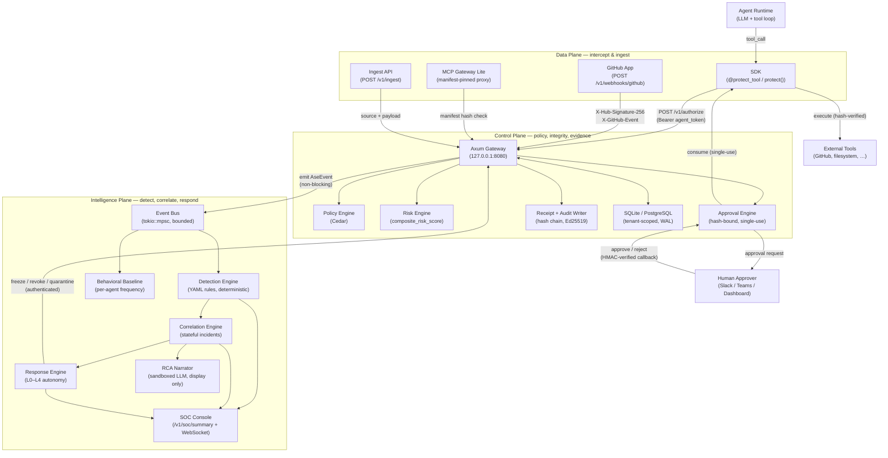
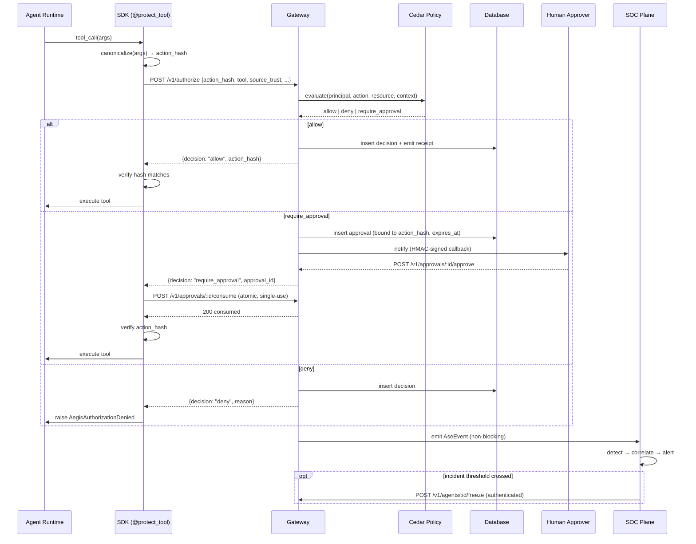

# AegisAgent — Architecture Overview

**Version:** v1.0  
**Date:** 2026-06-16  
**Issue:** [#1400](https://github.com/lavkushry/AegisAgent/issues/1400)  
**Detailed design:** [`AegisAgent_Agent_SOC_Design.md`](AegisAgent_Agent_SOC_Design.md)  
**Threat model:** [`security-model.md`](security-model.md) · [`AegisAgent_Threat_Model.md`](AegisAgent_Threat_Model.md)

AegisAgent is the **integrity layer for AI agent actions** — open, self-hostable, framework-neutral. It is organized into three planes: the **Data Plane** intercepts and authorizes agent tool calls, the **Control Plane** evaluates policy and enforces integrity guarantees, and the **Intelligence Plane** detects, correlates, and responds to agent security events.

---

## Three-plane architecture

---

## Data Plane

The Data Plane is the collection of surfaces through which agent activity enters AegisAgent. Every surface feeds the same Control Plane gateway.

### SDK (`@protect_tool` / `protect()`)

**Languages:** Python · Go · TypeScript  
**Source:** `sdk-python/aegisagent/decorator.py` · `sdk-go/aegis/protect.go` · `sdk-typescript/src/protect.ts`

The SDK wraps every tool call before execution:

1. Serializes the action using the `aegis-jcs-1` canonicalization scheme (byte-identical across all languages).
2. Computes `action_hash = SHA-256(canonical_action)`.
3. Sends `POST /v1/authorize` with the hash, agent token, and tool call metadata.
4. On `allow` — verifies the returned `action_hash` matches; executes the tool.
5. On `require_approval` — polls `GET /v1/approvals/:id` until approved; atomically consumes the approval (`POST /v1/approvals/:id/consume`) and re-verifies the hash before execution.
6. On `deny` or any error — **fails closed**: the tool is not executed.

The SDK is the only surface where `action_hash` verification happens on the client side. A compromised SDK breaks the guarantee at this boundary (B2–B3).

### GitHub App (`POST /v1/webhooks/github`)

**Source:** `gateway/src/routes.rs` → `receive_github_webhook`; `gateway/src/ingest.rs` → `normalize_github_native_event`

Receives native GitHub webhook events with mandatory HMAC-SHA256 signature verification (`X-Hub-Signature-256`). Normalizes `pull_request.opened`, `pull_request.merged`, `issues.opened`, and `issue_comment.created` into `AseEvent`s fed to the SOC pipeline. Unsupported event types are acknowledged (`202 ignored`) without emitting an event. Fails closed: returns `401` when `AEGIS_GITHUB_WEBHOOK_SECRET` is not configured.

### MCP Gateway Lite

**Source:** `mcp-gateway-lite/`

A manifest-pinning proxy in front of MCP servers. Each server's tool manifest is hashed at registration time and pinned in `mcp_servers.manifest_hash`. On every tool discovery call, the live manifest is re-fetched and compared. A hash mismatch emits an `mcp_manifest_drift` `AseEvent` to the SOC and triggers policy downgrade.

### Ingest API (`POST /v1/ingest`)

**Source:** `gateway/src/routes.rs` → `ingest_event`; `gateway/src/ingest.rs`

Allows external systems without the SDK (GitHub webhooks via the generic envelope, OpenAI trace exporters) to feed events into the SOC pipeline. Accepts `{"source": "github_webhook"|"openai_trace", "payload": {...}}`. Authentication uses standard tenant bearer token; GitHub webhook source optionally verifies `X-Hub-Signature-256`.

---

## Control Plane

The Control Plane is where AegisAgent's two headline security properties are enforced:

1. **Hash-bound approval integrity** — the action that executes equals the action the human approved.
2. **Deterministic trust-provenance gating** — authorization is gated on the source trust level, not a score.

### Axum Gateway

**Source:** `gateway/src/main.rs` · `gateway/src/routes.rs`  
**Bind:** `127.0.0.1:8080` (configurable via `AEGIS_BIND_ADDR`)  
**Budget:** `POST /v1/authorize` must complete in < 75 ms (Law 3).

The gateway handles authentication (hashed agent tokens in `agents.token_hash`), tenant extraction, rate limiting, and dispatches to the policy, risk, approval, and receipt subsystems. Every response to the SDK includes `action_hash` so the SDK can re-verify before execution.

### Policy Engine (Cedar)

**Source:** `gateway/src/policy.rs` · `gateway/policies.cedar`

Authorization decisions (`allow` / `deny` / `require_approval`) are made by the Cedar policy engine evaluating:

- `source_trust` label (6 levels: `trusted_internal_signed` → `malicious_suspected`)
- `mutates_state` flag
- `risk_tier` of the registered tool/action

Classifiers may only **tighten** a `source_trust` label, never loosen it. This is the confused-deputy defense: a Cedar `forbid` for `mutates_state && untrusted_external` fires regardless of any advisory score. Cedar decides; scores annotate.

### Risk Engine

**Source:** `gateway/src/risk.rs`

Computes an advisory `composite_risk_score` (0–100) based on base risk tier + environment penalties + context-trust level + MCP drift + anomaly signal - approval credit. The score is written to `decisions.composite_risk_score` and returned in the `POST /v1/authorize` response. **It never gates the decision** (Law 1) — Cedar does.

Per-tenant weight overrides: `GET|PUT /v1/tenants/risk-weights`.

### Approval Engine

**Source:** `gateway/src/routes.rs` (approval handlers) · `sdk-*/` (polling + consume)

When Cedar returns `require_approval`:

1. Gateway creates an approval row bound to the `action_hash` with an `expires_at`.
2. Notifies the approver via Slack/Teams callback (HMAC-SHA256 signed) or dashboard.
3. Approver sees the exact canonical action that is hashed — not a summary.
4. On approval, SDK atomically **consumes** the approval (`consumed_at` guard; 409 on replay).
5. SDK re-verifies `action_hash` before executing. Any mismatch → fail closed.

Three guarantees:
- **No approve-then-swap**: hash re-verified at execution time.
- **No replay**: single-use `consume` with atomic guard.
- **No expiry bypass**: `expires_at` enforced at gateway and SDK.

### Receipt + Audit Writer

**Source:** `gateway/src/routes.rs` → `emit_action_receipt` · `gateway/src/sign.rs`

Every decision that executes produces a receipt with: `receipt_id`, `action_hash`, `decision_hash`, `prev_hash` (chain link), `timestamp`, optional Ed25519 signature. Receipts form a per-tenant hash chain verifiable via `GET /v1/receipts/:id/verify` and `POST /v1/receipts/verify-chain`. Provides compliance evidence for SOC 2 and EU AI Act Article 14.

Audit write failures fail closed for high-risk actions (`audit_writer_unavailable` reason; `audit_writer_unhealthy=true` until the writer recovers). The writer retries on transient `SQLITE_BUSY`/`SQLITE_LOCKED` before declaring failure.

### Database (SQLite / PostgreSQL)

**Source:** `gateway/src/db.rs`

Multi-tenant, WAL-mode SQLite in development (≤150 req/s ceiling; see [`performance-baseline.md`](performance-baseline.md)); PostgreSQL for production throughput. Every query binds `tenant_id` as a parameterized argument — no string concatenation, no cross-tenant leakage.

---

## Intelligence Plane

The Intelligence Plane operates entirely out-of-band (Law 3). A SOC outage degrades monitoring; it never affects the action authorization path.

### Event Bus

**Source:** `gateway/src/events.rs`

A bounded `tokio::mpsc` channel (capacity 1024) through which the gateway emits `AseEvent`s non-blockingly. The `drain` task consumes events and fans them out to every downstream consumer. Emission is fire-and-forget from the authorize path.

### Detection Engine

**Source:** `gateway/src/detect.rs` · `gateway/src/rule_dsl.rs`

YAML-driven, deterministic rule evaluator. Each `AseEvent` is evaluated against:
- 8 embedded default rules (confused-deputy block, approval surface, critical deny, replay, MCP drift).
- Tenant custom rules from `detection_rules` table (loaded fresh per event — no stale cache).

No ML, no score gating (Law 2). Rules fire or don't. Alerts are deduplicated by rule name per event. Tenant custom rules managed via `GET|POST /v1/soc/rules`.

### Behavioral Baseline

**Source:** `gateway/src/baseline.rs`

Tracks per-agent action frequency over time windows. Emits advisory alerts when:
- An agent calls a `(tool, action)` pair it has never used before (`behavioral_anomaly_new_tool`).
- An agent's action rate exceeds 3× its historical mean (`behavioral_anomaly_rate`).

Baseline alerts are advisory signals for the correlator, never authorization gates (Law 1).

### Correlation Engine

**Source:** `gateway/src/correlate.rs`

Stateful multi-event pattern detector that groups events into **incidents**:

| Incident | Pattern |
|----------|---------|
| `deny_storm` | ≥ 5 denies from same `(tenant, agent)` in 60 s |
| `runaway` | ≥ 10 actions from same `(tenant, agent)` in 30 s |
| `repeated_approval` | ≥ 3 `require_approval` for same `(tenant, agent, tool, action)` in 10 min |
| `trust_escalation` | deny follows require_approval for same `(tenant, agent)` within 30 s |

### Response Engine

**Source:** `gateway/src/respond.rs`

Dispatches containment actions when an incident crosses threshold, at configurable autonomy levels (L0–L4). Available responses: `freeze`, `revoke`, `quarantine` — all tenant-scoped, authenticated, audited, and reversible. Every containment action emits a receipt (Law 4).

### RCA Narrator

**Source:** `gateway/src/narrate.rs`

A sandboxed LLM invoked **only** after an incident is fully decided and evidenced. It receives redacted, tenant-scoped evidence as **inert structured data** and produces a human-readable post-incident narrative. It has no tools, no authority, and no path to the authorization decision. Output is display-only in the SOC console (Law 2 — closes second-order prompt injection risk).

### SOC Console

**Endpoints:** `GET /v1/soc/summary` · `GET /v1/ws/events` (WebSocket live feed) · `GET /v1/alerts` · `GET /v1/incidents`

Real-time SOC summary and live event stream. Dashboard UI is roadmapped; today the API surface is complete.

---

## Data flow: request → authorize → decide → audit → detect → alert → respond

---

## Component ownership (AGENTS.md personas)

| Plane | Component | Owner persona | Source path |
|-------|-----------|---------------|-------------|
| Data | SDK (Python) | DeveloperAgent | `sdk-python/aegisagent/` |
| Data | SDK (Go) | DeveloperAgent | `sdk-go/` |
| Data | SDK (TypeScript) | DeveloperAgent | `sdk-typescript/src/` |
| Data | GitHub App webhook | DeveloperAgent | `gateway/src/routes.rs`, `ingest.rs` |
| Data | MCP Gateway Lite | DeveloperAgent | `mcp-gateway-lite/` |
| Data | Ingest API | DeveloperAgent | `gateway/src/ingest.rs` |
| Control | Axum Gateway | DeveloperAgent | `gateway/src/main.rs`, `routes.rs` |
| Control | Policy Engine | SecurityAuditorAgent | `gateway/src/policy.rs`, `policies.cedar` |
| Control | Risk Engine | DeveloperAgent | `gateway/src/risk.rs` |
| Control | Approval Engine | DeveloperAgent | `gateway/src/routes.rs` (approval handlers) |
| Control | Receipt + Audit Writer | DeveloperAgent | `gateway/src/routes.rs`, `sign.rs` |
| Control | Database | DeveloperAgent | `gateway/src/db.rs` |
| Intelligence | Event Bus | DeveloperAgent | `gateway/src/events.rs` |
| Intelligence | Detection Engine | SecurityAuditorAgent | `gateway/src/detect.rs`, `rule_dsl.rs` |
| Intelligence | Behavioral Baseline | DeveloperAgent | `gateway/src/baseline.rs` |
| Intelligence | Correlation Engine | DeveloperAgent | `gateway/src/correlate.rs` |
| Intelligence | Response Engine | DeveloperAgent | `gateway/src/respond.rs` |
| Intelligence | RCA Narrator | DeveloperAgent | `gateway/src/narrate.rs` |
| Intelligence | SOC Console | DeveloperAgent | `gateway/src/routes.rs` (SOC endpoints) |
| Cross-cutting | Cedar policies | SecurityAuditorAgent | `gateway/policies.cedar` |
| Cross-cutting | Helm / CI | OpsAgent | `helm/`, `.github/` |
| Cross-cutting | Docs / strategy | ArchitectAgent | `docs/`, `CLAUDE.md`, `AGENTS.md` |

---

## Key invariants

These invariants must not be weakened regardless of which plane or component is changed:

- **`aegis-jcs-1` byte parity** — canonicalization must produce identical bytes across all SDKs and the gateway. Locked by `tests/canonical_action_vectors.json` and the cross-language CI gate.
- **Cedar decides; scores annotate** (Law 1) — `composite_risk_score` is metadata, never a gate.
- **LLM sandboxed, display-only** (Law 2) — only the RCA narrator uses an LLM; it has no tools and no authority.
- **SOC is always async** (Law 3) — the `emit` call is fire-and-forget; detection outage never causes fail-open.
- **Containment is reversible and audited** (Law 4) — every freeze/revoke/quarantine is tenant-scoped, authenticated, and produces a receipt.

---

*For threat IDs (T-A through T-D) and security guarantees (G1–G6), see [`security-model.md`](security-model.md). For build commands and API contract, see [`CLAUDE.md`](../CLAUDE.md). For the full SOC design, see [`AegisAgent_Agent_SOC_Design.md`](AegisAgent_Agent_SOC_Design.md).*
