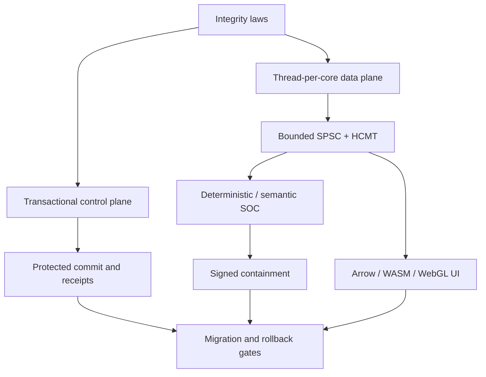

# AegisAgent Mandatory Architecture Law

> **MANDATORY:** Every human or automated contributor MUST read this file before writing code. The canonical target HLD is [../ARCHITECTURE.md](../ARCHITECTURE.md), the byte/algorithm contract is [LLD.md](LLD.md), and current-to-target cutover rules are in [../MIGRATION_MATRIX.md](../MIGRATION_MATRIX.md).

**Status:** repository law during the v1 → v2 architecture migration

**Last reviewed:** 2026-07-14

## Why these laws exist

AegisAgent is changing execution, storage, wire, detection, kernel and browser architectures while protecting approval and receipt semantics already used by SDKs. Without one migration law, a local optimization can introduce an upward dependency, a hidden JSON copy, an eventually consistent approval, or a target presented as shipped. These rules keep the current system deployable while every target component earns authority through shadow, recovery, security and benchmark gates.


```mermaid
flowchart TD
    I[Integrity laws] --> C[Transactional control plane]
    I --> D[Thread-per-core data plane]
    C --> P[Protected commit and receipts]
    D --> H[Bounded SPSC + HCMT]
    H --> S[Deterministic / semantic SOC]
    S --> E[Signed containment]
    H --> U[Arrow / WASM / WebGL UI]
    P --> R[Migration and rollback gates]
    E --> R
    U --> R
```

## 1. Status vocabulary

- **Current:** present and tested in this checkout.
- **Shadow:** receives real/replayed data but is not authoritative.
- **Target:** approved design direction, not a shipped claim.
- **Qualified:** passed the published correctness, recovery, security and performance profile.

Documentation MUST NOT describe a target as current or qualified. Current shipped state remains tracked in `docs/Implementation_Status.md`; measured performance remains in `docs/performance-baseline.md`.

## 2. Integrity laws

1. The exact post-admission action is canonicalized with `aegis-jcs-1` and bound to approval by SHA-256.
2. Hash mismatch, expiry, replay, unknown state, missing required authority, or failed protected commit blocks execution.
3. Trust provenance can only tighten; unknown is least trusted.
4. Cedar decides allow/deny. Aho matches, risk scores, vector search, ONNX, and LLM output cannot create an allow or increase trust.
5. Protected actions commit required control state and receipt evidence before execution is acknowledged.
6. Tenant context is authenticated and enforced in routing, every storage/index lookup, snapshots, encryption context and receipt chains.
7. Every queue, body, field, allocation, decompression, query, retry and time window is bounded.
8. Raw secrets and credentials never enter agent payloads, telemetry, model input, logs, traces, receipts or browser Arrow schemas.

## 3. Control plane and data plane are different stores

### Transactional control state

The following remain behind `StorageBackend` during transition and `ControlStore`/`ReceiptLog` in v2:

- tenants, agents, identities, tool grants and policy generations;
- approvals, edits, expiry, atomic consume, replay nonces and idempotency;
- bans, quarantine, signed commands and acknowledgements;
- protected decisions, receipt heads, signatures and checkpoints.

HCMT MUST NOT become authoritative for these until a separate accepted ADR proves the required transactional/linearizable semantics.

### HCMT event state

HCMT is for append-heavy telemetry and analytical projections: runtime events, prompt/model metadata, bulk audit projections, SOC timelines, facets, time series, deterministic scan candidates, vector codes and query indexes.

During migration, event data moves through `sql → dual → shadow read → HCMT`. Integrity-field shadow mismatches must be exactly zero before cutover.

## 4. Dependency direction

```text
common
├── canon
├── wire
└── crypto
    ↓
policy     event → reactor
    ↓         ↓
decision   hcmt → query → soc
    ↓                    ↓
control-store        guardrails / containment
    \____________________/
             ↓
      binaries and adapters
```

Exact allowed edges are in the [target DAG](../ARCHITECTURE.md#17-target-workspace-and-dependency-direction).

Hard rules:

- `aegis-policy` never depends on storage, networking, SOC or adapters.
- `aegis-hcmt` never evaluates Cedar or mutates control state.
- query code never mutates approvals, agents, commands or receipts.
- service crates never depend on Axum handlers, tonic service implementations, WebSocket types or binaries.
- binaries compose crates; library crates never import a binary.
- all functions return `Result<T, AegisError>` or a narrower typed error convertible to it.
- `cargo tree --workspace` must show an acyclic internal graph.

### Transitional v1 edges

Until extraction is complete, the current downward flow remains valid:

```text
aegis-common ← aegis-api ← aegis-storage / aegis-policy
                                    ↓
                           aegis-decision  (authorize pipeline + DecisionRuntime ports)
                                    ↓
                    aegis-soc ← gateway binary (thin REST/gRPC adapters)
```

- **Current:** `aegis-decision` owns the full authorize sequence (`admit → preflight → guard → metadata → evaluate`) behind host-implemented `DecisionRuntime` ports. The gateway implements those ports (`decision_runtime.rs`) and keeps REST/gRPC adapters thin.
- **Still transitional:** decision I/O remains async storage via ports (not reactor snapshots / `ControlStore`). Target hot-path restrictions in §7 apply once reactor cutover lands.

New code MUST move toward the target seams; it MUST NOT expand the existing 245-method storage trait or add new business logic to route modules when a focused service/trait can own it.

## 5. Thin protocol adapters and dual protocol

REST and gRPC adapters perform only:

```text
authenticate/parse → typed service call → typed error/response mapping
```

- Public control types are protobuf-first in `lib/api/proto/` during transition and `lib/wire/proto/` in v2.
- New public behavior is available through both REST and gRPC until an accepted deprecation ADR changes the contract.
- REST models mirror protobuf and exist for compatibility, not as the internal domain model.
- gRPC MUST NOT call a REST handler, buffer an Axum response body, or parse response JSON.
- FlatBuffers is the internal high-rate telemetry frame, not a replacement for protobuf public control contracts.
- Arrow IPC is the analytical result format; the browser WebSocket bridge preserves Arrow semantics but is not falsely described as standard Flight transport.

No SQL, Cedar construction, action hashing, receipt creation, rule evaluation, webhook delivery, model inference or query planning belongs in a handler or RPC implementation.

## 6. Storage access

Current code uses `StorageBackend`; raw `SqlitePool`/`PgPool` is confined to `lib/storage/` implementations and tests. Target code uses consistency-specific traits:

```text
ControlStore   transactional control state
ReceiptLog     ordered protected evidence
EventStore     append/query telemetry
ProjectionStore rebuildable derived state
```

Every operation binds authenticated `tenant_id`. SQL is parameterized. Dynamic column/order choices use closed enums. No user string is interpolated into SQL.

## 7. Hot-path restrictions

The target hot crates are `aegis-reactor`, `aegis-event`, `aegis-decision`, and `aegis-hcmt`. Their steady-state paths MUST NOT use:

- `tokio::spawn`, work stealing or thread migration;
- blocking `Mutex`/`RwLock`;
- `serde_json::Value` or per-event JSON serialization;
- SQL row inserts for normal telemetry;
- unbounded memory/queue/retry/time behavior;
- blocking DNS, KMS, webhook, model, filesystem or control-store work on a reactor core;
- shared mutable domain objects across cores.

Each hot reactor is a pinned owner thread. Cross-core transfer uses bounded SPSC descriptors or complete immutable generations. Producer/consumer cursors occupy separate 64-byte cache lines. Memory is NUMA-local by construction and measurement.

Tokio/JSON/locks may remain in bounded compatibility and administrative code outside the target performance envelope.

## 8. Wire, memory and unsafe rules

- Generated FlatBuffer verification precedes field access.
- Arrow schema fingerprint, dictionary generation, lengths, offsets and tenant range are verified.
- “Zero-copy” claims name a boundary and include a copy/allocation ledger.
- DMA, TLS, kernel/user, decompression, browser→WASM and CPU→GPU copies are not hidden.
- Unsafe code is isolated, justified by `// SAFETY:`, differentially tested, fuzzed and covered by Miri/sanitizers; atomics also require Loom.
- SIMD retains a scalar oracle and runtime capability selection.
- Epoch pins never span I/O or uncontrolled duration.

See [CONTRIBUTING.md](../CONTRIBUTING.md) for mandatory review evidence.

## 9. Guardrail authority

- Aho-Corasick uses versioned identical normalization at compile and scan and runs in `O(n + z)` after compilation.
- Automaton pattern bytes, states, resident memory and outputs are bounded.
- HNSW/PQ reports recall against exact search; no false worst-case complexity claim is permitted.
- ONNX sessions run on isolated inference cores with fixed inputs, queues and deadlines.
- Models/codebooks are content-addressed and cannot be retrained by untrusted events.
- Deterministic or semantic results may tighten, deny, quarantine or alert only through explicit policy; they never allow.

## 10. eBPF law

- Kernel/user ABI is versioned and layout-asserted.
- Policy maps publish by signed atomic generation switch.
- Commands bind tenant, node, key generation, nonce, expiry and monotonic control generation.
- Unsupported hooks/kernels report reduced assurance; polling fallback is not equivalent containment.
- Kernel programs enforce bounded cgroup/network/process/file facts, not arbitrary prompt parsing.
- Ring loss and map update failure are security events.

## 11. UI law

- React owns controls and bounded semantic summaries.
- WASM owns Arrow validation/transforms/LOD.
- WebGL2 owns high-cardinality drawing; no component/DOM/SVG node per event point.
- Streams are credit-bounded, cancelable and resumable.
- Current browser→WASM ingestion permits one declared bounded copy; WebGL2 upload is also a declared copy.
- Every canvas/WebGL workflow has keyboard and screen-reader-accessible semantics.

## 12. Configuration

Configuration is loaded once from `config/config.yaml` plus documented environment overrides, validated as a whole, and passed through constructors. Hot crates do not read environment variables.

Current defaults remain loopback REST `8080` and gRPC `6334`. A qualified profile additionally validates non-overlapping core roles, online CPUs, NUMA topology, queue/memory budgets, durability class, eBPF capabilities and query limits.

## 13. Tests required before cutover

Run current workspace gates:

```bash
cargo check --workspace
cargo test --workspace -- --test-threads=1
cargo fmt --all -- --check
cargo clippy --workspace --all-targets -- -D warnings
cargo tree --workspace
```

Stateful/performance components additionally require:

- cross-language canonical/receipt/wire differential corpora;
- approval/replay/tenant concurrency tests;
- WAL/segment/manifest crash and corruption injection;
- SQL versus HCMT shadow equality;
- Loom, Miri, fuzz and sanitizer coverage for unsafe/concurrency;
- raw p50/p95/p99/p99.9 histograms with coordinated-omission correction;
- allocation, copy, migration, cache/branch/NUMA and write-amplification evidence;
- rollback exercised from a built release artifact.

## Security and failure stance

Unknown identity, tenant, schema, policy generation, trust value, approval state, receipt state, command generation or storage integrity fails closed. Normal telemetry may be rejected or replayed according to its declared class; protected execution may not be acknowledged without its required commit. Semantic/model failure degrades enrichment only. Reduced eBPF capability is reported as reduced assurance, not silently treated as equivalent enforcement.

## Operations

Operators must be able to observe queue occupancy, rejection/spool state, control-generation propagation, protected commit latency, WAL/manifest health, compaction debt, query budgets, guardrail lag, eBPF loss/capability, browser stream credit and receipt verification. Every stateful cutover includes per-tenant generation, shadow mismatch telemetry, rollback command and recovery runbook.

## 14. Documentation and ADR rule

Core reactor, storage ABI, wire schema, control consistency, guardrail authority, eBPF, unsafe/SIMD, browser memory, durability or performance changes require an ADR before implementation. Update the HLD, LLD, migration matrix, implementation status and operator docs in the same change when their contract changes.

Historical ADRs are not rewritten to pretend a previous decision never existed; supersede them with a new ADR and explicit migration.

## References

- [Target High-Level Architecture](../ARCHITECTURE.md)
- [Target Low-Level Design](LLD.md)
- [Migration Matrix](../MIGRATION_MATRIX.md)
- [Contribution Standard](../CONTRIBUTING.md)
- [Implementation Status](Implementation_Status.md)
- [Measured Performance Baseline](performance-baseline.md)
- [ADR Index](adr/index.md)
