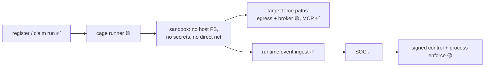

# Agent Cage

> **Status:** Partial. The cage-runner binary, Docker runtime, packaging, claim lifecycle, and Docker E2E exist; sensor IPC, forced egress, and the complete unknown-agent-to-incident force path remain unfinished.

## Overview

The cage is a disposable, locked room for agents you don't trust: no host files, no real credentials, no direct internet. Everything the agent tries must go through Aegis doors — or it doesn't work at all.

## Why it exists

The SDK protects agents that *cooperate*. Unknown or hostile agents need controls they cannot opt out of. The cage removes the ambient environment so the choke points become the environment.

## How it works

1. A run is registered with the gateway (`POST /v1/agent-cage/runs` — this API exists today).
2. A runner claims the run and launches a hardened disposable Docker sandbox.
3. The supported sandbox configuration isolates workspace/process settings and avoids placing provider credentials in the workload.
4. The target force path sends network through the egress proxy and privileged tools through the broker; those mandatory integrations are not complete.
5. Runtime telemetry streams back (`POST /v1/ingest/runtime-events` — exists today).
6. Dangerous behavior → signed kill/quarantine/ban commands; the workspace is preserved as evidence.

## Visual



## Technical details

Docker-first sandbox (gVisor/Firecracker/Kata later); the gateway **never** runs untrusted agents in-process. Full requirements, sandbox spec, and workspace lifecycle: [../AegisAgent_Agent_Cage.md](../AegisAgent_Agent_Cage.md) (normative design). Command security: [../AegisAgent_Control_Command_Protocol.md](../AegisAgent_Control_Command_Protocol.md).

## Related code

Gateway-side: `lib/storage/src/db/agent_runs.rs`, `runtime_events.rs`, `quarantine.rs`, and `src/src/routes/runtime.rs`. Runner: `bins/aegis-cage-runner/`, Dockerfile, Compose cage profile, Helm chart, and `scripts/cage-docker-e2e.sh`.

## Current status

Partial. Local/Kubernetes beta components exist, but the product-level force path is not complete. See [Implementation Status](../Implementation_Status.md).

## What can go wrong

The cage only contains what runs inside it — running an unknown agent *outside* the cage is an operator decision Aegis can't fix. Design-stage risks (sandbox escape, sensor bypass) are tracked in [../AegisAgent_Threat_Model.md](../AegisAgent_Threat_Model.md).

## Example

```bash
docker compose --profile cage up --build -d
bash scripts/cage-docker-e2e.sh
```

Run only on a host where mounting or controlling Docker is explicitly approved. Success proves the exercised Docker lifecycle and signed-kill scenario, not forced egress or complete sensor collection.

## Security

The runner must never execute untrusted workloads inside the gateway process. Harden container creation, restrict the Docker socket/daemon boundary, avoid raw credentials, use typed signed controls, and preserve the workspace before destructive containment. A Docker sandbox is not automatically equivalent to gVisor, Kata, or a VM boundary.

## Operations

Monitor run claim/lease/heartbeat, runner availability, sandbox lifecycle, command ACK/NACK, runtime-event freshness, and workspace retention. On runner or sensor loss, stop assigning runs and quarantine affected workloads using external platform controls. Follow [Cage Docker Security](../AegisAgent_Cage_Docker_Security.md) before production evaluation.

## Related docs

[../flows/Unknown_Agent_Cage_Flow.md](../flows/Unknown_Agent_Cage_Flow.md) · [Node_Sensor.md](Node_Sensor.md) · [Egress_Proxy.md](Egress_Proxy.md) · [Tool_Broker.md](Tool_Broker.md) · [../AegisAgent_Runtime_Data_Plane.md](../AegisAgent_Runtime_Data_Plane.md)
