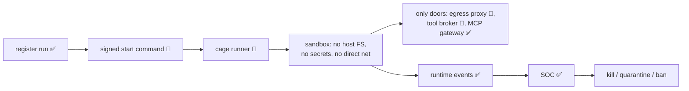

# Agent Cage

## Simple version

The cage is a disposable, locked room for agents you don't trust: no host files, no real credentials, no direct internet. Everything the agent tries must go through Aegis doors — or it doesn't work at all.

## Why it exists

The SDK protects agents that *cooperate*. Unknown or hostile agents need controls they cannot opt out of. The cage removes the ambient environment so the choke points become the environment.

## How it works (target design)

1. A run is registered with the gateway (`POST /v1/agent-cage/runs` — this API exists today).
2. The gateway sends a signed `start_run` command to a node sensor.
3. The cage runner launches a disposable sandbox: isolated workspace, no host filesystem, no Docker socket, no raw secrets.
4. The sandbox's only working paths are Aegis choke points: network → egress proxy, tools → tool broker, MCP → MCP gateway.
5. Runtime telemetry streams back (`POST /v1/ingest/runtime-events` — exists today).
6. Dangerous behavior → signed kill/quarantine/ban commands; the workspace is preserved as evidence.

## Visual

## Technical details

Docker-first sandbox (gVisor/Firecracker/Kata later); the gateway **never** runs untrusted agents in-process. Full requirements, sandbox spec, and workspace lifecycle: [../AegisAgent_Agent_Cage.md](../AegisAgent_Agent_Cage.md) (normative design). Command security: [../AegisAgent_Control_Command_Protocol.md](../AegisAgent_Control_Command_Protocol.md).

## Related code

Gateway-side (exists): `lib/storage/src/db/agent_runs.rs`, `lib/storage/src/db/runtime_events.rs`, `lib/storage/src/db/quarantine.rs`, migrations 0026–0030, `src/src/routes/runtime.rs` (at HEAD). Cage runner binary: **Planned. No implementation files yet.**

## Current status

Planned (Phase 4). Control-plane APIs and storage: Partial. See [../Implementation_Status.md](../Implementation_Status.md).

## What can go wrong

The cage only contains what runs inside it — running an unknown agent *outside* the cage is an operator decision Aegis can't fix. Design-stage risks (sandbox escape, sensor bypass) are tracked in [../AegisAgent_Threat_Model.md](../AegisAgent_Threat_Model.md).

## Related docs

[../flows/Unknown_Agent_Cage_Flow.md](../flows/Unknown_Agent_Cage_Flow.md) · [Node_Sensor.md](Node_Sensor.md) · [Egress_Proxy.md](Egress_Proxy.md) · [Tool_Broker.md](Tool_Broker.md) · [../AegisAgent_Runtime_Data_Plane.md](../AegisAgent_Runtime_Data_Plane.md)
