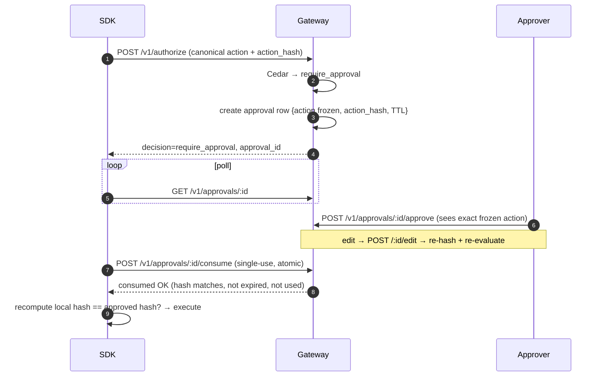

# Approval Integrity

**Status: ✅ Implemented** (core differentiator #1)

## 1. One-sentence summary

A human approval in AegisAgent is cryptographically bound to the SHA-256 hash of the *frozen, canonicalized action*, and the SDK fails closed if anything else would execute.

## 2. Why it exists

Most human-in-the-loop systems approve a **description** of an action. Between approval and execution, the action can be swapped (TOCTOU), replayed, or rendered differently than the bytes that run. If the approval doesn't bind to the exact bytes, the human is approving theater.

## 3. Mental model

A notarized contract: the approver signs a specific document's fingerprint, not "roughly this deal." Change a comma, the fingerprint changes, the signature no longer applies, execution is refused.

## 4. Architecture & flow



## 5. The guarantees, one by one

| Attack | Defense | Where |
|---|---|---|
| Approve-then-swap (parameters changed after approval) | approval binds `action_hash`; consume + SDK re-check compare hashes | `routes/approval.rs`, SDK clients |
| Replay (reuse an old approval) | single-use **atomic** consume; TTL expiry (`AEGIS_APPROVAL_TTL_SECS`, default 1800 s) | `db/approvals.rs` |
| Render-vs-bytes (UI shows one thing, bytes differ) | approver is shown the *frozen canonical action*; hash covers bytes, not rendering | console approvals view |
| Edited approvals silently diverging | `POST /:id/edit` re-canonicalizes, re-hashes (`effective_call_hash`, migration 0024) and **re-evaluates policy** | `routes/approval.rs` |
| Brute-forcing approval IDs | per-IP rate limit + per-`approval_id` failed-attempt tracker → 429 (fail closed) | `ApprovalAttemptTracker` in `routes/mod.rs` (#1307) |
| Unicode / encoding tricks in identifiers | tool identifiers NFC-normalized + percent-decoded before lookups; the hash always uses the original bytes | `normalize_tool_identifier` (#1335) |

## 6. Key data structures

- **Canonical action** (`aegis-jcs-1`) → `action_hash` — see [action-receipt-spec.md](../action-receipt-spec.md) §canonicalization.
- **`approvals` row** — tenant_id, agent, frozen action JSON, `action_hash`, `effective_call_hash` (post-edit), status (`pending/approved/rejected/expired/consumed`), approver, timestamps.

## 7. APIs

`GET /v1/approvals` · `GET /v1/approvals/:id` · `POST /v1/approvals/:id/{approve,reject,edit,consume}` · Slack interactive callback `POST /v1/callbacks/slack` (HMAC-verified, fail-closed 404 without `AEGIS_SLACK_SIGNING_SECRET`). Full schemas: [api-reference.md](../api-reference.md).

## 8. Storage

`approvals` table (baseline migration) + `0024_approval_effective_call_hash.sql`. Every query binds `tenant_id`.

## 9. Failure behavior

- Expired / already-consumed / unknown approval → consume returns 4xx → SDK refuses to execute.
- Gateway unreachable during consume → SDK refuses (mutating/high-risk).
- Hash mismatch at any point → refuse. There is no "warn and continue" path.

## 10. Example

```bash
# agent hits require_approval; approver acts:
curl -X POST $AEGIS/v1/approvals/$ID/approve -H "Authorization: Bearer $TOKEN"
# SDK consumes exactly once:
curl -X POST $AEGIS/v1/approvals/$ID/consume -H "Authorization: Bearer $TOKEN"
# second consume → 409 (already consumed)
```

Demo: `python3 examples/approve_then_swap_demo.py` — the swap is refused live. Walkthrough: [approve-then-swap-demo.md](../approve-then-swap-demo.md).

## 11. Common mistakes

- Approving from a summary and assuming parameters can't change — they can't *take effect*, but review the frozen action anyway.
- Setting a huge TTL "for convenience" — the TTL is the replay window.
- Building a custom client that executes on `approved` status without calling **consume** — consume is the single-use gate; polling status is not enough.

## 12. Debugging

- `GET /v1/approvals/:id` — inspect status + hashes.
- 429 on approval endpoints → check `ApprovalAttemptTracker` limits (someone/something is guessing IDs).
- Metric `approval_hash_mismatch_total` on `/metrics` — nonzero means swaps are being attempted (that's a SOC signal, not a bug).

## 13. Related code

`src/src/routes/approval.rs` · `lib/storage/src/db/approvals.rs` · `lib/api/src/models.rs` (approval models) · `sdk-python/aegisagent/{client,decorator}.py` · `sdk-go/aegis/protect.go` · `sdk-typescript/src/protect.ts` · tests in each SDK + gateway integration tests.

## 14. Related docs

[Last_Mile_System_Walkthrough.md](../Last_Mile_System_Walkthrough.md) Act IV · [flows/Known_Agent_Flow.md](../flows/Known_Agent_Flow.md) · [AegisAgent_Threat_Model.md](../AegisAgent_Threat_Model.md) (T-A) · [fail-closed-behavior.md](../fail-closed-behavior.md) · [components/Receipt_Engine.md](Receipt_Engine.md)
