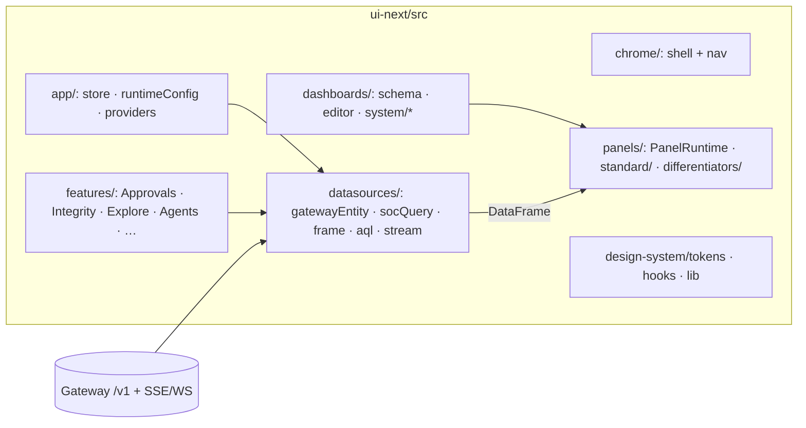

# UI Guide — the SOC Console

**One sentence:** the console is a schema-driven Bun SPA (`ui-next/`) served by the gateway at `/dashboard`, where dashboards are data, panels render frames, and every pixel maps to a `/v1` API.

> **Production tree:** `ui-next/` only (Bun + Vite + React 19). Binding contracts: [Console_UI_Bun_Contracts.md](./Console_UI_Bun_Contracts.md).

Hands-on onboarding: [onboarding/For_Frontend_Engineer.md](../onboarding/For_Frontend_Engineer.md). Design system: [AegisAgent_SOC_Console_Design_System.md](../AegisAgent_SOC_Console_Design_System.md). UX model: [AegisAgent_SOC_UI_Design.md](../AegisAgent_SOC_UI_Design.md).

## 1. App architecture

Build output `ui-next/dist` is served by the gateway (`src/src/routes/dashboard.rs` — `/dashboard`, `/dashboard/*path`). Same-origin auth; no CORS gymnastics.

## 2. The dashboard schema

Dashboards conform to `ui-next/src/dashboards/schema.ts`: metadata + time range + layout rows of panels. Each panel is a `PanelDefinition` (`type`, `datasourceId`, optional `entity` / `snapshot` / `aggregate` / `options` / `drilldowns`).

Built-in **system templates** (copy-only in the editor; reserved UIDs) live in `ui-next/src/dashboards/system/`:

| UID | Board | Notable panels |
|---|---|---|
| `overview` | Tenant posture now | stats, **timeseries**, **heatmap**, **agent-risk-map**, feeds |
| `fleet` | Agent workforce | **agent-risk-map**, agent table |
| `integrity` | Receipt chain | **receipt-integrity**, **provable-timeline** |
| `approvals` | HITL queue | **approval-card** |
| `incidents` | SOC cases | table + **decision-graph** (latest case) |
| `detections` | Triggered alerts | tables / stats |
| `mcp` | MCP registry | tables / status |
| `rules` | Detection rules | tables |
| `alerting` | Webhook subscriptions | tables |
| `explore` | Explore template | AQL-oriented layout |

Tenant-editable boards: `GET/POST /v1/soc/dashboards`, `GET/PUT/DELETE /v1/soc/dashboards/:uid` (Phase D editor).

## 3. Datasources → frames → panels

Datasources (registered in `datasources/registry.ts`) normalize into **frames** (`frame.ts`). **Panels never fetch list data themselves** — `PanelRuntime` builds a `QueryRequest` and passes a `DataFrame` (differentiator panels may call mutation/verify/export helpers with operator context).

| Datasource | Role |
|---|---|
| `gateway-entity` | REST entities + snapshots (`tenant-stats`, `soc-summary`, `agent-scoreboard`, …) |
| `soc-query` | `POST /v1/soc/query` — `count_over_time` / `count_by` (absolute time tokens) |
| stream helpers | SSE/WS live tail (ControlsBar / feed) |
| `aql/` | Explore compile/autocomplete → structured filters |

### Panel registry (complete allowlist)

Registered in `ui-next/src/panels/registry.ts` (types in `panels/types.ts`). Zero chart-library dependency for v1 charts (pure SVG).

**Standard** (`panels/standard/`):

| Type | Renders |
|---|---|
| `stat` | Single number + optional thresholds |
| `table` | Columnar frame (badges for decision/trust/hash) |
| `timeseries` | SVG series from `count_over_time` (`bucket`/`count`) |
| `heatmap` | SVG categorical intensity from `count_by` (`value`/`count`) |
| `status` | Health / state chips |
| `feed` | Live-ish event list |
| `note` | Static markdown-ish body (no fetch) |

**Differentiators / fleet** (`panels/differentiators/`):

| Type | Renders | Primary APIs |
|---|---|---|
| `approval-card` ★ | Frozen action + `action_hash` + Approve/Reject | `/v1/approvals`, approve/reject |
| `provable-timeline` ★ | Receipt rows + per-row Verify | `/v1/receipts`, `…/verify` |
| `receipt-integrity` ★ | Chain summary + Verify range + evidence ZIPs | `verify-range`, `/v1/evidence/export`, compliance pack |
| `agent-risk-map` | Ranked 24h composite risk (advisory only) | `GET /v1/agents/risk-scoreboard` |
| `decision-graph` | Layered evidence graph SVG | `GET /v1/graph/{incident\|agent\|run}/:id` |

PR trail for charts + differentiators: **#1821–#1828**.

## 4. State, auth, tenancy

`app/store.ts` (client state) + `lib/http/client.ts` (fetch) + `app/runtimeConfig.ts`. Auth is the same bearer token as the API. Gateway enforces tenant scoping via `X-Aegis-Tenant-ID` — the UI never “filters tenants” client-side for isolation. Fail-closed: empty tenant blocks `/v1` calls.

## 5. Feature surfaces → backend APIs

| UI surface | Backing APIs |
|---|---|
| Approvals review | `GET /v1/approvals`, `POST /v1/approvals/:id/{approve,reject,edit}` |
| Integrity / receipts | `GET /v1/receipts*`, verify / verify-range, evidence packs |
| Incidents / graph | `GET /v1/incidents[/:id]`, `GET /v1/graph/incident/:id`, evidence-pack ZIP |
| Fleet / agent actions | `GET /v1/agents`, freeze/unfreeze/revoke/restore, risk-scoreboard |
| Explore | AQL → decisions / `POST /v1/soc/query` |
| Overview analytics | `POST /v1/soc/query` (`count_over_time`, `count_by`), snapshots |
| Live stream | ControlsBar stream subscription (gateway SSE/WS) |
| Tenant dashboards | `/v1/soc/dashboards` |

## 6. Planned UI (📐 — do not document as shipped)

Agent-cage console (runs list, runtime timeline, kill/quarantine over control commands) remains Phase 9 of [AegisAgent_Phased_PR_Plan.md](../AegisAgent_Phased_PR_Plan.md). Status: [Implementation_Status.md](../Implementation_Status.md).

North-star chart libs (uPlot / ECharts / TanStack virtual table) stay swappable behind the panel registry — not required for the current SVG v1.

## 7. Testing

- Unit: `cd ui-next && bun test` (Bun test runner; colocated `*.test.ts`)
- Typecheck / lint: `bun run typecheck`, `bun run lint` (oxlint)
- E2E: Playwright in `e2e/` (`dashboard-*.spec.ts`, `mocked-soc-workflows.spec.ts`) against gateway + mock fixtures

## 8. Related docs

[Console_UI_Bun_Contracts.md](./Console_UI_Bun_Contracts.md) · [onboarding/For_Frontend_Engineer.md](../onboarding/For_Frontend_Engineer.md) · [AegisAgent_SOC_UI_Design.md](../AegisAgent_SOC_UI_Design.md) · [evidence-graph.md](../evidence-graph.md) · [api-reference.md](../api-reference.md) · `ui-next/README.md`
