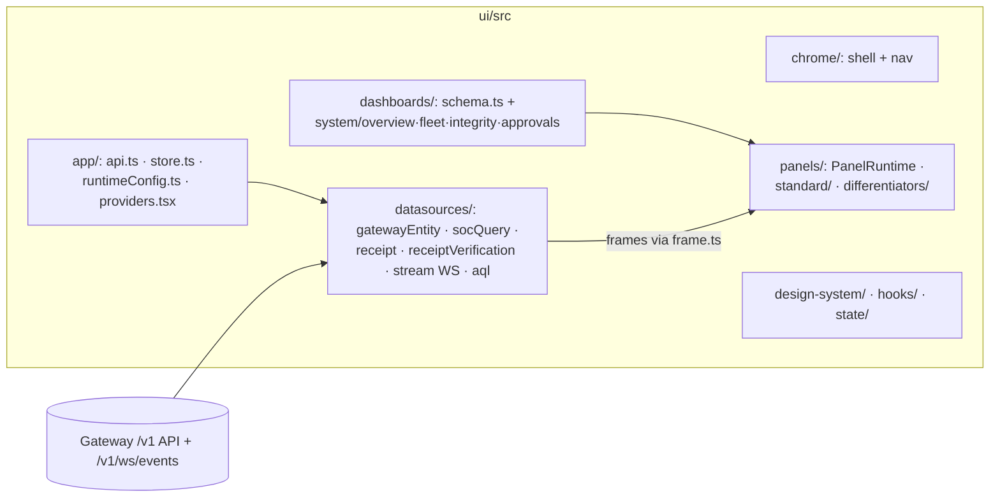

# UI Guide — the SOC Console

**One sentence:** the console is a schema-driven Bun SPA (`ui-next/`) served by the gateway at `/dashboard`, where dashboards are data, panels render frames, and every pixel maps to a `/v1` API.

> **Cutover (Phase E):** production is `ui-next/` only. Binding contracts: [Console_UI_Bun_Contracts.md](./Console_UI_Bun_Contracts.md). Paths below that still say `ui/` refer to historical Next layout; use `ui-next/src/…` for current code.

Hands-on onboarding: [onboarding/For_Frontend_Engineer.md](../onboarding/For_Frontend_Engineer.md). Design system: [AegisAgent_SOC_Console_Design_System.md](../AegisAgent_SOC_Console_Design_System.md). UX model: [AegisAgent_SOC_UI_Design.md](../AegisAgent_SOC_UI_Design.md).

## 1. App architecture

Build output `ui/dist` is served by the gateway (`src/src/routes/dashboard.rs`, routes `/dashboard`, `/dashboard/*path`) — one deployable, no CORS gymnastics, same-origin auth.

## 2. The dashboard schema

Dashboards conform to `ui/src/dashboards/schema.ts`: a dashboard = metadata + layout + panels; each panel = `{type, datasource, query, transforms, options}`. Built-ins in `dashboards/system/`:

| Dashboard | Answers |
|---|---|
| `overview.ts` | what's happening now — decisions, alerts, live stream |
| `fleet.ts` | agent workforce state — statuses, risk, activity |
| `integrity.ts` | receipts + chain verification health (the differentiator surface) |
| `approvals.ts` | pending approvals with the frozen action for review |

## 3. Datasources → frames → panels

Datasources (registered in `datasources/registry.ts`) fetch and normalize into **frames** (`frame.ts`) — panels never see raw API JSON:

- `gatewayEntity.ts` — REST entities (agents, approvals, decisions, incidents…)
- `socQuery.ts` — `POST /v1/soc/query` structured analytics
- `receipt.ts` / `receiptVerification.ts` — receipts + verify endpoints
- `stream.ts` — WebSocket `GET /v1/ws/events` live tail
- `aql/` — query-language helpers for the explore surface

Panels: `panels/standard/` (tables, stats, timeseries) and `panels/differentiators/` (approval-review, receipt-chain visualizations), executed by `PanelRuntime.tsx`.

## 4. State, auth, tenancy

`app/store.ts` (client state) + `app/api.ts` (fetch layer) + `app/runtimeConfig.ts` (gateway URL/config at runtime — nothing baked in). Auth is the same bearer token the API uses; the gateway enforces tenant scoping, so the UI never filters tenants client-side.

## 5. Feature surfaces → backend APIs

| UI surface | Backing APIs |
|---|---|
| Approvals review | `GET /v1/approvals`, `POST /v1/approvals/:id/{approve,reject,edit}` |
| Receipts / integrity | `GET /v1/receipts*`, verify endpoints, `chain-head` |
| Incidents / alerts | `GET /v1/alerts`, `GET /v1/incidents[/:id]`, `narrate`, `close` |
| Fleet / agent actions | `GET /v1/agents`, freeze/unfreeze/revoke/restore |
| Live stream | `GET /v1/ws/events` |
| Stats/timeseries | `GET /v1/stats`, `GET /v1/decisions/timeseries`, `GET /v1/soc/summary` |

## 6. Planned UI (📐 — do not document as shipped)

Agent-cage console (runs list, runtime timeline, kill/quarantine buttons over control commands) is Phase 9 of [AegisAgent_Phased_PR_Plan.md](../AegisAgent_Phased_PR_Plan.md); the backing timeline API partially exists (`GET /v1/runtime/runs/:id/events`). Status: [Implementation_Status.md](../Implementation_Status.md).

## 7. Testing

Vitest unit tests colocated (`*.test.ts` — datasources, store, runtimeConfig) · `cd ui && npm test` · full-stack Playwright in `e2e/` against a running gateway. Visual/UX changes should respect the design-system tokens in `ui/src/design-system/`.

## 8. Related docs

[onboarding/For_Frontend_Engineer.md](../onboarding/For_Frontend_Engineer.md) · [AegisAgent_SOC_UI_Design.md](../AegisAgent_SOC_UI_Design.md) · [api-reference.md](../api-reference.md) · `ui/README.md`
