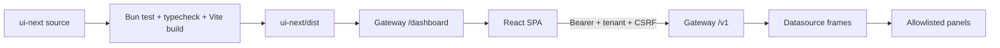

# Console UI contracts — Bun rewrite (product of record)

**Status:** binding for `ui-next/` (production console) — **rewrite complete**  
**Stack:** Bun + Vite + React 19 + TanStack Query + Zustand + react-router (`/dashboard/`)  
**Phases:** 0–F shipped; post-phase catalog polish through Explore template (#1819)

## Overview

This page defines the binding build, serving, tenant, token, route, panel, and theme contracts for the production console artifact. It is a reference for frontend, gateway, Docker, CI, and E2E changes.

## Why This Exists

The console spans multiple owners. Without explicit contracts, a frontend build can succeed while the gateway serves the wrong directory, state-changing requests omit CSRF, tenantless queries run, or a panel silently changes the meaning of security evidence.

## Architecture



## 1. Deploy / serve contract

| Item | Value |
|---|---|
| Artifact directory | `ui-next/dist` (also copied to `ui/dist` in the Docker image for path compatibility) |
| Gateway routes | `GET /dashboard/`, `GET /dashboard/*path` |
| Gateway handler | `src/src/routes/dashboard.rs` |
| Vite `base` | `/dashboard/` |
| CSRF | Gateway injects `<meta name="csrf-token">` + `aegis_csrf` cookie on index |
| Client header | `X-CSRF-Token` on state-changing requests when meta present |
| Tenant header | `X-Aegis-Tenant-ID` required on all `/v1` calls from console |
| Auth | `Authorization: Bearer <token>` |
| Demo env | `VITE_AEGIS_DEMO_MODE=true`, `VITE_AEGIS_GATEWAY_URL=http://127.0.0.1:8080` |

## 2. Fail-closed tenant gate

No SOC fetch may run with empty `tenantId`. Client throws:

`A tenant must be selected before calling the AegisAgent gateway.`

## 3. Production token policy

- Demo mode may persist bearer in `localStorage`.  
- Production must **not** persist bearer; strip on load.

## 4. P0 surfaces (shipped)

| # | Surface | Status |
|---|---|---|
| 1 | Settings / connection (+ operator id) | Shipped |
| 2 | Overview (schema-driven `DashboardLoader`) | Shipped (Phase B) |
| 3 | Approvals (`GET/POST /v1/approvals…`) | Shipped |
| 4 | Integrity / receipts (list + verify + verify-range) | Shipped |
| 5 | Explore (AQL → `/v1/decisions`) | Shipped (Phase A) |
| 6 | Agents fleet + detail + controls | Shipped (Phase C) |
| 7 | Incidents + evidence pack | Shipped |
| 8 | MCP registry + quarantine + history | Shipped (Phase C) |
| 9 | Approval edit + evidence export | Shipped |
| 10 | Detections / Rules / Alerting | Shipped (Phase 5) |
| 11 | ControlsBar (time range + live stream) | Shipped (Phase C) |
| 12 | Dashboard editor (`/v1/soc/dashboards`) | Shipped (Phase D) |
| 13 | System dashboard catalog (copy templates) | Overview, Integrity, Fleet, Approvals, Incidents, Detections, MCP, Rules, Alerting, Explore |
| 14 | Lazy routes + route error boundary | Shipped |

### Phase 2–3 API map

| UI action | Gateway |
|---|---|
| List pending approvals | `GET /v1/approvals` |
| Approve | `POST /v1/approvals/:id/approve` body `{approver_user_id, reason}` |
| Reject | `POST /v1/approvals/:id/reject` body `{approver_user_id, reason}` |
| Edit (re-hash) | `POST /v1/approvals/:id/edit` body `{approver_user_id, edited_tool_call, reason}` |
| List receipts | `GET /v1/receipts?limit=` |
| Verify one | `GET /v1/receipts/:id/verify` (`verified` boolean, fail-closed normalize) |
| Verify range | `POST /v1/receipts/verify-range` |
| Investigation export | `POST /v1/evidence/export` → ZIP |
| Compliance export | `GET /v1/compliance/evidence-pack` → ZIP |
| Explore | `GET /v1/decisions?limit=&q=&agent_id=&decision=&source_trust=&skill=` |
| Agents | `GET /v1/agents`; `POST …/freeze|unfreeze|restore|revoke` |
| Incidents | `GET /v1/incidents`; `GET /v1/incidents/:id`; `GET …/evidence-pack` |
| Evidence graph | `GET /v1/graph/incident/:id`; `GET /v1/graph/agent/:id`; `GET /v1/graph/run/:id` |
| SOC analytics | `POST /v1/soc/query` (`count_over_time`, `count_by`) |
| Agent risk scoreboard | `GET /v1/agents/risk-scoreboard` (advisory composite score) |
| MCP | `GET /v1/mcp/servers`; tools; quarantine/restore |
| Tenant dashboards | `GET/POST /v1/soc/dashboards`; `GET/PUT/DELETE /v1/soc/dashboards/:uid` |

## 4b. Panel suite (complete)

Allowlisted `PanelType` values are all registered in `ui-next/src/panels/registry.ts`. Product inventory: [Console_UI.md §3](./Console_UI.md).

| Class | Types |
|---|---|
| Standard | `stat`, `table`, `timeseries`, `heatmap`, `status`, `feed`, `note` |
| Differentiators ★ | `approval-card`, `provable-timeline`, `receipt-integrity` |
| Fleet / investigation | `agent-risk-map`, `decision-graph` |

Typed but unused in the editor catalog until needed: `agent-table` (alias of table patterns). Chart rendering is pure SVG (no uPlot/ECharts dependency yet).

## 5. Build commands

```bash
cd ui-next
bun install --frozen-lockfile
bun test
bun run build
# serve: gateway reads ui-next/dist (or AEGIS_UI_DIST)
```

## 6. Cutover (Phase E — complete)

| Step | Status |
|---|---|
| CI `ui-next` job: `bun test` + `bun run build` | Done |
| Docker builds Bun SPA into image | Done (`src/Dockerfile` → `/app/ui/dist` + `/app/ui-next/dist`) |
| Gateway dist resolution | Done (`AEGIS_UI_DIST`, `AEGIS_UI_BUNDLE=next\|legacy`) |
| CSRF meta + cookie on index | Unchanged (`dashboard.rs`) |
| Playwright for ui-next routes | Done (`e2e/tests/dashboard-*.spec.ts`) — Phase E expands ControlsBar, Dashboards, agent detail, detections/rules/alerting |
| Default image env `AEGIS_UI_BUNDLE=next` | Done |
| Remove Next `ui/` tree | **Done (Phase E)** — single tree is `ui-next/` |
| Re-port mocked workflows (#1638) | **Done (Phase F)** — `e2e/tests/mocked-soc-workflows.spec.ts` against ui-next |
| Display secret redaction | **Done (Phase F)** — `ui-next/src/lib/redact.ts` on Approvals tool-call previews |
| A11y baseline | **Done (Phase F)** — skip link, `main#main-content`, Settings `aria-label`s, reduced-motion |
| System catalog (10 boards) | **Done** — copy-only templates in `ui-next/src/dashboards/system/` (#1815–#1820) |
| Lazy routes + error boundary | **Done** — feature chunks + `RouteErrorBoundary` |
| Playwright freeze/confirm fixes | **Done** — exact control names + ui-next Confirm labels |
| Chart panels (`timeseries`, `heatmap`) | **Done** — pure SVG + `soc-query` (#1821–#1822) |
| Differentiator panels ★ | **Done** — approval-card, provable-timeline, receipt-integrity (#1824–#1826) |
| Fleet / evidence graph panels | **Done** — agent-risk-map, decision-graph (#1827–#1828) |

### 6.1 System dashboard catalog (editor)

Read-only templates under **System (read-only)** on `/dashboard/dashboards`. Copy rewrites `uid`/`title`; reserved UIDs cannot be saved as tenant boards.

| UID | Title |
|-----|--------|
| `overview` | SOC Overview |
| `integrity` | Integrity |
| `fleet` | Agent fleet |
| `approvals` | Approvals |
| `incidents` | Incidents |
| `detections` | Detections |
| `mcp` | MCP registry |
| `rules` | Rules |
| `alerting` | Alerting |
| `explore` | Explore |

Not templated (by design): `settings`, `dashboards` (chrome), `analytics`/`runtime` (future), `receipts` (use integrity).

**Runtime env:**

| Variable | Effect |
|---|---|
| `AEGIS_UI_DIST` | Absolute/relative path override to SPA root containing `index.html` |
| `AEGIS_UI_BUNDLE=next` | Force `ui-next/dist` |
| `AEGIS_UI_BUNDLE=legacy` | Force `ui/dist` (image still copies Bun SPA here for path compatibility) |
| *(unset)* | Prefer `ui-next/dist` if `index.html` exists, else `ui/dist` |

## 7. Theme contract (product of record)

| Mode | `data-theme` | Role |
|---|---|---|
| **Dark SOC (default)** | `dark-soc` | Primary operator experience |
| Light | `light` | Daytime / print / evidence export |
| OLED | `oled` | True-black wall / NOC displays |

- Token source: `ui-next/src/design-system/tokens.css`.
- Design system: `docs/AegisAgent_SOC_Console_Design_System.md` §3.
- Density: `data-density` = `compact` (default) | `cozy`.
- **Anti-template:** no stock Material / Ant / full shadcn skin. One brand accent (indigo); severity, decision, and trust ramps are reserved (never used for chrome decoration).
- Persistence keys: `aegis_theme`, `aegis_density` in `localStorage`.

## Security

Production bearer tokens must not persist in browser storage. Empty tenant blocks requests. State-changing requests use the injected CSRF value. Panel/datasource types are allowlisted, attacker-controlled text is escaped/redacted, and visual thresholds cannot change deterministic decision meaning.

## Operations

CI must run Bun tests, typecheck/build, gateway asset serving tests, and relevant Playwright workflows. A rollout verifies the selected bundle, `/dashboard/` deep links, runtime configuration, authentication, tenant scope, CSRF, and one evidence mutation/verification flow. Roll back the UI artifact with a compatible gateway API.

## References

[Console UI Guide](Console_UI.md) · [Frontend Onboarding](../onboarding/For_Frontend_Engineer.md) · [Console Design System](../AegisAgent_SOC_Console_Design_System.md) · [API Reference](../api-reference.md) · [Implementation Status](../Implementation_Status.md)
