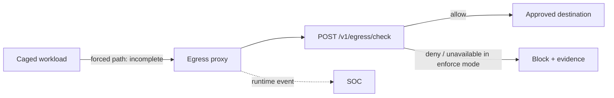

# Egress Proxy (`aegis-egress-proxy`)

**Status: 🟡 Partial** — the proxy binary, policy-check route, tests, Dockerfile, Compose, and Helm packaging exist. Forced transparent cage networking and an always-on path remain incomplete; implementation tracking: [Implementation Status](../Implementation_Status.md).

## Overview

The egress proxy is the network choke point for caged workloads: the intended supported topology gives sandboxes no direct internet, so tenant policy can allow, block, and evidence outbound requests.

## 2. Why it exists

Data exfiltration is the endgame of most agent attacks (secrets to attacker domains, prompt-injected "post this to pastebin"). Filtering text is evadable; removing the network path is not. The proxy makes egress *observable and deniable by policy*.

## 3. Mental model

A shipping dock with a customs desk: the warehouse (sandbox) has no other doors. Every parcel is logged, checked against the manifest (allowlist), and refused if the destination isn't approved — and refused parcels are themselves evidence.

## 4. Architecture



## 5. Current and target behavior

- Deployment shapes: host proxy, sidecar, DaemonSet, or service-mesh egress hop ([AegisAgent_Runtime_Data_Plane.md](../AegisAgent_Runtime_Data_Plane.md) §2).
- Enforcement modes: **observe** (log all), **enforce** (allowlist), **lockdown** (deny all except Aegis control endpoints).
- Policy source: tenant egress rules from the gateway (domains/CIDRs/ports per run or agent).
- Every allow/deny emits a runtime event (`network_egress` type) → `POST /v1/ingest/runtime-events` ✅ (ingest path exists) → SOC detections (e.g. repeated blocked egress = exfil attempt alert).
- Cage integration: `aegis-cage-runner` wires sandbox networking so the proxy is the only route ([AegisAgent_Agent_Cage.md](../AegisAgent_Agent_Cage.md)); DNS is resolved/controlled at the proxy to stop DNS tunneling of destinations.
- Fail closed: if the proxy can't reach the gateway for policy, enforce/lockdown modes deny-by-default.

## 6. Honest scope

The proxy only controls traffic **forced through it**. A workload outside the cage with its own network path is not controlled by this component — that is exactly why anonymous agents are only ever run caged, and why sensor telemetry watching for non-proxy traffic is a detection signal.

## Example

```bash
cargo test -p aegis-egress
cargo test -p aegis-egress-proxy
```

These tests verify library/proxy behavior. They do not prove transparent network enforcement; that requires the cage network integration E2E.

## Security

Enforce mode must deny when required policy cannot be obtained, prevent destination confusion through DNS/IP normalization, block loopback/link-local/metadata endpoints as policy requires, and avoid logging credentials or sensitive bodies. DNS must not become an uncontrolled bypass channel.

## Operations

Monitor allow/deny counts, decision latency, gateway reachability, DNS errors, bypass signals, and event drops. If the proxy fails in an enforced cage topology, block egress and stop new runs; do not silently restore direct networking.

## References

[AegisAgent_Agent_Cage.md](../AegisAgent_Agent_Cage.md) · [AegisAgent_Runtime_Data_Plane.md](../AegisAgent_Runtime_Data_Plane.md) · [components/Node_Sensor.md](Node_Sensor.md) · [flows/Unknown_Agent_Cage_Flow.md](../flows/Unknown_Agent_Cage_Flow.md) · roadmap: [AegisAgent_Phased_PR_Plan.md](../AegisAgent_Phased_PR_Plan.md) §Phase 5 · threat context: [AegisAgent_Threat_Model.md](../AegisAgent_Threat_Model.md), [runbooks/data-exfiltration.md](../runbooks/data-exfiltration.md)
