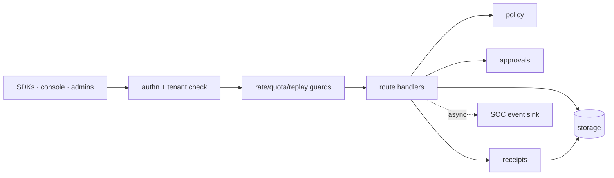

# Gateway

## Simple version

The gateway is the front door. Every request from agents, SDKs, the console, and admins goes through it — it authenticates the caller, makes the decision, writes the evidence, and hosts everything else.

## Why it exists

There has to be exactly one place where "may this action run?" is answered. Distributing that decision means distributing the bugs and losing the audit trail.

## How it works

1. A request arrives (REST `:8080` or gRPC `:6334`).
2. The `TenantId` extractor authenticates (JWT or tenant bearer token; optional agent mTLS) and verifies the tenant exists (bloom-filter fast path).
3. Rate limits, quotas, and replay protection run.
4. The handler calls the policy engine, approval engine, or storage — all behind `Arc<dyn StorageBackend>`.
5. Decisions, audit rows, and receipts are written; SOC events are emitted asynchronously.
6. The same process serves the console at `/dashboard` and health endpoints (`/livez`, `/readyz`, `/startupz`, `/metrics`).

## Visual

## Technical details

Axum router wired in `src/src/main.rs`; handlers in `src/src/routes/` (authorize, agents, approval, receipts, policy, soc, mcp, tenant, webhooks, playbook, dashboard, graph, openapi). gRPC mirrors in `src/src/grpc.rs` (proto in `lib/api/proto/`). Hot-path caches (`SkillActionCache`, MCP caches, `RiskWeightsCache`, replay-nonce LRU) cache registration metadata only — never decisions. Startup fails closed on misconfiguration (e.g. encryption key without sqlcipher build). OpenAPI is generated from route metadata (`src/src/bin/export_openapi.rs` → [../api-reference.md](../api-reference.md)).

## Related code

`src/src/main.rs` · `src/src/routes/` · `src/src/grpc.rs` · `src/src/mtls.rs` · `src/src/otel.rs` · `lib/api/`

## Current status

Implemented (production-hardened; see [../production-hardening.md](../production-hardening.md)).

## What can go wrong

401s are usually agent status (frozen/quarantined/revoked) or token format, not policy. 429s are the guard rails. Multi-instance writes need Postgres (#1194) — SQLite is single-writer.

## Related docs

[../Architecture_Overview.md](../Architecture_Overview.md) · [../runtime-authorization-api.md](../runtime-authorization-api.md) · [../Repo_Knowledge_Map.md](../Repo_Knowledge_Map.md) · [Policy_Engine.md](Policy_Engine.md) · [Storage.md](Storage.md)
