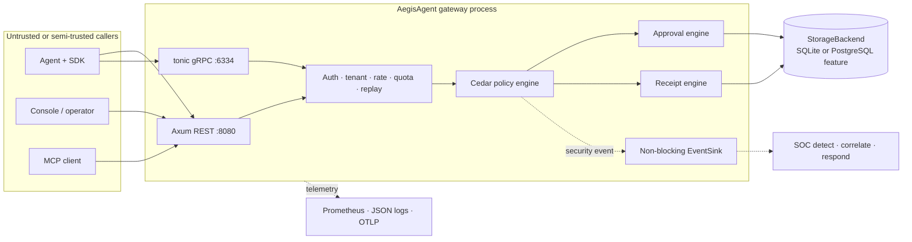
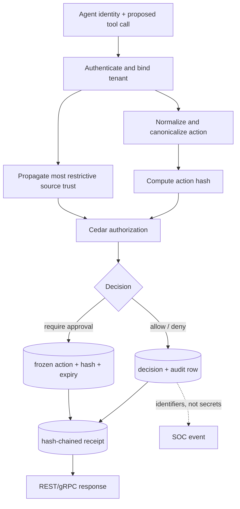
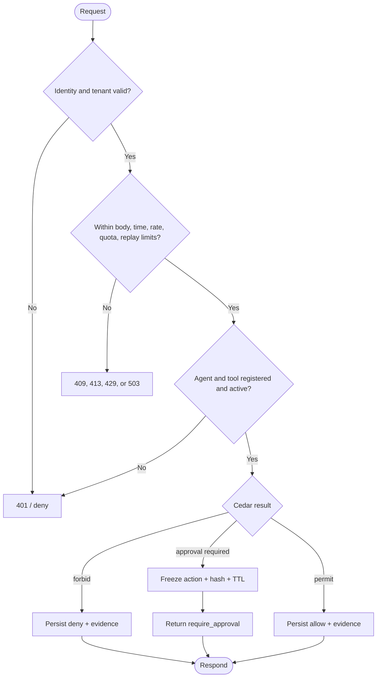
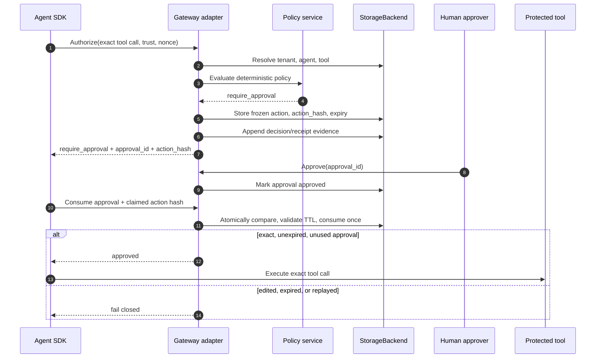
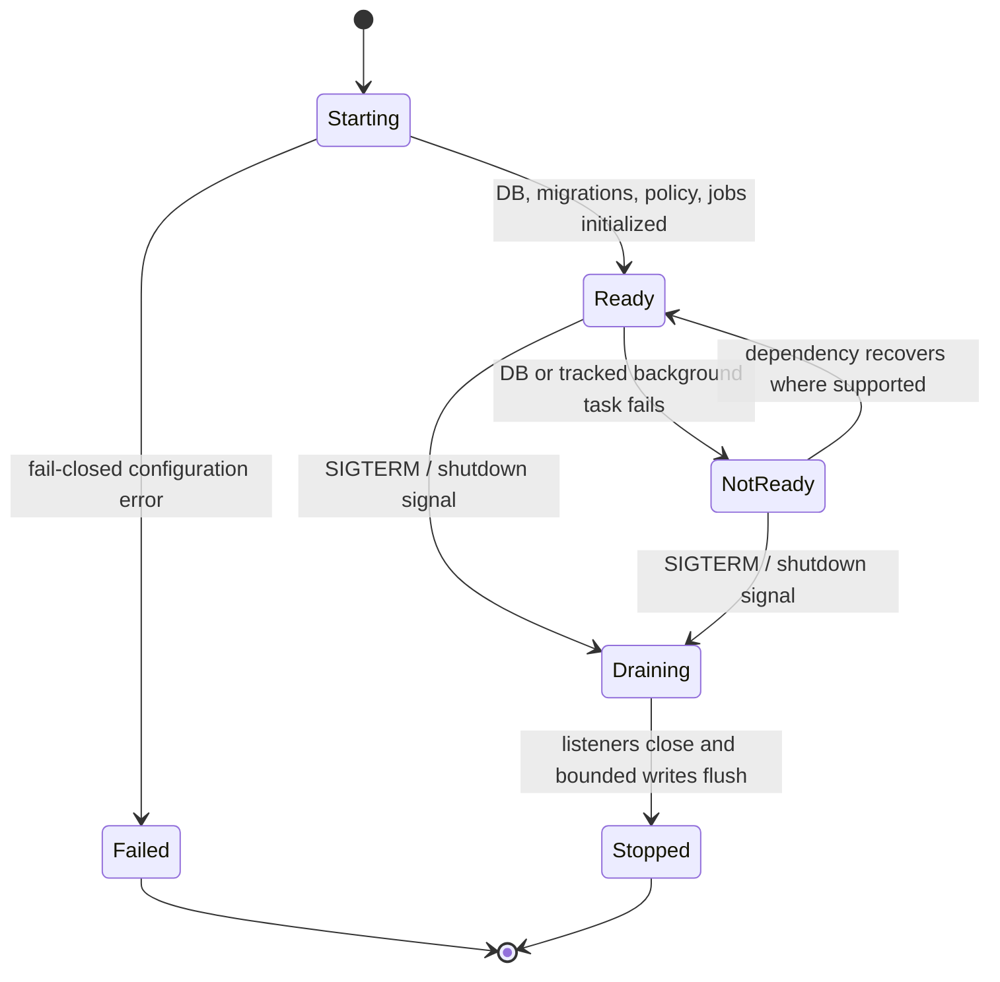
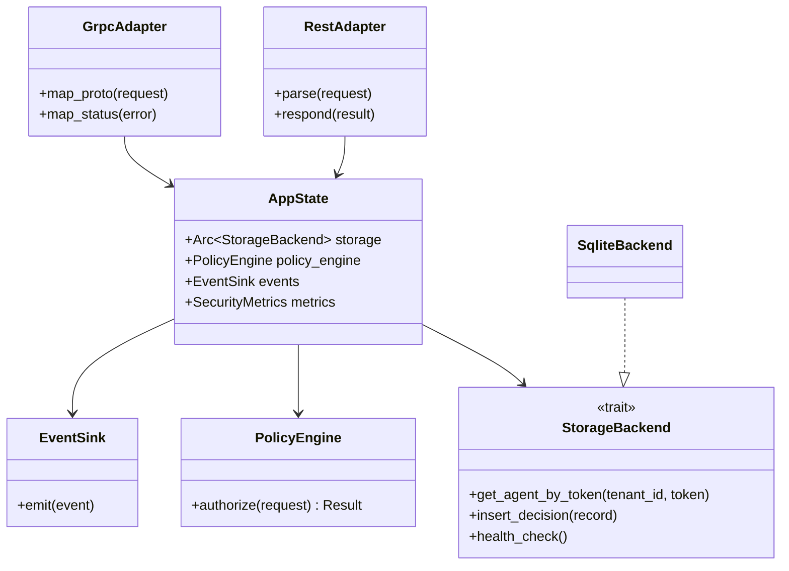
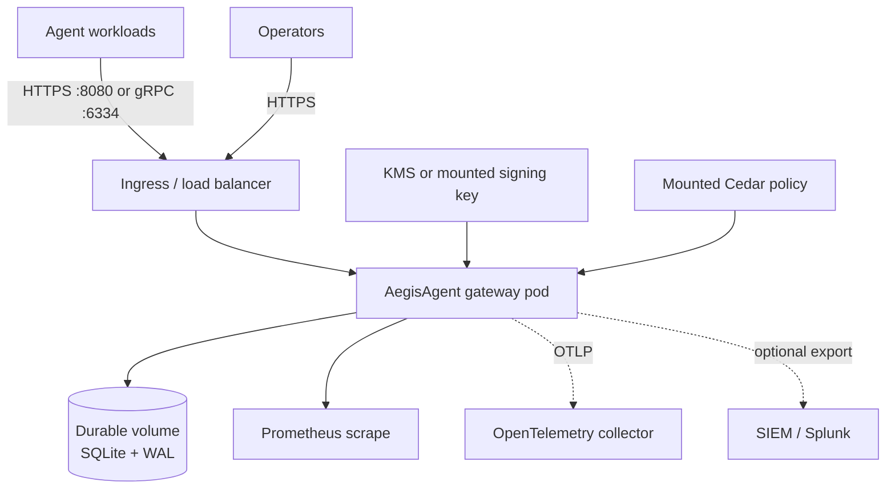

# AegisAgent Gateway

> **Status:** Implemented; production-hardened for the known-agent integrity path
>
> **Audience:** Students · Backend engineers · SDK developers · SREs · Security engineers · Architects
>
> **Time:** 15 minutes to understand · 10 minutes to run the proof demo

!!! abstract "In one sentence"
    The gateway is the trusted control point that authenticates an AI agent, evaluates its proposed action, requires exact-action approval when necessary, records tamper-evident evidence, and returns a decision over REST or gRPC.

!!! warning "Scope boundary"
    The gateway controls requests that reach an AegisAgent control point. It does not magically observe an agent that bypasses every SDK, gateway, proxy, or runtime control. See [Implementation Status](../Implementation_Status.md) before relying on cage, sensor, or forced-egress roadmap capabilities.

## Overview

An **AI agent action** is an operation with an external effect, such as reading a file, merging a pull request, sending money, or changing infrastructure. The AegisAgent gateway answers one question before that operation runs: **may this exact action proceed?**

Think of the gateway as an airport security checkpoint:

- the agent presents its identity;
- the proposed tool call is the luggage manifest;
- Cedar policy is the deterministic security rulebook;
- an approval is a supervisor's sign-off on the exact manifest;
- a receipt is the tamper-evident record of the crossing.

The same Rust process serves REST through Axum on port `8080` and gRPC through tonic on port `6334`. Both protocols share application state and the same authorization implementation.

### Five levels of understanding

| Level | Explanation |
|---|---|
| ELI5 | The gateway is a safety guard that checks an agent before the agent presses a real button. |
| Beginner | It authenticates the caller, checks policy, returns allow/deny/approval, and records evidence. |
| Intermediate | It canonicalizes the tool call, propagates source trust, evaluates Cedar, persists tenant-scoped records, and emits asynchronous SOC events. |
| Advanced | Protocol adapters share a trait-backed storage and policy service path; deterministic gates decide while advisory scores never gate. |
| Production | Probes, metrics, tracing, bounded queues, load shedding, TLS/mTLS, graceful draining, and durable protected-action receipts make the control point operable. |

## Why This Exists

AI agents combine untrusted language-model output with credentials that can change real systems. Without a central control point, each agent framework implements security differently, approvals become messages that can be edited or replayed, and investigators cannot prove which action was actually authorized.

Use the gateway when an agent can:

- mutate production data or infrastructure;
- access sensitive information;
- invoke registered tools, APIs, or MCP servers;
- require human approval;
- produce evidence for audit, incident response, or compliance.

Do not use the gateway as:

- a replacement for operating-system sandboxing or network enforcement;
- a probabilistic “is this prompt safe?” classifier;
- a general-purpose API gateway for traffic unrelated to agent actions;
- proof that an uninstrumented process cannot act outside Aegis control points.

The key tradeoff is deliberate: a synchronous authorization dependency adds latency and availability coupling, but it creates one enforceable decision point with a complete evidence trail. High-risk and mutating SDK calls therefore fail closed when the gateway cannot be reached.

## Problem Statement

Consider a coding agent with a GitHub token. It reads a public issue containing hidden instructions to merge an attacker's pull request. The text may look like an ordinary task, but its **source** is untrusted.

Without AegisAgent:

1. the agent may treat the injected text as an instruction;
2. a generic risk score may misclassify it;
3. a human might approve a summary while the parameters change afterward;
4. logs may show that “something was approved” without proving the exact action;
5. a security team cannot reconstruct a trustworthy chain of events.

The required properties are stronger than logging:

- source provenance must only become more restrictive across agent hops;
- policy must be deterministic and tenant-scoped;
- approval must bind to the canonical bytes of one exact action;
- expired, edited, or replayed approvals must fail closed;
- protected decisions must return durable receipt identity;
- SOC detection must not consume the inline authorization latency budget.

## Solution

The gateway implements a dual-plane integrity architecture:

- The **inline decision plane** authenticates, applies guards, evaluates deterministic policy, persists the decision and protected receipt, and responds.
- The **asynchronous SOC plane** receives a non-blocking security event, detects patterns, correlates alerts, and supports investigation.

Four design laws constrain the solution:

1. Deterministic policy decides; scores are advisory.
2. An LLM may narrate an investigation; it never authorizes an action.
3. The inline path is latency-sensitive; detection is asynchronous.
4. Canonicalization, approval hashes, and receipt-chain identity remain intact end to end.

The result is a gateway that answers not only “was it allowed?” but also “which identity proposed which exact action, under which source trust, by which policy, with which approval, and where is the cryptographic evidence?”

## Architecture

The diagram separates untrusted callers, thin protocol adapters, shared control services, storage, and asynchronous consumers. Follow the solid line for the inline path and the dotted line for work that must not delay authorization.



The trust boundary begins at the gateway listeners. SDK code runs inside the agent process and is not a trust anchor against a hostile host. The gateway recomputes action identity, checks server-side state, and uses tenant-bound storage operations instead of trusting client claims.

The optional [interactive architecture explorer](../explorer/index.html) uses the repository's `architecture-map.json`. A future 3D mode could render the same graph with React Three Fiber: the camera would start above the two planes, zoom to a selected request, animate particles only from live telemetry, expose status/latency/owner on hover, open canonical docs on click, and preserve a keyboard-accessible React Flow 2D fallback. This is a visualization concept, not a shipped production telemetry view.

## Component Breakdown

| Component | Responsibility | Implementation | Failure behavior |
|---|---|---|---|
| REST adapter | Parse HTTP, attach middleware, convert errors to status codes | `src/src/main.rs`, `src/src/routes/` | Structured 4xx/5xx; overload returns `503` |
| gRPC adapter | Map protobuf messages and metadata to the shared route/service path | `src/src/grpc.rs`, `lib/api/proto/` | Maps failures to `tonic::Status` |
| Authentication and tenant guard | Establish caller and tenant identity | route extractors and middleware | Unknown/invalid identity is denied |
| Policy engine | Evaluate Cedar and deterministic trust provenance | `lib/policy/` | Evaluation errors fail closed |
| Approval engine | Create, edit, expire, approve, and atomically consume hash-bound approvals | approval routes + storage trait | Mismatch, expiry, or reuse is refused |
| Receipt engine | Canonicalize and append per-tenant hash-chained evidence | receipt routes + storage | Protected-action receipt failure prevents a successful protected response |
| Storage backend | Tenant-scoped persistence behind a trait | `lib/storage/` | Readiness fails when storage is unavailable |
| SOC event sink | Emit security events without blocking the inline path | `lib/soc/src/events.rs` | Bounded channel can drop; metrics expose drops |
| Observability | Probes, metrics, JSON logs, optional OTLP | `src/src/main.rs`, `src/src/otel.rs`, `lib/common/src/metrics.rs` | Readiness exposes critical background-task failure |

## Data Flow

This flow shows which data is trusted, transformed, persisted, and emitted.



Sensitive action parameters are not blindly copied into SOC evidence. Evidence linkage uses identifiers and hashes. Tenant identity must be bound on every storage operation. For retention, backup, and archival behavior, use the [production hardening guide](../production-hardening.md) and [backup/restore runbook](../runbooks/backup-and-restore.md).

## Request Flow

The synchronous request path is intentionally narrow:

1. Axum or tonic accepts the request.
2. Middleware enforces body size, timeout, concurrency, authentication, tenant identity, rate, quota, and optional replay protection.
3. The registered agent and tool are resolved through tenant-scoped storage and metadata caches.
4. Trust provenance is tightened and Cedar returns a deterministic decision.
5. Decision and audit evidence are persisted.
6. A protected action receives a durable receipt before success is returned; low-risk read-only allow receipts may use the best-effort asynchronous path.
7. A security event is offered to the bounded SOC channel without awaiting SOC analysis.
8. The protocol adapter serializes the same decision model as JSON or protobuf.

The design target for the inline path is under `75 ms`. The checked-in local HTTP baseline measured p50 `10.24 ms`, p95 `13.80 ms`, and p99 `17.58 ms` at 10 requests/second; see [Performance](#performance) for limitations.

## Control Flow

The control flow emphasizes fail-closed branches. “Score” is absent from the decision branches because advisory risk scores must never override deterministic policy.



## Sequence Diagram

This sequence shows a protected action that requires approval and later executes only after the server atomically consumes approval for the same action hash.



The human approves a stored action, not a mutable summary. The final compare-and-consume step prevents approve-then-swap and replay attacks.

## State Diagram

The gateway process lifecycle separates startup, readiness, draining, and termination. Readiness may fall while liveness remains healthy, allowing an orchestrator to stop traffic without immediately killing the process.



`/startupz` represents the Starting transition, `/readyz` represents traffic eligibility, and `/livez` only proves that the HTTP process can answer.

## Class Diagram

This diagram shows ownership and downward dependency flow. Protocol adapters depend on shared API types and service crates; policy never depends on storage, and callers never receive a raw SQLite pool.



This pattern keeps handlers thin and makes storage replaceable. New database access belongs in the `StorageBackend` trait and its implementations, never in a handler.

## Deployment Architecture

The shipped production pattern puts TLS and identity controls at the edge, runs one gateway replica with SQLite by default, persists data on durable storage, and exports telemetry out of band.



Deployment choices:

| Mode | Best for | Important constraint |
|---|---|---|
| Docker Compose | Local proof and single-host evaluation | Shipped host networking is a development convenience |
| Helm/Kubernetes | Managed rollout, probes, policies, monitoring | Default SQLite/PVC topology remains one replica |
| Bare metal/systemd | Controlled single-node environments | You own TLS termination, file permissions, backups, and service isolation |

The Helm chart includes Deployment, Service, ConfigMap, Secret integration, NetworkPolicy, PodDisruptionBudget, HPA, ServiceAccount, PVC, and optional ServiceMonitor. Keep `replicaCount: 1` with the default SQLite `ReadWriteOnce` volume. Use the repository's PostgreSQL feature only after validating its current production status for your release.

For rolling updates, use readiness probes and a PodDisruptionBudget. For canary or blue-green rollout, isolate the candidate from the production SQLite writer; mirror dry-run authorization traffic or use an independent database before shifting enforcement traffic. Roll back the image and policy together when their contract changes. Back up before schema-changing releases and test restore procedures; see the [deployment guide](../deployment-guide.md) and [backup and restore runbook](../runbooks/backup-and-restore.md).

## Folder Structure

```text
AegisAgent/
├── config/config.yaml          # human-readable baseline configuration
├── lib/
│   ├── common/                 # errors, metrics, shared utilities
│   ├── api/proto/              # protobuf source of truth
│   ├── storage/                # StorageBackend trait and implementations
│   ├── policy/                 # Cedar, trust propagation, risk metadata
│   └── soc/                    # asynchronous detection and correlation
├── src/
│   ├── src/main.rs             # startup, router, probes, dual-server lifecycle
│   ├── src/grpc.rs             # thin tonic protocol adapter
│   ├── src/routes/             # thin Axum protocol adapters
│   ├── policies.cedar          # default policy used by local commands
│   └── Dockerfile              # distroless, non-root runtime image
├── helm/aegis-gateway/         # Kubernetes deployment chart
└── sdk-{python,go,typescript}/ # fail-closed client enforcement
```

The dependency direction is downward: `common → api → storage/policy → soc → binary`. `storage` and `policy` do not depend on each other. The binary wires the pieces together.

## Configuration

The repository includes `config/config.yaml` as the architecture-level baseline:

```yaml
storage:
  backend: sqlite
  sqlite:
    path: ./aegis.db
    busy_timeout_ms: 5000
    max_connections: 10

gateway:
  host: "127.0.0.1"
  rest_port: 8080
  grpc_port: 6334

policy:
  cedar_path: ./policies.cedar
```

- `backend: sqlite` selects the local storage implementation.
- `path` is the database file; place it on durable storage outside ephemeral containers.
- `busy_timeout_ms` lets SQLite wait up to five seconds for a lock instead of failing immediately.
- `max_connections` bounds the pool; increasing it does not remove SQLite's single-writer constraint.
- `host: 127.0.0.1` keeps local development off external interfaces.
- `rest_port: 8080` serves HTTP/JSON; `grpc_port: 6334` serves HTTP/2 protobuf.
- `cedar_path` points to the deterministic authorization policy.

The current binary also supports environment variables, which take precedence in deployment. In particular, `AEGIS_BIND_ADDR` and `AEGIS_GRPC_BIND_ADDR` configure complete listener addresses.

## Installation

Prerequisites:

- Git;
- Rust `1.88` or newer for a native build;
- Python 3.8+ for the reference demo;
- Docker and Docker Compose for the fastest full-stack path.

From the repository root:

```bash
make doctor
cargo check --workspace
```

`make doctor` checks local demo dependencies and port availability. `cargo check --workspace` type-checks every workspace crate without producing release binaries.

For Docker, no host Rust toolchain is required for the gateway image:

```bash
docker compose build gateway
```

The command builds the multi-stage image defined in `src/Dockerfile`; the runtime is distroless and uses uid/gid `65532` rather than root.

## Quick Start

From the repository root, run the complete integrity proof:

```bash
make demo
```

The target starts Docker Compose in detached mode, seeds a demo tenant/agent/tools, runs the malicious GitHub input scenario, runs approve-then-swap and replay checks, and verifies the persisted receipt chain.

Expected proof points include:

```text
AegisAgent blocked the malicious merge attempt
Gateway rejected the swapped claimed_action_hash
Replay Blocked
"verified": true
```

Generated identifiers, timestamps, and explanatory text vary. Verify service health independently:

```bash
curl -fsS http://127.0.0.1:8080/livez
curl -fsS http://127.0.0.1:8080/readyz
curl -fsS http://127.0.0.1:8080/startupz
```

`-f` fails on HTTP errors, `-sS` hides progress while preserving error text. Stop the demo with:

```bash
docker compose down
```

Add `-v` only when you intentionally want to delete persisted demo volumes.

## Detailed Walkthrough

### 1. Start the two protocol listeners

`src/src/main.rs` loads storage, migrations, policy, cryptographic signers, event channels, jobs, and shared state. It then starts Axum and tonic on separate Tokio tasks. Startup configuration that would weaken an enabled protection—for example, requesting database encryption without a SQLCipher build—returns an error instead of silently continuing.

### 2. Establish identity

REST uses the `Authorization` header plus tenant context. gRPC carries bearer authorization in metadata and the protobuf `tenant_id`, which the adapter maps into the same internal headers. Production JWT mode, optional agent mTLS, agent status, and tenant existence all restrict access.

### 3. Apply resource guards

The HTTP stack caps request-body bytes, applies a global timeout, limits concurrent requests, and load-sheds with `503` instead of building an unbounded queue. Per-tenant rate and quota checks protect fair use. A nonce plus timestamp can reject replay; a request ID provides idempotent decision replay, which is a different behavior.

### 4. Resolve and decide

The gateway resolves the registered agent and tool under the authenticated tenant. Trust propagation selects the most restrictive current or inherited source level. Cedar evaluates policy. The composite risk score is recorded for display and analysis but cannot loosen or override the deterministic result.

### 5. Persist evidence

The storage abstraction writes the decision and audit record. For protected decisions—mutating, high/critical risk, or any non-allow result—the response includes the identity of a durably stored hash-chained receipt. Dry-run requests deliberately skip persistence and side effects.

### 6. Emit asynchronous detection data

The event sink uses bounded, non-blocking delivery. If the channel is full, authorization does not wait; a dropped-event metric makes the loss observable. This is a latency/telemetry tradeoff, not permission to lose protected receipt evidence.

### 7. Respond and enforce

The adapter returns JSON or protobuf. The cooperating SDK interprets deny and approval states and refuses to call the tool unless the decision and, where required, consumed approval permit the exact action.

## Code Explanation

The following abridged Rust shape illustrates the required handler boundary. It is explanatory pseudocode; use the current source links in [References](#references) for the implementation.

```rust
pub async fn authorize(
    state: Arc<AppState>,
    headers: HeaderMap,
    body: Bytes,
) -> Result<AuthorizeResponse, AegisError> {
    let request = parse_authorize_request(&body)?;
    let identity = authenticate_and_bind_tenant(&state, &headers).await?;
    let decision = authorize_service(&state, &identity, request).await?;
    Ok(decision)
}
```

Line by line:

1. `state: Arc<AppState>` shares immutable handles to storage, policy, events, and metrics across concurrent requests.
2. `headers` carries authentication and tenant context; it is not treated as valid until server-side verification succeeds.
3. `body: Bytes` permits body-limit middleware and explicit parsing before domain work.
4. `Result<..., AegisError>` preserves one shared error vocabulary; REST and gRPC convert it at the boundary.
5. `parse_authorize_request` validates the wire payload.
6. `authenticate_and_bind_tenant` establishes the tenant before any tenant-owned lookup.
7. `authorize_service` owns the deterministic business path; the adapter does not contain SQL or Cedar rules.
8. `Ok(decision)` returns the shared response model for protocol serialization.

The real gRPC adapter maps generated protobuf types to the same REST/internal request model and invokes the shared authorization implementation. New API fields begin in `lib/api/proto/*.proto`, then receive a REST mirror where necessary.

## Live Example

### Small: prove the process is alive

```bash
curl -i http://127.0.0.1:8080/livez
```

Expected result: HTTP `200` and `{"status":"alive"}`. This proves only that the HTTP process can answer; it does not prove database or background-task health.

### Medium: run the known-agent integrity flow

```bash
make demo
curl -fsS http://127.0.0.1:8080/v1/audit/events \
  -H "Authorization: Bearer tenant_123" | python3 -m json.tool
```

The demo's local tenant bearer token is intentionally non-production. The response should contain the denied malicious merge attempt and related evidence.

### Enterprise pattern

Deploy the Helm chart with an externally managed Secret, TLS ingress, default-deny NetworkPolicy, durable volume, Prometheus ServiceMonitor, OTLP collector, and a tested backup schedule. Keep one gateway replica while using the default SQLite writer. Send a canary's requests in `dry_run` mode before enforcing a new policy bundle.

### Failure and recovery

If `/readyz` returns `503` with `db: "down"`, stop routing new requests, preserve logs, check volume/database health, and restore service or data according to the backup runbook. Do not change SDKs to fail open. Once storage health and tracked jobs recover, `/readyz` returns `200`; then restore traffic gradually and verify a protected receipt chain.

## API

### REST authorization

`POST /v1/authorize` accepts JSON. The complete, generated contract is in the [API reference](../api-reference.md).

```bash
curl -fsS -X POST http://127.0.0.1:8080/v1/authorize \
  -H "Authorization: Bearer <agent-token>" \
  -H "X-Aegis-Tenant-ID: <tenant-id>" \
  -H "Content-Type: application/json" \
  -d '{
    "request_id": "req-001",
    "agent": {"id": "coding-agent-prod", "environment": "production"},
    "tool_call": {
      "tool": "filesystem",
      "action": "read_file",
      "resource": "README.md",
      "mutates_state": false,
      "parameters": {}
    },
    "context": {
      "source_trust": "trusted_internal_signed",
      "contains_sensitive_data": false
    },
    "nonce": "unique-nonce-001",
    "timestamp": "2026-07-11T12:00:00Z",
    "dry_run": true
  }'
```

The placeholder token must be the show-once agent token returned during registration. `request_id` makes retries idempotent; `nonce` rejects reuse; `timestamp` constrains the replay window; `dry_run` evaluates without writing decisions, audits, approvals, receipts, SOC events, or other side effects. Use a current timestamp when running the example.

The response contains a decision, reason, matched policies, effective root trust, advisory risk metadata, and optional approval or receipt identity. Treat unknown decision values as deny in clients.

### gRPC authorization

The protobuf source of truth is `lib/api/proto/aegis.proto`:

```proto
service AegisService {
  rpc Authorize (AuthorizeRequest) returns (AuthorizeResponse);
}
```

The gRPC listener defaults to `127.0.0.1:6334`. Pass bearer credentials in `authorization` metadata and tenant identity in `AuthorizeRequest.tenant_id`. `parameters_json` is a JSON string in protobuf because protobuf does not natively preserve arbitrary JSON objects with the same semantics as the REST model.

Protocol parity is mandatory: a new endpoint or field is incomplete until protobuf, generated gRPC, REST models, both adapters, and tests agree.

### Important status classes

| Status | Meaning | Caller response |
|---|---|---|
| `200` | Decision produced, including deny or require-approval as domain results | Inspect `decision`; do not equate HTTP success with permission |
| `401` | Authentication, agent status, or identity failure | Refresh/rotate identity; never retry anonymously |
| `409` | Replay or conflicting state | Do not replay the same nonce/consumption |
| `413` | Body exceeds configured limit | Reduce payload; do not raise limits casually |
| `429` | Rate or quota guard | Back off with jitter and respect policy |
| `503` | Not ready, overloaded, or critical dependency unavailable | Fail closed for protected actions; retry within a bounded policy |

## CLI

Run commands from the repository root.

```bash
# Development build and dual-protocol startup
CEDAR_POLICY_PATH=src/policies.cedar cargo run -p gateway --bin gateway

# Optimized binary
cargo build --release -p gateway --bin gateway

# Workspace verification required before merge
cargo check --workspace
cargo test --workspace
cargo fmt --all -- --check
cargo clippy --workspace -- -D warnings
```

- `CEDAR_POLICY_PATH` points the binary at the repository's current default policy file.
- `-p gateway` selects the workspace package.
- `--bin gateway` selects its binary target.
- `--release` enables optimized compilation and writes `target/release/gateway`.
- `--workspace` validates every crate, preserving architecture compatibility.
- `-- --check` and `-- -D warnings` pass flags through Cargo to rustfmt and Clippy respectively.

The gateway itself is a long-running server, so success means it continues running and exposes probes. Stop a foreground development process with `Ctrl-C`; graceful shutdown drains bounded work within configured timeouts.

## Configuration Reference

This table lists the gateway settings most readers need. The exhaustive deployment reference remains [Deployment Guide §4](../deployment-guide.md#4-environment-variable-reference).

| Setting | Default | Sensitive | Restart | Effect |
|---|---:|:---:|:---:|---|
| `AEGIS_BIND_ADDR` | `127.0.0.1:8080` | No | Yes | REST listener; public binding requires production auth safeguards |
| `AEGIS_GRPC_BIND_ADDR` | `127.0.0.1:6334` | No | Yes | gRPC listener |
| `DATABASE_URL` | `sqlite://aegis.db` | Sometimes | Yes | Relational storage location and backend URL |
| `CEDAR_POLICY_PATH` | deployment-specific | No | No with hot reload | Cedar policy bundle path |
| `AEGIS_POLICY_HOT_RELOAD` | `false` outside chart defaults | No | Yes to enable watcher | Watches policy file changes |
| `AEGIS_JWT_REQUIRED` | `false` | No | Yes | Requires valid JWTs; enabling without a secret fails startup |
| `AEGIS_JWT_SECRET` | unset | **Yes** | Yes | HMAC JWT secret list; supports comma-separated rotation |
| `AEGIS_TLS_CERT` / `AEGIS_TLS_KEY` | unset | Key is **Yes** | Yes | Enable TLS when both paths are present |
| `AEGIS_MTLS_CA_CERT` | unset | Trust material | Yes | Requires agent client certificates signed by the CA |
| `AEGIS_MAX_BODY_LIMIT_BYTES` | `1048576` | No | Yes | Maximum REST request body, one MiB by default |
| `AEGIS_REQUEST_TIMEOUT_SECS` | `30` | No | Yes | Global request deadline |
| `AEGIS_MAX_CONCURRENT_REQUESTS` | `1000` | No | Yes | In-flight ceiling before load shedding |
| `AEGIS_REPLAY_STORE` | in-memory default | No | Yes | Selects durable shared replay storage when configured as documented |
| `AEGIS_OTLP_ENDPOINT` | unset | No | Yes | Enables OTLP trace/metric export |
| `AEGIS_RECEIPT_SIGNING_KEY` | unset | **Yes** | Yes | Optional local Ed25519 receipt signing key |
| `AEGIS_KMS_KEY_URI` | unset | Reference | Yes | Selects supported KMS-backed receipt signing |
| `RUST_LOG` | environment filter default | No | Yes | Controls structured log filtering |

Do not commit secret values. Use a secret manager, Kubernetes Secret integration, protected environment file, or KMS reference. Rotation procedures are in the [secret rotation runbook](../runbooks/secret-rotation.md).

## Security

### Authentication and authorization

- Agent bearer tokens, optional required JWTs, and optional mTLS establish identity.
- Tenant identity is checked before tenant-owned operations.
- Cedar makes deterministic authorization decisions; advisory scores cannot grant access.
- Frozen-action approvals bind to SHA-256 of `aegis-jcs-1` canonical bytes and are time-limited and single-use.

### Encryption, secrets, and certificates

- Use TLS for traffic outside loopback; use mTLS where agent identity must be certificate-bound.
- SQLite encryption requires a binary built with the `sqlcipher` feature; setting a key without support fails startup.
- Receipt signing supports local Ed25519 material and configured KMS paths. Keep signing keys out of API payloads and logs.
- Agent tokens are show-once credentials and are stored hashed.

### Tenant isolation and audit

- All database access must go through `StorageBackend`; every tenant-owned method binds `tenant_id`.
- Decisions, approvals, audit events, and receipts retain evidence identity.
- `/metrics` avoids tenant/agent labels to reduce identifier leakage and is guarded for loopback/admin access.

### Threat surface

Primary threats include confused-deputy input, approval manipulation, replay, cross-tenant access, policy/signing-key compromise, public listener exposure, oversized or overload traffic, and evidence tampering. The controls and residual risks are detailed in the [Threat Model](../AegisAgent_Threat_Model.md) and [Fail-Closed Behavior Guide](../fail-closed-behavior.md).

## Performance

The inline authorization path has a design budget below `75 ms`. The checked-in baseline used a live local gateway, SQLite, a steady-state read-only allow, 50 requests at 10 requests/second:

| Metric | Measured | Target |
|---|---:|---:|
| HTTP p50 | `10.24 ms` | `<10 ms` (marginal by `0.24 ms`) |
| HTTP p95 | `13.80 ms` | `<50 ms` |
| HTTP p99 | `17.58 ms` | `<100 ms` |
| Success | `100%` | `100%` within configured rate budget |

These are historical local baseline values, not a production capacity promise. Hardware, database media, policy size, TLS, concurrency, protected receipt durability, and network distance change results.

Resource considerations:

- **CPU:** Cedar evaluation, canonical JSON, SHA-256, signature verification, TLS, and serialization.
- **Memory:** bounded request concurrency, metadata caches, replay cache, event channel, audit/receipt batches.
- **Storage:** decisions, audits, approvals, receipts, runtime/SOC records, WAL growth, indexes, backups.
- **Network:** REST/gRPC request size, OTLP/SIEM export, replication/backend traffic, SDK-to-gateway latency.

The likely SQLite bottleneck is synchronous decision/audit/receipt writing rather than Cedar evaluation. Run the benchmark on deployment-class hardware:

```bash
cargo bench -p gateway --bench authorize_benchmark
```

Use [Performance Baseline](../performance-baseline.md) for methodology and [Performance Tuning](../performance-tuning-guide.md) before changing caches, pool size, or durability.

## Scaling

Scale in this order:

1. Measure p50/p95/p99, saturation, pool wait, event drops, WAL/storage latency, CPU, and memory.
2. Reduce avoidable network distance between SDKs and the gateway.
3. Tune bounded concurrency and database pool conservatively.
4. Keep metadata caches bounded; never cache authorization decisions.
5. Move to a validated shared backend before adding writers/replicas.
6. Load-test tenant isolation, replay storage, receipt ordering, and graceful drain under the intended topology.

SQLite is a single-writer database even with WAL. More connections or pods do not create more write capacity. The shipped Helm default therefore remains one replica with a `ReadWriteOnce` volume. Horizontal scale requires a shared relational backend, shared replay/rate-limit state where needed, and verification of per-tenant receipt-chain consistency.

## Monitoring

### Probes

| Endpoint | Meaning | Kubernetes use |
|---|---|---|
| `/livez` | HTTP process can answer; no dependency I/O | Liveness |
| `/readyz` | Storage reachable and tracked background tasks alive | Readiness |
| `/startupz` | DB, migrations, policy, and jobs initialized | Startup |
| `/health` | General service/database health | Human and external health check |

### Metrics and traces

Prometheus metrics include:

- `aegis_authorize_duration_seconds` histogram;
- decision and security-event counters;
- event drop counters;
- hash mismatch and provenance denial counters;
- handler panic counters;
- database pool active, idle, max, size, and acquire-wait gauges;
- optional exporter health.

Set `AEGIS_OTLP_ENDPOINT` to export OpenTelemetry data. Preserve W3C `traceparent` from SDK callers so an authorization span can join the agent's distributed trace. Dashboards should show latency percentiles, decision mix, protected failures, readiness, pool saturation, event drops, receipt integrity, and exporter freshness.

## Logging

The gateway uses structured tracing with JSON-capable output. Logs should answer: when, severity, component, request/trace identity, decision outcome, and error category. They must not contain bearer tokens, JWT secrets, signing keys, callback secrets, or unredacted sensitive parameters.

Example shape—field order and wording may vary by release:

```json
{
  "level": "WARN",
  "target": "gateway::routes::authorize",
  "message": "authorization denied",
  "request_id": "req-001",
  "decision": "deny"
}
```

Use `RUST_LOG=gateway=debug,aegis_policy=debug` temporarily for targeted diagnosis. Do not enable broad debug logging indefinitely in production; it increases volume and may expose more context. Send production logs to an append-protected store with retention aligned to incident and compliance requirements.

## Alerting

Start with symptom-based alerts and link each one to an action:

| Alert | Suggested condition | Severity | First response |
|---|---|---:|---|
| Gateway not ready | `/readyz` fails for 2–5 minutes | Critical | Stop traffic; inspect DB and dead background tasks |
| Authorization p99 high | p99 exceeds `75 ms` for 10 minutes | High | Check pool wait, storage latency, saturation, recent policy/deploy changes |
| Event drops | drop counter increases continuously | High | Check SOC consumer and channel pressure; authorization remains inline-safe |
| Receipt integrity failure | any verified chain failure | Critical | Preserve evidence; run receipt verification runbook |
| Hash mismatch spike | sustained increase over baseline | High | Investigate approve-then-swap, stale clients, or integration bugs |
| Authentication lockouts | sudden sustained rise | Medium/High | Check credential rotation, attack source, and tenant impact |
| DB pool saturation | active near max plus rising acquire wait | High | Reduce concurrency or fix storage latency; do not blindly enlarge pool |

Tune durations and thresholds from measured baselines to avoid noisy alerts. Use [runbooks](../runbooks/index.md) for deny storms, receipt-chain verification, token rotation, secret rotation, backup/restore, and exfiltration response.

## Troubleshooting

| Symptom | Likely cause | Verify | Recovery |
|---|---|---|---|
| `401` on authorization | Invalid/rotated token, wrong tenant, frozen/quarantined/revoked agent | Check identity headers, agent state, auth logs | Rotate token or correct tenant; never bypass auth |
| `409 replay_nonce_reused` | Nonce was reused | Inspect client retry logic and request IDs | Generate a fresh nonce; use request ID for idempotent retries |
| `429` | Per-tenant rate/quota limit | Metrics and configured refill/window | Back off with jitter or capacity-plan a justified limit change |
| `503` from `/readyz` | DB unavailable or tracked job exited | Read JSON fields and gateway logs | Repair dependency/task, verify readiness, then restore traffic |
| `503` under load | Concurrency load shedding | In-flight/saturation metrics | Reduce load or scale a validated shared-backend topology |
| gRPC unavailable, REST healthy | Port, HTTP/2, Service, or TLS mismatch | Check `6334`, Service target port, certificate mode | Correct listener/ingress; test direct channel |
| Approval never executes | Hash mismatch, expiry, prior consumption | Approval record and mismatch metric | Re-authorize the current exact action; do not reuse approval |
| Missing low-risk receipt immediately | Best-effort async path not flushed yet | Receipt metrics/logs and later query | Wait bounded interval; protected decisions should return durable identity |

For deeper procedures, see the [Debugging Guide](../AegisAgent_Debugging_Guide.md).

## Common Mistakes

- Treating HTTP `200` as “allowed.” A deny is a valid domain response; inspect `decision`.
- Binding `0.0.0.0` before enabling production authentication and TLS.
- Sending tenant bearer tokens or signing keys in source control, Helm values, screenshots, or tickets.
- Letting classifiers loosen source trust or risk scores override Cedar.
- Reusing a nonce for retries instead of using an idempotency request ID.
- Scaling SQLite by adding gateway replicas against one `ReadWriteOnce` volume.
- Writing SQL in REST/gRPC adapters instead of extending `StorageBackend`.
- Adding a REST route without protobuf and gRPC parity.
- Caching decisions instead of registration metadata.
- Using liveness as readiness, which can route traffic to a process with a failed dependency.
- Disabling fail-closed SDK behavior during an outage instead of restoring the control plane.

## Best Practices

- Keep the gateway near agents in network terms while retaining a trusted administrative boundary.
- Require TLS outside loopback and prefer mTLS for strong workload identity.
- Use deterministic source labels assigned from the channel, not inferred from text.
- Use dry-run for policy evaluation and canaries; compare decision distribution before enforcement.
- Rotate secrets with overlap where supported, then remove old material promptly.
- Keep policies, image, schema, SDKs, and proto contracts version-compatible.
- Protect the receipt-signing key separately from application credentials.
- Alert on evidence-integrity failure and exercise recovery runbooks.
- Benchmark with realistic protected-action mixes and deployment storage.
- Run workspace checks and REST/gRPC integration tests before every release.

## FAQ

### Is the gateway an AI model?

No. Authorization is deterministic Cedar policy. An LLM may be used only for sandboxed incident narration, never for the decision.

### Why are there two ports?

REST/JSON on `8080` is convenient for browsers, curl, webhooks, and broad integrations. gRPC/protobuf on `6334` provides a strongly typed HTTP/2 interface. Both must produce equivalent behavior.

### What happens when the gateway is unavailable?

Protected, mutating, and high-risk SDK calls fail closed. Read-only behavior depends on the SDK's documented policy, but clients must never silently execute a denied or unknown decision.

### Does a high risk score cause denial?

No. Scores are advisory metadata. Cedar and deterministic trust provenance decide.

### Can I run multiple replicas with SQLite?

Do not do so with the default single-writer PVC topology. Validate the PostgreSQL/shared-state path and receipt-chain behavior before horizontal scaling.

### How is approve-then-swap prevented?

The approval stores the frozen action and its SHA-256 hash. Consumption atomically checks the current claimed action hash, expiry, and single-use state. Any mismatch fails closed.

### What should an interviewer expect a maintainer to explain?

A strong answer covers the thin-adapter/shared-service pattern, protobuf-first dual protocol, trait-based tenant-scoped storage, deterministic trust gating, hash-bound approvals, receipt durability, and asynchronous SOC separation.

### Where are backup, rollback, and incident procedures?

Use the [Deployment Guide](../deployment-guide.md), [Production Hardening](../production-hardening.md), and indexed [runbooks](../runbooks/index.md). Component pages explain ownership; runbooks remain the canonical operational procedures.

## References

- [Mandatory architecture patterns](../architecture.md)
- [Architecture overview](../Architecture_Overview.md)
- [Known-agent flow](../flows/Known_Agent_Flow.md)
- [Runtime authorization API](../runtime-authorization-api.md)
- [Generated API reference](../api-reference.md)
- [Deployment guide](../deployment-guide.md)
- [Production hardening](../production-hardening.md)
- [Performance baseline](../performance-baseline.md)
- [Threat model](../AegisAgent_Threat_Model.md)
- [Fail-closed behavior](../fail-closed-behavior.md)
- [Implementation status](../Implementation_Status.md)
- Source: `src/src/main.rs`, `src/src/grpc.rs`, `src/src/routes/`, `lib/api/proto/`, `lib/storage/`, `lib/policy/`, `lib/soc/`
