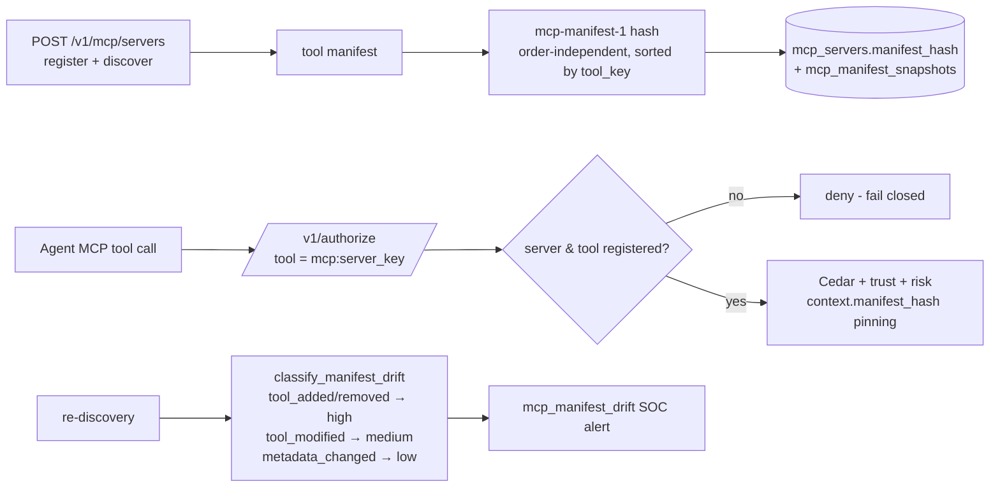

# MCP Gateway

**Status: ✅ Implemented (gateway-integrated "MCP Gateway Lite")** — a standalone MCP proxy binary is 📐 planned; today's defense lives inside `aegis-gateway`.

## 1. One-sentence summary

The MCP choke point registers MCP servers, pins a deterministic hash of each server's tool manifest, denies unknown servers/tools by default, and turns manifest drift into severity-classified SOC alerts.

## 2. Why it exists

MCP makes tools pluggable — which also makes them a supply chain. A compromised or swapped MCP server can quietly change a tool's parameters, risk profile, or add new tools ("rug pull"). Text-level review won't catch a manifest that changed *after* review.

## 3. Mental model

App-store pinning for tools: when a server is registered, its "menu" (tool manifest) is fingerprinted. Every re-discovery recomputes the fingerprint. New dish on the menu? Changed ingredients? The kitchen gets flagged before anyone orders.

## 4. Architecture & flow

- **Manifest hash** — `compute_mcp_manifest_hash` (`src/src/routes/mod.rs`): scheme `mcp-manifest-1`, covers each tool's key/name/description/risk/mutates_state/approval_required/input_schema; sorted by `tool_key` so discovery order never changes it. It is deliberately *not* the `aegis-jcs-1` action hash (different scheme tag, never hashes call payloads).
- **Drift classification** — `classify_manifest_drift` + `severity_for_manifest_drift` (#1336): a binary mismatch becomes an actionable diff (which tools appeared/vanished/changed), failing closed to medium severity when no prior snapshot exists to diff.
- **Unknown = deny** — an MCP call whose server (`mcp:<server_key>`) or tool isn't registered is denied; identifier normalization (#1335) stops case/percent-encoding/Unicode dodges.
- **Inspection** — `lib/soc/src/mcp_inspect.rs` feeds MCP signals into the SOC.
- **Caches** — `McpServerCache`/`McpToolCache` (bounded LRUs, #1337) cache registration metadata only; invalidated on every registration write; never cache decisions.

## 5. APIs / storage

`POST /v1/mcp/servers` (register/re-discover) · `DELETE /v1/mcp/servers/:key` (soft delete; re-register revives, #1193) · tool listing. Tables: `mcp_servers`, `mcp_tools`, `mcp_manifest_snapshots` (migrations 0002–0003), soft-delete columns (0022). Cedar can pin `context.manifest_hash` per [cedar policy authoring skill](https://github.com/lavkushry/AegisAgent/blob/main/.claude/rules/cedar_policy_authoring.md).

## 6. Failure behavior

Unknown server/tool → deny. Drift → alert (and policy can require approval on hash mismatch). Discovery failure → last-pinned manifest remains authoritative; nothing silently widens.

## 7. Common mistakes

- Registering a server and never re-discovering — drift detection needs re-discovery (schedule it or trigger on deploys).
- Treating `metadata_changed` (low) alerts as noise — a renamed tool description is how social-engineering-the-approver starts.
- Expecting the manifest hash to match SDK action hashes — different scheme, different purpose.

## 8. What "Lite" means / planned proxy mode

Today Aegis is the *authorization* choke point for MCP calls made by SDK-wrapped agents; it does not yet sit inline as a network proxy between an arbitrary MCP client and server. The standalone `aegis-mcp-gateway` proxy (forced path for caged agents) is part of the runtime data plane design ([AegisAgent_Runtime_Data_Plane.md](../AegisAgent_Runtime_Data_Plane.md)).

## 9. Related code & docs

Code: `src/src/routes/mcp.rs` · `src/src/routes/mod.rs` (manifest hash/drift) · `lib/soc/src/mcp_inspect.rs` · `lib/storage/src/db/mcp.rs`.
Docs: [mcp-defense-architecture.md](../mcp-defense-architecture.md) (deep design) · [components/SOC_Engine.md](SOC_Engine.md) · [Implementation_Status.md](../Implementation_Status.md)
