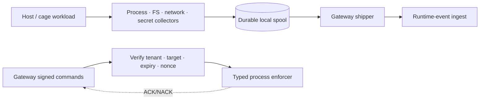

# Node Sensor (`aegis-node-sensor`)

**Status: 🟡 Partial** — the sensor binary, durable spool/shipper, command receiver, process enforcer, and minimal process/filesystem/network/secret collectors exist. Production-grade coverage and complete runner integration remain unfinished; see [Implementation Status](../Implementation_Status.md).

## Overview

The node sensor is the host-local agent of the control plane: it observes runtime activity, durably ships events to the gateway, and applies typed signed controls such as pause, resume, kill, and quarantine near the workload.

## 2. Why it exists

SDK controls only work for cooperative agents. An unknown or hostile agent needs an enforcement point it cannot opt out of, running *outside* the agent's own process — on the host, as a Kubernetes DaemonSet, or as a CI sidecar.

## 3. Mental model

A trusted site guard with a radio: it observes everything at its site, reports upstream over a durable channel, and only obeys orders that are signed, addressed to its site, fresh, and never-seen-before.

## 4. Architecture



## 5. Responsibilities and target behavior

- Register with the gateway per tenant/host; maintain identity keys.
- Observe: process exec, workspace file activity, network intents from caged workloads.
- Ship runtime events durably: local queue → `POST /v1/ingest/runtime-events` ✅ *(this ingest endpoint and the `runtime_events` store exist at HEAD — migration 0027, PR #1681)*.
- Poll/receive control commands; verify signature, tenant binding, target binding, expiry, nonce (protocol: [AegisAgent_Control_Command_Protocol.md](../AegisAgent_Control_Command_Protocol.md), storage 0028 ✅).
- Execute typed handlers only (start/pause/resume/kill/snapshot/quarantine/ban/config) — never arbitrary shell from a payload.
- ACK/NACK results (optionally signed) → receipts + timeline.
- Launch sandboxes via `aegis-cage-runner` ([AegisAgent_Agent_Cage.md](../AegisAgent_Agent_Cage.md), Phase 4).

## 6. What exists today vs. missing

| Piece | Status |
|---|---|
| `runtime_events` table + ingest route + run timeline API | ✅ (0027, #1681; route layer under revision) |
| `agent_runs` registry (`POST /v1/agent-cage/runs`) | ✅ (0026, #1681) |
| `control_commands` store | ✅ (0028) |
| Command signing, dispatch/poll, receiver verification, ACK path | 🟡 implemented path; full operational exercise required |
| Sensor binary, spool, shipper, process enforcer | 🟡 |
| Minimal process/filesystem/network/secret collectors | 🟡; coverage and platform portability remain |
| Sensor identity/registration, key pinning & rotation | 🟡/incomplete |

## Security

Fail closed on any invalid/unsigned/expired/replayed command; tenant- and target-bound commands; least-privilege typed handlers; every accepted command becomes evidence (runtime event + receipt). Bypass reality: a workload that avoids the sensor's host is out of scope for the sensor — that's why caged execution forces workloads onto sensor-monitored hosts.

## Example

```bash
cargo test -p aegis-node-sensor
```

The suite includes command and real child-process enforcement cases. It does not prove complete host telemetry coverage or cage-network enforcement.

## Operations

Monitor sensor heartbeat, spool depth/age, ship failures, collector errors, command poll/verification failures, ACK latency, and registered-run/PID freshness. On sensor silence, stop scheduling unknown workloads and isolate existing workloads through the orchestrator until evidence and enforcement recover.

## References

Code: `bins/aegis-node-sensor/`, `lib/storage/src/db/{runtime_events,agent_runs,control_commands}.rs`, `src/src/routes/runtime.rs`.
Docs: [Runtime Data Plane](../AegisAgent_Runtime_Data_Plane.md) · [Agent Cage](../AegisAgent_Agent_Cage.md) · [Control Command Protocol](../AegisAgent_Control_Command_Protocol.md) · [Implementation Status](../Implementation_Status.md) · [Unknown Agent Flow](../flows/Unknown_Agent_Cage_Flow.md)
