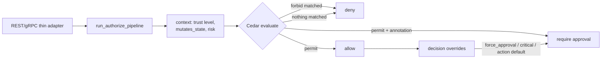

# Policy Engine

## Overview

The policy engine answers one question: *should this action run?* Its answers are **allow**, **deny**, or **ask a human** — and the same inputs always produce the same answer.

## Why it exists

Probabilistic text scoring can be argued with; deterministic policy cannot. Auditors, incident responders, and engineers all need to know *exactly why* a decision happened.

## How it works

1. Thin REST/gRPC adapters build `AuthorizeContext` and call
   `aegis-decision::run_authorize_pipeline` (host `DecisionRuntime` ports).
2. The evaluate stage builds a Cedar request: principal (agent), action,
   resource (tool/action), context (trust level, `mutates_state`, risk, manifest
   hash…). Handlers never construct Cedar requests or SQL for authorization.
3. Cedar evaluates the policy set (`policies.cedar`): `forbid` rules first, then
   `permit` rules; rules annotated `@decision("require_approval")` produce the
   third state. Decision overrides (force_approval, critical risk, registered
   action defaults) may tighten the result further.
4. Trust provenance gates mutating actions on the source trust level (six levels,
   tighten-only, propagated across agent hops).
5. Risk scoring (`lib/policy/src/risk.rs`, tenant-tunable weights) feeds context
   and is advisory only — scores never create an allow.
6. Unknown anything — agent, tool, MCP server — never reaches a permit: deny by
   default.

## Visual



## Technical details

Engine in `lib/policy/src/cedar.rs`; trust chain in `trust_chain.rs` (labels only tighten; most restrictive upstream wins); compiler/validation in `compiler.rs`/`validation.rs`. Authorization orchestration lives in `lib/decision/` (`run_authorize_pipeline`); the gateway implements `DecisionRuntime` in `src/src/decision_runtime.rs`. Policy management: CRUD + rollback + hash-chained audit log (`src/src/routes/policy.rs`), Ed25519-signed bundles (#1280, fails closed 501 without a verifying key), hot reload from disk (#883, `src/src/policy_watcher.rs` — a bad parse never clobbers the last-good set). Authoring guide: the six trust levels and `@decision` annotations are documented in the [cedar policy authoring skill](https://github.com/lavkushry/AegisAgent/blob/main/.claude/rules/cedar_policy_authoring.md).

## Related code

`lib/policy/src/` · `lib/decision/` · `policies.cedar` · `src/src/decision_runtime.rs` · `src/src/routes/policy.rs` · `src/src/policy_watcher.rs`

## Current status

Implemented.

## What can go wrong

Rules without trust-level conditions silently widen exposure — always state the trust levels a permit applies to. A policy that fails to parse never loads (fail closed), so a "policy change did nothing" usually means the reload rejected it — check `POST /v1/policies/reload`.

## Example

```bash
cargo test -p aegis-policy
curl -fsS -X POST http://127.0.0.1:8080/v1/policies/reload \
  -H "Authorization: Bearer $ADMIN_TOKEN"
```

Run the package tests before reload. A production reload must preserve the last-known-good policy if validation fails and should be preceded by dry-run comparison.

## Security

Policy is authorization code. Require review, validation, tenant/admin authorization, signed bundles where used, audit history, and rollback. Trust labels come from channel provenance and can only tighten. Risk/composite scores remain advisory and must never turn a forbid into permit.

## Operations

Monitor reload success/failure, policy hash/version, decision distribution, deny/approval spikes, evaluation latency, and audit-chain health. Canary with dry-run traffic, retain the prior bundle, and roll back when decision deltas are unexplained.

## Related docs

[../adr/0001-cedar-policy-engine.md](../adr/0001-cedar-policy-engine.md) · [../Architecture_Overview.md](../Architecture_Overview.md) §4 · [Approval_Engine.md](Approval_Engine.md) · [../flows/Known_Agent_Flow.md](../flows/Known_Agent_Flow.md)
