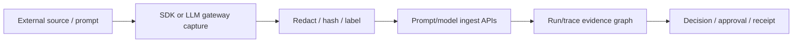

# Prompt & Model Call Capture

**Status: ✅ Implemented / beta** — prompt-event and model-call ingest routes, Python prompt emission, and the LLM gateway exist. Go/TypeScript emission parity, broader provider packaging/adapters, and prompt/model query UI remain incomplete.

## Overview

This choke point captures what entered an agent's context and model-call metadata so investigators can connect source, prompt/model activity, proposed tools, decisions, approvals, runtime evidence, and receipts without letting captured text make authorization decisions.

## 2. Why it exists

When an incident happens, "which prompt caused this?" is the first question. Without captured lineage you can prove *what* the agent did (receipts) but not *why*. And without source labels at ingestion, trust-provenance gating would have nothing deterministic to gate on.

## 3. Architecture



## 4. What exists today

- **`POST /v1/ingest`** — external content events (GitHub webhooks with HMAC verification via `AEGIS_GITHUB_WEBHOOK_SECRET`, tickets, generic sources) enter with a **channel-derived trust label** (the 6 levels). Handler in `src/src/routes/mod.rs`; webhook path in `routes/webhooks.rs`.
- **Trust chain propagation** — `lib/policy/src/trust_chain.rs`: the most restrictive upstream label gates downstream actions; classifiers may only tighten.
- **Context in authorize** — SDK calls carry `run_id`/`trace_id`/trust context, so decisions and receipts already link to the triggering run.
- **Evidence graph** — `GET /v1/graph/run/:run_id` links ingested content → decisions → approvals → receipts → alerts.
- **Runtime-event ingest** (`POST /v1/ingest/runtime-events`, #1681) — the transport that prompt/model events will ride.
- **Prompt/model APIs** — `POST /v1/ingest/prompt-events` and `POST /v1/ingest/model-calls`.
- **Python SDK prompt emission** and **`aegis-llm-gateway`** model-call capture path.

## 5. Remaining work

- Go/TypeScript prompt/model emission parity.
- Broader provider adapters and complete Docker/Helm/Compose packaging for every supported path.
- Query APIs and console timelines for prompt/model records.
- Stronger proposal-hash binding to the eventual `action_hash` across adapters.
- Roadmap: [AegisAgent_Phased_PR_Plan.md](../AegisAgent_Phased_PR_Plan.md) §Phase 7 ("Prompt/model/tool capture").

## 6. Design principles

1. **Capture is evidence, not authorization.** Decisions stay deterministic; captured text never *loosens* anything.
2. **Redaction by default.** Store hashes/metadata; raw prompt bodies only with explicit tenant opt-in.
3. **Labels at the edge.** Trust comes from the channel at ingestion — a prompt can't launder its own provenance.

## Security

Ingestion with a bad/missing HMAC (when configured) is rejected. Unlabeled content is `unknown` — which policies treat as requiring approval for mutating actions, not as trusted.

Captured content is attacker-controlled evidence. Redact secrets before persistence/export, bound payload size and retention, keep raw capture opt-in, and never feed captured instructions to an enforcement-capable LLM.

## Example

```bash
cargo test -p aegis-llm-gateway
```

Use SDK tests for prompt emission. A passing ingest test proves transport/schema behavior, not complete lineage coverage for every provider.

## Operations

Monitor ingest rejection, capture lag, redaction failure, dropped events, provider adapter errors, and run/trace linkage coverage. If capture fails, authorization remains deterministic; mark the evidence gap and alert rather than inventing lineage.

## References

Code: `src/src/routes/prompt_capture.rs`, `src/src/routes/webhooks.rs`, `bins/aegis-llm-gateway/`, SDK prompt capture, `lib/policy/src/trust_chain.rs`.
Docs: [flows/Prompt_To_Action_Lineage.md](../flows/Prompt_To_Action_Lineage.md) · [event-schema.md](../event-schema.md) · [evidence-graph.md](../evidence-graph.md) · [Implementation_Status.md](../Implementation_Status.md)
