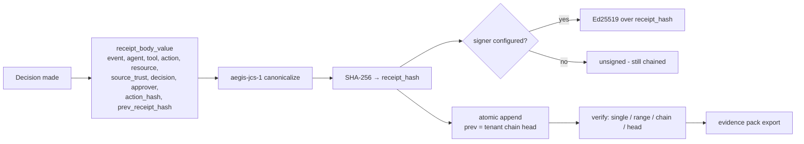

# Receipt & Evidence Model

**Status: ✅ Implemented** (core differentiator #2's evidence layer)

## 1. One-sentence summary

Every protected decision produces an **action receipt** whose canonical body is hashed and chained to the previous receipt, making the history of agent actions tamper-evident and independently verifiable.

## 2. Why it exists

Compliance (SOC 2, EU AI Act Art. 14) and incident response both ask the same question: *prove what the agent did.* Text logs can be edited, reordered, or deleted silently. A hash chain cannot — any modification breaks every subsequent link.

## 3. Mental model

A git history for agent actions: each commit (receipt) hashes its content plus its parent. Rewriting the past changes every hash after it. Optional Ed25519 signatures are like signed tags — verifiable with only the public key.

## 4. Architecture



- **Hash body** — `receipt_body_value` / `compute_receipt_hash` in `src/src/routes/mod.rs`; built identically at emit and verify time; excludes volatile `created_at`.
- **Chain link** — `prev_receipt_hash` = previous receipt's hash for the tenant; append is transaction-safe under concurrent writers (`lib/storage/src/db/receipts.rs`).
- **Signing (optional)** — `src/src/sign.rs`: Ed25519 over the `receipt_hash` string, stored *alongside*; never an input to the hash, so the byte-parity-locked chain is untouched. Unsigned is the hermetic default.
- **Durability** — protected decisions fail closed if the receipt can't be recorded (see [production-hardening.md](../production-hardening.md)); the #1512 deferred-write path applies only to best-effort auxiliary writes and is drained on graceful shutdown.

## 5. Verification

| Question | Endpoint / tool |
|---|---|
| Is this one receipt intact? | `GET /v1/receipts/:id/verify` |
| Is this range intact? | `POST /v1/receipts/verify-range` |
| Is the whole tenant chain intact? | `POST /v1/receipts/verify-chain` |
| What's the current head? | `GET /v1/receipts/chain-head` |
| Offline / third-party | `aegis verify-receipts <receipts.json>` (`sdk-python/aegisagent/verify_receipts.py`) |

Cross-language byte parity is locked by `tests/receipt_chain_vectors.json` (and `tests/canonical_action_vectors.json` for actions) — CI runs all three SDKs plus the gateway against the same vectors.

## 6. Key data structures

`ActionReceiptRecord` (`lib/api/src/records.rs`): `id/event_id`, `ts`, `agent_id`, `user_id`, `run_id`, `trace_id`, `tool`, `action`, `resource`, `source_trust`, `decision`, `approver`, `action_hash`, `prev_receipt_hash`, `receipt_hash`, optional `signature`/`signer_key_id` (migration 0020). Payload parameters are **not** stored in the receipt body — hashes, never payloads (redaction by design).

## 7. Evidence beyond receipts

- **Evidence graph** — `src/src/graph.rs` + `GET /v1/graph/run/:run_id`, `/v1/graph/agent/:agent_id`: links prompts/ingested content → decisions → approvals → receipts → alerts → incidents. Docs: [evidence-graph.md](../evidence-graph.md).
- **Evidence pack** — `GET /v1/compliance/evidence-pack`: exportable bundle for auditors.
- **Policy transparency log** — `policy_audit_log` is itself hash-chained (`compute_policy_audit_log_entry_hash`, migration 0010/#1312): policy changes are evidence too.
- **Audit events** — decision-linked (`0009_audit_events_decision_linkage.sql`), batched off the hot path (#1315), with a readiness signal if the writer degrades (`/readyz` `audit_writer`).

## 8. Failure behavior

- Any recomputed hash mismatch → verification reports the exact break point; the API never "repairs" a chain.
- A deleted or reordered row breaks the successor's `prev_receipt_hash` — silently rewriting history is not possible without detection.
- Signature verification failures are independent of chain verification (defense in depth).

## 9. Example

```bash
curl -s $AEGIS/v1/receipts?limit=5 -H "Authorization: Bearer $TOKEN" | jq
curl -s -X POST $AEGIS/v1/receipts/verify-chain -H "Authorization: Bearer $TOKEN" | jq
# → {"valid": true, "checked": 1284, "head": "sha256:…"}
```

## 10. Common mistakes

- Storing payload secrets in `resource` — receipts are long-lived evidence; keep identifiers, not secrets.
- Comparing receipts after JSON pretty-printing — always canonicalize (`aegis-jcs-1`) before hashing.
- Treating the receipt chain as a backup — it proves integrity, it doesn't restore data ([runbooks/backup-and-restore.md](../runbooks/backup-and-restore.md)).

## 11. Debugging

Chain broken? Run `POST /v1/receipts/verify-range` to bisect; check for manual DB edits or a restore from an older snapshot (see [runbooks/receipt-chain-verification.md](../runbooks/receipt-chain-verification.md)). `receipt_hash` benchmarks: `src/benches/receipt_hash_benchmark.rs`.

## 12. Related code

`src/src/routes/receipts.rs` · `src/src/routes/authorize_receipts.rs` · `src/src/routes/mod.rs` (`receipt_body_value`, `compute_receipt_hash`) · `src/src/sign.rs` · `src/canon/` · `lib/storage/src/db/receipts.rs` · `sdk-python/aegisagent/{receipts,verify_receipts,evidence}.py` · `sdk-go/aegis/receipts.go` · vectors in `tests/`.

## 13. Related docs

[action-receipt-spec.md](../action-receipt-spec.md) (normative spec) · [flows/Receipt_Flow.md](../flows/Receipt_Flow.md) · [adr/0003-aegis-jcs-1-canonicalization.md](../adr/0003-aegis-jcs-1-canonicalization.md) · [adr/0004-ed25519-receipt-signing.md](../adr/0004-ed25519-receipt-signing.md) · [evidence-graph.md](../evidence-graph.md)
