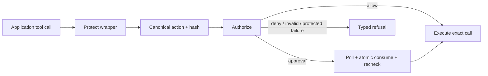

# SDK Guide (Python · TypeScript · Go)

**One sentence:** the SDKs are fail-closed clients that canonicalize actions, ask the gateway for a decision, handle approvals, and refuse to execute anything the gateway didn't authorize.

> **Status:** Python and TypeScript integrity/receipt paths are production-ready. Go is beta with prompt/model capture parity gaps; see [SDK Parity Status](../sdk-parity-status.md).

## Overview

The SDK sits immediately before tool execution. It turns a language-native call into one canonical cross-language action, carries identity/provenance, interprets the gateway decision, consumes exact-action approval once, and returns a typed result without exposing secrets.

## Why This Exists

A gateway decision has no effect if client code executes anyway. The SDK makes enforcement the default developer experience and locks canonicalization, approval, replay, and receipt behavior across languages.

## Architecture



Quick start per persona: [onboarding/For_SDK_Developer.md](../onboarding/For_SDK_Developer.md). Feature matrix across the three SDKs: [sdk-parity-status.md](../sdk-parity-status.md).

## 1. The shared contract

All three SDKs implement the same four responsibilities:

| Responsibility | Python | Go | TypeScript |
|---|---|---|---|
| `aegis-jcs-1` canonicalization + `action_hash` | `aegisagent/canon.py` | `canon/canon.go` | `src/canon.ts` |
| Gateway client (authorize, approvals, receipts) | `aegisagent/client.py` | `aegis/client.go` | `src/client.ts` |
| Protection wrapper (intercept → decide → execute/refuse) | `aegisagent/decorator.py` (`@protect_tool`) | `aegis/protect.go` | `src/protect.ts` |
| Receipt handling / verification | `aegisagent/receipts.py`, `verify_receipts.py` | `aegis/receipts.go` | `src/receipts.ts` |

Byte parity is *the* invariant: the same action must hash identically in every language and in the gateway (`src/canon/`). Locked by `tests/canonical_action_vectors.json` + `tests/receipt_chain_vectors.json`, run in CI for all four implementations.

## 2. Action hashing

```
canonical_bytes = aegis_jcs_1({tool, action, resource, parameters, ...})
action_hash     = sha256(canonical_bytes)
```

Canon rules: Unicode-sorted keys · compact separators (no whitespace) · raw UTF-8 (no `\uXXXX` escaping of non-ASCII) · non-finite floats rejected. Never substitute `json.dumps` / `JSON.stringify` / `encoding/json` defaults.

## 3. Decision handling (the fail-closed matrix)

| Gateway says | SDK does |
|---|---|
| `allow` | execute immediately |
| `deny` | raise/return typed error (`AegisAuthorizationDenied`); **tool never runs** |
| `require_approval` | poll `GET /v1/approvals/:id`; on approved → `POST /:id/consume` (single-use) → re-verify hash → execute |
| approval expired / consumed / hash mismatch | refuse |
| gateway unreachable, action mutating/high-risk | refuse (`AegisConnectionError`) — availability never buys authorization |

Full semantics: [fail-closed-behavior.md](../fail-closed-behavior.md).

## 4. Python specifics

- Install: `pip install aegisagent`; typed (`py.typed`), PEP 8/black, explicit exceptions (`AegisError` hierarchy).
- Extras: `accumulator.py` (event batching), `evidence.py` (evidence-pack helpers), `webhooks.py`, structured `logging.py`.
- **CLI:** `aegis <status|freeze-agent|unfreeze-agent|verify-receipts|export-audit|soc-summary>` — kubectl-style, `--format {table,json}`, `NO_COLOR`-aware (`aegisagent/cli.py`). Standalone `aegis-*` scripts still work.
- Testing style: mock `requests.post/get`; never hit a live gateway in unit tests (`sdk-python/tests/`, patterns in `.claude/rules/sdk_testing.md`).

## 5. Go specifics

`sdk-go/`: `canon` package is dependency-light and reusable; `aegis.Protect` wraps funcs; errors follow Go conventions (`errors.Is`-able sentinel types). Run `go test ./...`.

## 6. TypeScript specifics

`sdk-typescript/`: `protect()` HOF wrapper, strict TypeScript, receipt verifier, shared corpora; run `npm test` and `tsc --noEmit`.

## 7. Configuration

| Env | Meaning |
|---|---|
| `AEGIS_GATEWAY_URL` | gateway base URL (default dev `http://127.0.0.1:8080`) |
| `AEGIS_AGENT_TOKEN` | agent bearer token (from registration / rotation) |
| timeouts / poll interval | client options; approval polling default 1 s |

Redact secrets from parameters **before** the SDK sends them — policies should decide on identifiers, not credentials.

## 8. Common mistakes

Executing on `approved` without `consume` · custom JSON serialization before hashing · swallowing `AegisAuthorizationDenied` · wrapping only "dangerous" tools (wrap everything that mutates; the registry + policy decide risk) · reusing one agent token across distinct agents (breaks provenance and containment granularity).

## Example

```bash
python3 -m unittest discover -s sdk-python/tests
(cd sdk-go && go test ./...)
(cd sdk-typescript && npm test)
```

All implementations also depend on shared canonicalization and receipt vectors. A language-specific pass is insufficient if cross-language bytes differ.

## Security

Unknown decisions and malformed responses deny. Secrets are redacted before transmit. Approval polling is bounded, consume is mandatory, and current action bytes are rechecked. Preserve inherited root trust. Never provide a production “continue without gateway” switch for protected calls.

## Operations

Expose typed error categories and trace/request IDs without secret payloads. Monitor connection errors, decision mix, approval timeout/mismatch, version skew, and parity failures. Roll out SDK and gateway contract changes compatibly and test negative behavior against a real integration environment.

## 9. Related docs

[flows/Known_Agent_Flow.md](../flows/Known_Agent_Flow.md) · [components/Approval_Engine.md](Approval_Engine.md) · [runtime-authorization-api.md](../runtime-authorization-api.md) · [api-reference.md](../api-reference.md) · [sdk-parity-status.md](../sdk-parity-status.md)
