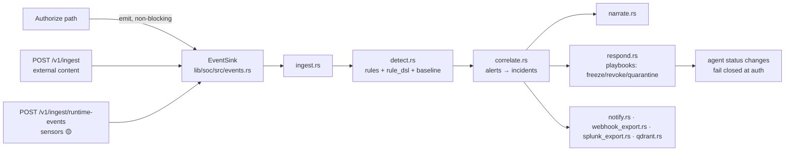

# SOC Model

**Status: ✅ Implemented** (async plane; runtime-event sources are 🟡 partial)

## 1. One-sentence summary

The AegisAgent SOC is an asynchronous pipeline that turns every decision and runtime event into detections, correlated incidents, and automated containment — anchored on verifiable evidence, never in the inline authorize path.

## 2. Why it exists

A single deny is noise; a *pattern* of denies is an attack. Someone has to watch the fleet, connect events into stories, and act. Traditional SIEMs don't understand agents (runs, prompts, approvals, receipts); this SOC is agent-native and every alert links back to hash-chained proof.

## 3. Mental model

An assembly line behind a one-way mirror: the inline plane makes decisions at full speed; behind the mirror, events stream past detectors (rules, baselines), a correlator groups related hits into incidents, a narrator writes the story, and a responder can pull the brake (freeze/quarantine/revoke) — all without ever slowing the line.

## 4. Architecture



All SOC logic lives in `lib/soc/src/`; it consumes storage through the same tenant-scoped `StorageBackend`.

## 5. Pipeline stages

| Stage | File | What it does |
|---|---|---|
| Ingest | `lib/soc/src/ingest.rs` | Normalizes decision/audit/external/runtime events into ASE (Agent Security Events) |
| Detect | `detect.rs`, `rule_dsl.rs`, `baseline.rs`, `backtest.rs` | Built-in rules (deny-storm, exfiltration pattern, MCP manifest drift, approval-hash-mismatch spikes…), a rule DSL for custom detections (`detection_rules` table, `POST /v1/soc/rules/reload`), behavioral baselines, and backtesting |
| Correlate | `correlate.rs` | Groups alerts into incidents with timelines and `EventEvidence` links |
| Narrate | `narrate.rs` | Human-readable incident narrative (`GET /v1/incidents/:id/narrate`) |
| Respond | `respond.rs`, `playbook.rs` | Automated containment playbooks (freeze/revoke/quarantine); playbook CRUD + `POST /v1/playbooks/:id/test` |
| Notify/export | `notify.rs`, `webhook_export.rs` (circuit breaker #912, reactivation #1584), `splunk_export.rs`, `qdrant.rs` | Slack/webhooks/Splunk/semantic index |

## 6. Query & investigation surface

- `POST /v1/soc/query` — structured queries (`lib/soc/src/query.rs`; hardened per #1674/#1682).
- `GET /v1/soc/summary`, `GET /v1/alerts`, `GET /v1/incidents[/:id]`, `POST /v1/incidents/:id/close`.
- `GET /v1/soc/semantic-search` — Qdrant-backed (optional).
- `GET /v1/runs/:id/timeline`, `GET /v1/graph/run/:run_id` — evidence-linked timelines.
- `GET /v1/ws/events` — live event stream (console uses this).
- CLI: `aegis soc-summary`, `aegis status`.

## 7. Storage

`soc_alerts`, `soc_incidents` (cursor-paginated), `detection_rules` (0008), `audit_events` (decision-linked, 0009), `runtime_events` (0027), FTS5 search (0018), baselines/risk scores (0005). All tenant-bound.

## 8. Security guarantees & failure behavior

- **Isolation from the inline plane:** SOC failure can never change an authorize decision; the sink is drained on graceful shutdown; a wedged background task surfaces on `/readyz` (`background_tasks`, #1152).
- **Deterministic response:** playbooks act on agent status via the same fail-closed auth checks — a frozen agent can't authenticate around the SOC.
- **Evidence-anchored:** every alert/incident references decision/receipt IDs; the narrative is derived from evidence, not free text.
- **Tamper-resistance of the SOC itself:** T-D in the [threat model](../AegisAgent_Threat_Model.md) — detection rules changes are audited; webhook exports have circuit breakers so a hostile endpoint can't wedge the pipeline.

## 9. Example

```bash
curl -s -X POST $AEGIS/v1/soc/query -H "Authorization: Bearer $TOKEN" \
  -H "Content-Type: application/json" \
  -d '{
    "version": 1,
    "entity": "ase",
    "filters": {
      "decision": "deny",
      "from": "2026-07-02T00:00:00Z",
      "to": "2026-07-03T00:00:00Z"
    },
    "aggregate": "count_by",
    "group_by": "agent_id",
    "limit": 20
  }' | jq
curl -s $AEGIS/v1/incidents -H "Authorization: Bearer $TOKEN" | jq '.[0]'
```

## 10. Common mistakes

- Putting detection logic in the authorize path — it belongs in `lib/soc`, asynchronously.
- Writing custom rules that fire per-event without windows — use the DSL's aggregation, or you'll create alert storms.
- Treating incident closure as evidence deletion — closing is a state change; receipts and events remain.

## 11. Debugging

- No alerts firing? Check `POST /v1/soc/rules/reload` result and `detection_rules` rows; run `backtest.rs` paths via playbook test endpoint.
- Events missing? `/readyz` (`audit_writer`, `background_tasks`), then `GET /v1/audit/events`.
- Webhook deliveries dead? `delivery_status='dead'` after 10 failures → `POST /v1/webhook_subscriptions/:id/reactivate` (#1584).

## 12. Related code

`lib/soc/src/*` · `lib/soc/src/events.rs` · `src/src/routes/soc.rs` · `src/src/routes/playbook.rs` · `lib/storage/src/db/soc.rs` · `ui/src/datasources/socQuery.ts`.

## 13. Related docs

[AegisAgent_Agent_SOC_Design.md](../AegisAgent_Agent_SOC_Design.md) (full design) · [flows/Ban_Quarantine_Flow.md](../flows/Ban_Quarantine_Flow.md) · [event-schema.md](../event-schema.md) · [runbooks/deny-storm.md](../runbooks/deny-storm.md) · [runbooks/data-exfiltration.md](../runbooks/data-exfiltration.md) · [onboarding/For_SOC_Analyst.md](../onboarding/For_SOC_Analyst.md)
