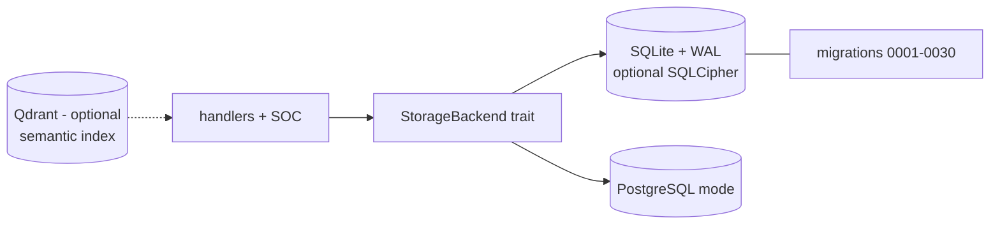

# Storage

## Simple version

One trait, one database, thirty migrations. Everything the gateway knows — tenants, agents, approvals, decisions, receipts, incidents — lives behind a single storage interface, and every query is locked to its tenant.

## Why it exists

Approvals, receipts, and decisions are relational, transactional data with integrity requirements (single-use consume, chain append). A real database with ACID semantics is non-negotiable; a pluggable trait keeps SQLite (default) and PostgreSQL (production target) interchangeable.

## How it works

1. `lib/storage/src/traits.rs` defines `StorageBackend` — every operation the gateway may perform.
2. The SQLite implementation lives in `lib/storage/src/sqlite.rs` + domain modules under `db/` (tenant, agents, approvals, decisions, receipts, policies, mcp, soc, webhooks, playbooks, replay, leader, agent_runs, runtime_events, control_commands, agent_bans, quarantine).
3. Migrations (`lib/storage/migrations/0001`–`0030`) run automatically at startup; Postgres mode uses `migrations_postgres/`.
4. Tenancy: **every** tenant-owned query binds `tenant_id`; parameterized SQLx only.
5. Hot-path protections: WAL mode, busy-timeout retries, tenant bloom filter (#917), audit batching (#1315), deferred best-effort writes (#1512).

## Visual

## Technical details

- **Encryption at rest:** compile with `--features sqlcipher` + set `AEGIS_DB_ENCRYPTION_KEY`; key without the feature = startup error (fail closed).
- **Tuning env vars:** statement cache (#906), mmap (#919), WAL checkpointing (#896) — see [../performance-tuning-guide.md](../performance-tuning-guide.md).
- **Single-writer ceiling:** SQLite serializes writes; keep one gateway instance per DB file until Postgres (#1194) is the backend.
- **Integrity-critical ops:** receipt append is transaction-safe under concurrent writers; approval consume is atomic single-use.
- ERD: [../database-schema.md](../database-schema.md).

## Related code

`lib/storage/src/traits.rs` · `lib/storage/src/sqlite.rs` · `lib/storage/src/db/` · `lib/storage/src/tenant_bloom.rs` · `lib/storage/migrations/` · `migrations_postgres/`

## Current status

Implemented (SQLite: production for single-writer; Postgres mode: Partial — see [../Implementation_Status.md](../Implementation_Status.md)).

## What can go wrong

Sharing one SQLite file across processes → `SQLITE_BUSY` storms. Restoring an old snapshot forks the receipt chain — verify after restore ([../runbooks/backup-and-restore.md](../runbooks/backup-and-restore.md)). Adding a tenant-owned table without a `tenant_id` index → full scans on the hot path.

## Related docs

[../database-schema.md](../database-schema.md) · [../adr/0002-sqlite-first-storage.md](../adr/0002-sqlite-first-storage.md) · [Gateway.md](Gateway.md) · [Receipt_Engine.md](Receipt_Engine.md)
