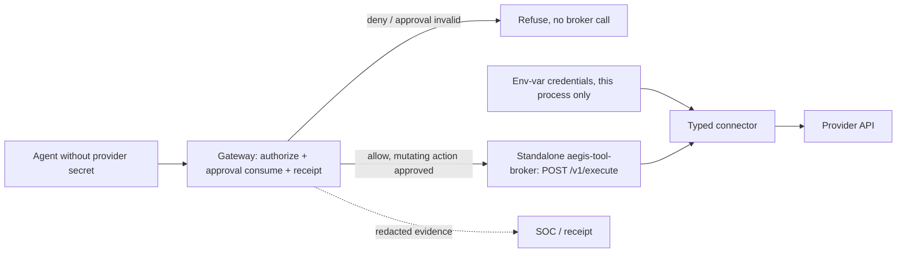

# Tool Broker (`aegis-tool-broker`)

**Status: 🟡 Partial** — a standalone `aegis-tool-broker` binary now exists (Phase 1 extraction): the gateway process no longer links the connector/credential-execution engine at all, and calls out to this binary over HTTP for every `POST /v1/broker/execute`. A mandatory privileged-tool force path (preventing an agent from bypassing gateway+broker entirely) and per-run scoped agent tokens are still not built; implementation tracking: [Implementation Status](../Implementation_Status.md).

## Overview

The tool broker is the credential-isolation choke point: agents request a registered operation, the broker authorizes the exact action, injects provider credentials server-side, executes through a typed connector, and redacts evidence.

## 2. Why it exists

If an agent process holds an API key, a successful prompt injection owns that key — exfiltrate it once and every other control is moot. The only robust fix is that the agent **never sees the credential at all**.

## 3. Mental model

A hotel concierge with the master keycard: guests (agents) can request "open the gym," the concierge checks the guest is allowed, opens the door, and logs it. Guests never touch the keycard, so a pickpocketed guest loses nothing.

## 4. Architecture



## 5. Current and target behavior

- **Current (Phase 1)**: the gateway itself performs authorization and atomically consumes the hash-bound approval (unchanged since Phase 6.4) — it never calls a separate authorize step *inside* the broker. It then calls the standalone `aegis-tool-broker` binary over HTTP, authenticated with a shared service-to-service bearer token (`AEGIS_TOOL_BROKER_API_TOKEN`), only for the already-authorized connector-execution step. The broker binary re-checks the approval hash as defense in depth but does not itself call any authorize endpoint.
- **Target (not yet built)**: sandboxed agents talking to the broker directly with a scoped, short-lived per-run token (not the flat shared token above), with the broker calling the gateway's authorize path itself. This reversed topology is real follow-up work, not silently claimed as done.
- Request shape mirrors the authorize contract: tool, action, parameters → canonicalized → `action_hash` — computed gateway-side and re-verified broker-side against the consumed approval, byte-identical between the two processes (`aegis-tool-broker-core`, shared dependency).
- Credentials live only in the broker binary's own process environment (`EnvCredentialResolver`), injected into the outbound provider call, and are **redacted from all events and receipts** (hashes, never payload secrets — the existing receipt redaction rule, plus a second scrub of connector error text). The gateway process cannot resolve a credential even if compromised — it no longer links the connector/credential crate at all.
- Every brokered call emits a runtime/SOC event and rides the receipt chain — same evidence model as SDK calls; receipt emission stays gateway-side (durable, hash-chained, written before the success response goes out).
- Relationship to existing pieces: per-agent tool permissions ✅ (migration 0013), action registry ✅, approval engine ✅ — the broker is a new *enforcement front-end* over the already-implemented decision core.

## 6. Honest scope

The broker protects credentials for calls that go **through the broker**. A known agent that is handed a raw key by its operator is protected only by SDK-level controls; the broker's guarantee is specifically for caged/anonymous workloads where Aegis provisions the environment.

**Phase 1 limitation**: the gateway consumes the approval *before* calling out to the broker binary (network call, not in-process). If the broker is unreachable after that point, the approval is already burned without the action having executed — a real gap, not glossed over, with a regression test (`execute_fails_closed_when_the_broker_is_unreachable`, `routes/broker.rs`) proving the current (undesirable but fail-closed, not fail-open) behavior. A future phase could fix this with a two-phase consume/rollback or by deferring consumption until after a successful broker response.

## Example

```bash
cargo test -p aegis-tool-broker-core
cargo test -p aegis-tool-broker-connectors
cargo test -p aegis-tool-broker
```

`aegis-tool-broker`'s own tests cover its bearer-auth middleware and `POST /v1/execute` handler (success, disabled tool, unregistered connector, approval mismatch, and a credential-never-leaks check at the HTTP layer). The gateway's `routes/broker.rs` tests run the real `BrokerExecutor` behind a mock HTTP server (not a real subprocess) to keep asserting the exact same route-level behavior. End-to-end acceptance still requires a workload that cannot access the provider except through the broker.

## Security

Connectors must be typed and allowlisted, never arbitrary shell or arbitrary URL execution. Secrets stay out of agent memory, request/response logs, receipts, and error text. Authorization, approval consume, tenant binding, destination validation, timeouts, and response-size limits apply before returning data.

## Operations

Monitor connector latency/errors, secret-provider health, authorization outcomes, redaction failures, and bypass attempts. On broker or secret-store failure, privileged calls fail closed. Rotate provider credentials independently and verify old credentials are rejected.

## References

[AegisAgent_Agent_Cage.md](../AegisAgent_Agent_Cage.md) · [AegisAgent_Runtime_Data_Plane.md](../AegisAgent_Runtime_Data_Plane.md) · [components/Approval_Engine.md](Approval_Engine.md) · [components/MCP_Gateway.md](MCP_Gateway.md) · roadmap: [AegisAgent_Phased_PR_Plan.md](../AegisAgent_Phased_PR_Plan.md) §Phase 6 · [runbooks/secret-rotation.md](../runbooks/secret-rotation.md)
