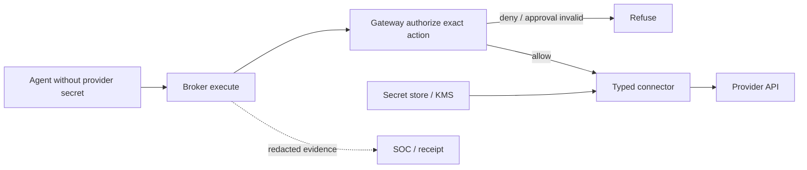

# Tool Broker (`aegis-tool-broker`)

**Status: 🟡 Partial** — broker core/connectors and `POST /v1/broker/execute` exist. A standalone broker binary and mandatory privileged-tool force path remain incomplete; implementation tracking: [Implementation Status](../Implementation_Status.md).

## Overview

The tool broker is the credential-isolation choke point: agents request a registered operation, the broker authorizes the exact action, injects provider credentials server-side, executes through a typed connector, and redacts evidence.

## 2. Why it exists

If an agent process holds an API key, a successful prompt injection owns that key — exfiltrate it once and every other control is moot. The only robust fix is that the agent **never sees the credential at all**.

## 3. Mental model

A hotel concierge with the master keycard: guests (agents) can request "open the gym," the concierge checks the guest is allowed, opens the door, and logs it. Guests never touch the keycard, so a pickpocketed guest loses nothing.

## 4. Architecture



## 5. Current and target behavior

- Sandboxed agents get a broker endpoint + per-run scoped broker token — never provider credentials.
- Request shape mirrors the authorize contract: tool, action, parameters → canonicalized → `action_hash`.
- The broker calls the gateway's authorize path (same Cedar/trust/approval semantics ✅ exist today) before touching any credential; deny or missing approval → refuse, fail closed.
- Credentials live in the broker's secret store (env/KMS), are injected into the outbound provider call, and are **redacted from all events and receipts** (hashes, never payload secrets — the existing receipt redaction rule).
- Every brokered call emits a runtime/SOC event and rides the receipt chain — same evidence model as SDK calls.
- Relationship to existing pieces: per-agent tool permissions ✅ (migration 0013), action registry ✅, approval engine ✅ — the broker is a new *enforcement front-end* over the already-implemented decision core.

## 6. Honest scope

The broker protects credentials for calls that go **through the broker**. A known agent that is handed a raw key by its operator is protected only by SDK-level controls; the broker's guarantee is specifically for caged/anonymous workloads where Aegis provisions the environment.

## Example

```bash
cargo test -p aegis-tool-broker-core
cargo test -p aegis-tool-broker-connectors
```

Route tests cover the gateway execution surface. End-to-end acceptance still requires a workload that cannot access the provider except through the broker.

## Security

Connectors must be typed and allowlisted, never arbitrary shell or arbitrary URL execution. Secrets stay out of agent memory, request/response logs, receipts, and error text. Authorization, approval consume, tenant binding, destination validation, timeouts, and response-size limits apply before returning data.

## Operations

Monitor connector latency/errors, secret-provider health, authorization outcomes, redaction failures, and bypass attempts. On broker or secret-store failure, privileged calls fail closed. Rotate provider credentials independently and verify old credentials are rejected.

## References

[AegisAgent_Agent_Cage.md](../AegisAgent_Agent_Cage.md) · [AegisAgent_Runtime_Data_Plane.md](../AegisAgent_Runtime_Data_Plane.md) · [components/Approval_Engine.md](Approval_Engine.md) · [components/MCP_Gateway.md](MCP_Gateway.md) · roadmap: [AegisAgent_Phased_PR_Plan.md](../AegisAgent_Phased_PR_Plan.md) §Phase 6 · [runbooks/secret-rotation.md](../runbooks/secret-rotation.md)
