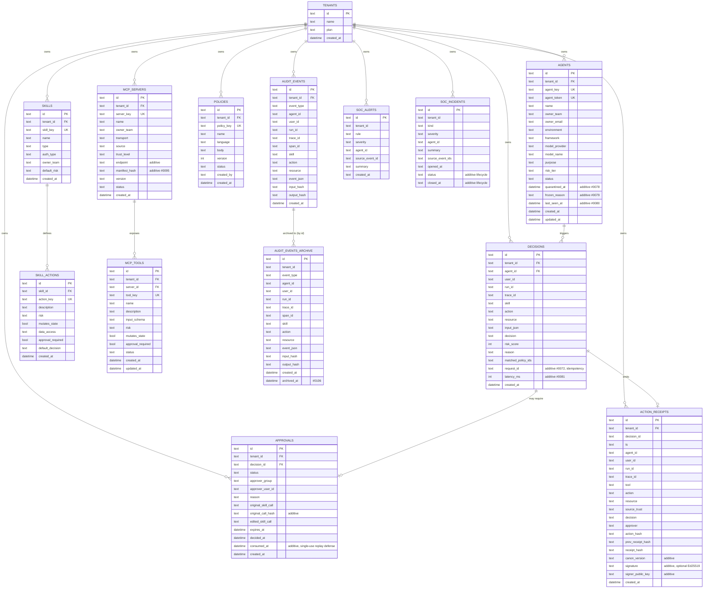

# Database schema (ERD)

The gateway uses a single SQLite database (`gateway/src/db.rs`, `run_migrations`).
Every tenant-owned table carries a `tenant_id` column, and every tenant-scoped
query filters/binds on it (multi-tenant isolation — see `CLAUDE.md`). New
columns are added via additive `ensure_*_column` migrations (checked with
`PRAGMA table_info` before `ALTER TABLE ... ADD COLUMN`), never by altering or
dropping existing columns.

## Notes

- **`action_receipts`** forms a per-tenant hash chain: each row's
  `prev_receipt_hash` must equal the previous row's `receipt_hash` (oldest
  `created_at` first), and `receipt_hash` is `SHA-256(canonical(body))` under
  scheme `aegis-jcs-1`. Verified by `gateway/src/jobs.rs::verify_tenant_receipt_chain`
  (periodic background job, #0107) and `POST /v1/receipts/verify-chain`.
- **`audit_events_archive`** has no foreign key to `tenants`, since archived
  rows must outlive any later tenant deletion. Populated by
  `db::archive_audit_events_older_than` (#0106), run periodically by
  `jobs::run_audit_event_archival_job`.
- **Composite indexes** (`idx_decisions_tenant_agent_created`,
  `idx_approvals_tenant_status_created`, `idx_audit_events_tenant_type_created`,
  `idx_action_receipts_tenant_created`, #940-#943) match the hot tenant-scoped
  list/query paths: `WHERE tenant_id [AND <filter>] ORDER BY created_at DESC`.
- **Migrations are additive and idempotent**: every `ensure_*_column` function
  checks `PRAGMA table_info(<table>)` before `ALTER TABLE ... ADD COLUMN`, so
  re-running `run_migrations` against an already-migrated database is a no-op
  (locked in by `db::tests::migrations_are_idempotent_on_existing_database`, #0108).
- **Qdrant Vector Database:** When enabled, Agent Security Events (`AseEvent`) are asynchronously vectorized and indexed in Qdrant. See the [Qdrant guide](qdrant-integration.md) for details on semantic indexing and configurations.

