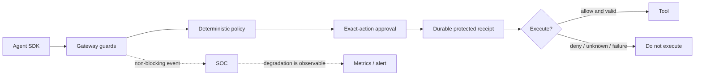

# Fail-closed behavior guide

> **Status:** Current guarantee catalogue for the implemented known-agent integrity path. Runtime cage/sensor/egress guarantees remain limited by [Implementation Status](Implementation_Status.md).

## Overview

**Fail closed** means refusing an action when AegisAgent cannot positively establish that the action is permitted and can be recorded with the required evidence. A timeout, unknown identity, invalid approval, policy failure, or protected receipt failure must not become permission.

Mutating or high-risk actions fail closed. Only explicitly documented low-risk, non-mutating behavior may degrade gracefully. The asynchronous SOC may lose detection availability, but its failure never changes a deny into an allow.

## Why This Exists

Agent actions can change production systems. Treating “the control did not answer” as “permission granted” converts an availability incident into a security incident. The fail-closed contract lets SDK authors, operators, approvers, and auditors predict the result of dependency failure before it happens.

## Architecture

Follow the solid path for authorization and the dotted path for asynchronous detection. Failure before protected execution reaches an allow result stops the tool call.



The SOC path is deliberately asynchronous. Protected receipt persistence is not: a protected action cannot report success without its durable evidence identity.

## Security

The contract defends approval manipulation, replay, confused-deputy behavior, unknown principals/tools, cross-tenant ambiguity, unrecorded protected mutation, and unsafe startup configuration. It does not prove control over an agent that bypasses every deployed Aegis control point.

## Quick Verification

From the repository root, exercise the negative integrity cases and then verify service state:

```bash
make demo
curl -fsS http://127.0.0.1:8080/readyz
```

The demo must show that a swapped hash and a replay do not execute. `readyz` must return success only when storage and tracked background tasks are healthy.

## Quick reference table

| Component | Failure mode | Behavior | What's denied | What's allowed | Rationale |
|---|---|---|---|---|---|
| **Gateway** (`/v1/authorize`) | Unreachable / network error from SDK | SDK's `client.authorize()` catches the exception and returns a synthetic `decision: "deny"`, `reason: "Gateway network error ... Fail-closed."` | All tool calls via `@protect_tool` / `@async_protect_tool` | Nothing — the function body never executes | Cannot verify a gateway-issued action hash exists, so nothing may run unverified |
| **Gateway** | Non-200 HTTP response (5xx, etc.) | SDK returns synthetic `decision: "deny"`, `reason: "Gateway error: <status>. Fail-closed."` | The tool call | Nothing | Same as above — any non-`200` is treated as "cannot confirm allow" |
| **Gateway** | Agent never registered / no token resolved | `client.authorize()` short-circuits to `decision: "deny"`, `risk_level: "critical"`, `reason: "Agent not registered/token not resolved. Failing closed."` | The tool call | Nothing | Unknown principal → deny by default |
| **Database (SQLite)** | Lookup/query error during `authorize_action` (agent lookup, idempotency lookup, decision/audit write) | `500 Internal Server Error` returned to the SDK; SDK treats non-200 as `deny` (see above) | The tool call (transitively, via the SDK's fail-closed mapping) | Nothing for the in-flight call | Errors are logged server-side only (`error!("Database lookup error: ...")`); the client never sees raw DB error text (CWE-209) |
| **Database** | On-disk schema version newer than the running binary supports | Gateway **refuses to start** | The entire gateway process | Nothing | Running against a schema the binary doesn't understand risks silent data corruption — refuse to boot rather than guess |
| **Policy engine (Cedar)** | `policies.cedar` fails to parse at startup | `PolicyEngine::init()` returns `Err`, gateway **refuses to start** (`main()` propagates the error via `?`) | The entire gateway process | Nothing | An unparseable policy file means *no* authorization decision can be trusted — refuse to boot |
| **Policy engine** | No policy matches a `tool_call` / unregistered action | `decision: "deny"`, `matched_policies: ["registered_action_default_deny"]` | The tool call | Nothing | Default-deny: an action must be explicitly permitted, never implicitly |
| **Audit / SOC event pipeline** | In-memory SOC event channel (`EventSink`) is at capacity (`has_capacity() == false`) for a **high-risk or mutating** action | `decision: "deny"`, `matched_policies: ["audit_writer_unavailable"]`, `reason: "Audit writer unavailable (SOC event stream full): action denied ... fail-closed."` — checked *before* any DB write | The tool call | Low-risk, non-mutating reads continue to be evaluated normally | If the action can't be durably recorded, a mutating action must not happen — there would be no evidence trail (EU AI Act Art. 14 / SOC 2) |
| **Audit / SOC event pipeline** | `write_decision_and_audit` itself errors (DB write failure) after the decision was computed | `state.audit_writer_unhealthy` is set to `true` (surfaces via `/readyz`); `500 Internal Server Error` returned, which the SDK maps to `deny` | The tool call | Nothing | Same fail-closed mapping as a generic DB error; `/readyz` flips so orchestrators stop routing new traffic to this replica |
| **Approval service — expiry** | Approval window (`expires_at`) has passed when the SDK polls or the gateway processes `approve`/`reject`/`edit`/`consume` | `GET /v1/approvals/:id` reports `status: "EXPIRED"`; `approve`/`reject`/`edit`/`consume` all return `409` with `reason: "approval_expired"`; SDK raises `PermissionError`/`TimeoutError` and never executes | The tool call | Nothing | An approval is a time-bound human assertion; an expired one carries no authority |
| **Approval service — hash mismatch** | The action about to execute hashes to something other than the `action_hash` bound to the approval (approve-then-swap, post-approval edit without re-approval) | SDK raises `PermissionError("... action hash mismatch. Failing closed.")` before calling the wrapped function; gateway emits a tamper-attempt receipt | The tool call | Nothing | This is the core **approval integrity** guarantee (T-A1/T-A2) — the human approved *exactly* this action, not "an action like this" |
| **Approval service — replay** | A previously consumed (single-use) approval is presented again, or two concurrent `consume` calls race for the same approval | `consume_approval` atomically transitions `pending → consumed` exactly once; the loser gets `409` (`already_consumed`/`approval_expired`); SDK fails closed | The tool call (second/replayed attempt) | The first, legitimate consume | Defends T-A3 (approval replay) — "approve once" must mean "execute once" |
| **MCP server / tool registry** | `tool`/`action` resolves to an MCP server or tool not present in the registry (including percent-encoded / case-variant aliases of a known tool) | `decision: "deny"`, `matched_policies: ["mcp_unknown_tool"]` | The tool call | Nothing | Unregistered MCP surface = unknown blast radius → deny by default, independent of normalization tricks |
| **MCP server** | Live manifest hash differs from the pinned `manifest_hash` (drift) | Action requires approval (or is denied, depending on policy) rather than silently executing against a changed tool surface | The tool call (until a human re-approves the new manifest) | Nothing automatically | A tool's behavior can change without changing its name — manifest pinning catches supply-chain-style drift |
| **Agent identity** | Agent is `frozen` or `revoked` (via SOC response engine, manual freeze, or trust-escalation incident) | Every `/v1/authorize` call for that agent returns `decision: "deny"`, `matched_policies: ["agent_<status>"]`, `reason: "Agent '<key>' is <status>; all tool calls are denied (fail-closed)."` | All tool calls for that agent | Nothing | Containment must be total and immediate — a frozen agent cannot "read its way around" the freeze |
| **Agent identity** | Action would be `allow`, but `risk_level == "critical"` | Decision is downgraded to `require_approval` (`matched_policies: ["critical_risk_requires_approval"]`) | Immediate execution | Execution after human approval | Critical-risk actions always get a human in the loop, even if policy would otherwise permit them |
| **Trust provenance** | `context.trust_level` is `untrusted_external` or `malicious_suspected` and the action `mutates_state == true` | `forbid` policy matches → `decision: "deny"` | Any mutating action triggered from untrusted/malicious-flagged content | Read-only actions may still be evaluated on their own merits | Confused-deputy defense (T-B*): the *source* of the instruction, not its wording, gates mutation |
| **Trust provenance** | `context.trust_level` is `semi_trusted_customer` or `unknown` and the action `mutates_state == true` | `decision: "require_approval"` | Immediate execution | Execution after human approval | Same gate, one notch less severe — ambiguous provenance still needs a human |
| **Replay / idempotency** | A request arrives with a `nonce` whose `timestamp` is >5 minutes old, or a `nonce` already seen for this `(tenant, agent)` | `409 Conflict`, `reason: "replay_timestamp_expired"` or `"replay_nonce_reused"` | The tool call | Nothing | Defends against literal request replay independent of approval replay |
| **Rate limit / quota** | Tenant exceeds its configured rate limit or request quota | `429 Too Many Requests` | The tool call | Nothing (caller should retry later) | Prevents a runaway agent from drowning the gateway or its own audit trail |
| **Webhook / Slack callback signature** | `X-Slack-Signature` doesn't match `HMAC-SHA256(secret, "v0:{timestamp}:{body}")`, the timestamp is >5 min old, or the body was tampered with after signing | `401 Unauthorized`, `reason: "invalid_signature"` (or stale-timestamp equivalent) | The callback (approve/reject action is **not** applied) | Nothing | Approval callbacks are themselves a privileged action — an unsigned/forged callback must not be able to approve anything |
| **Webhook / Slack callback** | Tenant has no callback secret configured for the approval | `404` returned — fail closed, since an unconfigured secret means the callback cannot be verified | The callback | Nothing | Verifying nothing is not the same as verifying successfully |
| **Kubernetes liveness/readiness** | `/readyz`: `audit_writer_unhealthy` flag set, or `db::health_check` fails | `/readyz` returns non-200 | New traffic is *not* routed to this replica by the orchestrator | In-flight requests on this replica continue (each still fails closed per the rules above) | Lets the orchestrator drain/restart an unhealthy replica without it ever silently fail-opening |
| **Background SOC pipeline** (`events::drain`, detection/correlation/notify) | Detector, correlator, or notify sink errors, or the SOC event channel is dropped/lagging | Logged and/or surfaced as a `ws_events` "lagged consumer" notice; the *authorize* decision already returned before this pipeline runs | Nothing in the authorize path — this pipeline is purely observational/responsive | The original decision stands as already made | SOC is async by construction (design law 3): its failure can degrade detection/response speed but can **never** retroactively turn a `deny` into an `allow` |

## Verifying this table against the test suite

Each row above is backed by tests in `src/src/routes/` (Rust gateway,
`cargo test --workspace -- --test-threads=1`) or `sdk-python/tests/`
(Python SDK, `python3 -m unittest discover -s sdk-python/tests`):

- **Gateway unreachable / non-200 / network error** —
  `sdk-python/tests/test_sdk.py::test_authorize_deny`,
  `sdk-python/tests/test_async_protect_tool.py::test_deny_raises_permission_error`,
  `test_deny_not_executed`.
- **Approval expiry** —
  `src/src/routes/authorize_tests.rs` (and approval route tests):
  `approval_is_expired_detects_past_window`,
  `consume_approval_rejects_expired_approval`,
  `approve_approval_expired_response_includes_reason_field`,
  `reject_approval_rejects_expired_approval`,
  `edit_approval_rejects_expired_approval`,
  `expired_approval_is_reported_and_cannot_be_approved`;
  `sdk-python/tests/test_approval_expiry.py::test_approved_but_expired_fails_closed`.
- **Approval hash mismatch (approve-then-swap)** —
  `src/src/routes/authorize_tests.rs::hash_mismatch_on_consume_increments_counter`,
  `replay_consume_emits_tamper_receipt`, `approve_expired_emits_tamper_receipt`;
  `sdk-python/tests/test_sdk.py::test_approval_hash_mismatch_fails_closed`,
  `sdk-python/tests/test_async_protect_tool.py::test_approval_hash_mismatch_fails_closed`.
- **Single-use / replay** —
  `src/src/routes/authorize_tests.rs::consume_is_single_use`,
  `consume_approval_concurrent_race_only_one_succeeds`,
  `consume_approval_returns_bound_action_hash`,
  `edit_approval_rejects_if_already_consumed`,
  `replay_consume_emits_replay_attempt_security_event`.
- **Unknown MCP tool / server** —
  `src/src/routes/authorize_tests.rs::authorize_denies_unknown_mcp_tools_by_default`,
  `authorize_denies_unknown_mcp_tool_with_encoded_or_cased_identifier`;
  also `lib/decision` pipeline/metadata e2e for MCP fail-closed defaults.
- **Frozen / revoked agent** —
  `src/src/routes/authorize_tests.rs::authorize_action_denies_frozen_and_revoked_agent`,
  `revoke_agent_sets_status_to_revoked`;
  also `lib/decision` pipeline/guard tests for frozen/revoked.
- **Trust-provenance gating** —
  Cedar/policy tests and `lib/decision` evaluate provenance metrics
  (untrusted/malicious → `forbid`; semi-trusted/unknown → `require_approval` for
  mutating actions).
- **Slack callback signature / replay / tamper** —
  `src/src/routes/approval.rs::slack_callback_rejects_stale_timestamp_with_401`,
  `slack_callback_rejects_invalid_signature_with_401`,
  `slack_callback_rejects_tampered_body_with_401`.
- **Receipt-chain tamper detection** —
  see [`action-receipt-spec.md`](action-receipt-spec.md#verification);
  `verify_chain()` / `verify_receipt()` — any mismatch is invalid (fail closed).

## Operator takeaway

If you are running AegisAgent and a dependency (database, policy file,
audit/event pipeline, approval store, MCP registry) becomes unavailable,
**every mutating or high-risk action is denied** until the dependency
recovers. Only low-risk, non-mutating reads may continue. No failure mode in
this table results in a mutating action executing without a verified
approval and a durable receipt.

## Monitoring and Operations

Alert on readiness failure, protected receipt write failure, receipt-chain integrity failure, sustained SOC event drops, hash-mismatch spikes, replay conflicts, and authentication lockouts. During dependency failure, stop routing traffic, preserve evidence, restore the dependency, verify the receipt chain, and reopen traffic gradually. Never modify an SDK to fail open as an outage workaround.

Use [Deny Storm](runbooks/deny-storm.md), [Receipt Chain Verification](runbooks/receipt-chain-verification.md), [Backup and Restore](runbooks/backup-and-restore.md), and [Secret Rotation](runbooks/secret-rotation.md) for operational response.

## References

- [Threat Model](AegisAgent_Threat_Model.md)
- [Agent Workflow](AegisAgent_Agent_Workflow.md)
- [Approval Engine](components/Approval_Engine.md)
- [Receipt Engine](components/Receipt_Engine.md)
- [Production Hardening](production-hardening.md)
- [Implementation Status](Implementation_Status.md)
