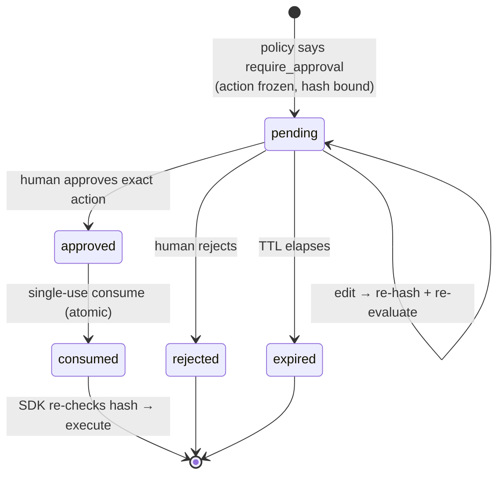

# Flow: Approval

## Overview

A risky action pauses. A human sees the *exact* action and approves it. The approval is a fingerprint-locked, single-use ticket — if the action changes even slightly, the ticket doesn't fit.

## Visual



## Step by step

1. Policy returns `require_approval`; the gateway freezes the action and stores its `action_hash` (`src/src/routes/approval.rs`).
2. The approver reviews the frozen action in the console or Slack — not a paraphrase.
3. Approve / reject / **edit** — an edit re-canonicalizes, re-hashes, and re-evaluates policy.
4. The SDK polls, then calls `POST /v1/approvals/:id/consume` — atomic, single-use.
5. The SDK re-checks that what it is about to run still matches the approved hash, then executes.
6. Everything lands in the receipt chain, with the approver recorded.

## Why this matters

This kills approve-then-swap, replay, and render-vs-bytes attacks. Demo the defense live: `python3 examples/approve_then_swap_demo.py`.

## What can go wrong

Expired/consumed/unknown approval → refuse (fail closed). Brute-forcing approval IDs → 429 (per-IP limiter + per-ID attempt tracker, #1307). Executing on `approved` status without consuming → you built a bypass; use the SDKs.

## Example

```bash
python3 examples/approve_then_swap_demo.py
```

The expected result is that the originally approved action can be consumed once, while changed parameters and replay do not execute.

## Security

Approvers review the stored effective action and hash, not a caller-controlled summary. Approval endpoints require authenticated tenant/role context, expiry, rate limiting, and audit. SDKs must consume atomically and compare the current hash before the wrapped tool call.

## Current status

Implemented.

## Related code / docs

Code: `src/src/routes/approval.rs` · `lib/storage/src/db/approvals.rs` · SDK consume paths.
Docs: [../components/Approval_Engine.md](../components/Approval_Engine.md) (deep dive) · [Known_Agent_Flow.md](Known_Agent_Flow.md) · [../How_It_Works.md](../How_It_Works.md)
