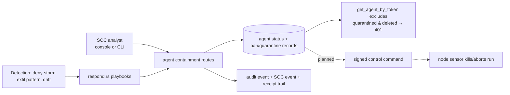

# Ban & Quarantine Model

**Status: 🟡 Partial** — agent-level containment (freeze/quarantine/revoke) ✅ implemented; first-class ban/quarantine stores ✅ (schemas landed); sensor-enforced runtime bans 📐 planned.

## 1. One-sentence summary

Containment in AegisAgent is a ladder — freeze → quarantine → revoke → ban — where every rung makes the agent's authentication or execution fail closed, and every rung leaves evidence.

## 2. Why it exists

Detection without containment is a dashboard, not a control. When an agent misbehaves (or its credentials leak), someone — human or playbook — must be able to stop it *now*, in a way the agent can't talk its way out of.

## 3. Mental model

Security badges in a building: freeze = badge temporarily disabled; quarantine = escorted to a holding room (still observable); revoke = badge shredded; ban = name on the no-entry list at every door, including doors that haven't been built yet (future runs).

## 4. The containment ladder

| Rung | Effect | How | Status |
|---|---|---|---|
| **Freeze** | agent's authorize calls are denied; reversible | `POST /v1/agents/:id/freeze` / `unfreeze` (also CLI `aegis freeze-agent`) | ✅ |
| **Quarantine** | agent marked quarantined; `get_agent_by_token` refuses it (401); reversible via restore | SOC respond playbooks (`lib/soc/src/respond.rs`) or agent routes; `quarantine_records` store (migration 0030, #1679) adds first-class records with reason/scope | ✅ status-level / 🟡 records wired |
| **Revoke** | token invalidated; agent must be re-credentialed (`rotate-token` for benign rotation) | `POST /v1/agents/:id/revoke` / `restore` | ✅ |
| **Ban** | durable, listable ban independent of agent row state; intended to gate *future* runs and sensor-side enforcement | `agent_bans` store (migration 0029, #1678: `lib/storage/src/db/agent_bans.rs`) | 🟡 store exists; preflight/run-gating + sensor propagation 📐 |
| **Kill / workspace quarantine** (unknown agents) | terminate sandbox, preserve workspace as evidence | signed control commands to node sensor / cage runner | 📐 design ([AegisAgent_Control_Command_Protocol.md](../AegisAgent_Control_Command_Protocol.md), [AegisAgent_Agent_Cage.md](../AegisAgent_Agent_Cage.md)) |

## 5. Who pulls the trigger



Fail-closed detail worth knowing: `get_agent_by_token` / `get_agent_by_mtls_cn` exclude `status='quarantined'` **and** `status='deleted'` (a gap where deleted agents could still authenticate was closed in the #1193 work).

## 6. APIs

`POST /v1/agents/:id/{freeze,unfreeze,revoke,restore,rotate-token}` · quarantine via respond playbooks and agent routes · `GET /v1/agents` shows status · CLI: `aegis freeze-agent`, `aegis unfreeze-agent`, `aegis status`. Ban/quarantine record APIs ride the runtime data-plane route work (see [Implementation_Status.md](../Implementation_Status.md)).

## 7. Storage

`agents.status` (active/frozen/quarantined/revoked/deleted) · `agent_bans` (0029) · `quarantine_records` (0030) · every transition writes an audit event. Tenant-scoped, parameterized.

## 8. Security guarantees & failure behavior

- Containment is enforced at **authentication and authorization**, not by asking the agent nicely — a contained agent's requests fail closed with 401/deny.
- Transitions are audited and SOC-visible; un-quarantining is an explicit, logged action.
- Planned: bans gate `POST /v1/agent-cage/runs` preflight, so a banned identity can't start new caged runs; sensor-side enforcement makes bans hold even if the gateway is briefly unreachable (sensor caches ban list — design).

## 9. Example

```bash
aegis freeze-agent --agent-id $ID --format json
curl -s -X POST $AEGIS/v1/agents/$ID/revoke -H "Authorization: Bearer $TOKEN"
# the agent's next authorize:
# → 401 Unauthorized (fail closed), SOC event recorded
```

## 10. Common mistakes

- Using revoke when you meant freeze (revoke forces re-credentialing).
- Forgetting quarantine is reversible state, not deletion — GDPR deletion is `DELETE /v1/tenants/:id` scope.
- Assuming a ban today stops a *caged run* — that wiring is planned; today bans are records + agent-status enforcement.

## 11. Debugging

Agent unexpectedly 401? Check `GET /v1/agents/:id` status first — you may be contained, not broken. Token rotated? See [runbooks/agent-token-rotation.md](../runbooks/agent-token-rotation.md).

## 12. Related code

`src/src/routes/agents.rs` · `lib/soc/src/respond.rs` · `lib/storage/src/db/{agents,agent_bans,quarantine}.rs` · migrations `0029`, `0030` · `sdk-python/aegisagent/cli.py`.

## 13. Related docs

[components/SOC_Engine.md](../components/SOC_Engine.md) · [AegisAgent_Control_Command_Protocol.md](../AegisAgent_Control_Command_Protocol.md) · [flows/Control_Command_Flow.md](Control_Command_Flow.md) · [runbooks/deny-storm.md](../runbooks/deny-storm.md) · [Implementation_Status.md](../Implementation_Status.md)
