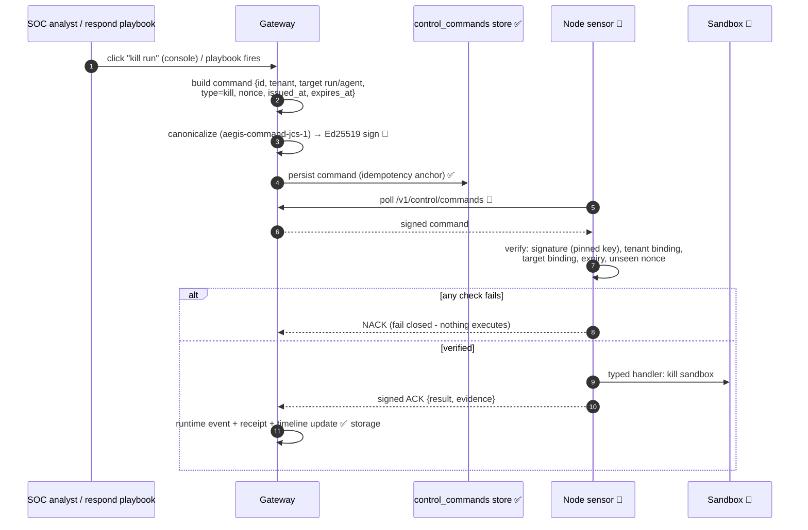

# Flow: Control Command (Kill / Pause / Quarantine)

**Status: 🟡 storage implemented, protocol designed.** The `control_commands` store exists (migration 0028, `lib/storage/src/db/control_commands.rs`); command signing, dispatch routes, sensor verification, and ACK handling are 📐 target design from [../AegisAgent_Control_Command_Protocol.md](../AegisAgent_Control_Command_Protocol.md). Today's *implemented* containment path (freeze/quarantine/revoke on agent status) is in [../flows/Ban_Quarantine_Flow.md](../flows/Ban_Quarantine_Flow.md).

## Why every field exists

| Field / check | Attack it stops |
|---|---|
| Ed25519 signature over canonical bytes | forged commands from anyone but the gateway |
| Tenant binding | cross-tenant control (tenant A killing tenant B's run) |
| Target binding (run/agent/sandbox id) | retargeting a legitimate command |
| `expires_at` | stale command replayed later |
| Nonce + command id | replay; re-delivery resolves idempotently (same id → same ACK) |
| Typed handlers only | payload smuggling arbitrary shell to the sensor |
| ACK/NACK + receipts | silent failure; disputes about what was enforced |

Key management (rotation, `kid`, grace windows, emergency re-registration) is specified in [../AegisAgent_Control_Command_Protocol.md](../AegisAgent_Control_Command_Protocol.md) §3.

## Command types (designed set)

`start_run` · `pause` · `resume` · `kill` · `snapshot` · `quarantine_workspace` · `ban_agent` · `update_sensor_config`. Each execution emits runtime events and rides the receipt chain, so *the act of containment is itself evidence*.

## What to build next (per the phased plan)

1. Signing + canonical command serializer (`aegis-command-jcs-1`) in the gateway.
2. `POST /v1/control/commands` (issue) + sensor poll/ack routes.
3. Sensor-side verifier + typed handlers (Phase 3 skeleton).

## Related docs

[../AegisAgent_Control_Command_Protocol.md](../AegisAgent_Control_Command_Protocol.md) (normative design) · [../components/Node_Sensor.md](../components/Node_Sensor.md) · [Unknown_Agent_Cage_Flow.md](Unknown_Agent_Cage_Flow.md) · [../Implementation_Status.md](../Implementation_Status.md) · [../AegisAgent_Phased_PR_Plan.md](../AegisAgent_Phased_PR_Plan.md)
