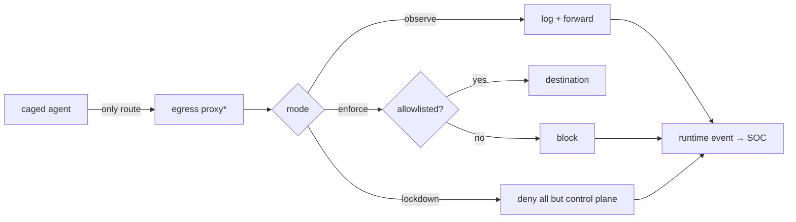

# Flow: Egress Block

> **Status: Planned (Phase 5). No implementation files yet.** This page describes the target flow; the normative design is [../components/Egress_Proxy.md](../components/Egress_Proxy.md).

## Simple version

A caged agent has exactly one road to the internet: the egress proxy. Allowed destinations pass. Everything else is blocked — and every block becomes evidence.

## Visual

## Step by step (target)

1. The cage runner wires sandbox networking so the proxy is the only route (DNS included, to stop tunneling).
2. Tenant egress policy (domains/CIDRs/ports per run or agent) comes from the gateway.
3. Three modes: **observe** (log everything), **enforce** (allowlist), **lockdown** (deny all except Aegis control endpoints).
4. Every allow/deny emits a `network_egress` runtime event → `POST /v1/ingest/runtime-events` (this ingest path exists today).
5. Repeated blocked egress = exfiltration-attempt detection in the SOC.
6. If the proxy can't reach the gateway for policy, enforce/lockdown deny by default (fail closed).

## Why this matters

Exfiltration is the endgame of most agent attacks. You can't reliably filter *content*; you can remove the *path*.

## Honest scope

The proxy controls traffic forced through it. A workload outside the cage with its own network path is out of scope — which is why unknown agents only run caged, and why non-proxy traffic seen by the sensor is itself a detection signal.

## Related docs

[../components/Egress_Proxy.md](../components/Egress_Proxy.md) · [Unknown_Agent_Cage_Flow.md](Unknown_Agent_Cage_Flow.md) · [../runbooks/data-exfiltration.md](../runbooks/data-exfiltration.md) · [../Implementation_Status.md](../Implementation_Status.md)
