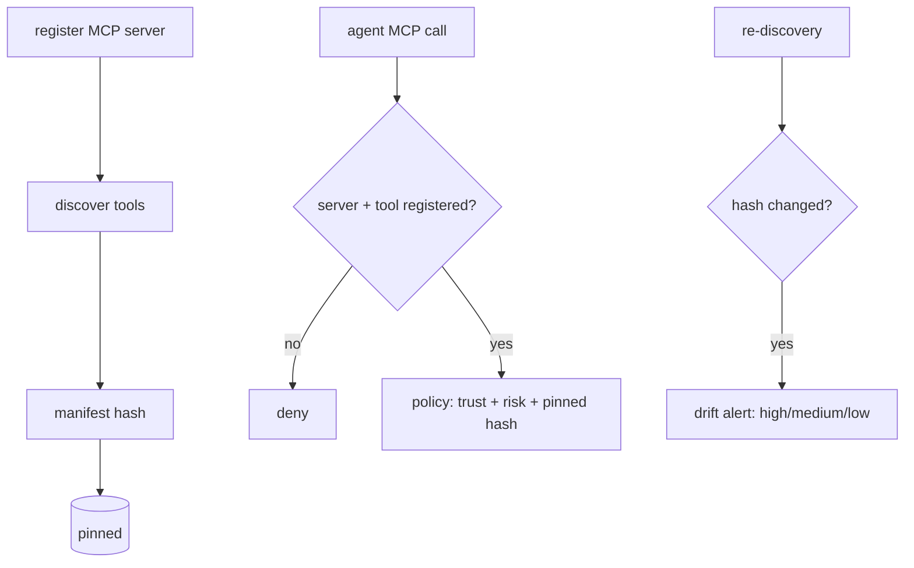

# Flow: MCP Gateway

## Simple version

MCP servers are plug-in tool menus for agents. Aegis fingerprints each server's menu when it's registered. Unknown menus don't get served, and a changed menu raises an alarm before anyone orders from it.

## Visual

## Step by step

1. `POST /v1/mcp/servers` registers a server and discovers its tools (`src/src/routes/mcp.rs`).
2. The manifest is hashed deterministically (`mcp-manifest-1`, order-independent) and pinned with a snapshot.
3. An agent's MCP call (`tool = mcp:<server_key>`) goes through the normal authorize path; unknown server or tool → deny.
4. Policy can require the pinned manifest hash in context — drifted manifests can be forced into approval.
5. Re-discovery classifies drift: tool added/removed → high, tool modified → medium, metadata only → low → SOC alert.

## Why this matters

MCP is a supply chain. A "rug-pulled" server that quietly adds a parameter or a new tool is caught by hash comparison, not by hoping a reviewer re-reads the manifest.

## What can go wrong

Never re-discovering means drift is never checked — schedule it. Low-severity metadata drift is still social-engineering surface for approvers.

## Current status

Implemented (gateway-integrated "lite"); a standalone inline MCP proxy for caged agents is Planned.

## Related code / docs

Code: `src/src/routes/mcp.rs` · `lib/soc/src/mcp_inspect.rs` · `lib/storage/src/db/mcp.rs`.
Docs: [../components/MCP_Gateway.md](../components/MCP_Gateway.md) (deep dive) · [../mcp-defense-architecture.md](../mcp-defense-architecture.md)
