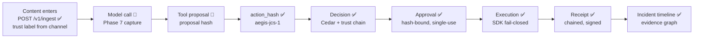

# Flow: Prompt-to-Action Lineage

**Status: 🟡 partial** — trigger-side (trust-labeled ingest) → decision → approval → receipt lineage is ✅ implemented; explicit prompt/model-call capture is 📐 Phase 7 ([../components/Prompt_Model_Capture.md](../components/Prompt_Model_Capture.md)).

The question this flow answers: **"show me the path from the thing that entered the agent's context to the action that executed — with proof at every hop."**



## The hops, with code

| Hop | Mechanism | Status |
|---|---|---|
| Content → trust label | `POST /v1/ingest` labels by channel (GitHub issue = `untrusted_external`, …); HMAC-verified webhooks | ✅ `src/src/routes/mod.rs` |
| Label → downstream actions | `trust_chain::propagate` — most restrictive upstream label wins; tighten-only | ✅ `lib/policy/src/trust_chain.rs` |
| Prompt → model call → tool proposal | first-class captured events with proposal hashes | 📐 Phase 7 |
| Proposal → `action_hash` | SDK canonicalization at the tool boundary (today the lineage starts here for the action side) | ✅ SDK `canon` |
| `action_hash` → decision | authorize path, decision row keyed to `run_id`/`trace_id` | ✅ `lib/decision` + thin `routes/authorize.rs` |
| Decision → approval | approval bound to the same hash | ✅ `routes/approval.rs` |
| Approval → execution | single-use consume + SDK hash re-check | ✅ |
| Execution → receipt | chained receipt carrying `action_hash`, `source_trust`, `run_id`, `trace_id`, approver | ✅ `compute_receipt_hash` |
| Receipt → timeline | `GET /v1/runs/:id/timeline`, `GET /v1/graph/run/:run_id` link ingested content, decisions, approvals, receipts, alerts | ✅ `src/src/graph.rs` |

## What the `run_id`/`trace_id` spine gives you today

Because the SDK sends `run_id` and `trace_id` with authorize calls, and receipts + SOC events carry them, an analyst can already walk: *ingested GitHub issue (labeled) → denied decision for the same run → deny-storm alert → incident narrative*. What's missing until Phase 7 is the **interior** of the agent: which model call, given which prompt tokens, produced the proposal. W3C `traceparent` propagation (#1156) additionally stitches SDK → gateway spans in your tracing backend.

## Example investigation

```bash
curl -s $AEGIS/v1/graph/run/$RUN_ID -H "Authorization: Bearer $TOKEN" | jq
curl -s $AEGIS/v1/runs/$RUN_ID/timeline -H "Authorization: Bearer $TOKEN" | jq
curl -s $AEGIS/v1/incidents/$INC_ID/narrate -H "Authorization: Bearer $TOKEN"
```

## Related docs

[../evidence-graph.md](../evidence-graph.md) · [../components/Prompt_Model_Capture.md](../components/Prompt_Model_Capture.md) · [Known_Agent_Flow.md](Known_Agent_Flow.md) · [Receipt_Flow.md](Receipt_Flow.md) · [../components/SOC_Engine.md](../components/SOC_Engine.md)
